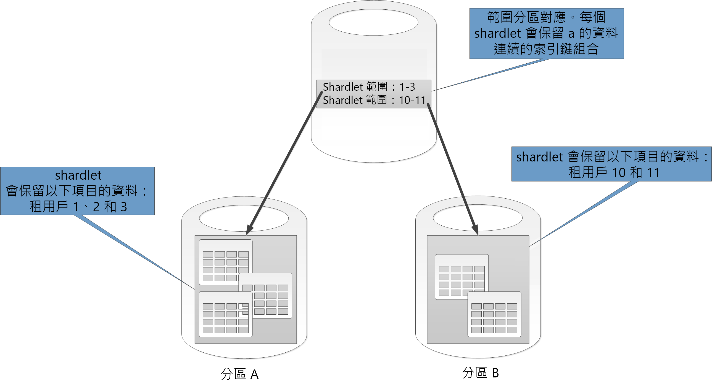
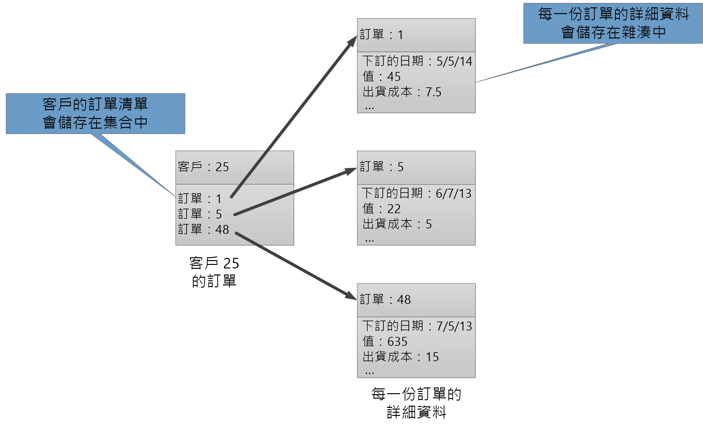

# 資料分割策略

本文說明一些在各種 Azure 資料存放區中分割資料的策略。 如需有關何時分割資料和最佳做法的一般指引，請參閱[資料分割](./data-partitioning.md)

## 分割 Azure SQL Database

單一 SQL 資料庫會對其可包含的資料量有所限制。 輸送量會受到結構性因素和其支援之並行連接數目的限制。

[彈性集區](/azure/sql-database/sql-database-elastic-pool)支援 SQL 資料庫的水平調整。 使用彈性集區，您可以將資料分割成分區，以分佈到多個 SQL 資料庫。 您也可以因為需要處理的資料量成長和縮減而新增或移除分區。 彈性集區也可以藉由將負載分散到多個資料庫，協助減少爭用。

每個分區都被實作成 SQL 資料庫。 一個分區可以保留多個資料集 (稱為 Shardlet)。 每個資料庫會維護描述其所包含之 shardlet 的中繼資料。 Shardlet 可以是單一資料項目，或一組共用相同 Shardlet 索引鍵的項目。 例如，在多租用戶應用程式中，Shardlet 索引鍵可以是租用戶識別碼，而租用戶的所有資料都可保留在相同 Shardlet 中。

用戶端應用程式會負責將資料集與 Shardlet 索引鍵產生關聯。 個別的 SQL 資料庫可做為全域分區對應管理員。 此資料庫具有一份系統中所有分區和 Shardlet 的清單。 應用程式會連線到分區對應管理員資料庫，以取得分區對應的複本。 它會在本機快取分區對應，並使用對應來將資料要求路由傳送至適當的分區。 此功能隱藏在一系列 API (包含在[彈性資料庫用戶端程式庫](/azure/sql-database/sql-database-elastic-database-client-library)中) 之後，適用於 Java 和 .NET。

如需彈性集區的詳細資訊，請參閱[使用Azure SQL Database 相應放大](/azure/sql-database/sql-database-elastic-scale-introduction)。

若要減少延遲並改善可用性，您可以複寫全域分區對應管理員資料庫。 您可以使用進階定價層，設定作用中的異地複寫，持續將資料複製到不同區域中的資料庫。

另外，使用 [Azure SQL 資料同步](/azure/sql-database/sql-database-sync-data)或 [Azure Data Factory](/azure/data-factory/)，跨區域複寫分區對應管理員資料庫。 這種形式的複寫會定期執行，如果分區對應不常變更就更適合，而且不需要進階層。

彈性資料庫提供將資料對應到 shardlet 並將它們儲存在分區中的兩個配置：

- **清單分區對應**會將單一索引鍵關聯至 Shardlet。 例如，在多租用戶系統中，每個租用戶的資料可以和唯一的索引鍵相關聯，並儲存在自己的 shardlet 中。 為了保證隔離，每個 Shardlet 都可以保留在自己的分區內。

    

- **範圍分區對應**會將一組連續索引鍵值關聯至 Shardlet。 例如，您可以在相同 Shardlet 內將一組租用戶 (有各自的索引鍵) 資料群組在一起。 此配置比第一個配置成本低，因為租用戶共用資料儲存空間，但是隔離程度較低。

    

單一分區可以包含數個 Shardlet 的資料。 例如，您可以使用清單 shardlet，將不同非連續租用戶的資料儲存在相同的分區中。 您也可以混合相同分區中的範圍 Shardlet 和清單 Shardlet，雖然它們會透過不同對應來處理。 下圖顯示這個方法：

彈性集區能夠在資料數量縮小和成長時，新增及移除分區。 用戶端應用程式可以動態建立和刪除分區，並且明確地更新分區對應管理員。 但是，移除分區是破壞性作業，也需要刪除該分區中的所有資料。

如果應用程式必須將一個分區劃分成兩個個別的分區，或將分區結合在一起，請使用[劃分-合併工具](/azure/sql-database/sql-database-elastic-scale-overview-split-and-merge)。 此工具會執行為 Azure Web 服務，並且在分區之間安全地遷移資料。

資料分割配置會大幅影響系統效能。 它也會影響必須新增或移除分區的速率，或者必須跨分區重新分割的資料。 請考慮下列幾點：

- 將一起使用的資料群組到同一個分區，並避免從多個分區存取資料的作業。 分區是自有權限的 SQL 資料庫，必須在用戶端上執行跨資料庫聯結。

    雖然 SQL Database 不支援跨資料庫聯結，但您可以使用彈性資料庫工具來執行[多分區查詢](/azure/sql-database/sql-database-elastic-scale-multishard-querying)。 多分區查詢會將個別查詢傳送至每個資料庫，並合併結果。

- 請不要設計在分區之間具有相依性的系統。 某一個資料庫中的參考完整性條件約束、觸發程序及預存程序都無法參考另一個資料庫中的物件。

- 如果您有查詢經常使用的參考資料，請考慮跨分區複寫此資料。 這種方法可以移除跨資料庫聯結資料的需求。 在理想的情況下，這類資料應該是靜態或緩慢移動的，才能最小化複寫工作量並降低它陳舊的機會。

- 屬於相同分區對應的 Shardlet 應該具有相同的結構描述。 此規則不會由 SQL Database 強制執行，但如果每個 Shardlet 都具有不同的結構描述，資料管理和查詢會變得非常複雜。 相反地，為每個結構描述建立個別的分區對應。 請記住，屬於不同 Shardlet 的資料可以儲存在相同的分區中。

- 只有分區內的資料支援交易式作業，跨分區並不支援。 交易可以跨越 shardlet，只要它們是相同分區的一部分。 因此，如果您的商務邏輯需要執行交易，請將資料儲存在相同的分區，或實作最終一致性。

- 將分區放在要存取這些分區中之資料的使用者附近。 此策略有助於減少延遲。

- 避免混合高度作用中和相對非使用中的分區。 請嘗試跨分區平均分散負載。 這可能需要為分區金鑰設定雜湊。 如果您是地理尋找分區，請確定雜湊索引鍵對應的 shardlet 保留在分區中 (這些分區儲存在存取該資料的使用者附近)。

### 分割 Azure 表格儲存體

Azure 表格儲存體是一個索引鍵-值存放區，專為資料分割而設計。 所有實體都會儲存在分割區中，而且分割區會在內部由 Azure 表格儲存體管理。 儲存在資料表中的每個實體都必須提供兩個部分的索引鍵，其中包括：

- **分割區索引鍵**。 此為字串值，可決定 Azure 資料表儲存體將在哪個分割區中放置實體。 具有相同資料分割索引鍵的所有實體將會儲存在相同分割區上。

- **資料列索引鍵**。 這是字串值，會識別分割區內的實體。 在一個分割區內的所有實體都會由此索引鍵依照語彙以遞增順序排列。 分割區索引鍵/資料列索引鍵組合對每個實體必須是唯一的，且長度不能超過 1 KB。

如果實體已利用先前未使用的分割區索引鍵新增至表格，Azure 表格儲存體就會為此實體建立新的分割區。 具有相同資料分割索引鍵的其他實體將會儲存在相同分割區中。

這項機制會有效地實作自動化的向外延展策略。 每個分割區都會儲存在 Azure 資料中心的相同伺服器上，以協助確保從單一分割區擷取資料的查詢可以快速執行。

Microsoft 已發佈 Azure 儲存體帳戶的[延展性目標]。 如果您的系統可能會超出這些限制，請考慮將實體劃分成多個資料表。 使用垂直資料分割，將欄位區分成最有可能一起存取的群組。

下圖顯示範例儲存體帳戶的邏輯結構。 儲存體帳戶包含三個資料表：Customer Info、Product Info 和 Order Info。

每個資料表有多個分割區。

- 在 Customer Info 資料表中，資料是依據客戶所在的城市進行分割。 資料列索引鍵包含客戶識別碼。
- 在 Product Info 資料表中，產品是依據產品類別進行分割，而資料列索引鍵包含產品號碼。
- 在 Order Info 資料表中，訂單是依據訂單日期進行分割，而資料列索引鍵會指定收到訂單的時間。 請注意，所有資料都會依據資料列索引鍵在每個分割區中排序。

當您設計 Azure 表格儲存體的實體時，請考慮下列幾點：

- 依據資料的存取方式來選取資料分割索引鍵和資料列索引鍵。 請選擇分割區索引鍵/資料列索引鍵組合，以支援大多數的查詢。 最有效率的查詢會藉由指定分割區索引鍵和資料列索引鍵來擷取資料。 掃描單一分割區，即可完成指定分割區索引鍵和資料列索引鍵範圍的查詢。 這是相對快速的方法，因為資料會以資料列索引鍵的順序保留。 如果查詢未指定要掃描哪個分割區，就必須掃描每個分割區。

- 如果實體有一個自然索引鍵，則使用它做為資料分割索引鍵，並指定空白字串做為資料列索引鍵。 如果實體具有包含兩個屬性的複合索引鍵，選取最慢的變更中屬性作為資料分割索引鍵，另一個則作為資料列索引鍵。 如果實體有兩個以上的索引鍵屬性，使用屬性的串連來提供資料分割和資料列索引鍵。

- 如果您使用分割區和資料列索引鍵以外的欄位定期執行查閱資料的查詢，請考慮實作[索引資料表模式](../patterns/index-table.md)，或考慮使用支援索引的不同資料存放區，例如 Cosmos DB。

- 如果您使用單純數列 (例如 "0001"、"0002"、"0003") 來產生分割區索引鍵，而每個分割區只包含有限的資料數量，那麼 Azure 資料表儲存體會在同一部伺服器上將這些分割區實際群組在一起。 Azure 儲存體假設應用程式很有可能在連續範圍的分割區中執行查詢 (範圍查詢)，並已針對此情況進行最佳化。 不過，這種方法會導致作用點，因為新實體的所有插入可能都會集中在連續範圍的其中一端。 它也會降低延展性。 若要更平均地分散負載，請考慮針對資料分割索引鍵進行雜湊。

- Azure 資料表儲存體支援屬於相同分割區之實體的交易式作業。 應用程式可以執行多個插入、更新、刪除、取代或合併作業作為不可部分完成的單位，前提是交易未包含 100 個以上的實體，且要求的承載大小未超過 4 MB。 跨越多個分割區的作業不是交易式，而且可能需要您實作最終一致性。 如需有關資料表儲存空間和交易的詳細資訊，請參閱[執行實體群組交易]。

- 請考慮資料分割索引鍵的細微性：

  - 針對保留在一個伺服器上之單一分割區中的每個實體結果，使用相同的分割區索引鍵。 這可防止分割區相應放大，並且將焦點放在單一伺服器上的負載。 如此一來，這個方法只適用於儲存少數實體。 不過，這個方法確實能確保所有實體都可以參與實體群組交易。

  - 對每個實體使用唯一的分割區索引鍵，會導致表格儲存體服務為每個實體建立個別的分割區，可能會產生大量的小型分割區。 比起使用單一分割區索引鍵，這種方法具更大的可調整性，但無法進行實體群組交易， 此外，擷取多個實體的查詢可能牽涉到讀取多部伺服器。 不過，如果應用程式執行範圍查詢，針對分割區索引鍵使用單純的數列可能有助於最佳化這些查詢。

  - 跨實體的子集共用資料分割區索引鍵，能夠將相同分割區中的相關實體分組。 涉及可使用實體群組交易執行之相關實體的作業，以及擷取一組相關實體的查詢，可藉由存取單一伺服器來滿足。

如需詳細資料，請參閱 [Azure Storage Table Design Guide]。

## 分割 Azure blob 儲存體

Azure Blob 儲存體可以保留大型二進位物件。 在您必須快速上傳或下載大量資料的案例中使用區塊 Blob。 對需要隨機而不是序列存取部分資料的應用程式使用分頁 blob。

每個 blob (區塊或分頁) 會保留在 Azure 儲存體帳戶中的容器中。 您可以使用容器來將具有相同安全性需求的相關 blob 群組在一起。 這是邏輯性的群組，而非實體的。 在容器內，每個 Blob 都有唯一的名稱。

blob 的分割索引鍵為帳戶名稱 + 容器名稱 + blob 名稱。 分割區索引鍵是用來將資料分割成數個範圍，這些範圍在整個系統都是負載平衡的。 Blob 可以分散到多部伺服器，以相應放大對它們的存取，但是單一伺服器只能服務單一 Blob。

如果您的命名配置使用時間戳記或數字識別碼，可能會導致過多流量前往單一分割區，限制系統無法有效進行負載平衡。 例如，如果日常作業使用有時間戳記的 Blob 物件，如 yyyy-mm-dd，則該作業的所有流量都會前往單一分割區伺服器。 相反地，請考慮在名稱前面加上 3 位數雜湊。 如需詳細資訊，請參閱[資料分割命名慣例](/azure/storage/common/storage-performance-checklist#subheading47)

寫入單一區塊或分頁的動作是不可部分完成的，但跨越區塊、分頁或 Blob 的作業卻不是。 如果您必須在跨區塊、分頁和 Blob 執行寫入作業時確保一致性，請使用 Blob 租用來執行寫入鎖定。

## 分割 Azure 儲存體佇列

Azure 儲存體佇列可讓您實作程序之間的非同步傳訊。 Azure 儲存體帳戶可以包含任意數目的佇列，而每個佇列可以包含任意數目的訊息。 唯一的限制是儲存體帳戶中的可用空間。 個別訊息的大小上限是 64 KB。 如果您需要比這個限制更大的訊息，請考慮改用 Azure 服務匯流排佇列。

每個儲存體佇列在其所屬的儲存體帳戶內都有唯一的名稱。 Azure 會根據名稱分割佇列。 同一個佇列的所有訊息都會儲存在相同的分割區中，由單一伺服器所控制。 不同的佇列可以由不同的伺服器管理，以協助平衡負載。 伺服器的佇列配置對應用程式和使用者而言是透明的。

在大型應用程式中，請勿將相同的儲存體佇列用於應用程式的所有執行個體，因為這種方法可能會使裝載佇列的伺服器變成作用點。 請改為針對應用程式的不同功能區域使用不同的佇列。 Azure 儲存體佇列不支援交易，因此將訊息導向到不同的佇列，對傳訊一致性的影響應該不大。

Azure 儲存體佇列每秒可處理高達 2,000 個訊息。 如果您必須以更高的速率處理訊息，請考慮建立多個佇列。 例如，在全域應用程式的個別儲存體帳戶中建立個別儲存體佇列，以處理在每個區域中執行的應用程式執行個體。

## 資料分割 Azure 服務匯流排

Azure 服務匯流排使用訊息代理程式，來處理傳送至服務匯流排佇列或主題的訊息。 根據預設，所有傳送至佇列或主題的訊息都是由相同的訊息代理程式程序來處理。 此架構可限制訊息佇列的整體輸送量。 不過，您也可以在建立佇列或主題時進行分割。 您可以將佇列或主題描述的 EnablePartitioning 屬性設定為 true，藉以進行分割。

分割的佇列或主題會區分成多個片段，每個片段都會受到個別訊息存放區和訊息代理程式所支援。 服務匯流排會負責建立和管理這些片段。 當應用程式張貼訊息至分割的佇列或主題時，服務匯流排會將訊息指派給該佇列或主題的片段。 當應用程式從佇列或訂用帳戶接收到訊息時，服務匯流排會檢查每個片段是否有下一個可用的訊息，然後將它傳遞給應用程式進行處理。

這種結構有助於跨訊息代理程式和訊息存放區分佈負載，提高延展性並改善可用性。 如果有一個片段的訊息代理程式或訊息存放區暫時無法使用，服務匯流排可以從其中一個剩餘的可用片段擷取訊息。

服務匯流排會指派訊息給片段，如下所示：

- 如果訊息屬於工作階段，所有具有 *SessionId* 屬性之相同值的訊息都會傳送至相同片段。

- 如果訊息不屬於工作階段，但寄件者已指定 PartitionKey 屬性的值，則具有相同 PartitionKey 值的所有訊息都會傳送至相同的片段。

  > [!NOTE]
  > 如果同時指定 SessionId 和 PartitionKey 屬性，則必須將它們設為相同的值，否則訊息將會遭到拒絕。

- 如果未指定訊息的 SessionId 和 PartitionKey 屬性，但已啟用重複偵測，就會使用 MessageId 屬性。 具有相同 MessageId 的所有訊息會導向至相同的片段。

- 如果訊息不包含 SessionId、PartitionKey 或 MessageId 屬性，則服務匯流排會循序將訊息指派給片段。 如果片段無法使用，服務匯流排會移至下一個片段。 這表示，傳訊基礎結構中的暫時性錯誤不會造成訊息傳送作業失敗。

在決定是否或如何分割服務匯流排訊息佇列或主題時，請考慮下列幾點：

- 服務匯流排佇列和主題都會在服務匯流排命名空間的範圍內建立。 服務匯流排目前每個命名空間允許最多 100 個分割佇列或主題。

- 每個服務匯流排命名空間都會制定可用資源的配額，例如，每個主題的訂用帳戶數目、每秒同時傳送和接收要求的數目，以及可建立之並行連接的最大數目。 這些配額如[服務匯流排配額]中所述。 如果您預期超過這些值，請建立其他具有佇列和主題的命名空間，並跨這些命名空間分佈工作。 例如，在全域應用程式中的每個區域建立不同的命名空間，並設定應用程式執行個體使用最接近命名空間中的佇列和主題。

- 傳送做為交易一部分的訊息必須指定資料分割索引鍵。 這可以是 SessionId、PartitionKey 或 MessageId 屬性。 傳送做為相同交易一部分的所有訊息必須指定相同的資料分割索引鍵，因為它們必須由相同的訊息代理程式程序加以處理。 您無法在相同的交易內傳送訊息至不同的佇列或主題。

- 無法將分割的佇列或主題設定為在其變成閒置狀態時自動刪除。

- 如果您正在建置跨平台或混合式解決方案，目前無法將分割的佇列和主題與進階訊息佇列通訊協定 (AMQP) 搭配使用。

## 資料分割 Cosmos DB

Azure Cosmos DB 是一種可以使用 [Azure Cosmos DB SQL API][cosmosdb-sql-api] 儲存 JSON 文件的 NoSQL 資料庫。 Cosmos DB 資料庫中的文件是物件或其他資料片段的 JSON 序列化表示。 沒有固定的結構描述會強制執行，但是每個文件都必須包含唯一識別碼。

文件會組織成集合。 您可以將相關文件一起群組於一個集合中。 例如，在維護部落格文章的系統中，您可以將每篇部落格文章的內容儲存為集合中的文件。 您也可以為每個主體類型建立集合。 或者，在多租用戶應用程式中 (例如，不同的作者可以控制和管理自己部落格文章的系統)，您可以根據作者分割部落格，並為每位作者建立個別的集合。 配置給集合的儲存體空間非常有彈性，而且可以依需要縮小或成長。

根據由應用程式定義的分割索引鍵，Cosmos DB 支援自動資料分割。 邏輯分割是一種資料分割，會儲存單一資料分割索引鍵值的所有資料。 共用相同分割索引鍵值的所有文件都位於相同的邏輯分割中。 Cosmos DB 會根據分割索引鍵的雜湊碼來散發值。 邏輯分割的大小上限為 10 GB。 因此，選擇分割索引鍵是在設計階段的一項重要決策。 選擇具有各種不同的值並且有平均存取模式的屬性。 如需詳細資訊，請參閱 [Azure Cosmos DB 中的分割和調整](/azure/cosmos-db/partition-data)。

> [!NOTE]
> 每個 Cosmos DB 資料庫都有「效能層級」來決定它取得的資源數量。 每個效能層級都會與「要求單位」(RU) 速率限制相關聯。 RU 速率限制會指定要保留且可供該集合獨佔使用的資源量。 集合的成本取決於為該集合選取的效能層級。 效能層級 (和 RU 速率限制) 愈高，費用也愈高。 您可以使用 Azure 入口網站來調整集合的效能層級。 如需詳細資訊，請參閱 [Azure Cosmos DB 中的要求單位][cosmos-db-ru]。

如果 Cosmos DB 提供的分割機制不足夠，您可能需要在應用程式層級分區資料。 文件集合會提供自然的機制，可在單一資料庫內分割資料。 實作分區化最簡單的方法是建立每個分區的集合。 容器是邏輯資源，可以跨一或多個伺服器。 固定大小的容器具有上限為 10 GB 和 10,000 RU/秒的輸送量。 無限制的容器不會有儲存大小上限，但是必須指定分割區索引鍵。 透過應用程式分區，用戶端應用程式必須將要求導向到適當的分區，通常是以定義分區索引鍵的某些資料屬性為基礎，來實作其本身的對應機制。

所有資料庫都要建立在 Cosmos DB 帳戶的內容中。 單一帳戶可以包含數個資料庫，而且它會指定要在哪些區域中建立資料庫。 每個帳戶也會強制執行它自己的存取控制。 您可以使用 Cosmos DB 帳戶異地尋找靠近需要存取帳戶之使用者的地區 (資料庫內的集合)，並強制執行限制，以便只讓使用者和它們連接。

決定如何利用 Cosmos DB SQL API 分割資料時，請考慮下列幾點：

- **Cosmos DB 資料庫的可用資源受限於帳戶的配額限制**。 每個資料庫可以保留許多集合，每個集合都和控管該集合 RU 速率限制 (保留的輸送量) 的效能層級相關聯。 如需詳細資訊，請參閱 [Azure 訂用帳戶和服務限制、配額與條件約束][azure-limits]。

- **每份文件都必須有一個屬性，可用來在保留該文件之集合內唯一識別該文件**。 這個屬性和定義哪個集合要保留該文件的分區索引鍵不同。 集合可以包含大量文件。 理論上，它只受限於文件識別碼的最大長度。 文件識別碼可多達 255 個字元。

- **針對文件的所有作業都會在交易的內容中執行。交易範圍則是包含該文件的集合。** 如果作業失敗，會復原已執行的工作。 當文件受限於某個作業時，所做的任何變更都會受限於快照集層級隔離。 例如，如果建立新文件的要求失敗，此機制可確保另一個同時查詢資料庫的使用者不會看到當時移除的部分文件。

- **資料庫查詢的範圍也只限於集合層級**。 單一查詢只能從一個集合擷取資料。 如果您需要從多個集合中擷取資料，您必須個別查詢每個集合，並利用應用程式程式碼來合併結果。

- **Cosmos DB 支援所有可和文件一起儲存在集合中的可程式化項目**。 這些包括預存程序、使用者定義函式和觸發程序 (以 JavaScript 撰寫)。 這些項目可以在相同的集合內存取任何文件。 此外，這些項目會在環境交易的範圍內執行 (如果是針對文件執行之建立、刪除或取代作業的結果引發了觸發程序)，或啟動新的交易 (如果是明確的用戶端要求結果做為執行的預存程序)。 如果可程式化項目中的程式碼擲回例外狀況，交易就會復原。 您可以使用預存程序和觸發程序來維護文件之間的完整性和一致性，但這些文件都必須屬於相同的集合。

- **您想要在資料庫中保留的集合應該不太可能會超過集合的效能層級所定義的輸送量限制**。 如需詳細資訊，請參閱 [Azure Cosmos DB 中的要求單位][cosmos-db-ru]。 如果您預期會達到這些限制，請考慮在不同帳戶中跨資料庫劃分集合，以減少每個集合的負載。

## 資料分割 Azure 搜尋服務

搜尋資料的功能通常是許多 Web 應用程式所提供的主要導覽及探索方法。 它可協助使用者根據搜尋準則的組合快速尋找資源 (例如，電子商務應用程式中的產品)。 Azure 搜尋服務提供 web 內容上的全文檢索搜尋功能，並包括預先輸入、根據鄰近符合項目建議查詢，以及多面向導覽等功能。 如需詳細資訊，請參閱[何謂 Azure 搜尋服務？]。

Azure 搜尋服務會將可搜尋的內容儲存為資料庫中的 JSON 文件。 您定義的索引可以在這些文件中指定可搜尋的欄位，並將這些定義提供給 Azure 搜尋服務。 當使用者提交搜尋要求時，Azure 搜尋服務會使用適當的索引來尋找符合的項目。

為了減少爭用，Azure 搜尋服務所使用的儲存體可以區分成 1、2、3、4、6 或 12 個分割區，且每個分割區可以複寫高達 6 次。 分割區數目乘以複本數目的乘積稱「搜尋單位」(SU)。 Azure 搜尋服務的單一執行個體可以包含最多 36 個 SU (具有 12 個分割區的資料庫只支援最多 3 個複本)。

您需要支付配置給服務的每個 SU。 當可搜尋的內容數量增加或搜尋要求的速率成長時，您可以將 SU 新增到 Azure 搜尋服務的現有執行個體來處理額外的負載。 Azure 搜尋服務本身會跨分割區平均分佈文件。 目前不支援任何手動資料分割策略。

每個分割區可以包含最多 1500 萬份文件或佔用 300 GB 的儲存空間 (取兩者中較低者)。 您最多可以建立 50 個索引。 服務的效能會因文件的複雜性、可用的索引，以及網路延遲的影響而有所不同。 雖然我們建議利用您自己的資料來執行效能評比，以取得更精確的輸送量量值，但平均而言，單一複本 (1 SU) 的處理速度應該是每秒 15 個查詢 (QPS)。 如需詳細資訊，請參閱 [Azure 搜尋服務中的服務限制]。

> [!NOTE]
> 您可以將一組有限的資料類型儲存在可搜尋的文件中，包括字串、布林值、數字資料、日期時間資料，以及一些地理資料。 如需詳細資料，請參閱 Microsoft 網站上的 [支援的資料類型 (Azure 搜尋服務)] 頁面。

針對 Azure 搜尋服務如何分割每個服務執行個體的資料，您的控制權有限。 不過，在全域環境中，您能夠藉由使用下列任一策略來分割服務本身，進一步改善效能並減少延遲和爭用：

- 在每個地理區域中，建立 Azure 搜尋服務的執行個體，並確定會將用戶端應用程式導向至最接近的可用執行個體。 此策略需要可搜尋內容的任何更新，可跨服務的所有執行個體即時複寫。

- 建立兩層的 Azure 搜尋服務︰

  - 每個區域中的本機服務，包含該區域中的使用者最常存取的資料。 使用者可以在此處導向要求 (適用於快速而有限的結果)。
  - 包含所有資料的全域服務。 使用者可以在此處導向要求 (適用於較慢但更完整的結果)。

當搜尋的資料中有重大的區域性變化時，最適用這個方法。

## 資料分割 Azure Redis 快取

Azure Redis 快取在雲端中提供以 Redis 索引鍵-值資料存放區為基礎的共用快取服務。 正如其名，Azure Redis 快取的目的是做為快取解決方案。 只能用它來保留暫時性資料，而不是做為永久的資料存放區。 如果快取無法使用，使用 Azure Redis 快取的應用程式應該能夠繼續運作。 Azure Redis 快取支援主要/次要複寫以提供高可用性，但目前的快取大小上限為 53 GB。 如果您需要更多的空間，您必須建立其他快取。 如需詳細資訊，請參閱 [Azure Redis 快取]。

分割 Redis 資料存放區包含跨 Redis 服務的執行個體劃分資料。 每個執行個體都會構成單一分割區。 Azure Redis Cache 會抽象化外觀背後的 Redis 服務，而不會直接公開它們。 實作資料分割的最簡單方式是建立多個 Azure Redis 快取執行個體，並將資料分佈於它們之間。

您可以將每個資料項目關聯至指定哪個快取要儲存資料項目的識別碼 (分割區索引鍵)。 用戶端應用程式邏輯接著可以使用這個識別碼，將要求路由傳送至適當的分割區。 此配置非常簡單，但是如果資料分割配置有所變更 (例如，如果建立了其他 Azure Redis 快取執行個體)，則用戶端應用程式可能需要重新設定。

根據 Redis 叢集，原生 Redis (非 Azure Redis Cache) 支援伺服器端資料分割。 在這種方法中，您可以使用雜湊機制，跨伺服器平均區分資料。 每個 Redis 伺服器會儲存中繼資料 (描述分割區保留的雜湊索引鍵範圍)，也包含哪些雜湊索引鍵位於其他伺服器上的分割區中的相關資訊。

用戶端應用程式只會將要求傳送至任何參與的 Redis 伺服器 (可能是最接近的伺服器)。 Redis 伺服器會檢查用戶端要求。 如果可以在本機解決，就會執行要求的作業， 否則會將要求轉送到適當的伺服器。

此模型會使用 Redis 叢集實作，而且會在 Redis 網站上的 [Redis 叢集教學課程] 頁面上提供更詳細的描述。 Redis 叢集對用戶端應用程式而言是透明的。 其他的 Redis 伺服器可以加入至叢集 (資料可重新分割)，而不需重新設定用戶端。

> [!IMPORTANT]
> Azure Redis Cache 目前不支援 Redis 叢集。 如果您想要利用 Azure 實作這個方法，則必須將 Redis 安裝在一組 Azure 虛擬機器上並手動設定它們，以實作您自己的 Redis 伺服器。 [在 Azure 中的 CentOS Linux VM 上執行 Redis] 頁面會逐步解說範例，並顯示如何建置和設定作為 Azure VM 執行的 Redis 節點。

Redis 網站上的 [Partitioning: how to split data among multiple Redis instances (資料分割：如何在多個 Redis 執行個體上分割資料) (資料分割：如何在多個 Redis 執行個體上分割資料)] 頁面會提供更多關於使用 Redis 實作資料分割的資訊。 本節的其餘部分假設您正在實作用戶端或 proxy 輔助資料分割。

決定如何利用 Azure Redis 快取來分割資料時，請考慮下列幾點：

- Azure Redis 快取的目的不是做為永久的資料存放區，因此無論您實作任何資料分割配置，您應用程式的程式碼都必須夠從不是快取的位置上擷取資料。

- 經常一起存取的資料應保留於相同的分割區中。 Redis 是一個功能強大的索引鍵-值存放區，提供數種高度最佳化的機制以建構資料。 這些機制可以是下列其中一項：
  - 簡單字串 (長度高達 512 MB 的二進位資料) 
  - 彙總類型，例如清單 (其可做為佇列和堆疊)
  - 集合 (排序和未排序)
  - 雜湊 (可將相關的欄位群組在一起，例如在一個物件中代表欄位的項目)

- 彙總類型可讓您將許多相關的值與同一個索引鍵建立關聯。 Redis 索引鍵可識別清單、集合或雜湊，而非它所包含的資料項目。 這些類型全都可供 Azure Redis 快取使用，並描述於 Redis 網站上的 [Data Types] 頁面。 例如，在追蹤客戶所下訂單的部分電子商務系統中，每一位客戶的詳細資料都可儲存於 Redis 雜湊中，使用客戶識別碼做為索引鍵。 每個雜湊都可以保留客戶的訂單識別碼集合。 個別的 Redis 集合可以保留訂單、重新建構為雜湊，並使用訂單識別碼做為索引鍵。 圖 8 顯示此結構。 請注意，Redis 不會實作任何形式的參考完整性，所以開發人員必須負責維護客戶和訂單之間的關聯性。

*圖 8.Redis 儲存體中記錄客戶訂單及其詳細資料的建議結構。*

> [!NOTE]
> 在 Redis 中，所有索引鍵都是二進位資料值 (例如 Redis 字串)，且最多可包含 512 MB 的資料。 理論上，索引鍵幾乎可以包含所有資訊。 不過，建議採用一致的索引鍵命名慣例，可描述資料類型並識別實體，但該慣例不可過長。 常見的方法是使用 "entity_type:ID" 形式的索引鍵。 例如，您可以使用 "customer:99" 來指出客戶識別碼 99 的索引鍵。

- 您可以將相關的資訊儲存在相同資料庫中的不同彙總以實作垂直資料分割。 例如，在電子商務應用程式中，您可以將經常存取的產品相關資訊儲存在某一個 Redis 雜湊中，並將較少使用的詳細資訊儲存在另一個。 這兩個雜湊可以使用相同的產品識別碼做為索引鍵的一部分。 例如，您可以針對產品資訊使用 "product:nn" (其中 nn 是產品識別碼)，而 "product_details: nn" 則適用於詳細資料。 此策略有助於減少大多數查詢可能會擷取的資料量。

- 您可以重新分割 Redis 資料存放區，但請記住它是複雜且耗時的工作。 Redis 叢集可以自動重新分割資料，但Azure Redis 快取無法使用此功能。 因此，當您設計資料分割配置時，請嘗試在每個分割區中保留足夠的可用空間，以允許一段時間後預期的資料成長。 不過，請記住 Azure Redis Cache 的目的是暫時快取資料，而且保留在快取中的資料具有有限的存留期，指定為存留時間 (TTL) 值。 對於相對易變的資料而言，TTL 可以短一點，但對於靜態資料而言，TTL 可以更長。 如果此資料量可能會填滿快取，請避免在快取中儲存大量長時間留存的資料。 如果空間價格不斐，您可以指定會讓 Azure Redis Cache 移除資料的收回原則。

  > [!NOTE]
  > 當您使用 Azure Redis 快取時，可以藉由選取適當的定價層，來指定快取的大小上限 (從 250 MB 到 53 GB)。 不過，建立 Azure Redis 快取之後，您就無法增加 (或減少) 其大小。

- Redis 批次與交易無法跨越多個連接，因此受批次或交易影響的所有資料應都保留在相同的資料庫 (分區) 中。

  > [!NOTE]
  > Redis 交易中的作業序列不一定是不可部分完成的。 構成交易的命令已經過驗證，並在執行之前已排入佇列， 如果在這個階段期間發生錯誤，即會捨棄整個佇列。 不過，在交易成功提交之後，排入佇列的命令就會依序執行。 如果有任何命令失敗，則只有該命令會停止執行。 佇列中的所有先前與後續命令都會執行。 如需詳細資訊，請瀏覽 Redis 網站上的[交易]頁面。

- Redis 支援有限數量的不可部分完成作業。 支援多個索引鍵和值的此類型作業只有 MGET 和 MSET 作業。 MGET 作業會傳回指定索引鍵清單值的集合，而 MSET 作業會儲存指定索引鍵清單值的集合。 如果您必須使用這些作業，MSET 和 MGET 命令所參考的索引鍵-值組必須儲存在同一個資料庫內。

## 資料分割 Azure Service Fabric

Azure Service Fabric 是微服務平台，在雲端中提供分散式應用程式的執行階段。 Service Fabric 支援 .Net 來賓可執行檔、具狀態和無狀態的服務、容器。 具狀態服務提供[可靠集合][service-fabric-reliable-collections]，可持續將資料儲存在 Service Fabric 叢集內的索引鍵/值集合中。 如需可靠集合中的分割區索引鍵的策略詳細資訊，請參閱 [Azure Service Fabric 中可靠集合的指導方針與建議]。

### 詳細資訊

- [Azure Service Fabric 概觀]是 Azure Service Fabric 的簡介。

- [分割 Service Fabric 可靠服務]提供 Azure Service Fabric 中可靠服務的詳細資訊。

## 資料分割 Azure 事件中樞

[Azure 事件中樞][event-hubs]是針對大規模資料流而設計，而在服務中建置資料分割則是為了啟用水平調整。 每一個取用者只會讀取訊息資料流的特定分割區。

事件發佈行者只會知道資料分割索引鍵，不會知道事件發佈的目的地資料分割。 索引鍵和資料分割脫鉤的這種機制，讓傳送者不需要知道太多有關下游處理的細節。 (也可以直接將事件傳送至給定的資料分割，但一般而言，不建議這麼做。)  

當您選取資料分割計數時，請考慮長期規模。 建立事件中樞之後，便無法變更資料分割數目。

如需在事件中樞中使用分割的詳細資訊，請參閱[什麼是事件中樞？]。

如需可用性和一致性之間的取捨考量，請參閱[事件中樞的可用性和一致性]。

[事件中樞的可用性和一致性]: /azure/event-hubs/event-hubs-availability-and-consistency
[azure-limits]: /azure/azure-subscription-service-limits
[Azure Content Delivery Network]: /azure/cdn/cdn-overview
[Azure Redis 快取]: https://azure.microsoft.com/services/cache/
[Azure Storage Scalability and Performance Targets]: /azure/storage/storage-scalability-targets
[Azure Storage Table Design Guide]: /azure/storage/storage-table-design-guide
[Building a Polyglot Solution]: https://msdn.microsoft.com/library/dn313279.aspx
[cosmos-db-ru]: /azure/cosmos-db/request-units
[Data Access for Highly-Scalable Solutions: Using SQL, NoSQL, and Polyglot Persistence]: https://msdn.microsoft.com/library/dn271399.aspx
[Data consistency primer]: https://aka.ms/Data-Consistency-Primer
[Data Partitioning Guidance]: https://msdn.microsoft.com/library/dn589795.aspx
[Data Types]: https://redis.io/topics/data-types
[cosmosdb-sql-api]: /azure/cosmos-db/sql-api-introduction
[Elastic Database features overview]: /azure/sql-database/sql-database-elastic-scale-introduction
[event-hubs]: /azure/event-hubs
[Federations Migration Utility]: https://code.msdn.microsoft.com/vstudio/Federations-Migration-ce61e9c1
[Azure Service Fabric 中可靠集合的指導方針與建議]: /azure/service-fabric/service-fabric-reliable-services-reliable-collections-guidelines
[Multi-shard querying]: /azure/sql-database/sql-database-elastic-scale-multishard-querying
[Azure Service Fabric 概觀]: /azure/service-fabric/service-fabric-overview
[分割 Service Fabric 可靠服務]: /azure/service-fabric/service-fabric-concepts-partitioning
[Partitioning: how to split data among multiple Redis instances (資料分割：如何在多個 Redis 執行個體上分割資料) (資料分割：如何在多個 Redis 執行個體上分割資料)]: https://redis.io/topics/partitioning
[執行實體群組交易]: /rest/api/storageservices/Performing-Entity-Group-Transactions
[Redis 叢集教學課程]: https://redis.io/topics/cluster-tutorial
[在 Azure 中的 CentOS Linux VM 上執行 Redis]: https://blogs.msdn.microsoft.com/tconte/2012/06/08/running-redis-on-a-centos-linux-vm-in-windows-azure/
[Scaling using the Elastic Database split-merge tool]: /azure/sql-database/sql-database-elastic-scale-overview-split-and-merge
[Using Azure Content Delivery Network]: /azure/cdn/cdn-create-new-endpoint
[服務匯流排配額]: /azure/service-bus-messaging/service-bus-quotas
[service-fabric-reliable-collections]: /azure/service-fabric/service-fabric-reliable-services-reliable-collections
[Azure 搜尋服務中的服務限制]:  /azure/search/search-limits-quotas-capacity
[Sharding pattern]: ../patterns/sharding.md
[支援的資料類型 (Azure 搜尋服務)]:  https://msdn.microsoft.com/library/azure/dn798938.aspx
[交易]: https://redis.io/topics/transactions
[什麼是事件中樞？]: /azure/event-hubs/event-hubs-what-is-event-hubs
[何謂 Azure 搜尋服務？]: /azure/search/search-what-is-azure-search
[What is Azure SQL Database?]: /azure/sql-database/sql-database-technical-overview
[延展性目標]: /azure/storage/common/storage-scalability-targets
