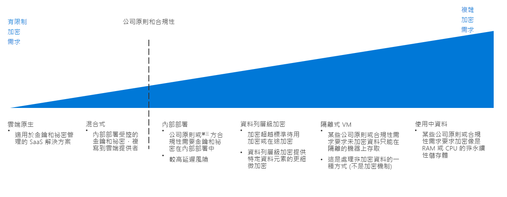

# 加密決策指南

將資料加密可防止資料遭到未經授權存取。 正確實作的加密原則能夠為雲端式工作負載提供額外的安全性，並抵禦來自組織和網路內外的攻擊者與其他未經授權的使用者。

雖然通常都會需要將資源加密，但加密也確實需要付出一些代價，例如可能會增加延遲和整體資源使用量。 對於需要大量資源的工作負載，在加密與效能之間取得適當的平衡點是必要的。

跳至：[金鑰管理](#key-management) | [資料加密](#data-encryption) | [進一步瞭解](#learn-more)

判斷雲端加密策略時的轉折點重點在於公司政策和合規性要求。

有多種方式可以在不同成本和複雜度的情況下於雲端環境實作加密。 公司政策和第三方合規性是規劃加密策略時最重要的考量事項。 大部分的雲端解決方案都能提供標準加密機制，以加密待用或傳輸中的資料。 但是對於要求更嚴格控制的政策與合規性需求 (例如標準化的祕密和金鑰管理、使用中的加密，或資料特定加密)，您可能需要實作複雜的解決方案。

## 金鑰管理

最新的金鑰管理系統應支援使用硬體安全模組 (HSM) 儲存金鑰，以加強保護金鑰。 因此組織必須擁有金鑰管理系統，以具備建立及儲存加密金鑰、重要密碼、連線字串，以及其他 IT 機密資訊的能力。

規劃雲端移轉作業時，以下表格說明儲存及管理加密金鑰、憑證和秘密的方式，這對於建立安全和可管理雲端部署而言至關重要：

| 問題 | 雲端原生 | 混合式 | 內部部署 |
|---------------------------------------------------------------------------------------------------------------------------------------|--------------|--------|-------------|
| 您的組織是否缺乏集中管理金鑰和祕密的能力？                                                                    | yes          | 否     | 否          |
| 您是否需要制訂規則，以限制建立可同時在內部部署硬體裝置和雲端使用的金鑰和秘密？ | 否           | yes    | 否          |
| 您的組織是否已制訂規則或原則以防止在異地儲存金鑰和祕密？                | 否           | 否     | yes         |

### 雲端原生

具備雲端原生金鑰管理能力之後，就能在雲端保存庫中產生、管理及儲存所有金鑰和祕密。 此方法可簡化許多和金鑰管理有關的 IT 工作。

雲端原生金鑰管理假設事項：使用雲端原生金鑰管理系統時會假設以下事項：

- 您信任並使用雲端金鑰管理解決方案建立、管理及裝載您組織的密與金鑰。
- 您允許需要存取加密服務或秘密的所有內部部署應用程式和服務存取雲端金鑰管理系統。

### 混合式 (攜帶您自己的金鑰)

採用「攜帶您自己的金鑰」方法時，您可以在內部部署環境內的專用 HSM 硬體上產生金鑰，然後將金鑰傳輸到安全的雲端金鑰管理系統以和雲端資源搭配使用。

混合式金鑰管理假設事項：使用混合式金鑰管理系統時會假設以下事項：

- 您信任並採用雲端平台的基礎安全性和存取控制基礎結構裝載及使用您的金鑰和祕密。
- 您因為法規或管理原則的限制，必須在內部部署系統中建立及管理組織的秘密和金鑰。

### 內部部署 (保存您自己的金鑰)

在某些情況下，您可能會因為法規、原則技術原因的限制，而無法將金鑰儲存在公用雲端服務所提供的金鑰管理系統中。 在這些情況下，您必須使用內部部署硬體維護金鑰，並佈建機制以允許雲端資源針對加密用途存取這些金鑰。 請注意，保留您自己金鑰的方法可能並未與所有雲端服務相容。

內部部署金鑰管理假設事項：使用內部部署金鑰管理系統時會假設以下事項：

- 您因為法規或管理原則的限制，必須在內部部署系統中建立、管理及裝載組織的秘密和金鑰。
- 需要存取加密服務或秘密的任何雲端應用程式或服務都能存取內部部署金鑰管理系統。

## 資料加密

規劃加密原則時，有幾個不同的資料狀態需考量不同的加密需求：

| 資料狀態 | 資料 |
|-----|-----|
| 資料傳輸中 | 內部網路流量、網際網路連線、資料中心或虛擬網路之間的連線 |
| 待用資料    | 資料庫、檔案、虛擬磁碟機、PaaS 儲存體 |
| 資料使用中     | 資料已載入至 RAM 或 CPU 快取中 |

### 資料傳輸中

資料傳輸中代表資料正在內部資源之間、在資料中心或外部網路之間，或在網際網路上移動。

傳輸中資料的加密工作通常是透過要求針對流量使用 SSL/TLS 通訊協定來完成。 雲端裝載資源之間傳輸到外部網路或公用網際網路的流量應一律加密。 PaaS 資源通常也會預設對流量強制進行 SSL/TLS 加密。 我們建議雲端採用小組和工作負載擁有者，將虛擬網路內部所裝載 IaaS 資源之間的流量強制加密。

**加密傳輸中資料時的假設事項**。 實作傳輸中資料的適當加密原則時會假設以下事項：

- 您雲端環境中所有可公開存取的端點都將使用 SSL/TLS 通訊協定與公用網際網路通訊。
- 透過公用網際網路連線雲端網路與內部部署或其他外部網路時，會使用加密的 VPN 通訊協定。
- 使用專用 WAN 連線 (例如 ExpressRoute) 連線雲端網路與內部部署或其他外部網路時，您會將 VPN 或內部部署的其他加密設備，與雲端網路中部署的相對應虛擬 VPN 或加密設備搭配使用。
- 如果您有機密資料不應包含在 IT 人員可檢視的流量記錄或其他診斷報告中，您會將虛擬網路中資源之間的所有流量加密。

### 待用資料

待用資料代表目前未移動或處理的任額資料，包括檔案、資料庫、虛擬機器磁碟機、PaaS 儲存體帳戶，或類似的資產。 加密儲存的資料可保護虛擬裝置或檔案，避免遭到外部網路入侵、惡意的內部使用者，或意外發布之類的未經授權存取。

PaaS 儲存體與資料庫資源通常會預設強制加密。 IaaS 虛擬資源可以運用儲存在您金鑰管理系統中的密碼編譯金鑰，透過虛擬磁碟加密方式加以保護。

將待用資料加密也涉及更高階的資料庫加密技術，例如資料行層級和資料列層級加密，這可以讓您更準確地控制那些資料需受到保護。

您的整體原則和合規性需求、所儲存資料的機密度，以及工作負載的效能需求，應該會決定哪些資產需要加密。

**加密待用資料時的假設事項**。 加密待用資料時會假設以下事項：

- 您儲存的資料並不是提供給公眾使用的資料。
- 您的工作負載可以接受因磁碟加密而增加的延遲成本。

### 資料使用中

加密使用中的資料涉及保護非永久性儲存體 (例如 RAM 或 CPU 快取) 中的資料。 使用像是完整記憶體加密和記憶體保護區技術 (例如 Intel 的安全防護擴充功能 (SGX)) 這樣的技術。 這也包括密碼編譯技術，例如可用來建立安全、受信任執行環境的同態加密技術。

**加密使用中資料時的假設事項**。 加密使用中資料時會假設以下事項：

- 您隨時都需要個別維護資料擁有權與基礎雲端平台，即使在 RAM 與 CPU 層級也一樣。

## 深入了解

如需 Azure 平台中加密和金鑰管理的相關詳細資訊，請參閱下列各項。

- [Azure 加密概觀](/azure/security/security-azure-encryption-overview)。 Azure 如何使用加密來保護待用和傳輸中資料的詳細描述。
- [Azure Key Vault](/azure/key-vault/key-vault-overview)。 金鑰保存庫是 Azure 內儲存及管理密碼編譯金鑰、祕密和憑證的主要金鑰管理系統。
- [Azure 中的機密運算](/solutions/confidential-compute)。 Azure 的機密運算方案提供了工具和技術，用來建立受信任的執行環境或其他加密機制，以保護使用中的資料。

## 後續步驟

了解軟體定義網路如何提供用於雲端部署的虛擬化網路功能。

> [!div class="nextstepaction"]
> [哪一個軟體定義網路模式最適合我的部署？](../software-defined-network/overview.md)
