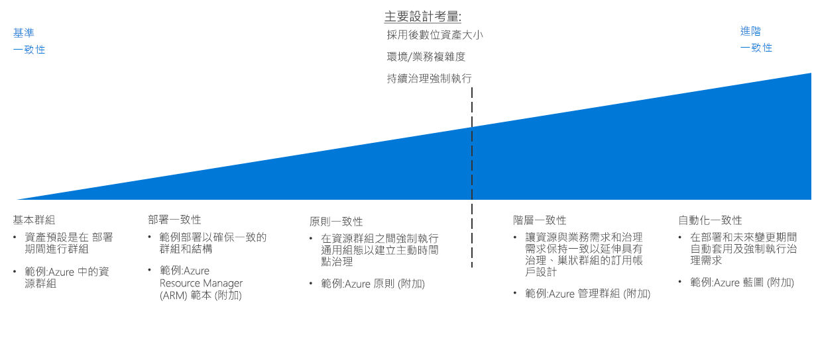

# CAF：資源一致性決策指南

Azure[訂用帳戶設計](../subscriptions/overview.md)可定義雲端資產的組織方式，這些雲端資產則與您組織的整體結構息息相關。 此外，您現有的 IT 管理標準和組織性原則的整合，則取決於部署及組織訂用帳戶內雲端資源的方式。

可用來實作資源部署、分組及管理設計的工具會視雲端平台而異。 通常每個解決方案都會包含下列功能：

- 訂用帳戶或帳戶層級以下的邏輯群組機制。
- 以程式設計方式使用 API 部署資源的功能。
- 建立標準化部署的範本。
- 在訂用帳戶、帳戶和資源群組層級部署原則規則的功能。

跳至：[基本群組](#basic-grouping) | [部署一致性](#deployment-consistency) | [原則一致性](#policy-consistency) | [階層式一致性](#hierarchical-consistency)  | [自動化的一致性](#automated-consistency)

資源部署和群組決策主要取決於下列因素：移轉後的數位資產大小、不符合您現有訂用帳戶設計方式的業務或環境複雜度，或需要在部署資源之後持續強制執行治理。 更進階的資源群組設計需要執行更多工作，以確保能夠準確地分組，因此這會導致在變更管理和追蹤時需要更多時間。

## 基本分組

在 Azure 中，[資源群組](/azure/azure-resource-manager/resource-group-overview#resource-groups)是以邏輯方式將訂用帳戶內的資源分組的核心資源組織機制。

資源群組會做為具有一般生命週期或共用管理條件約束 (例如原則或以角色為基礎的存取控制 (RBAC) 要求) 的資源容器。 資源群組不能建立巢狀結構，且資源只能屬於一個資源群組。 某些動作可套用於資源群組中的所有資源。 例如，刪除資源群組即可移除該群組內的所有資源。 有幾種常見模式可建立資源群組，通常區分為兩種類別：

- 傳統 IT 工作負載：最常見的分組方式為依照相同生命週期內的項目分組，例如應用程式。 依照應用程式分組，即可進行個別應用程式管理。
- 敏捷式 IT 工作負載：著重於外部客戶面向的雲端應用程式。 資源群組通常會反映出部署 (例如 Web 層或應用程式層) 和管理的功能層次。

## 部署一致性

大部分雲端平台皆建置在基本的資源群組機制之上，可提供系統以用於使用範本將資源部署至雲端環境。 您可以在部署工作負載時使用範本建立一致的組織和命名慣例，強制執行您資源部署和管理設計的各個層面。

[Azure Resource Manager 範本](/azure/azure-resource-manager/resource-group-overview#template-deployment)可讓您使用預先決定的組態和資源群組結構，以一致的狀態重複部署資源。 Resource Manager 範本可協助您定義一組標準作為部署基礎。

例如，您可以使用標準範本部署，將包含兩個虛擬機器的 Web 伺服器工作負載，部署為結合負載平衡器的 Web 伺服器，以管理伺服器之間的流量。 然後只要需要新的 Web 伺服器工作負載，就可以重複使用此範本建立結構完全相同的部署，僅需變更涉及的部署名稱和 IP 位址。

請注意，您也可以用程式設計方式部署這些範本，並將它們與您的 CI/CD 系統整合。

## 原則一致性

為確保在建立資源時套用治理原則，資源群組設計的一部份會涉及使用一般組態部署資源。

您可以透過結合資源群組和標準化 Resource Manager 範本，針對部署時需要哪些設定，以及要對每個資源群組或資源套用哪些 [Azure 原則](/azure/governance/policy/overview)規則等需求，強制執行適用標準。

例如，您可能需要讓訂用帳戶內部署的所有虛擬機器皆連線到由您的中央 IT 小組所管理的一般子網路。 您可以建立標準範本，以用於部署會針對工作負載建立個別資源群組，並在其中部署必要 VM 的工作負載 VM。 此資源群組會有一項原則規則，限制只允許將資源群組內的網路介面加入至共用子網路。

如需有關在雲端部署內強制執行原則決策的更深入討論，請參閱[原則強制執行](../policy-enforcement/overview.md)。

## 階層式一致性

當雲端資產的大小成長時，您可能需要支援比使用 Azure Enterprise 合約的企業/部門/帳戶/訂用帳戶階層時更複雜治理要求。 資源群組可讓您透過在資源群組層級套用 Azure 原則規則和存取控制，以在組織內支援額外的階層層級。

[Azure 管理群組](../subscriptions/overview.md#management-groups)可在企業合約結構上重疊一個替代階層，藉此支援更複雜的組織性結構。 這可讓訂用帳戶和它們包含的資源支援妥善安排的存取控制和原則強制執行機制，以符合您的業務組織性需求。

## 自動化的一致性

對於大型雲端部署而言，全域治理變得更加重要，而且更複雜。 務必要自動套用和部署資源時，強制執行控管需求，以及針對現有部署更新的需求。

[Azure 藍圖](/azure/governance/blueprints/overview)可讓組織支援 Azure 中大型雲端資產的全域治理。 藍圖超越了標準 Azure Resource Manager 範本所提供的功能，可建立完整且能夠部署資源及套用原則規則的部署協調流程。 藍圖支援下列功能：版本控制、將更新套用至使用藍圖的所有訂用帳戶，以及鎖定已部署的訂用帳戶，藉此防止未經授權建立及修改資源。

這些部署套件可讓 IT 和開發團隊，快速部署符合變更組織性原則需求的新工作負載和網路資產。 藍圖也可以整合至 CI/CD 管線中，以在更新部署時套用修改過的治理標準。

## 後續步驟

了解如何使用資源命名與標記進一步組織及管理雲端資源。

> [!div class="nextstepaction"]
> [資源命名與標記](../resource-tagging/overview.md)
