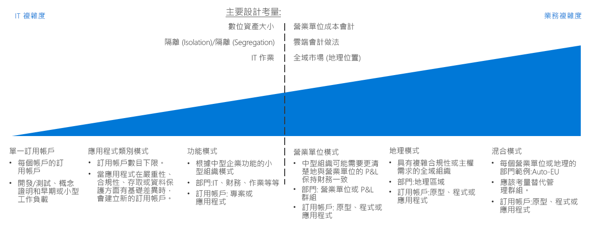
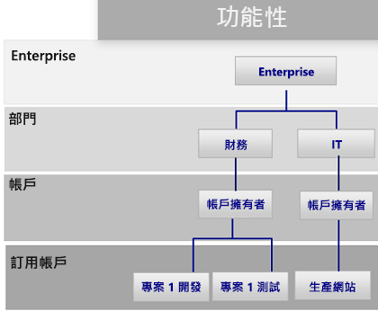
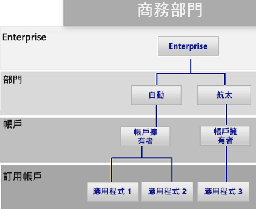

# 訂用帳戶決策指南

所有雲端平台都是以核心擁有權模型為基礎，以便為組織提供許多帳單和資源管理選項。 Azure 所使用的結構不同於其他雲端提供者，因為它包含適用於組織階層和已群組訂用帳戶擁有權的各種支援選項。 不論如何，通常會有一個人負責帳單，並指派另一個人作為管理資源的最上層擁有者。

跳至：[訂用帳戶設計和 Azure Enterprise 合約](#subscriptions-design-and-azure-enterprise-agreements) | [訂用帳戶設計模式](#subscription-design-patterns) | [管理群組](#management-groups) | [訂用帳戶層級的組織](#organization-at-the-subscription-level)

訂用帳戶設計是公司在雲端採用期間，用來建立結構或組織資產的最常見策略之一。

**訂用帳戶階層**：「訂用帳戶」是 Azure 服務 (例如，虛擬機器、SQL DB、應用程式服務或容器) 的邏輯集合。 Azure 中的每個資產都會部署到單一訂用帳戶。 每個訂用帳戶則會由一個「帳戶」所擁有。 此帳戶是使用者帳戶 (或最好是服務帳戶)，可跨訂用帳戶提供帳單和系統管理存取。 對於已透過 Enterprise 合約 (EA) 承諾使用特定數量之 Azure 的客戶，會新增另一個稱為「部門」的控制層級。 在 EA 入口網站中，可以基於帳單和管理用途，使用訂用帳戶、帳戶和部門來建立階層。

訂用帳戶設計的複雜度各不相同。 有關設計策略的決策具有獨特的轉折點，因為它們通常涉及商務和 IT 條件約束。 進行技術決策之前，IT 架構設計師和決策人員應該與商務專案關係人和雲端策略小組合作，以了解所需的雲端帳戶處理方法、您營業單位內的成本帳戶處理做法，以及適用於貴組織的全球市場需求。

**轉折點**：上圖的虛線會基於訂用帳戶設計，參考簡單模式和更複雜模式之間的轉折點。 其他以數位資產大小與 Azure 訂用帳戶限制、隔離 (Isolation) 和隔離 (Segregation) 原則，以及 IT 作業部門為依據的技術決策點，通常會對訂用帳戶設計產生重大影響。

**其他考量**：選取訂用帳戶設計時應注意的事項是，訂用帳戶不是群組資源或部署的唯一方式。 訂用帳戶都是在 Azure 早期建立的，因此，它們具有與先前 Azure 解決方案 (例如 Azure Service Manager) 相關的限制。

部署結構、自動化，以及新增方法來群組資源，可能都會影響您的結構訂用帳戶設計。 完成訂用帳戶設計之前，請考慮[資源一致性](../resource-consistency/overview.md)決策可能會對您的設計選擇產生何種影響。 例如，大型跨國組織一開始可能考慮針對訂用帳戶管理使用複雜模式。 不過，藉由新增管理群組階層，該家公司或許能夠透過較簡單的營業單位模式來實現更大的利益。

## 訂用帳戶設計和 Azure Enterprise 合約

所有 Azure 訂用帳戶都會與一個帳戶相關聯，該帳戶會連線到每個訂用帳戶的帳單和最上層存取控制。 單一帳戶可以擁有多個訂用帳戶，而且可提供基本層級的訂用帳戶組織。

對於小型 Azure 部署，單一訂用帳戶或小型訂用帳戶集合可能就會構成您的整個雲端資產。 不過，大型 Azure 部署可能需要跨越多個訂用帳戶來支援您的組織結構，並略過[訂用帳戶配額和限制](/azure/azure-subscription-service-limits)。

每個 Azure Enterprise 合約都提供進一步的能力，來將訂用帳戶和帳戶組織為可反映組織優先順序的階層。 您的組織 Enterprise 註冊會以合約的角度，來定義公司內部的 Azure 服務形式和用途。 在每個 Enterprise 合約中，您可以進一步將環境細分成部門、帳戶和訂用帳戶，以符合組織的結構。

## 訂用帳戶設計模式

每個企業都不同。 因此，已在整個 Azure Enterprise 合約中啟用的部門/帳戶/訂用帳戶階層，能夠在組織 Azure 的方式上提供極大的彈性。 將貴組織的階層模型化以反映公司的帳單、資源管理和資源存取需求，是當您開始在公用雲端中作業時所做的最優先且最重要的決策。

下列訂用帳戶模式反映出普遍提高了訂用帳戶設計的複雜度，以支援潛在的組織優先順序：

### 單一訂用帳戶

如果組織需要部署少數裝載於雲端的資產，則針對每個帳戶使用單一訂用帳戶就已足夠。 這通常是您在開始雲端採用程序時所實作的第一個訂用帳戶模式，讓小規模的實驗性或概念證明部署能夠探索雲端平台的功能。

不過，對於單一訂用帳戶將支援的資源數目可能會有技術限制。 隨著您的雲端資產大小增長，您可能還想要支援組織資源，以單一訂用帳戶不支援的方式，更妥善地組織原則和存取控制。

### 應用程式分類模式

隨著組織雲端磁碟使用量大小的增長，使用多個訂用帳戶的可能性就會提高。 在此案例中，通常會建立訂用帳戶，以支援在商務關鍵性、合規性需求、存取控制或資料保護需求中具有基本差異的應用程式。 支援這些應用程式分類的訂用帳戶和帳戶，全都組織於由中央 IT 作業人員所擁有且管理的單一部門之下。

每個組織選擇來將應用程式分類的方式各有不同，通常會根據特定的應用程式或服務，或是應用程式原型之類的訂用帳戶來分隔訂用帳戶。 可能會證明此模式下之個別訂用帳戶的工作負載包括：

- 實驗性或低風險應用程式
- 含有受保護資料的應用程式
- 任務關鍵性工作負載
- 受限於法規需求 (例如 HIPAA 或 FedRAMP) 的應用程式
- 批次工作負載
- 巨量資料工作負載，例如 Hadoop
- 已使用 Kubernetes 之類的部署協調器進行容器化的工作負載
- 分析工作負載

此模式支援多個負責特定工作負載的帳戶擁有者。 由於它在 Enterprise 合約階層的部門層級缺乏更複雜的結構，因此，此模式不需要實作 Azure Enterprise 合約。

### 功能模式

此模式會使用提供給 Azure Enterprise 合約客戶的企業/部門/帳戶/訂用帳戶階層，依功能 (例如，財務、業務或 IT 支援) 來組織訂用帳戶和帳戶。

### 營業單位模式

此模式會使用 Azure Enterprise 合約階層，根據損益分類、營業單位、部門、利潤中心或類似的商務結構，來群組應用程式和帳戶。

### 地理模式

對於全球營運的組織，此模式會使用 Azure Enterprise 合約階層，根據地理區域來群組訂用帳戶和帳戶。

### 混合模式

企業/部門/帳戶/訂用帳戶階層。 不過，您可以將地理區域和營業單位之類的模式相結合，以反映貴公司內更複雜的帳單與組織結構。 此外，您的[資源一致性設計](../resource-consistency/overview.md)可以進一步擴充訂用帳戶設計的治理與組織結構。

管理群組 (如下一節所討論) 有助於支援更複雜的組織結構。

下一節所討論的管理群組有助於支援更複雜的組織結構。

## 管理群組

除了透過 Enterprise 合約提供的部門和組織結構，[Azure 管理群組](/azure/governance/management-groups/index)還會跨多個訂用帳戶，針對組織原則、存取控制及合規性提供額外的彈性。 管理群組的巢狀結構最多可有六個層級，讓您能夠建立與帳單階層分開的階層。 這樣做只為了讓您能更有效率地管理資源。

管理群組可對您的帳單階層進行鏡像處理，而且企業通常會以該方式作為起點。 不過，管理群組的強大功能是，當相關的訂用帳戶 (無論位於帳單階層的何處&mdash;&mdash;) 群組在一起，而且需要獲派常見角色、原則及計劃時，即可使用這些管理群組來為組織建立模型。

範例包括：

- 生產/非生產：有些企業會建立管理群組來識別其生產和非生產訂用帳戶。 管理群組可讓這些客戶更輕鬆地管理角色和原則，例如：非生產訂用帳戶可能會允許開發人員具有「參與者」存取權，但在生產訂用帳戶中，他們只具有「讀者」存取權。
- 內部服務/外部服務：類似於生產/非生產，企業對內部服務和提供給客戶的外部服務通常會有不同的需求、原則和角色。

## 訂用帳戶層級的組織

在判斷您的部門和帳戶 (或管理群組) 時，您將需優先決定如何分配 Azure 環境以符合您的組織。 但是，訂用帳戶才是真正執行作業的地方，而這些決策都將影響安全性、延展性和帳單。

請考慮下列模式作為指南：

- **應用程式/服務**：訂用帳戶代表應用程式或服務 (應用程式的組合)。

- **生命週期**：訂用帳戶代表服務生命週期，例如生產或開發。

- **部門**：訂用帳戶代表組織中的部門。

前兩個模式最常使用，而且強烈建議使用這兩者。 生命週期方法適用於大部分的組織。 在此情況下，一般建議是使用兩個基本訂用帳戶：生產和非生產，然後使用資源群組進一步細分環境。

如需如何使用 Azure 訂用帳戶和資源群組來群組和管理資源的一般描述，請參閱 [Azure 中的資源存取管理](../../getting-started/azure-resource-access.md)。

## 後續步驟

了解如何使用識別服務，在雲端中進行存取控制和管理。

> [!div class="nextstepaction"]
> [身分識別](../identity/overview.md)
