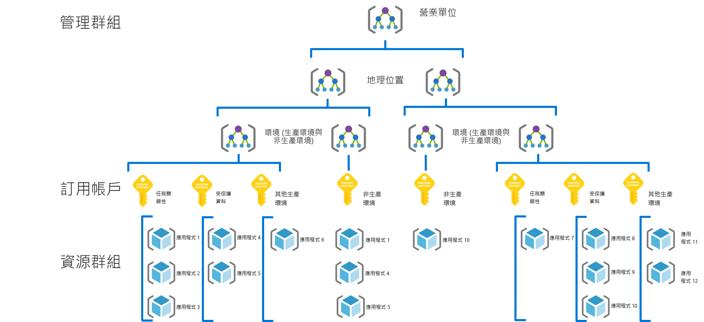
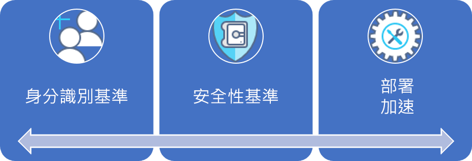
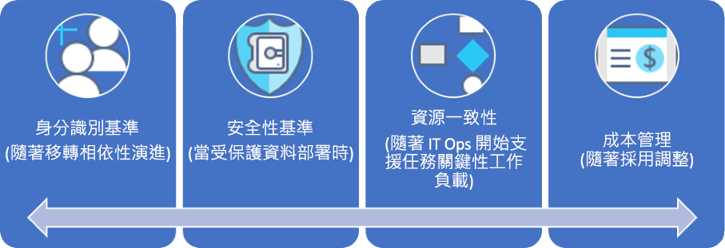

# CAF：大型企業治理旅程圖CAF: Large enterprise governance journey

## 最佳做法概觀Best practice overview

這個治理旅程圖會遵循虛構公司在治理成熟度各個階段的體驗，This governance journey follows the experiences of a fictional company through various stages of governance maturity. 並以實際的客戶旅程圖為基礎。It is based on real customer journeys. 建議的最佳做法則會以該虛構公司的條件約束和需求為主。The suggested best practices are based on the constraints and needs of the fictional company.

此概觀會根據最佳做法來定義治理的最簡可行產品 (MVP) 以作為快速起點。As a quick starting point, this overview defines a minimum viable product (MVP) for governance based on best practices. 它還提供一些治理演進的連結，這些演進會隨著新業務或技術風險的出現，進一步新增最佳做法。It also provides links to some governance evolutions that add further best practices as new business or technical risks emerge.

> [!WARNING]
> 這個 MVP 是基於一組假設的基準起點。This MVP is a baseline starting point, based on a set of assumptions. 即便是這組基本的最佳做法，也會以獨特的業務風險和風險承受度所衍生的公司原則為基礎。Even this minimal set of best practices is based on corporate policies driven by unique business risks and risk tolerances. 若要查看您是否適用這些假設，請閱讀本文後面[較長的敘述](./narrative.md)。To see if these assumptions apply to you, read the [longer narrative](./narrative.md) that follows this article.

### 治理最佳做法Governance best practice

這個最佳做法會作為組織可用來在多個 Azure 訂用帳戶中快速且一致地新增治理防護的基礎。This best practice serves as a foundation that an organization can use to quickly and consistently add governance guardrails across multiple Azure subscriptions.

### 資源組織Resource organization

下圖顯示組織資源的治理 MVP 階層。The following diagram shows the governance MVP hierarchy for organizing resources.

每個應用程式都應該在管理群組、訂用帳戶，以及資源群組階層的適當區域中部署。Every application should be deployed in the proper area of the management group, subscription, and resource group hierarchy. 在部署規劃期間，雲端治理小組將在階層中建立必要的節點，以使雲端採用小組更具產能。During deployment planning, the Cloud Governance team will create the necessary nodes in the hierarchy to empower the cloud adoption teams.

1. 適用於每個營業單位的管理群組，以及詳細反映地理位置和環境類型 (生產、非生產) 的階層。A management group for each business unit with a detailed hierarchy that reflects geography then environment type (Production, Non-Production).
2. 適用於每個獨特的營業單位、地理位置、環境和「應用程式分類」組合的訂用帳戶。A subscription for each unique combination of business unit, geography, environment, and "Application Categorization."
3. 適用於每個應用程式的單獨資源群組。A separate resource group for each application.
4. 應該在此群組階層的每個層級套用一致的命名法。Consistent nomenclature should be applied at each level of this grouping hierarchy.

這些模式會提供成長的空間，而不會不必要地使階層複雜化。These patterns provide room for growth without complicating the hierarchy unnecessarily.

[!INCLUDE [governance-of-resources](../../../../../includes/cloud-adoption/governance/governance-of-resources.md)]

## 治理演進Governance evolutions

一旦部署此 MVP 之後，其他治理層就可以快速地合併到環境中。Once this MVP has been deployed, additional layers of governance can be quickly incorporated into the environment. 以下是一些推演 MVP 以符合特定業務需求的方式：Here are some ways to evolve the MVP to meet specific business needs:

- [受保護資料的安全性基準Security Baseline for protected data](./security-baseline-evolution.md)
- [任務關鍵性應用程式的資源設定Resource configurations for mission-critical applications](./resource-consistency-evolution.md)
- [成本管理控制Controls for Cost Management](./cost-management-evolution.md)
- [多重雲端演進的控制Controls for multi-cloud evolution](./multi-cloud-evolution.md)

<!-- markdownlint-disable MD026 -->

## 這個最佳做法有哪些用途？What does this best practice do?

在 MVP 中，從[部署加速](../../deployment-acceleration/overview.md)專業領域建立做法和工具是為了快速套用公司原則。In the MVP, practices and tools from the [Deployment Acceleration](../../deployment-acceleration/overview.md) discipline are established to quickly apply corporate policy. 特別是，MVP 會使用 Azure 藍圖、Azure 原則及 Azure 管理群組來套用數個基本的公司原則，如這家虛構公司的敘述中所定義。In particular, the MVP uses Azure Blueprints, Azure Policy, and Azure management groups to apply a few basic corporate policies, as defined in the narrative for this fictional company. 這些公司原則會使用 Azure Resource Manager 範本與 Azure 原則來套用，以建立很小的身分識別和安全性基準。Those corporate policies are applied using Azure Resource Manager templates and Azure policies to establish a very small baseline for identity and security.

## 推演最佳做法Evolving the best practice

經過一段時間之後，這個治理 MVP 將用於推演治理做法。Over time, this governance MVP will be used to evolve the governance practices. 隨著採用率提高，業務風險也會增加。As adoption advances, business risk grows. CAF 治理模型中的各種專業領域將持續推演以降低這些風險。Various disciplines within the CAF governance model will evolve to mitigate those risks. 本系列的後續文章將討論影響這家虛構公司的公司原則演進。Later articles in this series discuss the evolution of corporate policy affecting the fictional company. 這些演進會跨三個專業領域進行：These evolutions happen across three disciplines:

- 身分識別基準 (移轉相依性在敘述中持續推演時)Identity Baseline, as migration dependencies evolve in the narrative
- 成本管理 (採用擴大規模時)Cost Management, as adoption scales.
- 安全性基準 (部署受保護的資料時)。Security Baseline, as protected data is deployed.
- 資源一致性 (IT 操作開始支援任務關鍵性工作負載時)。Resource Consistency, as IT Operations begins supporting mission-critical workloads.

## 後續步驟Next steps

既然您已經熟悉治理 MVP，並且了解後續的治理演進，請閱讀對於其他內容的支持性敘述。Now that you’re familiar with the governance MVP and have an idea of the governance evolutions to follow, read the supporting narrative for additional context.

> [!div class="nextstepaction"]
> [閱讀支持性敘述Read the supporting narrative](./narrative.md)
