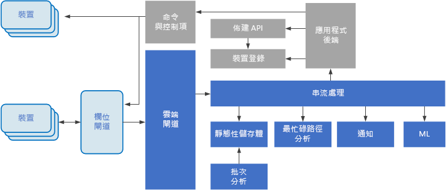

# 巨量資料架構

巨量資料架構的設計，可處理對於傳統資料庫系統而言太大或太複雜之資料的擷取、處理和分析。 組織跨入巨量資料領域的門檻會隨使用者及其工具的能力而有所不同。 對於某些組織來說，這個門檻可能代表數百 GB 的資料，對於其他組織來說，則可能代表數百 TB 的資料。 隨著用來處理巨量資料集的工具不斷發展，巨量資料的意義也跟著進化。 這個字詞與可透過進階分析從資料集內擷取出的價值越來越有關係，而非僅與資料大小有關，不過，在這些案例中，其規模往往會相當龐大。

積年累月下來，資料態勢已發生變化。 您可以對資料進行的作業或應當進行的作業已改變。 儲存成本已大幅下降，於此同時，資料的收集方式也不斷增加。 某些資料會不斷送達，因此需要持續地收集和觀察。 其他資料則較不常送達，但會有非常大的區塊，其形式通常為數十年的歷史資料。 您可能會遇到進階的分析問題，或需要機器學習的問題。 這些問題便是巨量資料架構要試圖解決的挑戰。

巨量資料的解決方案通常會涉及一或多個下列類型的工作負載：

* 待用之巨量資料來源的批次處理。
* 移動中之巨量資料的即時處理。
* 巨量資料的互動式探索。
* 預測性分析和機器學習。

當您有以下需求時，請考慮使用巨量資料架構：

* 要儲存和處理的資料數量對於傳統資料庫來說太大時。
* 要轉換非結構化資料以進行分析和報告。
* 要以即時或低延遲的方式擷取、處理和分析未繫結的資料串流。

## 巨量資料架構的元件

下圖顯示可融入巨量資料架構的邏輯元件。 個別解決方案可能不會包含此圖中的每個項目。

 

巨量資料的架構大多包括下列的部分或所有元件：

* **資料來源**。 所有巨量資料解決方案都是從一或多個資料來源來開始建置的。 範例包括：

    * 應用程式資料存放區，例如關聯式資料庫。
    * 應用程式所產生的靜態檔案，例如 Web 伺服器記錄檔。
    * 即時資料來源，例如 IoT 裝置。

* **資料儲存體**。 要進行批次處理作業的資料通常儲存在分散式檔案存放區，以便能夠保存大量具有不同格式的大型檔案。 這種存放區通常稱為「資料湖」。 可供實作此儲存體的選項包含 Azure Data Lake Store 或 Azure 儲存體中的 Blob 容器。

* **批次處理**。 由於資料集是如此龐大，巨量資料解決方案通常必須使用需要長時間執行的批次作業來處理資料檔案，以便篩選、彙總和準備資料以供分析。 這些作業通常涉及讀取原始程式檔、加以處理，然後將輸出寫入至新的檔案。 選項包括在 Azure Data Lake Analytics 中執行 U-SQL 作業、在 HDInsight Hadoop 叢集中使用 Hive、Pig 或自訂的 Map/Reduce 作業，或是在 HDInsight Spark 叢集中使用 Java、Scala 或 Python 程式。

* **即時訊息擷取**。 如果解決方案中包含即時來源，則架構中必須有方法可擷取和儲存即時訊息以進行串流處理。 這可能是簡單的資料存放區，內送訊息會放入資料夾處理。 不過，許多解決方案需要有訊息擷取存放區，以做為訊息的緩衝區，以及支援相應放大處理、可靠的傳遞和其他訊息佇列語意。 串流架構的這個部分通常稱為串流緩衝處理。 選項包括 Azure 事件中樞、Azure IoT 中樞和 Kafka。

* **串流處理**。 在擷取即時訊息後，解決方案必須經由篩選、彙總和準備要分析的資料，以便處理這些資料。 已處理的串流資料接著會寫入至輸出接收器。 Azure 串流分析會根據永久執行的 SQL 查詢 (會針對未繫結資料流進行操作) 提供受控串流處理服務。 您也可以使用開放原始碼的 Apache 串流技術，例如 HDInsight 叢集中的 Storm 和 Spark 串流。

* **分析資料存放區**。 許多巨量資料解決方案會準備資料以供分析，然後以可使用分析工具來查詢的結構化格式提供處理過的資料。 用來提供這些查詢的分析資料存放區可以是 Kimball 樣式的關聯式資料倉儲，如同我們在大部分的傳統商業智慧 (BI) 解決方案所看見的。 或者，我們也可以透過低延遲的 NoSQL 技術 (例如 HBase) 或是互動式 Hive 資料庫 (可針對分散式資料存放區中的資料檔案提供中繼資料擷取) 來呈現資料。 Azure SQL 資料倉儲可提供受控服務供大規模的雲端式資料倉儲使用。 HDInsight 則支援互動式 Hive、HBase 和 Spark SQL，它們也可用來提供要分析的資料。

* **分析和報告**。 大部分巨量資料解決方案的目標，是要透過分析和報告提供資料的深入見解。 為了讓使用者能夠分析資料，架構中可能要包括資料模型化層，例如 Azure Analysis Services 中的多維度 OLAP Cube 或表格式資料模型。 架構也可能會支援自助商業智慧，其使用的是 Microsoft Power BI 或 Microsoft Excel 中的模型化和視覺效果技術。 分析和報告也可供資料科學家或資料分析師透過互動方式瀏覽資料。 針對這些案例，許多 Azure 服務支援了分析筆記本 (例如 Jupyter)，讓這些使用者能夠利用其現有的技巧來使用 Python 或 R。若要瀏覽大規模的資料，您可以使用 Microsoft R Server (不論是獨立使用或搭配 Spark 來使用)。

* **協調流程**。 大部分的巨量資料解決方案都包含重複的資料處理作業並封裝在工作流程中，這些作業會轉換來源資料、在多個來源和接收器之間移動資料、將處理過的資料載入分析資料存放區，或將結果直接推送到報告或儀表板。 若要讓這些工作流程自動執行，您可以使用協調流程技術，例如 Azure Data Factory 或 Apache Oozie 和 Sqoop。

## Lambda 架構

在處理非常大型的資料集時，用戶端所需查詢的執行時間可能會很久。 這些查詢無法即時執行，而且往往需要可跨整個資料集平行運作的演算法，例如 [MapReduce](https://en.wikipedia.org/wiki/MapReduce)。 其結果隨後會與未經處理資料分開儲存，並用於查詢。

這種方法的其中一個缺點是會導致延遲 &mdash; 如果處理時間需要數小時，查詢所傳回的可能是數小時之前的結果。 理想情況下，您會想要即時取得一些結果 (可能會損失一些精確度)，並將這些結果與批次分析的結果合併。

**Lambda 架構**是由 Nathan Marz 率先提出，此架構會藉由建立兩個資料流程路徑來解決此問題。 進入系統的所有資料會經過這兩個路徑：

* **批次層** (冷路徑) 會以原始格式儲存所有內送資料，並對資料執行批次處理。 此處理的結果會儲存為**批次檢視**。

* **速度層** (熱路徑) 會即時分析資料。 這一層的設計目的是要犧牲精確度來實現低延遲。

批次層會饋送至**服務層**，由服務層為批次檢視編制索引以便能有效率地查詢。 速度層會根據最新的資料，使用累加式更新來更新服務層。

流入熱路徑的資料會受到速度層所施加之延遲需求的約束，因此會盡快處理。 這通常需要犧牲一定程度的精確度以換取盡快備妥資料。 例如，請設想有大量溫度感應器正在傳送遙測資料的 IoT 案例。 速度層可用來處理內送資料的滑動時間範圍。 

另一方面，流入冷路徑的資料則無須遵守同樣的低延遲需求。 此一行為可在跨大型資料集進行計算時獲得高精確度，但極為耗時。 

熱路徑和冷路徑最終會在分析用戶端應用程式會合。 如果用戶端需要即時顯示及時但可能較不精確的資料，便會從熱路徑取得其結果。 否則，便會從冷路徑選取結果以顯示較不即時但更精確的資料。 換句話說，熱路徑所擁有之資料的時間範圍較小，此時間過後，系統就會使用更精確的冷路徑資料來更新結果。

儲存在批次層的未經處理資料永遠不會更動。 內送資料一律會附加至現有資料，永遠不會覆寫先前的資料。 特定資料值若有任何變更，都會儲存為新的時間戳記事件記錄。 這可讓您在所收集資料之整段歷史中的任何時間點進行重新計算。 從原始的未經處理資料重新計算批次檢視的功能很重要，因為它可讓您隨系統的演進建立新的檢視。 

## Kappa 架構

Lambda 架構的缺點是其複雜度。 處理邏輯會出現在兩個使用不同架構的不同位置，也就是冷路徑和熱路徑。 這會導致計算邏輯重複且這兩個路徑之架構的管理複雜度翻倍。

**Kappa 架構**是 Jay Kreps 所提出，目的是要替代 Lambda 架構。 它與 Lambda 架構擁有相同的基本目標，但有一大差異：所有資料會流經使用串流處理系統的單一路徑。 

這與 Lambda 架構的批次層有一些相似之處，事件資料永遠不會更動，並且會收集全部內容而不只是部分。 系統會以事件串流的形式將資料擷取至分散式且容錯的統一記錄。 這些事件經過排序，且只有附加的新事件能變更事件的目前狀態。 類似於 Lambda 架構的速度層，所有事件處理都是在輸入資料流上執行的，並且會以即時檢視的形式保存下來。 

如果您需要重新計算整個資料集 (相當於批次層在 Lambda 中的作用)，您只需重新執行串流，一般是使用平行處理原則來即時完成計算。

## 物聯網 (IoT)

從實務的觀點來看，物聯網 (IoT) 代表與網際網路連線的任何裝置。 這包括您的電腦、行動電話、智慧型手錶、智慧型溫控器、智慧型冰箱、連網汽車、心臟監測植入物，以及其他任何與網際網路連線並且會傳送或接收資料的任何物體。 不僅連線裝置的數目與日俱增，從這些裝置所收集的資料量也是如此。 此資料往往是在高限制 (有時會高延遲) 的環境中收集。 在其他情況中，資料則是由數千或數百萬台裝置透過低延遲的環境傳送，所以必須能夠快速擷取資料並據以處理。 因此，您必須有適當的規劃，才能應付這些限制和獨特的需求。

事件驅動架構是 IoT 解決方案的核心。 下圖顯示 IoT 可能的邏輯架構。 此圖強調架構的事件串流元件。

**雲端閘道**會使用可靠、低延遲的傳訊系統在雲端邊界擷取裝置事件。

裝置可能會將事件直接傳送到雲端閘道，或透過**現場閘道**來傳送。 現場閘道是專用的裝置或軟體，通常會與裝置共置，以便接收事件並將它們轉送到雲端閘道。 現場閘道可能也會前置處理未經處理的裝置事件，以執行篩選、彙總或通訊協定轉換等功能。

在擷取之後，事件會通過一個或多個**串流處理器**，這些處理器可以路由傳送資料 (例如，傳送到儲存體) 或執行分析和其他處理。

以下是一些常見的處理類型。 (此清單一定不怎麼詳盡)。

- 將事件資料寫入冷儲存體，以便封存或批次分析。

- 最忙碌路徑分析，(近乎) 即時地分析事件串流，以偵測異常行為、辨識滾動時間範圍的模式，或在串流中發生特定情況時觸發警示。 

- 處理裝置中特殊的非遙測訊息類型，例如通知和警示。 

- 機器學習。

深灰色的方塊顯示的是 IoT 系統中，與事件串流沒有直接關係，但為求完整所以在此納入的元件。

- **裝置登錄**是已佈建之裝置的資料庫，包括裝置識別碼，且通常會包括裝置中繼資料，例如位置。

- **佈建 API** 是常見用於佈建和註冊新裝置的外部介面。

- 某些 IoT 解決方案允許將**命令和控制訊息**傳送至裝置。

相關 Azure 服務：

- [Azure IoT 中心](https://azure.microsoft.com/services/iot-hub/)
- [Azure 事件中樞](https://azure.microsoft.com/services/event-hubs/)
- [Azure 串流分析](https://azure.microsoft.com/services/stream-analytics/)  

閱讀 [Azure IoT 參考架構](https://azure.microsoft.com/updates/microsoft-azure-iot-reference-architecture-available/)以深入了解 Azure 上的 IoT。

