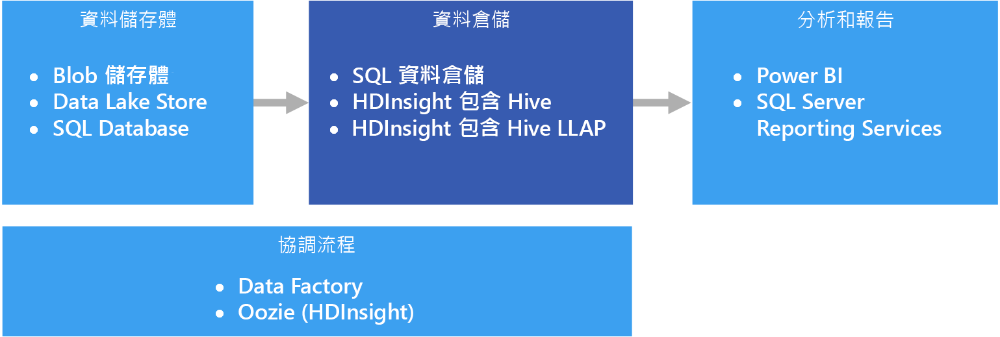

# 資料倉儲和資料超市

資料倉儲是從一或多個不同的來源 (跨多個或所有主體區域) 整合資料的中央、組織、關聯式存放庫。 資料倉儲會儲存目前的資料和歷史資料，可多方面運用於資料的報告和分析。

資料移至資料倉儲時，系統會定期從包含重要商業資訊的各種來源擷取資料。 資料移動時，可進行格式化、清理、驗證、摘要和重新組織。 或者，也可以用最低的詳細程度儲存資料，並在倉儲中提供彙總檢視以供報告之用。 無論採用何種方式，資料倉儲都會成為用於報告、分析和使用商業智慧 (BI) 工具形成重要商務決策的資料所使用的永久儲存空間。

## 資料超市和作業資料存放區

管理大規模的資料是複雜的工作，而以單一資料倉儲呈現整個企業的所有資料，也愈來愈少見了。 反之，組織會建立較小而更為聚焦的資料倉儲 (稱為*資料超市*)，以公開分析所需的資料。 協調程序會將作業資料存放區中維護的資料填入資料超市。 作業資料存放區會作為來源交易系統與資料超市之間的媒介。 作業資料存放區所管理的資料來源是交易系統中的資料經清理後的版本，且通常是資料倉儲或資料超市所維護之歷史資料的子集。

## 使用此解決方案的時機

當您需要將作業系統中的大量資料轉換為容易了解、最新且正確的格式時，請選擇資料倉儲。 資料倉儲不需要依循您在作業/OLTP 資料庫中可能使用的相同簡易資料結構。 您可以使用對商業使用者和分析師具有意義的資料行名稱、重新建構結構描述以簡化資料關聯性，並將多個資料表合併為一個。 這些步驟有助於引導需要建立隨選報表或需要在 BI 系統中建立報表及分析資料的使用者，在沒有資料庫管理員 (DBA) 或資料開發人員的協助下完成操作。

如果您基於效能考量而需要在來源交易系統以外保留歷史資料，請考慮使用資料倉儲。 資料倉儲提供使用通用格式、通用索引鍵、通用資料模型和通用存取方法的集中式位置，可讓您輕鬆地多個位置存取歷史資料。

資料倉儲針對讀取存取進行了最佳化，因此報表產生的速度會優於直接對來源交易系統執行報表。 此外，資料倉儲還具有下列優點：

- 來自多個來源的所有歷史資料，都可視為單一真實來源進行儲存以及從資料倉儲存取。
- 您可以在資料匯入至資料倉儲加以清理、提供更精確的資料，以及提供一致的程式碼和描述，而改善資料品質。
- 報告工具不會與交易來源系統競爭查詢處理週期。 資料倉儲可讓交易系統主要著重於寫入的處理，而大部分的讀取要求則由資料倉儲負責因應。
- 資料倉儲有助於整合來自不同軟體的資料。
- 資料採礦工具可協助您使用自動方法在您的倉儲所儲存的資料中找出隱藏的模式。
- 透過資料倉儲，將更容易為授權使用者提供安全的存取，同時限制其他人的存取。 由於不需要為商業使用者授與資料來源的存取權，對於一或多個生產交易系統的潛在攻擊媒介因而消除。
- 資料倉儲可讓您輕鬆地以資料建立商業智慧解決方案，例如 [OLAP Cube](online-analytical-processing.md)。

## 挑戰

要適當設定資料倉儲以符合個人商業需求，可能必須先克服下列難題：

- 確認正確建立商業概念模型所需的時間。 這是重要的步驟，因為資料倉儲是由資訊驅動的，專案的其餘部分皆由概念對應所推動。 這牽涉到商業相關詞彙和通用格式的標準化 (例如貨幣或日期)，和以對商業使用者具有意義，但仍可確保資料彙總與關聯性之正確性的方式重新建構結構描述。

- 規劃和設定您的資料協調流程。 應考量的事項包括如何將資料從來源交易系統複製到資料倉儲，以及何時將歷史資料移出作業資料存放區，並移至倉儲中。

- 在資料匯入至倉儲時加以清理，以維護或改善資料品質。

## Azure 中的資料倉儲

在 Azure 中，您的資料可能會有一或多個來源，無論是來自客戶交易，還是來自不同部門所使用的各種商業應用程式。 過去，此資料會儲存在一或多個 [OLTP](online-transaction-processing.md) 資料庫中。 資料可持續保存在其他儲存媒體中，例如網路共用、Azure 儲存體 Blob 或 Data Lake。 資料也可由資料倉儲本身儲存，或儲存在關聯式資料庫中，例如 Azure SQL Database。 分析資料存放區層的目的是為了因應分析和報告工具對資料倉儲或資料超市所發出的查詢。 在 Azure 中，這項分析存放區功能可透過 Azure SQL 資料倉儲或使用 Hive 或互動式查詢的 Azure HDInsight 來提供。 此外，您將需要某種程度的協調流程，以定期將資料從資料儲存體移動或複製到資料倉儲，而此功能則可藉由 Azure Data Factory 或 Azure HDInsight 上的 Oozie 來提供。

在 Azure 中實作資料倉儲有多種選項，您可以依據您的需求做選擇。 下列清單分成兩個類別，[對稱式多處理](https://en.wikipedia.org/wiki/Symmetric_multiprocessing) (SMP) 和[大量平行處理](https://en.wikipedia.org/wiki/Massively_parallel) (MPP)。

SMP：

- [Azure SQL Database](/azure/sql-database/)
- [虛擬機器中的 SQL Server](/sql/sql-server/sql-server-technical-documentation)

MPP：

- [Azure 資料倉儲](/azure/sql-data-warehouse/sql-data-warehouse-overview-what-is)
- [HDInsight 上的 Apache Hive](/azure/hdinsight/hadoop/hdinsight-use-hive)
- [HDInsight 上的互動式查詢 (Hive LLAP)](/azure/hdinsight/interactive-query/apache-interactive-query-get-started)

一般而言，SMP 架構的倉儲最適用於小型至中型資料集 (上限為 4-100 TB)，而 MPP 通常用於巨量資料。 中/小和巨量資料之間的劃分，有部分與您組織的定義和支援基礎結構有關。 (請參閱[選擇 OLTP 資料存放區](online-transaction-processing.md#scalability-capabilities)。)

除了資料大小，工作負載模式的類型可能是更大的決定因素。 比方說，SMP 解決方案用於複雜的查詢可能會太慢，反而需要 MPP 解決方案。 作業在節點之間散發和彙總的方式，可能會使得 MPP 系統對小型資料的效能造成負面影響。 如果您的資料大小已超過 1 TB，並預期要持續成長，請考慮選取 MPP 解決方案。 不過，如果您的資料大小少於 1 TB，但您的工作負載即將超過 SMP 解決方案的可用資源，則 MPP 可能是最佳的選項。

資料倉儲存取或儲存的資料可能來自許多資料來源，包括 Data Lake，例如 [Azure Data Lake Store](/azure/data-lake-store/)。 如需在能使用 Azure Data Lake 的 MPP 服務之間比較各自的優點，請參閱這段研討會影片 [Azure Data Lake 和 Azure 資料倉儲：將現代做法套用至您的應用程式 (英文)](https://azure.microsoft.com/resources/videos/build-2016-azure-data-lake-and-azure-data-warehouse-applying-modern-practices-to-your-app/)。

讓關聯式資料庫管理系統的單一執行個體共用所有資源 (CPU/記憶體/磁碟) 是 SMP 系統的特性。 您可以相應增加 SMP 系統。 對於 VM 上執行的 SQL Server 而言，您可以相應增加 VM 大小。 對於 Azure SQL Database，您可以選取不同的服務層以相應增加。

您可以新增更多計算節點 (其中有他們自己的 CPU、記憶體和 I/O 子系統) 來相應放大 MPP 系統。 對伺服器進行相應增加存在實體限制，此時進行相應放大會更為理想 (視工作負載而定)。 不過，由於查詢、塑模、資料分割，及其他平行處理獨有的其他因素中存在差異，MPP 解決方案需要不同的技能組合。

決定要使用哪一種 SMP 解決方案時，請參閱[仔細看看 Azure SQL Database 和 Azure VM 上的 SQL Server](/azure/sql-database/sql-database-paas-vs-sql-server-iaas#a-closer-look-at-azure-sql-database-and-sql-server-on-azure-vms)。

Azure SQL 資料倉儲也適用於小型及中型資料集，其中的工作負載屬於運算和記憶體密集型。 深入了解 SQL 資料倉儲模式和常見案例：

- [SQL 資料倉儲模式和反向模式](https://blogs.msdn.microsoft.com/sqlcat/2017/09/05/azure-sql-data-warehouse-workload-patterns-and-anti-patterns/)

- [SQL 資料倉儲載入模式和策略](https://blogs.msdn.microsoft.com/sqlcat/2017/05/17/azure-sql-data-warehouse-loading-patterns-and-strategies/)

- [將資料移轉至 Azure SQL 資料倉儲](https://blogs.msdn.microsoft.com/sqlcat/2016/08/18/migrating-data-to-azure-sql-data-warehouse-in-practice/)

- [使用 Azure SQL 資料倉儲的常見 ISV 應用程式模式](https://blogs.msdn.microsoft.com/sqlcat/2017/09/05/common-isv-application-patterns-using-azure-sql-data-warehouse/)

## 關鍵選取準則

若要縮小選項範圍，請開始回答這些問題：

- 比起自行管理伺服器，您更想使用受控服務嗎？

- 您正在使用極大型資料集，或相當複雜且長時間執行的查詢嗎？ 如果是，請考慮 MPP 選項。

- 對於大型資料集，資料來源是結構化或非結構化？ 非結構化資料可能需要用巨量資料環境來處理，例如 HDInsight 上的 Spark、Azure Databricks、HDInsight 上的 Hive LLAP，或 Azure Data Lake Analytics。 可將其全部作為 ELT (擷取、載入、轉換) 和 ETL (擷取、轉換、載入) 引擎。 它們可以將處理的資料輸出為結構化資料，以便更容易載入到 SQL 資料倉儲或其他選項。 對於結構化資料，SQL 資料倉儲具有稱為「針對計算最佳化」的效能層級，適用於需要超高效能的大量計算工作負載。

- 是否要區隔您的歷史資料與您目前的操作資料？ 如果是的話，請選取需要[協調流程](../technology-choices/pipeline-orchestration-data-movement.md)的其中一個選項。 這些是為大量讀取存取所最佳化的獨立倉儲，而且最適合作為個別的歷程記錄資料存放區。

- 除了您的 OLTP 資料存放區，您是否需要整合多個來源的資料？ 如果是的話，請考慮可輕鬆整合多個資料來源的選項。

- 您是否有多租用戶的需求？ 如果是，這項需求不適用 SQL 資料倉儲。 如需詳細資訊，請參閱 [SQL 資料倉儲模式和反向模式](https://blogs.msdn.microsoft.com/sqlcat/2017/09/05/azure-sql-data-warehouse-workload-patterns-and-anti-patterns/)。

- 您是否慣用關聯式資料存放區？ 如果是這樣，請只考慮包含關聯式資料存放區的選項，並記得在需要時仍可使用 PolyBase 這類的工具來查詢非關聯式資料存放區。 不過，如果決定要使用 PolyBase，請針對工作負載的非結構化資料集來執行效能測試。

- 您是否有即時的報告需求？ 若要在插入大量單一查詢時確保快速的回應時間，請只考慮可支援即時報告的選項。

- 您需要支援大量的並行使用者及連線嗎？ 支援眾多並行使用者/連線的能力則取決於許多因素。

  - 對於 Azure SQL Database，請根據服務層級參閱[記錄的資源限制](/azure/sql-database/sql-database-resource-limits)。
  
  - SQL Server 最多允許 32,767 筆使用者連線。 在 VM 上執行時，效能將取決於 VM 大小和其他因素。

  - SQL 資料倉儲具有並行查詢和並行連線限制。 如需詳細資訊，請參閱 [SQL 資料倉儲中的並行存取和工作負載管理](/azure/sql-data-warehouse/sql-data-warehouse-develop-concurrency)。 請考慮使用互補服務，例如 [Azure Analysis Services](/azure/analysis-services/analysis-services-overview)，以克服 SQL 資料倉儲中的限制。

- 您有哪些種類的工作負載？ 一般情況下，MPP 型倉儲解決方案最適合用於分析、批次導向的工作負載。 如果您的工作負載具備交易式本質，包含許多小型的讀取/寫入作業或多個按個別資料列執行的作業，請考慮使用 SMP 選項。 這個指導方針的例外狀況有：在 HDInsight 叢集上使用串流處理 (例如 Spark 串流)，及在 Hive 資料表中儲存資料。

## 功能對照表

下表是主要功能差異的摘要。

### 一般功能

<!-- markdownlint-disable MD033 -->

| | 連接字串 | SQL Server (VM) | SQL 資料倉儲 | HDInsight 上的 Apache Hive | HDInsight 上的 Hive LLAP |
| --- | --- | --- | --- | --- | --- | -- |
| 為受控服務 | yes | 否 | yes | 是 1 | 是 1 |
| 需要資料協調流程 (保存資料/歷程記錄資料的複本) | 否 | 否 | yes | 是 | yes |
| 輕鬆整合多個資料來源 | 否 | 否 | yes | 是 | yes |
| 支援計算暫停 | 否 | 否 | yes | 否 2 | 否 2 |
| 關聯式資料存放區 | yes | 是 |  是 | 否 | 否 |
| 即時報告 | yes | 是 | 否 | 否 | yes |
| 彈性備份還原點 | yes | yes | 否 3 | 是 4 | 是 4 |
| SMP/MPP | SMP | SMP | MPP | MPP | MPP |

<!-- markdownlint-enable MD033 -->

[1] 手動設定和調整。

[2] HDInsight 叢集可在不需要時刪除然後重新建立。 將外部資料存放區連結至您的叢集，因此在刪除叢集後可保留資料。 您可以使用 Azure Data Factory 來自動化叢集的生命週期，方法是建立隨選 HDInsight 叢集來處理您的工作負載，然後在完成處理後刪除它。

[3] 利用 SQL 資料倉儲，您可以將資料庫還原到過去七天內的任何可用還原點。 快照集每四到八個小時會啟動，並且可供使用七天。 當快照集存在時間超過七天，它就會過期，而且無法再使用其還原點。

[4] 考慮使用可視需要備份和還原的[外部 Hive 中繼存放區](/azure/hdinsight/hdinsight-hadoop-provision-linux-clusters#use-hiveoozie-metastore)。 套用至 Blob 儲存體或 Data Lake Store 的標準備份和還原選項可用於資料，或第三方 HDInsight 備份與還原解決方案，例如 [Imanis 資料](https://azure.microsoft.com/blog/imanis-data-cloud-migration-backup-for-your-big-data-applications-on-azure-hdinsight/) 可更靈活和輕易地使用。

### 延展性功能

<!-- markdownlint-disable MD033 -->

| | 連接字串 | SQL Server (VM) |  SQL 資料倉儲 | HDInsight 上的 Apache Hive | HDInsight 上的 Hive LLAP |
| --- | --- | --- | --- | --- | --- | -- |
| 高可用性的備援區域伺服器  | yes | 是 | 是 | 否 | 否 |
| 支援查詢相應放大 (分散式查詢)  | 否 | 否 | yes | 是 | 是 |
| 動態延展性 | 是 | 否 | 是 1 | 否 | 否 |
| 支援資料的記憶體內快取 | yes |  是 | 否 | yes | 是 |

[1] SQL 資料倉儲可讓您調整資料倉儲單位 (DWU) 數目以相應增加或減少。 請參閱[管理 Azure SQL 資料倉儲中的計算能力](/azure/sql-data-warehouse/sql-data-warehouse-manage-compute-overview)。

<!-- markdownlint-enable MD033 -->

### 安全性功能

<!-- markdownlint-disable MD033 -->

|                         |           連接字串            |  虛擬機器中的 SQL Server  | SQL 資料倉儲 |   HDInsight 上的 Apache Hive    |    HDInsight 上的 Hive LLAP     |
|-------------------------|-----------------------------------------|-----------------------------------|--------------------|-------------------------------|-------------------------------|
|     驗證      | SQL / Azure Active Directory (Azure AD) | SQL / Azure AD / Active Directory |   SQL / Azure AD   | 本機 / Azure AD 1 | 本機 / Azure AD 1 |
|      Authorization      |                   yes                   |                是                |        是         |              yes              |       是 1        |
|        稽核         |                   yes                   |                是                |        是         |              yes              |       是 1        |
| 待用資料加密 |            是 2             |         是 2          |  是 2  |       是 2        |       是 1        |
|   資料列層級安全性    |                   yes                   |                是                |        是         |              否               |       是 1        |
|   支援防火牆    |                   yes                   |                是                |        是         |              yes              |       是 3        |
|  動態資料遮罩   |                   yes                   |                是                |        是         |              否               |       是 1        |

<!-- markdownlint-enable MD033 -->

[1] 使用[已加入網域的 HDInsight 叢集](/azure/hdinsight/domain-joined/apache-domain-joined-introduction)時所需。

[2] 使用透明資料加密 (TDE) 來加密和解密待用資料時所需。

[3] [在 Azure 虛擬網路中使用](/azure/hdinsight/hdinsight-extend-hadoop-virtual-network)時支援。

深入了解資料倉儲保護：

- [保護您的 SQL Database](/azure/sql-database/sql-database-security-overview#connection-security)

- [保護 SQL 資料倉儲中的資料庫](/azure/sql-data-warehouse/sql-data-warehouse-overview-manage-security)

- [使用 Azure 虛擬網路延伸 Azure HDInsight](/azure/hdinsight/hdinsight-extend-hadoop-virtual-network)

- [已加入網域之 HDInsight 叢集的企業等級 Hadoop 安全性](/azure/hdinsight/domain-joined/apache-domain-joined-introduction)
