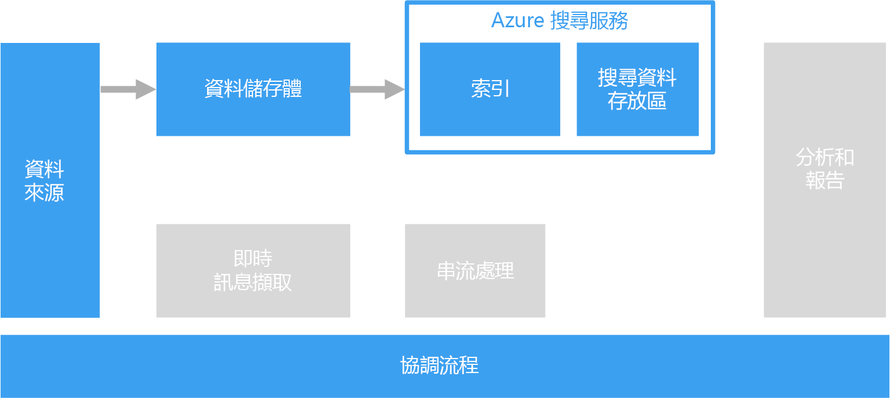

# 處理自由格式文字以供搜尋之用Processing free-form text for search

若要支援搜尋，可以對包含文字段落的文件執行自由格式文字處理。To support search, free-form text processing can be performed against documents containing paragraphs of text.

文字搜尋的運作方式是建構預先對文件集合執行計算的特殊索引。Text search works by constructing a specialized index that is precomputed against a collection of documents. 用戶端應用程式會提交包含搜尋詞彙的查詢。A client application submits a query that contains the search terms. 查詢會傳回結果集，其中包含一份依照每個文件符合搜尋準則的程度排序的文件清單。The query returns a result set, consisting of a list of documents sorted by how well each document matches the search criteria. 結果集也可包含文件符合準則的內容，讓應用程式能夠醒目提示文件中相符的片語。The result set may also include the context in which the document matches the criteria, which enables the application to highlight the matching phrase in the document.

自由格式文字處理可從大量混雜的文字資料中產生有用而可操作的資料。Free-form text processing can produce useful, actionable data from large amounts of noisy text data. 其結果可為非結構化文件提供完整定義且可供查詢的結構。The results can give unstructured documents a well-defined and queryable structure.

## 挑戰Challenges

- 處理自由格式文字文件的集合，通常需要耗費大量的計算資源和時間。Processing a collection of free-form text documents is typically computationally intensive, as well as time intensive.
- 若要有效率地搜尋自由格式文字，搜尋索引應根據具有類似建構的詞彙支援模糊搜尋。In order to search free-form text effectively, the search index should support fuzzy search based on terms that have a similar construction. 比方說，以詞形歸併還原和語言詞幹分析建置搜尋索引，對於 "run" 的查詢就會比對出包含 "ran" 和 "running" 的文件。For example, search indexes are built with lemmatization and linguistic stemming, so that queries for "run" will match documents that contain "ran" and "running."

## 架構Architecture

在大部分情況下，來源文字文件會載入 Azure 儲存體或 Azure Data Lake Store 之類的物件儲存體中。In most scenarios, the source text documents are loaded into object storage such as Azure Storage or Azure Data Lake Store. 在 SQL Server 或 Azure SQL Database 內使用全文檢索搜尋，則屬例外。An exception is using full text search within SQL Server or Azure SQL Database. 在此情況下，文件資料會載入資料庫所管理的資料表中。In this case, the document data is loaded into tables managed by the database. 經儲存後，文件即會進行批次處理，以建立索引。Once stored, the documents are processed in a batch to create the index.

## 技術選擇Technology choices

建立搜尋索引的選項包括 Azure 搜尋服務、Elasticsearch，以及使用 Solr 的 HDInsight。Options for creating a search index include Azure Search, Elasticsearch, and HDInsight with Solr. 前述各項技術都可從文件集合填入搜尋索引。Each of these technologies can populate a search index from a collection of documents. Azure 搜尋服務提供可自動為多種文件填入索引的索引子，舉凡純文字、Excel 乃至於 PDF 格式均適用。Azure Search provides indexers that can automatically populate the index for documents ranging from plain text to Excel and PDF formats. 在 HDInsight 上，Apache Solr 可為許多類型的二進位檔案編製索引，包括純文字、Word 和 PDF。On HDInsight, Apache Solr can index binary files of many types, including plain text, Word, and PDF. 索引建構完成後，用戶端可以透過 REST API 存取搜尋介面。Once the index is constructed, clients can access the search interface by means of a REST API.

如果您的文字資料儲存在 SQL Server 或 Azure SQL Database 中，您可以使用資料庫內建的全文檢索搜尋。If your text data is stored in SQL Server or Azure SQL Database, you can use the full-text search that is built into the database. 資料庫會從儲存在相同資料庫內的文字、二進位檔或 XML 資料填入索引。The database populates the index from text, binary, or XML data stored within the same database. 用戶端會使用 T-SQL 查詢進行搜尋。Clients search by using T-SQL queries.

如需詳細資訊，請參閱[搜尋資料存放區](../technology-choices/search-options.md)。For more information, see [Search data stores](../technology-choices/search-options.md).
