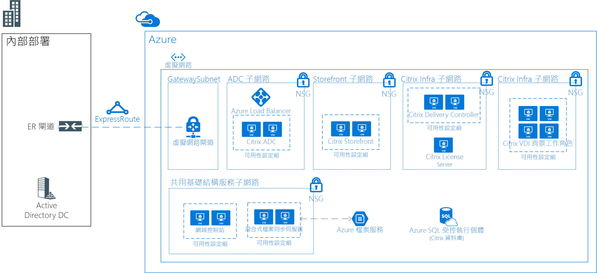

# 使用 Citrix 的 Linux 虛擬桌面

此範例案例也適用於任何需要 Linux 桌面適用虛擬桌面基礎結構 (VDI) 的產業。 VDI 是指在虛擬機器內部執行使用者桌面的程序，而該虛擬機器需存留在資料中心內的伺服器上。 此案例中的客戶選擇使用以 Citrix 為基礎的解決方案來滿足其 VDI 需求。

組織通常有一些異質環境，其員工會在其中使用多個裝置和作業系統。 對應用程式提供一致的存取，同時維護安全的環境，很有挑戰。 不管使用者使用哪個裝置或作業系統，Linux 桌面適用的 VDI 解決方案都可讓貴組織提供存取權。

此案例的一些優點包括：

- 讓更多使用者存取相同的基礎結構，共用 Linux 虛擬桌面的投資報酬率就比較高。 在集中式 VDI 環境中合併資源，終端使用者裝置就不需要非常強大。
- 不論使用者裝置為何，效能都會一致。
- 使用者可以從任何裝置 (包括非 Linux 裝置) 存取 Linux 應用程式。
- 所有分散各地的員工都可以在 Azure 資料中心保護敏感性資料。

## 相關使用案例

請針對下列使用案例考慮此案例：

- 提供從 Linux 或非 Linux 裝置對任務關鍵性、特殊化 Linux VDI 桌面的安全存取

## 架構

此範例案例示範如何允許公司網路存取 Linux 虛擬桌面：

- ExpressRoute 建立於內部部署環境與 Azure 之間，可供快速且可靠連線至雲端。
- 針對 VDI 部署的 Citrix XenDeskop 解決方案。
- 在 Ubuntu (或另一個支援的散發版本) 上執行的 CitrixVDA。
- Azure 網路安全性群組會套用正確的網路 ACL。
- Citrix ADC (NetScaler) 會發行所有的 Citrix 服務並使其達到負載平衡。
- Active Directory Domain Services 將用於使 Citrix 伺服器網域加入。 VDA 伺服器不會加入網域。
- Azure 混合式檔案同步會在解決方案內啟用共用儲存體。 例如，它可以使用於遠端/首頁解決方案。

在此案例中，使用下列 SKU：

- Citrix ADC (NetScaler)：2 x D4sv3 與 [NetScaler 12.0 VPX Standard Edition 200 MBPS PAYG 映像](https://azuremarketplace.microsoft.com/pt-br/marketplace/apps/citrix.netscalervpx-120?tab=PlansAndPrice)
- Citrix 授權伺服器：1 x D2s v3
- Citrix VDA：4 x D8s v3
- Citrix 店面：2 x D2s v3
- Citrix 傳遞控制站：2 x D2s v3
- 網域控制站：2 x D2sv3
- Azure 檔案伺服器：2 x D2sv3

> [!NOTE]
> 所有授權 (NetScaler 除外) 都自備授權 (BYOL)

### 元件

- [Azure 虛擬網路](/azure/virtual-network/virtual-networks-overview)可讓 VM 等資源安全地互相通訊，以及與網際網路和內部部署網路通訊。 虛擬網路會提供隔離與分割、篩選與路由流量，並允許位置之間的連線。 一個虛擬網路將用於此案例中的所有資源。
- [Azure 網路安全性群組 (NSG)](/azure/virtual-network/security-overview) 包含一些安全性規則，可根據來源或目的地 IP 位址、連接埠和通訊協定允許或拒絕輸入或輸出網路流量。 此案例中的虛擬網路會受到網路安全性群組規則保護，這些規則會限制應用程式元件之間的流量。
- [Azure 負載平衡器](/azure/application-gateway/overview)會根據規則和健康情況探查來散發輸入流量。 對於所有 TCP 和 UDP 應用程式，負載平衡器可提供低延遲和高輸送量，且最多可相應增加為數百萬個流程。 此案例會使用內部負載平衡器，將流量散發於 Citrix NetScaler。
- [Azure 混合式檔案同步](https://github.com/MicrosoftDocs/azure-docs/edit/master/articles/storage/files/storage-sync-files-planning.md)會使用於所有共用儲存體。 使用混合式檔案同步，此儲存體會複寫到兩部檔案伺服器。
- [Azure SQL Database](/azure/sql-database/sql-database-technical-overview) 是關聯式資料庫即服務 (DBaaS)，它是根據最新穩定版本的 Microsoft SQL Server 資料庫引擎而建置。 它將用於裝載 Citrix 資料庫。
- [ExpressRoute](/azure/expressroute/expressroute-introduction) 可讓您透過連線提供者所提供的私人連線，將內部部署網路延伸至 Microsoft 雲端。
- [Active Directory Domain Services 使用於目錄服務和使用者驗證
- [Azure 可用性設定組](/azure/virtual-machines/windows/tutorial-availability-sets)可確保您在 Azure 上部署的 VM 會分散到叢集中多個各自獨立的硬體節點。 這麼做可以確保當 Azure 發生硬體或軟體故障時，受到影響的只會是一部分的 VM 子集，您整體的解決方案則會維持可用且正常運作。
- [Citrix ADC (NetScaler)](https://www.citrix.com/products/citrix-adc) 是一個應用程式傳遞控制站，可執行特定應用程式流量分析，進而以智慧方式散發、最佳化及保護 Web 應用程式的第 4 層 7 (L4–L7) 網路流量。
- [Citrix Storefront](https://www.citrix.com/products/citrix-virtual-apps-and-desktops/citrix-storefront.html) 是一個企業應用程式存放區，可改善安全性並簡化部署，以及在任何平台上透過 Citrix Receiver 提供現代化、極為近乎原生的使用者體驗。 StoreFront 可讓您輕鬆地管理多網站和多版本的 Citrix 虛擬應用程式和桌面環境。
- [Citrix License Server](https://www.citrix.com/buy/licensing/overview.html) 會管理 Citrix 產品的授權。
- [Citrix XenDesktops VDA](https://docs.citrix.com/en-us/citrix-virtual-apps-desktops-service) 能夠連線應用程式和桌面。 VDA 會針對使用者安裝在執行應用程式或虛擬桌面的電腦上。 它可讓電腦向 Delivery Controller 註冊，以及管理使用者裝置的高畫質體驗 (HDX) 連線。
- [Citrix Delivery Controller](https://docs.citrix.com/en-us/xenapp-and-xendesktop/7-15-ltsr/manage-deployment/delivery-controllers) 是一個伺服器端元件，負責管理使用者存取權，以及代理和最佳化連線。 Controller 也會提供可建立桌面和伺服器映像的 Machine Creation Services。

### 替代項目

- 有多個夥伴在 Azure 中支援 VDI 解決方案，例如 VMware、Workspot 等等。 此特定範例架構是以使用 Citrix 的已部署專案為基礎。
- Citrix 提供可擷取此架構一部分的雲端服務。 這可能是此解決方案的替代項目。 如需詳細資訊，請參閱 [Citrix Cloud](https://www.citrix.com/products/citrix-cloud)。

## 考量

- 檢查 [Citrix Linux 要求](https://docs.citrix.com/en-us/linux-virtual-delivery-agent/current-release/system-requirements)。
- 延遲會對整體解決方案造成影響。 在生產環境中，據此進行測試。
- 視案例而定，解決方案可能需要具有 VDA 適用 GPU 的 VM。 在此解決方案中，假設 GPU 不是必要項目。

### 可用性、延展性與安全性

- 此範例專為所有角色 (授權伺服器除外) 的高可用性而設計。 如果授權伺服器離線，此環境在 30 天的寬限期內會持續運作，因此該伺服器上不需要任何額外的備援。
- 所有提供類似角色的伺服器都應該部署在[可用性設定組](/azure/virtual-machines/windows/manage-availability#configure-multiple-virtual-machines-in-an-availability-set-for-redundancy)中。
- 此範例案例不包含災害復原功能。 [Azure Site Recovery](/azure/site-recovery/site-recovery-overview) 可能是這項設計的良好附加元件。
- 請考慮將此案例中的 VM 執行個體部署在各個[可用性區域](/azure/availability-zones/az-overview)上。 每個可用性區域由一或多個資料中心組成，配備了電力、冷卻系統及網路系統。 每個已啟用的區域最少有三個可用性區域。 這個跨區域 VM 執行個體的分佈能為應用程式層提供高可用性。 如需詳細資訊，請參閱[什麼是 Azure 中的可用性區域？](/azure/availability-zones/az-overview)。 您也可以[在 Azure 可用性區域中部署 VPN 和 ExpressRoute 閘道](/azure/vpn-gateway/about-zone-redundant-vnet-gateways)。
- 在生產部署中，應該實作[備份](/azure/backup/backup-introduction-to-azure-backup)、[監視](/azure/monitoring-and-diagnostics/monitoring-overview)和[更新管理](/azure/automation/automation-update-management)等管理解決方案。
- 此範例應適用於大約 250 個並行 (每部 VDA 伺服器大約 50-60 個) 使用者 (混合使用方式)。 不過，這主要取決於所使用的應用程式類型。 針對生產用途，應該執行嚴格的負載測試。

## 部署

如需部署資訊，請參閱官方的 [Citrix 文件](https://docs.citrix.com/en-us/citrix-virtual-apps-desktops/install-configure.html) \(英文\)。

## 價格

- Citrix XenDesktop 授權不會包含在 Azure 服務費用中。
- Citrix NetScaler 授權包含在預付型方案中。
- 使用保留的執行個體，可大幅降低解決方案的計算成本。
- 不包含 ExpressRoute 費用。

## 後續步驟

- 請參閱[這裡](https://docs.citrix.com/en-us/citrix-virtual-apps-desktops/install-configure)的 Citrix 文件進行規劃和部署。
- 若要在 Azure 中部署 Citrix ADC (NetScaler)，請檢閱 Citrix 在[這裡](https://github.com/citrix/netscaler-azure-templates)提供的 Resource Manager 範本。
