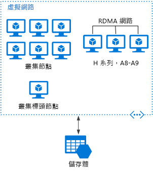
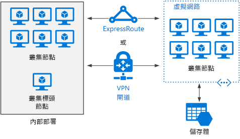

# 大量計算架構樣式Big compute architecture style

「大量計算」一詞描述需要大量核心 (通常數以千、百計) 的大型工作負載。The term *big compute* describes large-scale workloads that require a large number of cores, often numbering in the hundreds or thousands. 案例包括影像轉譯、流體動態、財務風險模型、石油探勘、藥物設計、工程壓力分析，當然還有其他的。Scenarios include image rendering, fluid dynamics, financial risk modeling, oil exploration, drug design, and engineering stress analysis, among others.

以下是大量計算應用程式的一些 典型特性：Here are some typical characteristics of big compute applications:

- 工作可以分割成多個離散的工作，這些工作可以同時分散到許多核心上執行。The work can be split into discrete tasks, which can be run across many cores simultaneously.
- 每個工作有限。Each task is finite. 它會取得一些輸入、執行一些處理、並產生輸出。It takes some input, does some processing, and produces output. 整個應用程式會執行一段有限的時間 (幾分鐘至幾天)。The entire application runs for a finite amount of time (minutes to days). 常見的模式是佈建一批數量龐大的核心，然後在應用程式完成後停轉至零。A common pattern is to provision a large number of cores in a burst, and then spin down to zero once the application completes.
- 應用程式不需要全年無休。The application does not need to stay up 24/7. 不過，系統必須處理節點失敗或應用程式當機。However, the system must handle node failures or application crashes.
- 某些應用程式的工作是獨立的，而且可平行執行。For some applications, tasks are independent and can run in parallel. 其他應用程式的工作會緊密結合，這表示它們必須互動或交換中繼結果。In other cases, tasks are tightly coupled, meaning they must interact or exchange intermediate results. 在此情況下，請考慮使用高速網路技術，例如 InfiniBand 和遠端直接記憶體存取 (RDMA)。In that case, consider using high-speed networking technologies such as InfiniBand and remote direct memory access (RDMA).
- 根據您的工作負載，您應使用可應付大量計算的 VM 大小 (H16r、H16mr 和 A9)。Depending on your workload, you might use compute-intensive VM sizes (H16r, H16mr, and A9).

## 使用此架構的時機When to use this architecture

- 計算密集的作業，例如模擬、數字密集運算。Computationally intensive operations such as simulation and number crunching.
- 會密集運算、必須分散在多部電腦 (10-1000 部) 之 CPU 的模擬。Simulations that are computationally intensive and must be split across CPUs in multiple computers (10-1000s).
- 會耗用一部電腦太多記憶體、必須分散在多部電腦的模擬。Simulations that require too much memory for one computer, and must be split across multiple computers.
- 若在單一電腦上完成會花太多時間的長時間執行計算。Long-running computations that would take too long to complete on a single computer.
- 必須執行 100 或 1000 次以上的小型計算，例如 Monte Carlo 模擬。Smaller computations that must be run 100s or 1000s of times, such as Monte Carlo simulations.

## 優點Benefits

- 運用 [embarrassingly parallel][embarrassingly-parallel] 處理而有高效能。High performance with "[embarrassingly parallel][embarrassingly-parallel]" processing.
- 可以利用數百或數千部電腦核心，更快解決大型問題。Can harness hundreds or thousands of computer cores to solve large problems faster.
- 存取專門的高效能硬體，搭配專用的高速 InfiniBand 網路。Access to specialized high-performance hardware, with dedicated high-speed InfiniBand networks.
- 您可以視需要佈建 VM 來執行工作，然後終止它們。You can provision VMs as needed to do work, and then tear them down.

## 挑戰Challenges

- 管理 VM 基礎結構。Managing the VM infrastructure.
- 管理數字密集運算的磁碟區Managing the volume of number crunching
- 適時佈建數千個核心。Provisioning thousands of cores in a timely manner.
- 針對緊密結合的工作，加入更多核心可以有些微回報。For tightly coupled tasks, adding more cores can have diminishing returns. 您可能需要不斷實驗找出最佳的核心數目。You may need to experiment to find the optimum number of cores.

## 使用 Azure Batch 的大量計算Big compute using Azure Batch

[Azure Batch][batch] 是受控服務，可用於執行大規模的高效能運算 (HPC) 應用程式。[Azure Batch][batch] is a managed service for running large-scale high-performance computing (HPC) applications.

使用 Azure Batch，要設定 VM 集區，並上傳應用程式和資料檔案。Using Azure Batch, you configure a VM pool, and upload the applications and data files. 然後 Batch 服務會佈建 VM、將工作指派給 VM、執行工作，並監視進度。Then the Batch service provisions the VMs, assign tasks to the VMs, runs the tasks, and monitors the progress. Batch 可以自動相應放大 VM 來反應工作負載。Batch can automatically scale out the VMs in response to the workload. Batch 也提供作業排程。Batch also provides job scheduling.

## 虛擬機器上執行的大量計算Big compute running on Virtual Machines

您可以使用 [Microsoft HPC Pack][hpc-pack] 管理 VM 的叢集，排程和監控 HPC 作業。You can use [Microsoft HPC Pack][hpc-pack] to administer a cluster of VMs, and schedule and monitor HPC jobs. 使用此方法時，您必須佈建和管理 VM 及網路基礎結構。With this approach, you must provision and manage the VMs and network infrastructure. 如果您有現有的 HPC 工作負載，而且想要將部分或全部工作負載移到 Azure，請考慮這種方法。Consider this approach if you have existing HPC workloads and want to move some or all it to Azure. 您可以將整個 HPC 叢集移到 Azure，或將 HPC 叢集放在內部部署，但是使用 Azure 處理暴增產能。You can move the entire HPC cluster to Azure, or keep your HPC cluster on-premises but use Azure for burst capacity. 如需詳細資訊，請參閱[大規模運算工作負載的 Batch 和 HPC 解決方案][batch-hpc-solutions]。For more information, see [Batch and HPC solutions for large-scale computing workloads][batch-hpc-solutions].

### 部署至 Azure 的 HPC PackHPC Pack deployed to Azure

在此案例中，HPC 叢集整個建立在 Azure 中。In this scenario, the HPC cluster is created entirely within Azure.

前端節點提供叢集的管理和作業排程服務。The head node provides management and job scheduling services to the cluster. 如為緊密結合的工作，使用 RDMA 網路在 VM 之間提供高頻寬、低延遲的通訊。For tightly coupled tasks, use an RDMA network that provides very high bandwidth, low latency communication between VMs. 如需詳細資訊，請參閱[在 Azure 中部署 HPC Pack 2016 叢集][deploy-hpc-azure]。For more information see [Deploy an HPC Pack 2016 cluster in Azure][deploy-hpc-azure].

### 將 HPC 叢集暴增的工作負載移至 AzureBurst an HPC cluster to Azure

此案例中，組織是在內部部署執行 HPC Pack，並使用 Azure VM 處理暴增產能。In this scenario, an organization is running HPC Pack on-premises, and uses Azure VMs for burst capacity. 叢集前端節為內部部署。The cluster head node is on-premises. ExpressRoute 或 VPN 閘道會將您的內部部署網路連線至 Azure VNet。ExpressRoute or VPN Gateway connects the on-premises network to the Azure VNet.

<!-- links -->

[batch]: /azure/batch/
[batch-hpc-solutions]: /azure/batch/batch-hpc-solutions
[deploy-hpc-azure]: /azure/virtual-machines/windows/hpcpack-2016-cluster
[embarrassingly-parallel]: https://en.wikipedia.org/wiki/Embarrassingly_parallel
[hpc-pack]: https://technet.microsoft.com/library/cc514029
