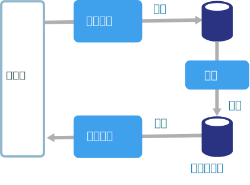
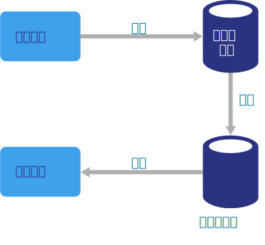
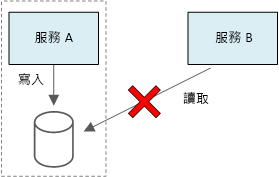

# CQRS 架構樣式CQRS architecture style

命令和查詢責任隔離 (CQRS) 是可從寫入作業分隔讀取作業的架構樣式。Command and Query Responsibility Segregation (CQRS) is an architecture style that separates read operations from write operations.

在傳統架構中，相同資料模型是用來查詢和更新資料庫。In traditional architectures, the same data model is used to query and update a database. 那很簡單，而且對基本 CRUD 作業可運作良好。That's simple and works well for basic CRUD operations. 不過，在更複雜的應用程式中，此方法可能會變得不便。In more complex applications, however, this approach can become unwieldy. 比方說，在讀取端，應用程式可能會執行許多不同的查詢，傳回具有不同圖形的資料傳輸物件 (DTO)。For example, on the read side, the application may perform many different queries, returning data transfer objects (DTOs) with different shapes. 物件對應可能會變得複雜。Object mapping can become complicated. 在寫入端，模型可能會實作複雜的驗證和商務邏輯。On the write side, the model may implement complex validation and business logic. 如此一來，您可能會獲得執行太多作業、過於複雜的模型。As a result, you can end up with an overly complex model that does too much.

另一個潛在的問題是，讀取和寫入工作負載通常是不對稱的，具有非常不同的效能和調整需求。Another potential problem is that read and write workloads are often asymmetrical, with very different performance and scale requirements.

CQRS 可解決這些問題，方法是將讀取和寫入分隔至個別的模型，使用 **命令** 來更新資料，以及使用**查詢**來讀取資料。CQRS addresses these problems by separating reads and writes into separate models, using **commands** to update data, and **queries** to read data.

- 命令應該以工作為基礎，而不是以資料為中心。Commands should be task based, rather than data centric. (「預訂旅館房間」而不是「將保留狀態設為已保留」。) 命令可能會放在佇列上以進行非同步處理，而不是同步處理。("Book hotel room," not "set ReservationStatus to Reserved.") Commands may be placed on a queue for asynchronous processing, rather than being processed synchronously.

- 查詢永遠不會修改資料庫。Queries never modify the database. 查詢會傳回不會封裝任何網域知識的 DTO。A query returns a DTO that does not encapsulate any domain knowledge.

如需更好的隔離，您可以實際上將讀取資料與寫入資料分隔。For greater isolation, you can physically separate the read data from the write data. 在該情況下，讀取資料庫可以使用自己已對查詢最佳化的資料結構描述。In that case, the read database can use its own data schema that is optimized for queries. 例如，它可以儲存資料的[具體化檢視][materialized-view]，以避免複雜的聯結或複雜的 O/RM 對應。For example, it can store a [materialized view][materialized-view] of the data, in order to avoid complex joins or complex O/RM mappings. 它甚至可能會使用不同類型的資料存放區。It might even use a different type of data store. 例如，寫入資料庫可能為關聯式，而讀取資料庫為文件資料庫。For example, the write database might be relational, while the read database is a document database.

如果使用個別的讀取和寫入資料庫，它們必須保持同步。通常其實現方式為每當更新資料庫時便由寫入模型發佈事件。If separate read and write databases are used, they must be kept in sync. Typically this is accomplished by having the write model publish an event whenever it updates the database. 更新資料庫和發佈事件必須在單一交易中發生。Updating the database and publishing the event must occur in a single transaction.

CQRS 的某些實作使用[事件來源模式][event-sourcing]。Some implementations of CQRS use the [Event Sourcing pattern][event-sourcing]. 利用此模式，應用程式狀態會儲存為一系列的事件。With this pattern, application state is stored as a sequence of events. 每個事件代表對資料的一組變更。Each event represents a set of changes to the data. 目前狀態則是透過重新執行事件來建構。The current state is constructed by replaying the events. 在 CQRS 內容中，事件來源的其中一個優點是，相同事件可以用來通知其他元件 &mdash; 特別是通知讀取模型。In a CQRS context, one benefit of Event Sourcing is that the same events can be used to notify other components &mdash; in particular, to notify the read model. 讀取模型使用事件來建立目前狀態的快照集，這對查詢更有效率。The read model uses the events to create a snapshot of the current state, which is more efficient for queries. 不過，事件來源會增加設計的複雜性。However, Event Sourcing adds complexity to the design.

## 使用此架構的時機When to use this architecture

考慮將 CQRS 用於許多使用者存取相同資料的共同作業網域，特別是當讀取和寫入的工作負載是不對稱時。Consider CQRS for collaborative domains where many users access the same data, especially when the read and write workloads are asymmetrical.

CQRS 不是可適用整個系統的最上層結構。CQRS is not a top-level architecture that applies to an entire system. 僅將 CQRS 套用至將讀取和寫入分隔有明顯價值的子系統中。Apply CQRS only to those subsystems where there is clear value in separating reads and writes. 否則，您便是在產生額外的複雜性，但沒有任何好處。Otherwise, you are creating additional complexity for no benefit.

## 優點Benefits

- **獨立調整**。**Independently scaling**. CQRS 允許讀取和寫入工作負載，以獨立調整，並可能導致較少的鎖定爭用。CQRS allows the read and write workloads to scale independently, and may result in fewer lock contentions.
- **最佳化資料結構描述**。**Optimized data schemas**. 讀取端可以使用已針對查詢最佳化的結構描述，同時寫入端可使用已針對更新最佳化的結構描述。The read side can use a schema that is optimized for queries, while the write side uses a schema that is optimized for updates.
- **安全性**。**Security**. 要確保只有適當的網域實體會對資料執行寫入更輕鬆。It's easier to ensure that only the right domain entities are performing writes on the data.
- **考量分隔**。**Separation of concerns**. 分隔讀取和寫入端，會導致更容易維護且更具彈性的模型。Segregating the read and write sides can result in models that are more maintainable and flexible. 大部分的複雜商務邏輯進入寫入模型。Most of the complex business logic goes into the write model. 讀取模型可以是相當簡單。The read model can be relatively simple.
- **較簡單的查詢**。**Simpler queries**. 藉由將具體化檢視儲存在讀取資料庫，查詢時應用程式可以避免複雜的聯結。By storing a materialized view in the read database, the application can avoid complex joins when querying.

## 挑戰Challenges

- **複雜度**。**Complexity**. CQRS 的基本概念很簡單。The basic idea of CQRS is simple. 但是，它可能會導致更複雜的應用程式設計，特別是如果它們包含事件來源模式。But it can lead to a more complex application design, especially if they include the Event Sourcing pattern.

- **傳訊**。**Messaging**. 雖然 CQRS 不需要傳訊，通常會使用傳訊來處理命令訊息並發佈更新事件。Although CQRS does not require messaging, it's common to use messaging to process commands and publish update events. 在該情況下，應用程式必須處理訊息失敗或重複的訊息。In that case, the application must handle message failures or duplicate messages.

- **最終一致性**。**Eventual consistency**. 如果您將讀取和寫入資料庫分隔，讀取資料可能會過時。If you separate the read and write databases, the read data may be stale.

## 最佳作法Best practices

- 如需實作 CQRS 的詳細資訊，請參閱 [CQRS 模式][cqrs-pattern]。For more information about implementing CQRS, see the [CQRS pattern][cqrs-pattern].

- 考慮使用[事件來源][event-sourcing]模式以避免發生更新衝突。Consider using the [Event Sourcing][event-sourcing] pattern to avoid update conflicts.

- 考慮對讀取模型使用[具體化檢視模式][materialized-view]，用來將查詢的結構描述最佳化。Consider using the [Materialized View pattern][materialized-view] for the read model, to optimize the schema for queries.

## 微服務中的 CQRSCQRS in microservices

在[微服務架構][microservices]中，CQRS 特別有用。CQRS can be especially useful in a [microservices architecture][microservices]. 微服務的其中一個準則是服務無法直接存取另一個服務的資料存放區。One of the principles of microservices is that a service cannot directly access another service's data store.

在下列表中，服務 A 會寫入資料存放區，而服務 B 會保留資料的具體化檢視。In the following diagram, Service A writes to a data store, and Service B keeps a materialized view of the data. 服務 A 會在寫入資料存放區時發佈事件。Service A publishes an event whenever it writes to the data store. 服務 B 訂閱此事件。Service B subscribes to the event.

<!-- links -->

[cqrs-pattern]: ../../patterns/cqrs.md
[event-sourcing]: ../../patterns/event-sourcing.md
[materialized-view]: ../../patterns/materialized-view.md
[microservices]: ./microservices.md
