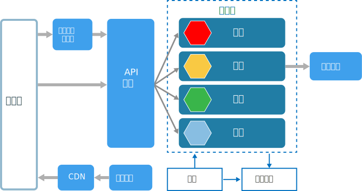

# 微服務架構樣式

微服務架構是由一組小型的自發服務所組成。 每個服務各自獨立，並且應該實作單一的商務功能。 如需在 Azure 上建置微服務架構的詳細指引，請參閱[在 Azure 上設計、建置及操作微服務](../../microservices/index.md)。

 
在某些方面，微服務算是服務導向架構 (SOA) 的自然演化，但微服務和 SOA 之間存有差異。 以下是微服務的一些定義特性：

- 微服務架構中的服務屬於小型、獨立且鬆散結合的服務。

- 每個服務都是個別的程式碼基底，可由小型的開發小組負責管理。

- 服務可以獨立部署。 小組可以直接更新現有服務，而不需要重建和重新部署整個應用程式。

- 服務需負責保存自己的資料或外部狀態。 這一點不同於傳統模型，傳統模型是由個別資料層處理資料持續性。

- 服務會使用妥善定義的 API 來彼此通訊。 每個服務的內部實作詳細資料都會對其他服務隱藏。

- 服務不需要共用相同的技術堆疊、程式庫或架構。

除了服務本身外，典型的微服務架構中還會出現一些其他元件：

**管理**。 管理元件負責將服務放在節點上、識別失敗、跨節點重新平衡服務等等。  

**服務探索**。  保有服務及其所在節點的清單。 可進行服務查閱來尋找服務端點。 

**API 閘道**。 API 閘道是用戶端的進入點。 用戶端不會直接呼叫服務。 相反地，它們會呼叫 API 閘道，API 閘道再將呼叫轉送至後端的適當服務。 API 閘道可能會彙總數個服務的回應，並傳回彙總的回應。 

使用 API 閘道的優點包括：

- 它可讓用戶端與服務分離。 服務可以控制版本或重構，而不需要更新所有的用戶端。

-  服務可使用非專供 Web 使用的傳訊通訊協定，例如 AMQP。

- API 閘道可以執行其他跨領域功能，例如驗證、記錄、SSL 終止和負載平衡。

## 使用此架構的時機

請考慮將此架構樣式用於：

- 需要高發行速度的大型應用程式。

- 需要具有高擴充性的複雜應用程式。

- 具有豐富網域或許多子網域的應用程式。

- 由小型開發小組所組成的組織。

## 優點 

- **獨立部署**。 您可以逕自更新服務而不必重新部署整個應用程式，並於發生錯誤時復原或向前復原。 錯誤修正和功能版本會更容易管理且風險較低。

- **獨立開發**。 單一開發小組可以建置、測試及部署服務。 結果便是不斷創新和更快速的發行頻率。 

- **小型焦點小組**。 小組可以專注於一項服務。 每個服務的範圍越小，就能更容易了解程式碼基底，並讓新的小組成員容易跟上進展。

- **錯誤隔離**。 如果服務停止運作，不必因此取出整個應用程式。 不過，這並非表示您可以不必付出代價就完成復原。 您仍需遵循復原功能的最佳做法和設計模式。 請參閱[為 Azure 設計復原應用程式][resiliency-overview]。

- **混合技術堆疊**。 小組可以挑選最適合其服務使用的技術。 

- **細微調整**。 服務可以獨立調整。 同時，每個 VM 的服務密度越高，代表 VM 資源已充分運用。 使用放置條件約束，服務即可對應至 VM 設定檔 (高 CPU、高記憶體等等)。

## 挑戰

- **複雜度**。 微服務應用程式的變動組件數量比同等單體式應用程式的還多。 每個服務會更為簡單，但是系統整個會變得更複雜。

- **開發和測試**。 根據服務相依性來進行開發需要不同的方法。 現有工具的設計不一定可處理服務相依性。 跨服務界限進行重構會很困難。 測試服務相依性也會很困難，尤其是當應用程式的演變速度很快時。

- **缺乏控管**。 微服務的非集中式建置方法有其優點，卻也可能導致問題發生。 您最終可能會有很多不同的語言和架構，而讓應用程式變得難以維護。 備有某些適用於全部專案的標準，而不要過度限制小組的彈性，這樣的做法可能會有幫助。 這特別適用於跨領域功能，例如記錄。

- **網路壅塞與延遲**。 使用許多小型且細微的服務可能會導致服務之間需要更多通訊。 此外，如果服務相依性鏈結太長 (服務 A 呼叫 B、B 再呼叫 C...)，額外的延遲可能成為問題。 您將必須謹慎地設計 API。 請避免對話過度的 API、考慮使用序列化格式，並找找看有沒有地方可以使用非同步的通訊模式。

- **資料完整性**。 每個微服務負責維持自己的資料持續性。 因此，維持資料一致性會成為挑戰。 可能的話，請採用最終一致性。

- **管理**。 想要成功運用微服務，就必須有成熟的 DevOps 文化。 在服務之間建立關聯式記錄會非常困難。 一般而言，記錄必須將多個服務呼叫相互關聯到單一使用者作業。

- **版本控制**。 服務的更新不得打斷與其相依的服務。 多個服務有可能在同一時間一起更新，因此若未謹慎設計，便可能發生回溯相容性或往後相容性問題。

- **技能集**。 微服務是高度分散的系統。 請謹慎評估小組是否有技能和經驗能夠成功。

## 最佳作法

- 根據商業領域建立服務的模型。 

- 將所有項目拆開。 由個別小組負責設計和建置服務。 避免共用程式碼或資料結構描述。 

- 資料儲存體應該為擁有資料的服務私用。 針對每個服務和資料類型使用最佳的儲存體。 

- 服務應透過設計良好的 API 進行通訊。 避免洩漏實作詳細資料。 API 應該建立網域的模型，而不是建立服務內部實作的模型。

- 避免服務彼此結合。 結合的原因包括共用資料庫結構描述和固定的通訊協定。

- 將跨領域考量 (例如驗證和 SSL 終止) 卸載給閘道。

- 不要在閘道中暴露網域資訊。 閘道應該在不知道商務規則或網域邏輯的情況下處理和路由傳送用戶端要求。 否則，閘道會成為相依項目，而讓服務彼此結合。

- 服務應該具有鬆散結合和高度功能一致性的特性。 可能會一起變更的功能應該一起封裝和部署。 如果這些功能分居不同服務，它們最後會緊密結合，因為對某項服務進行變更就會需要更新其他服務。 兩個服務之間對話過度可能是緊密結合和低一致性的徵兆。 

- 隔離失敗。 請使用復原策略來避免某個服務的失敗產生連鎖反應。 請參閱[恢復模式][resiliency-patterns]和[設計復原應用程式][resiliency-overview]。

## 使用 Azure Container Service 的微服務 

您可以使用 [Azure Container Service](/azure/container-service/) 來設定和佈建 Docker 叢集。 Azure Container Service 支援數種熱門的容器 Orchestrator，包括 Kubernetes、DC/OS 和 Docker Swarm。

 
**公用節點**。 這些節點可透過對外公開的負載平衡器來聯繫到。 API 閘道裝載在這些節點上。

**後端節點**。 這些節點會執行用戶端透過 API 閘道所連線的服務。 這些節點不會直接收到網際網路流量。 後端節點可能會包含不只一個的 VM 集區，其各有不同的硬體設定檔。 例如，您可以建立不同的集區來應付一般的計算工作負載、高 CPU 的工作負載和高記憶體的工作負載。 

**管理 VM**。 這些 VM 會執行容器 Orchestrator 的主要節點。 

**網路**。 公用節點、後端節點和管理 VM 會位於相同虛擬網路 (VNet) 內的不同子網路。 

**負載平衡器**。  對外公開的負載平衡器位於公用節點前面。 它會將網際網路要求散發給公用節點。 另一個負載平衡器會位於管理 VM，以使用 NAT 規則允許安全殼層 (ssh) 流量進入管理 VM。

為了保有可靠性和延展性，每個服務都會跨多個 VM 來複寫。 不過，由於這些服務相當輕量 (相較於單體式應用程式)，因此通常會將多個服務封裝到單一 VM 中。 密度越高，資源使用率就越好。 如果特定服務不會使用大量資源，您就不需要專門準備一整個 VM 來執行該服務。

下圖顯示執行了四個不同服務的三個節點 (以不同形狀表示)。 請注意每個服務都有至少兩個執行個體。 
 

## 使用 Azure Service Fabric 的微服務

下圖顯示使用 [Azure Service Fabric](/azure/service-fabric/) 的微服務架構。

Service Fabric 叢集會部署到一個或多個虛擬機器擴展集。 您可以在叢集中放入多個 VM 擴展集，以便混用 VM 類型。 API 閘道會位於 Service Fabric 叢集前面，並有外部負載平衡器可接收用戶端要求。

Service Fabric 執行階段會執行叢集管理，包括服務放置、節點容錯移轉以及健康情況監視。 執行階段會部署在叢集節點本身之中。 沒有不同組的叢集管理 VM。

服務會使用內建於 Service Fabric 的反向 Proxy 彼此通訊。 Service Fabric 會提供可解析具名服務端點的探索服務。

<!-- links -->

[resiliency-overview]: ../../resiliency/index.md
[resiliency-patterns]: ../../patterns/category/resiliency.md

