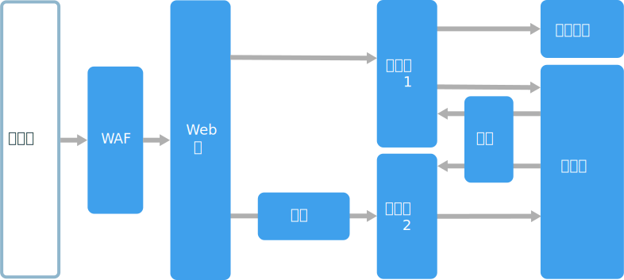

# 多層式架構樣式

多層式架構會將應用程式分成**邏輯層**和**實體層**。 

層是用來分隔責任與管理相依性的一個方式。 每個層有特定的責任。 較高層可以使用較低層中的服務，反向則不行。 

層在實際上是分隔的，在個別電腦上執行。 層可以直接呼叫另一層，或使用非同步傳訊 (訊息佇列)。 雖然每個層可能會裝載在自己的層中，但並非必要。 數個層可能會裝載於相同層上。 實際分隔各層可改善延展性和復原，但也會從其他網路通訊增加延遲。 

傳統的三層式應用程式有展示層、中介層和資料庫層。 中介層是選擇性的。 更複雜的應用程式可以有三層以上。 上圖顯示具有兩個中間層的應用程式，封裝不同區域的功能。 

多層式架構應用程式可以有**關閉層架構**或**開放層架構**：

- 在關閉層架構中，層只能呼叫緊接著的下一層。 
- 在開放層架構中，層也可以呼叫其下方的任何層。 

關閉層架構會限制層之間的相依性。 不過，如果某層只會將要求傳遞至下一層，它可能會產生不必要的網路流量。 

## 使用此架構的時機

多層式架構通常實作為基礎結構即服務 (IaaS) 應用程式，每個層均執行在一組個別的 VM 上。 不過，多層式架構應用程式不需要是純 IaaS。 通常，對架構的某些部分 (特別是快取、傳訊和資料存放區) 使用受管理的服務會有幫助。

考慮下列項目的多層式架構：

- 簡單的 Web 應用程式。 
- 使用最小重構將內部部署應用程式移轉至 Azure。
- 內部部署和雲端應用程式的整合開發。

多層式架構架構在傳統內部部署應用程式中很常見，因此，它自然很適合用來將現有的工作負載移轉至 Azure。

## 優點

- 雲端與內部部署之間，以及雲端平台之間的可攜性。
- 對大部分開發人員來說，學習曲線較少。
- 從傳統應用程式模型的自然演進。
- 開放給異質性環境 (Windows/Linux)

## 挑戰

- 產生只會在資料庫上執行 CRUD 作業、新增額外的延遲而不會執行任何實用工作的中介層很容易。 
- 整合型設計可避免獨立部署功能。
- 管理 IaaS 應用程式的工作比只使用受管理服務的應用程式更多。 
- 在大型系統中可能難以管理網路安全性。

## 最佳作法

- 您可以使用自動調整來處理負載中的變更。 請參閱[自動調整最佳做法][autoscaling]。
- 使用非同步傳訊來分離各層。
- 快取半靜態資料。 請參閱[快取最佳做法][caching]。
- 使用 [SQL Server Always On 可用性群組][sql-always-on]之類解決方案來設定資料庫層以獲得高可用性。
- 將 Web 應用程式防火牆 (WAF) 放置在前端與網際網路之間。
- 將每一層放在自己的子網路中，並使用子網路作為安全性界限。 
- 透過僅允許來自中間層的要求，限制存取資料層。

## 虛擬機器上的多層式架構

本節說明 VM 上執行的建議多層式架構。 

每一層是由放在可用性設定組或 VM 擴展集的兩或多個 VM 所組成。 一個 VM 失敗時，多個 VM 會提供復原。 負載平衡器可用來在層中的 VM 間散發要求。 將更多 VM 新增至集區，即可以水平調整層。 

每一層也會放在自內己的子網路，這表示其內部 IP 位址落在相同的位址範圍內。 此方式能讓您輕鬆地套用網路安全性群組 (NSG) 規則，並以將表格路由至個別層。

Web 和商務層為無狀態。 任何 VM 可以處理該層的任何要求。 資料層應該包含複寫的資料庫。 對於 Windows，我們建議使用 SQL Server，利用 Always On 可用性群組來獲得高可用性。 對於 Linux，請選擇支援複寫的資料庫，例如 Apache Cassandra。 

網路安全性群組 (NSG) 會限制存取每一層。 例如，資料庫層只會允許來自商務層的存取。

如需詳細資料和可部署的 Resource Manager 範本，請參閱下列參考架構：

- [執行適用於多層式應用程式的 Windows VM][n-tier-windows]
- [執行適用於多層式應用程式的 Linux VM][n-tier-linux]

### 其他考量

- 多層式架構架構並不限於三層。 對於更複雜的應用程式，通常會有更多層。 在此情況下，請考慮使用 7 層路由，以將要求路由至特定層。

- 層是延展性、可靠性和安全性的界限。 考慮對這些區域中具有個別需求的服務有個別的層。

- 使用 VM 擴展集來自動調整。

- 在架構中尋找您可以使用受管理的服務，而不需進行重大重構的位置。 特別是，查看快取、傳訊、儲存體和資料庫。 

- 為獲得較高安全性，請在應用程式前方放置網路 DMZ。 DMZ 包含實作安全性功能 (例如防火牆和封包檢查) 的網路虛擬裝置 (NVA)。 如需詳細資訊，請參閱[網路 DMZ 參考架構][dmz]。

- 為獲得高可用性，請將兩個或多個 NVA 放置在可用性設定組，加上一個外部負載平衡器在執行個體間散發網際網路要求。 如需詳細資訊，請參閱[部署高可用性的網路虛擬裝置][ha-nva]。

- 請勿允許直接使用 RDP 或 SSH 存取執行應用程式碼的 VM。 相反地，操作員必須登入 Jumpbox，也稱為防禦主機。 這是網路上系統管理員用來連線到其他 VM 的安全 VM。 Jumpbox 具有的 NSG 可允許僅來自核准的公用 IP 位址的 RDP 或 SSH。

- 您可以使用站對站虛擬私人網路 (VPN) 或 Azure ExpressRoute，將 Azure 虛擬網路延伸至您的內部部署網路。 如需詳細資訊，請參閱[混合式網路參考架構][hybrid-network]。

- 如果您的組織使用 Active Directory 來管理身分識別，您可以將 Active Directory 環境延伸至 Azure VNet。 如需詳細資訊，請參閱[身分識別管理參考架構][identity]。

- 如果您需要比適用於 VM 的 Azure SLA 所提供更高的可用性，請跨兩個區域複寫應用程式並使用 Azure 流量管理員進行容錯移轉。 如需詳細資訊，請參閱[在多個區域中執行 Windows VM][multiregion-windows] 或[在多個區域中執行 Linux VM][multiregion-linux]。

[autoscaling]: ../../best-practices/auto-scaling.md
[caching]: ../../best-practices/caching.md
[dmz]: ../../reference-architectures/dmz/index.md
[ha-nva]: ../../reference-architectures/dmz/nva-ha.md
[hybrid-network]: ../../reference-architectures/hybrid-networking/index.md
[identity]: ../../reference-architectures/identity/index.md
[multiregion-linux]: ../../reference-architectures/virtual-machines-linux/multi-region-application.md
[multiregion-windows]: ../../reference-architectures/virtual-machines-windows/multi-region-application.md
[n-tier-linux]: ../../reference-architectures/virtual-machines-linux/n-tier.md
[n-tier-windows]: ../../reference-architectures/virtual-machines-windows/n-tier.md
[sql-always-on]: /sql/database-engine/availability-groups/windows/always-on-availability-groups-sql-server