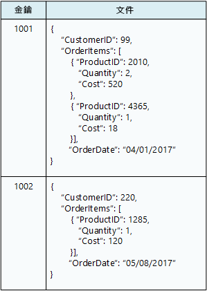
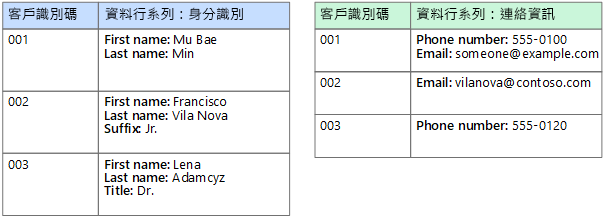

# 選擇正確的資料存放區

現代商務系統管理著越來越大的資料量。 資料可能會是從外部服務內嵌、由系統本身產生，或者由使用者建立。 這些資料集可能具有非常不同的特性和處理需求。 企業會使用資料來評估趨勢、觸發商務程序、稽核其作業、分析客戶行為以及其他許多事項。

此異質性意味著單一資料存放區通常不是最好的方法。 相反地，最好是在不同的資料存放區中儲存不同類型的資料，每個存放區專注於特定工作負載或使用方式模式。 「多語制持續性」一詞是用來描述使用混合資料存放區技術的解決方案。

針對您的需求選取正確的資料存放區，是關鍵的設計決策。 實際上有數百個實作可以從 SQL 和 NoSQL 資料庫中選擇。 資料存放區通常是依據它們的結構資料和它們所支援的作業類型來分類。 這篇文章描述一些最常見的儲存體模型。 請注意，特定資料存放區技術可能支援多個儲存體模型。 例如，關聯式資料庫管理系統 (RDBMS) 也可支援索引鍵/值或圖表儲存體。 事實上，還有所謂「多模型」支援的一般趨勢，其中單一資料庫系統支援數個模型。 但是了解高階的不同模型仍然相當有用。

並非指定類別中的所有資料存放區都提供相同的功能集。 大部分資料存放區提供伺服器端功能，來查詢及處理資料。 有時候這項功能已內建於資料儲存引擎。 在其他情況下，資料儲存和處理功能會分隔，可能有數個處理和分析的選項。 資料存放區也支援不同的程式設計和管理介面。

一般而言，您應該從考量哪個儲存體模型最適合您的需求開始。 然後根據例如功能集、成本和輕鬆管理的因素，考慮該分類中的特定資料存放區。

## 關聯式資料庫管理系統

關聯式資料庫會將資料組織為具有資料列和資料行之二維資料表的系列。 每個資料表有它自己的資料行，且資料表中的每個資料列擁有相同的資料行集合。 這個模型以數學方式為基礎，大部分廠商提供結構化查詢語言 (SQL) 的方言來擷取及管理資料。 RDBMS 通常會實作符合 ACID (不可部分完成性、一致性、隔離性、耐用性) 模型的交易一致性機制，以更新資訊。

RDBMS 通常支援 schema-on-write 模型，其中資料結構會預先定義，而所有讀取或寫入作業必須使用結構描述。 這與大部分 NoSQL 資料存放區相反，特別是索引鍵/值類型，其中 schema-on-read 模型假設用戶端將會自己的解釋性結構描述加諸於來自資料庫的資料，而且對於寫入的資料格式無從驗證。

當強式一致性保證很重要時，RDBMS 很有用 &mdash; 其中所有變更都不可部分完成，而交易一律要讓資料維持一致的狀態。 不過，基礎結構不會讓自己藉由散發儲存體和跨機器處理來相應放大。 此外，儲存在 RDBMS 的資訊，必須依照正規化程序放入關聯式結構。 雖然此程序易於了解，但是它會導致低效率，因為需要邏輯實體解譯成個別資料表中的資料列，然後在執行查詢時重組資料。

相關 Azure 服務：

- [Azure SQL Database][sql-db]
- [適用於 MySQL 的 Azure 資料庫][mysql]
- [適用於 PostgreSQL 的 Azure 資料庫][postgres]

## 索引鍵/值存放區

索引鍵/值存放區基本上是大型雜湊資料表。 讓每個資料值與唯一的索引鍵產生關聯，索引鍵/值存放區會使用此索引鍵來儲存資料，方法是使用適當的雜湊函式。 會選取雜湊函式以提供跨資料儲存體雜湊索引鍵的平均分配。

大部分索引鍵/值存放區僅支援簡單的查詢、插入和刪除作業。 若要修改值 (部分或完全)，應用程式必須覆寫整個值的現有資料。 在大部分實作中，讀取或寫入單一值是不可部分完成的作業。 如果值很大，寫入可能需要一些時間。

應用程式可以將任意資料儲存為一組值，雖然某些索引鍵/值存放區會對值的大小上限施加限制。 儲存的值對於儲存體系統軟體是不透明的。 任何結構描述資訊都必須由應用程式提供並解譯。 基本上，值為 blob 且索引鍵/值存放區只依據索引鍵擷取或儲存值。

索引鍵/值存放區針對執行簡單查閱的應用程式高度最佳化，但是較不適合需要跨不同索引鍵/值存放區查詢資料的系統。 索引鍵/值存放區也未針對以下案例最佳化：依據值來查詢很重要，而不是只根據索引鍵來執行查閱。 例如，您可以使用關聯式資料庫以使用 WHERE 子句來尋找記錄，但是索引鍵/值存放區通常不會有這種類型的值查閱功能。

單一索引鍵/值存放區可以極度擴充，因為資料存放區可以輕易地在不同機器上的多個節點之間分散資料。

相關 Azure 服務：

- [Cosmos DB][cosmosdb]
- [Azure Redis 快取][redis-cache]

## 文件資料庫

文件資料庫在概念上類似索引鍵/值存放區，不同之處在於它會儲存具名欄位和資料 (稱為文件) 的集合，每個項目都可以是簡單的純量項目或複合元素，例如清單和子集合。 文件之欄位中的資料可以各種不同的方式編碼，包括 XML、YAML、JSON、BSON，或甚至以純文字形式儲存。 不同於索引鍵/值存放區，文件中的欄位會公開至儲存體管理系統，讓應用程式可以藉由使用這些欄位中的值來查詢和篩選資料。

一般而言，文件包含實體的整個資料。 哪些項目構成實體是應用程式特有的。 例如，實體可能包含客戶、訂單或兩者組合的詳細資料。 單一文件可能包含會分散於 RDBMS 中數個關聯式資料表的資訊。

文件存放區不需要所有文件都具有相同的結構。 此自由格式的方法提供極大的彈性。 應用程式可以隨著商務需求變更而在文件中儲存不同的資料。

應用程式可以使用文件索引鍵來擷取文件。 這是文件的唯一識別碼，通常是雜湊，以協助平均散發資料。 某些文件資料庫會自動建立文件索引鍵。 其他資料庫則可讓您指定要作為索引鍵的文件屬性。 應用程式也可以根據一或多個欄位的值來查詢文件。 某些文件資料庫支援編製索引，以便根據一或多個索引的欄位來快速查閱文件。

許多文件資料庫支援就地更新，讓應用程式不需要重寫整份文件，就可以修改文件中特定欄位的值。 單一文件中多個欄位的讀取和寫入作業通常是不可部分完成。

相關 Azure 服務：[Cosmos DB][cosmosdb]

## 圖表資料庫

圖表資料庫會儲存兩種類型的資訊、節點和邊緣。 您可以將節點視為實體。 邊緣，指定節點之間的關聯性。 節點和邊緣都有屬性，提供該節點或邊緣的相關資訊，類似於資料表中的資料行。 邊緣也可以有方向，指出關聯性的本質。

圖表資料庫的目的是允許應用程式有效率地執行查詢，周遊節點和邊緣的網路，並分析實體之間的關聯性。 下圖顯示以圖表為結構之組織的人員資料庫。 實體是員工和部門，邊緣表示報告關聯性以及員工工作所在的部門。 在此圖表中，邊緣上的箭號會顯示關聯性的方向。

此結構會讓執行例如「尋找直接或間接向 Sarah 報告的所有員工」或「誰在與 John 一樣的部門工作？」的查詢更加直覺。 針對具有大量實體和關聯性的大型圖表，您可以非常快速地執行非常複雜的分析。 許多圖表資料庫提供查詢語言，可讓您有效率地周遊關聯性的網路。

相關 Azure 服務：[Cosmos DB][cosmosdb]

## 資料行系列資料庫

資料行系列資料庫會將資料組織成資料列和資料行。 在其最簡單的形式中，資料行系列資料庫的外觀可以非常類似於關聯式資料庫，至少在概念上是如此。 資料行系列資料庫的實際能力在於其建構疏鬆資料的反正規化方法。

您可以將資料行系列資料庫視為保存具有資料列和資料行的表格式資料，但是資料行分成稱為「資料行系列」的群組。 每個資料行系列會保存一組資料行，邏輯上相互關聯，通常當作一個單位來擷取或管理。 個別存取的其他資料可以儲存在個別的資料行系列中。 在資料行系列內，新資料行可以動態新增，而資料列可以是疏鬆的 (亦即，一個資料列不一定要具有每個資料行的值)。

下圖顯示具有兩個資料行系列 `Identity` 和 `Contact Info` 的範例。 單一實體的資料在每個資料行系列中會有相同的資料列索引鍵。 此結構 (其中資料行系列中任何指定物件的資料列會動態變化) 是資料行系列方法的重要優點，讓這種形式的資料存放區高度適用於儲存結構化、動態資料。

不同於索引鍵/值存放區或文件資料庫，大部分資料行系列資料庫會以索引鍵順序來儲存資料，而不是藉由計算雜湊。 許多實作可讓您在資料行系列中的特定資料行上建立索引。 索引可讓您依據資料行值擷取資料，而不是依據資料列索引鍵。

資料列的讀取和寫入作業通常是單一資料行系列不可部分完成的，雖然某些實作在跨越多個資料行系列的整個資料列提供不可部分完成的作業。

相關 Azure 服務：[HDInsight 中的 HBase][hbase]

## 資料分析

資料分析存放區提供擷取、儲存及分析資料的大量平行解決方案。 這項資料會在多部伺服器之間散發，使用不共用任何項目架構以最大化擴充性及最小化相依性。 資料不是靜態，因此這些存放區都必須能夠在繼續處理新查詢的同時，處理來自多個串流之各種不同格式的大量資訊。

相關 Azure 服務：

- [SQL 資料倉儲][sql-dw]
- [Azure Data Lake][data-lake]

## 搜尋引擎資料庫  

搜尋引擎資料庫支援搜尋保存在外部資料存放區和服務之資訊的能力。 搜尋引擎資料庫可以用於對大量資料編制索引，以及提供這些索引的即時存取。 雖然搜尋引擎資料庫通常被視為與 Web 同義，許多大型系統使用它們以在自己資料庫的頂端提供結構化及臨機操作搜尋功能。

搜尋引擎資料庫的主要特性是非常快速地儲存資訊並編制索引，以及為搜尋要求提供快速回應時間的能力。 索引可以是多維度，且可支援跨大量文字資料的任意文字搜尋。 索引可以藉由使用提取模型來執行、由搜尋引擎資料庫觸發，或者使用推送模型，由外部應用程式程式碼起始。

搜尋可以是精確或模糊的。 模糊搜尋會尋找符合一組條件的文件，並且計算符合程度。 某些搜尋引擎也支援可以根據同義字、內容類型擴充 (例如，比對 `dogs` 與 `pets`) 和詞幹分析 (比對字詞與相同字根) 傳回相符項目的語言分析。

相關 Azure 服務：[Azure 搜尋服務][search]

## 時間序列資料庫

時間序列資料是依時間組織的一組值，且時間序列資料庫是最適合用於此資料類型的資料庫。 時間序列資料庫必須支援非常大量的寫入，因為它們通常會即時從大量來源收集大量資料。 更新很少，刪除通常會以大量作業來完成。 雖然寫入時間序列資料庫的記錄通常很小，但是經常會有大量記錄，資料大小總計會快速成長。

時間序列資料庫適合用於儲存遙測資料。 案例包括 IoT 感應器或應用程式/系統計數器。

相關 Azure 服務：[時間序列深入解析][time-series]

## 物件儲存體  

物件儲存體已針對儲存和擷取大型二進位物件 (映像、檔案、影片和音訊串流、大型應用程式資料物件和文件、虛擬機器磁碟映像) 最佳化。 這些存放區類型中的物件是由預存資料、某些中繼資料和用來存取物件的唯一識別碼所組成。 物件存放區能夠進行極大量非結構化資料的管理。

相關 Azure 服務：[Blob 儲存體][blob]

## 共用檔案

有時候，使用簡單的一般檔案是儲存和擷取資訊的最有效方式。 使用檔案共用可以讓檔案跨網路存取。 指定適當安全性和並行存取控制機制，以這種方式共用資料可以讓發佈服務提供可高度調整的資料存取權，來執行基本、低階作業，例如簡單的讀取和寫入要求。

相關 Azure 服務：[檔案儲存體][file-storage]

<!-- links -->

[blob]: https://azure.microsoft.com/services/storage/blobs/
[cosmosdb]: https://azure.microsoft.com/services/cosmos-db/
[data-lake]: https://azure.microsoft.com/solutions/data-lake/
[file-storage]: https://azure.microsoft.com/services/storage/files/
[hbase]: /azure/hdinsight/hdinsight-hbase-overview
[mysql]: https://azure.microsoft.com/services/mysql/
[postgres]: https://azure.microsoft.com/services/postgresql/
[redis-cache]: https://azure.microsoft.com/services/cache/
[search]: https://azure.microsoft.com/services/search/
[sql-db]: https://azure.microsoft.com/services/sql-database
[sql-dw]: https://azure.microsoft.com/services/sql-data-warehouse/
[time-series]: https://azure.microsoft.com/services/time-series-insights/
