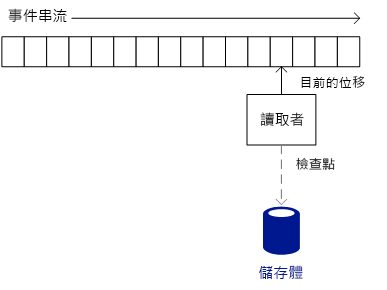
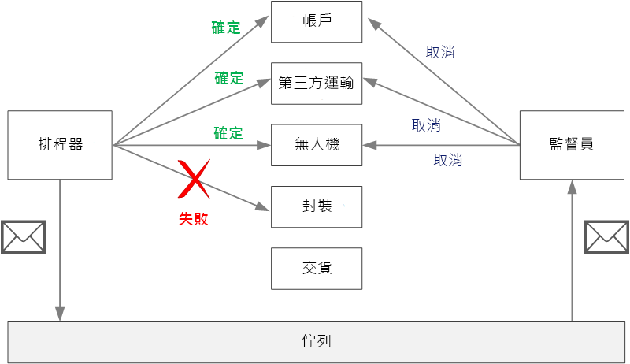

# <a name="designing-microservices-ingestion-and-workflow"></a>設計微服務：擷取與工作流程

微服務通常會有個工作流程需針對單一交易橫跨多個服務。 此工作流程必須很可靠；不能遺失交易，或讓交易處於部分完成狀態。 此外，控制傳入要求的擷取率也很重要。 許多小型服務彼此通訊時，突然出現一批傳入要求可能會淹沒服務間通訊。


## <a name="the-drone-delivery-workflow"></a>無人機遞送工作流程

在無人機遞送應用程式中，必須執行下列作業，才能排程遞送：

1. 檢查客戶的帳戶狀態 (帳戶服務)。
2. 建立新的包裝實體 (包裝服務)。
3. 根據取件和遞送位置，檢查此遞送是否需要任何第三方運輸 (第三方運輸服務)。
4. 排程無人機取件 (無人機服務)。
5. 建立新的遞送實體 (遞送服務)。

這是整個應用程式的核心，所以端對端程序必定要具有良好效能，並且很可靠。 必須處理一些特定的挑戰：

- **負載調節**。 太多用戶端要求可能會讓服務間網路流量淹沒系統。 也可能會淹沒後端相依性，例如儲存體或遠端服務。 其回應方式為進行服務節流、呼叫服務、在系統中建立背壓。 因此，務必對進入系統的要求進行負載調節，做法將其放入緩衝區或佇列中進行處理。

- **保證遞送**。 為避免遺漏任何用戶端要求，擷取元件必須保證至少傳遞訊息一次。

- 錯誤處理。 如果任何一項服務傳回錯誤碼，或發生非暫時性失敗，就無法排程傳遞。 錯誤碼可能會指出預期的錯誤狀況 (例如，客戶的帳戶已暫止) 或未預期的伺服器錯誤 (HTTP 5xx)。 服務也可能無法使用，而導致網路呼叫逾時。

首先，我們會查看等式的擷取端 &mdash; 系統如何在高輸送量時內嵌傳入的使用者要求。 然後我們會考慮無人機遞送應用程式如何實作可靠的工作流程。 結果就是擷取子系統的設計會影響工作流程後端。

## <a name="ingestion"></a>擷取

根據商務需求，開發小組針對擷取找出了下列非功能性需求：

- 每秒 10K 個要求的持續輸送量。
- 能夠處理高達 50K/秒的尖峰，但沒有遺漏用戶端要求或逾時。
- 小於 500 毫秒的延遲 (第 99 個百分位數)。

處理偶發流量尖峰需求是設計的一大挑戰。 理論上，可以將系統相應放大，以處理最大預期的流量。 不過，佈建這麼多資源會非常沒有效率。 在大部分的情況下，應用程式不需要這麼多容量，因此會有閒置核心，這樣不僅耗費金錢，且也不會增加價值。

比較好的做法是將傳入要求放入緩衝區，並且讓緩衝區當作負載調節器。 採用此設計，擷取服務必須能夠處理短期間的最大擷取率，但後端服務只需要處理最大的持續性負載。 在前端進行緩衝處理時，後端服務不需要處理大量的流量尖峰。 對於無人機遞送應用程式所需的規模，[Azure 事件中樞](/azure/event-hubs/)是不錯的負載調節選擇。 事件中樞可提供低延遲和高輸送量，而且在高擷取量時是具有成本效益的解決方案。

在我們的測試中，我們使用了具有 32 個分割區和 100 個輸送量單位的標準層事件中樞。 我們發現大約每秒擷取 32K 個事件時，會有約 90 毫秒的延遲。 目前的預設限制為 20 個輸送量單位，但 Azure 客戶可藉由提出支援要求來要求額外的輸送量單位。 如需詳細資訊，請參閱[事件中樞配額](/azure/event-hubs/event-hubs-quotas)。 如同所有的效能計量，許多因素 (例如訊息承載大小) 都有可能會影響效能，所以請勿將這些數字解譯成效能評定。 如果需要更多輸送量，擷取服務可以在多個事件中樞間進行分區。 為達到更高的輸送率，[專用事件中樞](/azure/event-hubs/event-hubs-dedicated-overview)可提供單一租用戶部署，其每秒可以輸入超過 2 百萬個事件。

請務必了解事件中樞如何達到這麼高的輸送量，因為這會影響用戶端應如何取用來自事件中樞的訊息。 事件中樞不會實作「佇列」。 然而，它會實作「事件串流」。

透過採用佇列，個別取用者可以從佇列中移除訊息，而下一個取用者就看不到該訊息。 因此佇列可讓您使用[競爭取用者模式](../patterns/competing-consumers.md)來平行處理訊息並改善延展性。 為獲取較強大的復原功能，取用者可以鎖定訊息，而在完成訊息處理時解除鎖定。 如果取用者失敗 &mdash; 例如，其執行的所在節點毀損 &mdash; 則鎖定會逾時且訊息會回到佇列中。


另一方面，事件中樞會使用串流語意。 取用者會依自己的步調獨立讀取串流。 每個取用者都要負責追蹤其在串流中的目前位置。 取用者應以預先定義的間隔將其目前位置寫入永續性儲存體。 這樣一來，如果取用者遇到錯誤 (例如，取用者毀損或主機失敗)，則新的執行個體可以從最後記錄的位置繼續讀取。 此程序稱為「檢查點檢查」。

基於效能考量，取用者通常不會在每則訊息之後進行檢查點檢查。 而是以固定間隔進行檢查點檢查，例如處理 n 則訊息之後，或每隔 n 秒。 因此，如果取用者失敗，有些事件可能會處理兩次，因為新的執行個體一律從最後一個檢查點銜接。 權衡取捨：頻繁的檢查點會使效能降低，但疏鬆的檢查點表示您會在失敗後重新執行更多事件。



事件中樞並非針對競爭取用者而設計。 雖然多個取用者可以讀取一個串流，但是會各自獨立周遊串流。 事件中樞會改用分割式取用者模式。 事件中樞最多有 32 個分割區。 將個別取用者指派給每個分割區，即可達到橫向擴展。

這對無人機遞送工作流程有何意義？ 若要擁有事件中樞的完整優勢，遞送排程器就不能先等候每則訊息進行處理，再移到下一則訊息。 如果這麼做，將會花費大部分的時間等待網路呼叫完成。 反而需要使用對後端服務的非同步呼叫，以平行方式處理數個訊息批次。 將如我們所見，選擇正確的檢查點檢查策略也很重要。

## <a name="workflow"></a>工作流程

我們已探討用於讀取和處理訊息的三個選項：事件處理器主機、服務匯流排佇列和 IoTHub React 程式庫。 我們選擇了 IoTHub React，但為了解原因，就從事件處理器主機開始。

### <a name="event-processor-host"></a>事件處理器主機

事件處理器主機專為訊息批次處理所設計。 此應用程式會實作 `IEventProcessor` 介面，而處理器主機會為事件中樞的每個分割區，建立一個事件處理器執行個體。 然後，事件處理器主機會以數批事件訊息，呼叫每個事件處理器的 `ProcessEventsAsync` 方法。 此應用程式可控制何時在 `ProcessEventsAsync` 方法內部進行檢查點檢查，而事件處理器主機會將檢查點寫入 Azure 儲存體。

在分割內，事件處理器主機會等候 `ProcessEventsAsync` 傳回後，再使用下一個批次再次進行呼叫。 這種方法可簡化程式設計模型，因為不需要重新輸入您的事件處理程式碼。 不過，這也表示事件處理器一次處理一個批次，而這會限制處理器主機可以提取訊息的速度。

> [!NOTE]
> 處理器主機並不是真的在「等候」，而是封鎖執行緒。 `ProcessEventsAsync` 方法是非同步的，因此在此方法即將完成時，處理器主機可以執行其他工作。 但是在方法傳回前，此方法並不會針對該分割區傳遞另一批訊息。

在無人機應用程式中，系統可以平行處理一批訊息。 但是，等候整個批次完成仍可能造成效能瓶頸。 處理只能與批次中最慢的訊息一樣快速。 任何回應時間變化都可以形成「長尾」，其中有些緩慢回應會拖累整個系統。 我們的效能測試顯示我們並未使用此方法來達成我們的目標輸送量。 這「不」表示您應該避免使用事件處理器主機。 但如需高輸送量，請避免在 `ProcesssEventsAsync` 方法內進行任何長時間執行的工作。 以便快速地處理每個批次。

### <a name="iothub-react"></a>IoTHub React

[IoTHub React](https://github.com/Azure/toketi-iothubreact) 是一個 Akka Streams 程式庫，可供從事件中樞讀取事件。 Akka Streams 是以串流為基礎並實作 [Reactive Streams](https://www.reactive-streams.org/) 規格的程式設計架構。 可用來建置有效的串流管線，其中的所有串流作業會以非同步方式執行，而管線則會依正常程序處理背壓。 當事件來源產生事件的速率比下游取用者可接收事件的速率更快時，就會發生背壓 &mdash; 這正是無人機遞送系統有流量高峰時的情況。 如果後端服務變慢，IoTHub React 將會變慢。 如果容量增加，IoTHub React 將會透過管線推送更多訊息。

Akka Streams 也是非常自然的程式設計模型，可供從事件中樞串流事件。 您可以定義一組將套用到每個事件的作業，並且讓 Akka Streams 處理串流，而不用對一批事件執行迴圈處理。 Akka Streams 會從「來源」、「流程」和「接收」方面定義串流管線。 來源會產生輸出串流、流程會處理輸入串流及產生輸出串流，而接收端會取用串流但不產生任何輸出。

以下是排程器服務中可設定 Akka Streams 管線的程式碼：

```java
IoTHub iotHub = new IoTHub();
Source<MessageFromDevice, NotUsed> messages = iotHub.source(options);

messages.map(msg -> DeliveryRequestEventProcessor.parseDeliveryRequest(msg))
        .filter(ad -> ad.getDelivery() != null).via(deliveryProcessor()).to(iotHub.checkpointSink())
        .run(streamMaterializer);
```

此程式碼會將事件中樞設定為來源。 `map` 陳述式會將每個事件訊息還原序列化成 Java 類別，以表示傳遞要求。 `filter` 陳述式會移除串流中的任何 `null` 物件；這可防範訊息無法還原序列化的狀況。 `via` 陳述式會將來源加入至可處理每個傳遞要求的流程。 `to` 方法會將流程加入至檢查點接收，這內建於 IoTHub React 中。

IoTHub React 會使用與事件主機處理器不同的檢查點檢查策略。 檢查點是由檢查點接收寫入，這是管線中的終結階段。 Akka Streams 的設計允許當接收寫入檢查點時，管線可繼續串流資料。 這表示上游處理階段不需要等待進行檢查點檢查。 您可以設定在逾時之後或已處理特定數量的訊息之後，進行檢查點檢查。

`deliveryProcessor` 方法會建立 Akka Streams 流程：

```java
private static Flow<AkkaDelivery, MessageFromDevice, NotUsed> deliveryProcessor() {
    return Flow.of(AkkaDelivery.class).map(delivery -> {
        CompletableFuture<DeliverySchedule> completableSchedule = DeliveryRequestEventProcessor
                .processDeliveryRequestAsync(delivery.getDelivery(),
                        delivery.getMessageFromDevice().properties());

        completableSchedule.whenComplete((deliverySchedule,error) -> {
            if (error!=null){
                Log.info("failed delivery" + error.getStackTrace());
            }
            else{
                Log.info("Completed Delivery",deliverySchedule.toString());
            }

        });
        completableSchedule = null;
        return delivery.getMessageFromDevice();
    });
}
```

此流程會呼叫靜態 `processDeliveryRequestAsync` 方法，該方法會執行處理每則訊息的實際工作。

### <a name="scaling-with-iothub-react"></a>透過 IoTHub React 調整

此排程器服務已設計成每個容器執行個體可從單一分割區讀取。 例如，如果事件中樞有 32 個分割區，則排程器服務會部署 32 個複本。 就橫向擴展而論，這可提供很大的彈性。

視叢集的大小而定，叢集中的節點可能有一個以上的排程器服務 pod 在其上執行。 但如果排程器服務需要更多資源，則可將叢集相應放大，以將 pod 分散於多個節點。 我們的效能測試顯示，排程器服務受限於記憶體和執行緒，因此效能極度取決於 VM 大小和每個節點的 pod 數目。

每個執行個體必須知道要讀取哪個事件中樞分割區。 為設定分割區編號，我們利用了 Kubernetes 中的 [StatefulSet](https://kubernetes.io/docs/concepts/workloads/controllers/statefulset/) 資源類型。 StatefulSet 中的 Pod 有一個持續性識別碼，其中包含數值索引。 具體而言，pod 名稱為 `<statefulset name>-<index>`，而且此值可透過 Kubernetes [Downward API](https://kubernetes.io/docs/tasks/inject-data-application/downward-api-volume-expose-pod-information/) 提供給容器。 在執行階段，排程器服務會讀取 pod 名稱，並使用 pod 索引作為分割區識別碼。

如果您需要更進一步相應放大排程器服務，您可依照每個事件中樞分割區指派一個以上的 pod，讓多個 pod 讀取每個分割區。 不過，在此情況下，每個執行個體會讀取指派分割區中的所有事件。 若要避免重複處理，您必須使用雜湊演算法，以便每個執行個體略過部分的訊息。 這樣一來，多個讀取器就可以取用串流，但每則訊息只由一個執行個體處理。


### <a name="service-bus-queues"></a>服務匯流排佇列

我們考慮的第三個選項是將訊息從事件中樞複製到服務匯流排佇列中，然後讓排程器服務從服務匯流排讀取訊息。 將傳入要求寫入事件中樞，只為了在服務匯流排中複製它們，似乎有點奇怪。  不過，此構想是要利用每個服務的不同優點：使用事件中樞來承受高流量尖峰，同時利用服務匯流排中的佇列語意來處理具有競爭取用者模式的工作負載。 請記住，我們對於持續輸送量的目標小於我們所預期的尖峰負載，因此處理服務匯流排佇列不需要與訊息擷取一樣快速。

使用此方法，我們的概念證明實作已達到每秒大約 4K 作業。 這些測試使用了未執行任何實際工作的模擬後端服務，但每個服務只新增了固定的延遲量。 請注意，我們的效能數字遠比服務匯流排的理論最大值小。 可能的不一致原因包括：

- 各種用戶端參數沒有最佳值，例如連線集區限制、平行化程度、預先擷取計數和批次大小。

- 網路 I/O 瓶頸。

- 使用 [PeekLock](/rest/api/servicebus/peek-lock-message-non-destructive-read) 模式 (而非 [ReceiveAndDelete](/rest/api/servicebus/receive-and-delete-message-destructive-read))，這可確保至少一次的訊息傳遞。

進一步效能測試可能會發現根本原因，並可讓我們解決這些問題。 不過，IoTHub React 符合我們的效能目標，所以我們選擇了該選項。 儘管如此，服務匯流排是此案例的可行選項。

## <a name="handling-failures"></a>處理失敗

所要考慮的一般失敗類別有三種。

1. 下游服務可能會有非暫時性的失敗，這是不太可能自行消失的任何失敗。 非暫時性失敗包含一般錯誤狀況，例如方法的無效輸入。 這些也包括在應用程式程式碼中未處理的例外狀況或程序損毀。 如果發生這類錯誤，必須將整個商務交易標示為失敗。 有可能需要復原相同交易中其他已成功的步驟。 (請參閱下面的「補償交易」。)

2. 下游服務可能會發生暫時性失敗，例如網路逾時。 通常，只要重試呼叫就可以解決這類錯誤。 如果在嘗試數次之後，此作業仍然失敗，則會將此視為非暫時性失敗。

3. 排程器服務本身可能會發生錯誤 (例如，因為節點毀損)。 在此情況下，Kubernetes 會顯示服務的新執行個體。 不過，任何已在進行中的交易都必須繼續。

## <a name="compensating-transactions"></a>補償交易

如果發生非暫時性失敗，目前的交易可能處於「部分失敗」狀態，因為其中一個或多個步驟已順利完成。 例如，如果無人機服務已排定無人機，則必須取消此無人機。 在此情況下，應用程式必須使用[補償交易](../patterns/compensating-transaction.md)來復原成功的步驟。 在某些情況下，這必須經由外部系統或甚至經由手動程序完成。

如果補償交易的邏輯很複雜，請考慮建立負責此程序的個別服務。 在無人機遞送應用程式中，排程器服務會將失敗的作業放到專用佇列。 個別的微服務 (稱為監督員) 會從此佇列讀取，並對需要補償的服務呼叫取消 API。 這是[排程器代理程式監督員模式][scheduler-agent-supervisor]的變化情形。 監督員服務可能也會採取其他動作，例如透過簡訊或電子郵件通知使用者，或將警示傳送到作業儀表板。



## <a name="idempotent-vs-non-idempotent-operations"></a>冪等性與非冪等性作業

為避免遺失任何要求，排程器服務必須保證所有訊息至少會處理一次。 如果用戶端正確進行檢查點檢查，則事件中樞可保證至少遞送一次。

如果排程器服務毀損，有可能是發生在處理一或多個用戶端要求過程當中。 排程器的另一個執行個體將會取得這些訊息並重新處理。 如果處理要求兩次會怎樣？ 請務必避免重複任何工作。 我們終究不希望系統對相同的包裹派遣兩架無人機。

其中一種方法是將所有作業設計為冪等性。 如果作業可以呼叫多次，但不會在第一次呼叫之後產生其他副作用，這就是冪等作業。 換句話說，用戶端可以叫用此作業一次、兩次或許多次，且結果會相同。 基本上，服務應該忽略重複的呼叫。 如果有副作用的方法具冪等性，服務必須能夠偵測重複的呼叫。 例如，您可以讓呼叫端指派識別碼，而不是讓服務產生新的識別碼。 然後服務可以檢查重複的識別碼。

> [!NOTE]
> HTTP 規格規定 GET、PUT 和 DELETE 方法必須具冪等性。 不保證 POST 方法都具冪等性。 如果 POST 方法建立新的資源，通常不保證此作業具冪等性。

並不是永遠都可直接撰寫冪等性方法。 排程器的另一個選項是追蹤長期存放區中每筆交易的進度。 當排程器處理訊息時，會查閱持久存放區中的狀態。 在每個步驟之後，它會將結果寫入存放區。 此方法可能會有效能影響。

## <a name="example-idempotent-operations"></a>範例：等冪性作業

HTTP 規格規定 PUT 方法必須具冪等性。 此規格會這麼定義冪等性：

> 具有「冪等性」的要求方法是指，使用該方法的多個相同要求在伺服器上的預期效果，皆與單一此種要求產生的效果一樣。 ([RFC 7231](https://tools.ietf.org/html/rfc7231#section-4))

請務必了解在建立新實體時 PUT 與 POST 語意之間的差別。 在這兩種情況下，用戶端都會在要求本文中傳送實體的表示法。 但是 URI 的意義不同。

- 在 POST 方法中，URI 代表新實體的父資源，例如集合。 例如，若要建立新的傳遞，URI 可能是 `/api/deliveries`。 伺服器會建立實體並為它指派新 URI，例如 `/api/deliveries/39660`。 此 URI 會在回應的位置標頭傳回。 每次用戶端傳送要求時，伺服器會使用新 URI 建立新實體。

- 在 PUT 方法中，URI 會識別實體。 如果已存在具有該 URI 的實體，伺服器會以要求中的版本取代現有的實體。 如果不存在具有該 URI 的實體，則伺服器會建立一個。 例如，假設用戶端會將 PUT 要求傳送到 `api/deliveries/39660`。 假設沒有隨著該 URI 傳遞任何項目，則伺服器會建立一個新的傳遞。 現在，如果用戶端再次傳送相同的要求，則伺服器將會取代現有的實體。

以下是 PUT 方法的傳遞服務實作。

```csharp
[HttpPut("{id}")]
[ProducesResponseType(typeof(Delivery), 201)]
[ProducesResponseType(typeof(void), 204)]
public async Task<IActionResult> Put([FromBody]Delivery delivery, string id)
{
    logger.LogInformation("In Put action with delivery {Id}: {@DeliveryInfo}", id, delivery.ToLogInfo());
    try
    {
        var internalDelivery = delivery.ToInternal();

        // Create the new delivery entity.
        await deliveryRepository.CreateAsync(internalDelivery);

        // Create a delivery status event.
        var deliveryStatusEvent = new DeliveryStatusEvent { DeliveryId = delivery.Id, Stage = DeliveryEventType.Created };
        await deliveryStatusEventRepository.AddAsync(deliveryStatusEvent);

        // Return HTTP 201 (Created)
        return CreatedAtRoute("GetDelivery", new { id= delivery.Id }, delivery);
    }
    catch (DuplicateResourceException)
    {
        // This method is mainly used to create deliveries. If the delivery already exists then update it.
        logger.LogInformation("Updating resource with delivery id: {DeliveryId}", id);

        var internalDelivery = delivery.ToInternal();
        await deliveryRepository.UpdateAsync(id, internalDelivery);

        // Return HTTP 204 (No Content)
        return NoContent();
    }
}
```

預計大部分的要求會建立新的實體，所以此方法會樂觀地在存放庫物件上呼叫 `CreateAsync`，然後藉由更新資源來處理資源重複的例外狀況。

> [!div class="nextstepaction"]
> [API 閘道](./gateway.md)

<!-- links -->

[scheduler-agent-supervisor]: ../patterns/scheduler-agent-supervisor.md