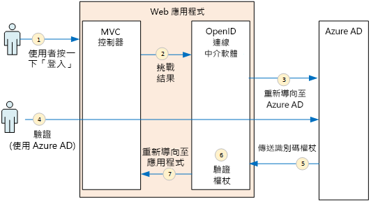

# <a name="authenticate-using-azure-ad-and-openid-connect"></a>使用 Azure AD 和 OpenID Connect 進行驗證

[ 程式碼範例][sample application]

Surveys 應用程式會使用 OpenID Connect (OIDC) 通訊協定，透過 Azure Active Directory (Azure AD) 驗證使用者。 Surveys 應用程式會使用 ASP.NET Core，其具有內建的 OIDC 中介軟體。 下圖概括顯示使用者登入時會發生什麼情況。



1. 使用者在應用程式中按一下 [登入] 按鈕。 這個動作是由 MVC 控制器處理。
2. MVC 控制器會傳回 **ChallengeResult** 動作。
3. 中介軟體會攔截 **ChallengeResult** 並建立 302 回應，進而將使用者重新導向至 Azure AD 登入頁面。
4. 使用者會向 Azure AD 進行驗證。
5. Azure AD 會將 ID 權杖傳送至應用程式。
6. 中介軟體會驗證 ID 權杖。 此時，使用者已在應用程式內驗證。
7. 中介軟體會將使用者重新導向回到應用程式。

## <a name="register-the-app-with-azure-ad"></a>使用 Azure AD 註冊應用程式
若要啟用 OpenID Connect，SaaS 提供者會在自己的 Azure AD 租用戶內註冊應用程式。

若要註冊應用程式，請遵循[整合應用程式與 Azure Active Directory](/azure/active-directory/active-directory-integrating-applications/) 之[新增應用程式](/azure/active-directory/active-directory-integrating-applications/#adding-an-application)一節中的步驟。

請參閱[執行 Surveys 應用程式](./run-the-app.md)，以了解 Surveys 應用程式的特定步驟。 請注意：

- 針對多租用戶應用程式，您必須明確地設定多租用戶選項。 這可讓其他組織能夠存取該應用程式。

- 回覆 URL 是 Azure AD 要做為 OAuth 2.0 回應傳送目的地的 URL。 在使用 ASP.NET Core 時，這必須符合您在驗證中介軟體中設定的路徑 (請參閱下一節)。 

## <a name="configure-the-auth-middleware"></a>設定驗證中介軟體
本節說明如何在 ASP.NET Core 中設定驗證中介軟體，以便利用 OpenID Connect 進行多租用戶驗證。

在您的[啟動類別](/aspnet/core/fundamentals/startup)中加入 OpenID Connect 中介軟體：

```csharp
app.UseOpenIdConnectAuthentication(new OpenIdConnectOptions {
    ClientId = configOptions.AzureAd.ClientId,
    ClientSecret = configOptions.AzureAd.ClientSecret, // for code flow
    Authority = Constants.AuthEndpointPrefix,
    ResponseType = OpenIdConnectResponseType.CodeIdToken,
    PostLogoutRedirectUri = configOptions.AzureAd.PostLogoutRedirectUri,
    SignInScheme = CookieAuthenticationDefaults.AuthenticationScheme,
    TokenValidationParameters = new TokenValidationParameters { ValidateIssuer = false },
    Events = new SurveyAuthenticationEvents(configOptions.AzureAd, loggerFactory),
});
```

請注意，某些設定是取自執行階段的組態選項。 以下是中介軟體選項的意義：

* **ClientId**。 當您在 Azure AD 中註冊應用程式時所得到之應用程式的用戶端識別碼。
* **Authority**。 對於多租用戶應用程式，將此選項設定為 `https://login.microsoftonline.com/common/`。 這是 Azure AD 一般端點的 URL，可讓任何 Azure AD 租用戶的使用者進行登入。 如需一般端點的詳細資訊，請參閱 [此部落格文章](https://www.cloudidentity.com/blog/2014/08/26/the-common-endpoint-walks-like-a-tenant-talks-like-a-tenant-but-is-not-a-tenant/)。
* 在 **TokenValidationParameters** 中，將 **ValidateIssuer** 設為 false。 這表示應用程式將會負責驗證識別碼權杖中的簽發者值。 (中介軟體仍會驗證權杖本身)。如需驗證簽發者的詳細資訊，請參閱[簽發者驗證](claims.md#issuer-validation)。
* **PostLogoutRedirectUri**。 指定要在登出後重新導向使用者的 URL。這應該是允許匿名要求的頁面 &mdash; 通常是首頁。
* **SignInScheme**。 將此選項設定為 `CookieAuthenticationDefaults.AuthenticationScheme`。 此設定表示在驗證使用者之後，使用者宣告就會儲存在本機在 Cookie 中。 此 Cookie 是使用者在瀏覽器工作階段期間保持已登入狀態的方法。
* **事件。** 事件回呼；請參閱 [驗證事件](#authentication-events)。

此外，將 Cookie 驗證中介軟體新增至管線。 此中介軟體負責將使用者宣告寫入至 Cookie，然後在後續頁面載入期間讀取 Cookie。

```csharp
app.UseCookieAuthentication(new CookieAuthenticationOptions {
    AutomaticAuthenticate = true,
    AutomaticChallenge = true,
    AccessDeniedPath = "/Home/Forbidden",
    CookieSecure = CookieSecurePolicy.Always,

    // The default setting for cookie expiration is 14 days. SlidingExpiration is set to true by default
    ExpireTimeSpan = TimeSpan.FromHours(1),
    SlidingExpiration = true
});
```

## <a name="initiate-the-authentication-flow"></a>起始驗證流程
若要在 ASP.NET MVC 中開始驗證流程，請從控制器傳回 **ChallengeResult** ：

```csharp
[AllowAnonymous]
public IActionResult SignIn()
{
    return new ChallengeResult(
        OpenIdConnectDefaults.AuthenticationScheme,
        new AuthenticationProperties
        {
            IsPersistent = true,
            RedirectUri = Url.Action("SignInCallback", "Account")
        });
}
```

這會導致中介軟體傳回可重新導向至驗證端點的 302 (找到) 回應。

## <a name="user-login-sessions"></a>使用者登入工作階段
如上所述，當使用者第一次登入時，Cookie 驗證中介軟體會將使用者宣告寫入至 Cookie。 之後，系統會藉由讀取 Cookie 來驗證 HTTP 要求。

根據預設，Cookie 中介軟體會寫入[工作階段 Cookie][session-cookie]，當使用者關閉瀏覽器後便會遭到刪除。 使用者下次瀏覽網站時，則必須再次登入。 不過，如果您將 **ChallengeResult** 中的 **IsPersistent** 設定為 true，中介軟體便會寫入永續性 Cookie，讓該名使用者在關閉瀏覽器之後仍保持登入。 您可以設定 Cookie 到期日；請參閱[控制 Cookie 選項][cookie-options]。 持續性 Cookie 對使用者而言比較方便，但可能不適用於您希望使用者每次登入的一些應用程式 (例如，銀行應用程式)。

## <a name="about-the-openid-connect-middleware"></a>關於 OpenID Connect 中介軟體
ASP.NET 中的 OpenID Connect 中介軟體會隱藏大部分的通訊協定詳細資料。 本節包含一些有關實作的注意事項，這對於了解通訊協定流程很有幫助。

首先，讓我們從 ASP.NET 的角度 (忽略應用程式與 Azure AD 之間的 OIDC 通訊協定流程細節) 檢查驗證流程。 下圖顯示此程序。


在此圖中，有兩個 MVC 控制器。 帳戶控制器會處理登入要求，而首頁控制器會為首頁提供服務。

以下是驗證程序：

1. 使用者按一下「登入」按鈕，而瀏覽器會傳送 GET 要求。 例如： `GET /Account/SignIn/`。
2. 帳戶控制器會傳回 `ChallengeResult`。
3. OIDC 中介軟體會傳回 HTTP 302 回應，並重新導向至 Azure AD。
4. 瀏覽器會將驗證要求傳送至 Azure AD
5. 使用者登入 Azure AD，而 Azure AD 會送回驗證回應。
6. OIDC 中介軟體會建立宣告主體，並將它傳遞給 Cookie 驗證中介軟體。
7. Cookie 中介軟體會將宣告主體序列化並設定 Cookie。
8. OIDC 中介軟體會重新導向至應用程式的回呼 URL。
9. 瀏覽器會遵循重新導向，並在要求中傳送 Cookie。
10. Cookie 中介軟體會將此 Cookie 還原序列化為宣告主體，並設定 `HttpContext.User` 等於宣告主體。 要求會路由傳送至 MVC 控制器。

### <a name="authentication-ticket"></a>驗證票證
如果驗證成功，OIDC 中介軟體會建立驗證票證，其中包含保存使用者宣告的宣告主體。 您可以存取 **AuthenticationValidated** 或 **TicketReceived** 事件內的票證。

> [!NOTE]
> 在整個驗證流程完成之前，`HttpContext.User` 仍會保有匿名主體，而「不是」已驗證的使用者。 匿名主體具有空的宣告集合。 在驗證完成且應用程式重新導向之後，Cookie 中介軟體將驗證 Cookie 還原序列化並將 `HttpContext.User` 設定為代表已驗證使用者的宣告主體。
> 
> 

### <a name="authentication-events"></a>驗證事件
在驗證過程中，OpenID Connect 中介軟體會引發一連串的事件：

* **RedirectToIdentityProvider**。 緊接在中介軟體重新導向至驗證端點前呼叫。 您可以使用此事件來修改重新導向 URL；例如，以便新增要求參數。 請參閱[新增系統管理員同意提示](signup.md#adding-the-admin-consent-prompt)，以取得範例。
* **AuthorizationCodeReceived**。 使用授權碼來呼叫。
* **TokenResponseReceived**。 在中介軟體從 IDP 取得存取權杖後，但在其通過驗證前呼叫。 僅適用於授權碼流程。
* **TokenValidated**。 在中介軟體驗證 ID 權杖之後呼叫。 此時，應用程式有一組關於使用者的已驗證宣告。 您可以使用此事件對宣告執行額外的驗證，或轉換宣告。 請參閱[使用宣告](claims.md)。
* **UserInformationReceived**。 如果中介軟體從使用者資訊端點取得使用者設定檔，則會呼叫。 僅適用於授權碼流程，而且只有在中介軟體選項中的 `GetClaimsFromUserInfoEndpoint = true` 時使用。
* **TicketReceived**。 在驗證完成時呼叫。 這是最後一個事件，並假設驗證成功。 在此事件處理之後，使用者就會登入應用程式。
* **AuthenticationFailed**。 如果驗證失敗時，則會呼叫。 請使用此事件來處理驗證失敗，例如，藉由重新導向至錯誤頁面。

若要為這些事件提供回呼，請在中介軟體設定 [事件] 選項。 有兩種不同的方式可宣告事件處理常式：使用 lambda 內嵌，或在衍生自 **OpenIdConnectEvents** 的類別中內嵌。 如果事件回呼有任何實質邏輯，則建議使用第二種方法，如此才不會擾亂您的啟動類別。 我們的參考實作使用這種方法。

### <a name="openid-connect-endpoints"></a>OpenID Connect 端點
Azure AD 支援 [OpenID Connect 探索](https://openid.net/specs/openid-connect-discovery-1_0.html)，會由識別提供者 (IDP) 傳回[已知端點](https://openid.net/specs/openid-connect-discovery-1_0.html#ProviderConfig)的 JSON 中繼資料文件。 中繼資料文件包含的資訊如下：

* 授權端點的 URL。 這是應用程式重新導向來驗證使用者的位置。
* 「結束工作階段」端點的 URL，也就是應用程式即將登出使用者的位置。
* 用以取得簽署金鑰的 URL，而用戶端會使用這些金鑰來驗證它從 IDP 取得的 OIDC 權杖。

根據預設，OIDC 中介軟體會知道如何擷取此中繼資料。 請在中介軟體中設定 [授權] 選項，中介軟體便會建構此中繼資料的 URL。 (您可以藉由設定 **MetadataAddress** 選項來覆寫中繼資料 URL)。

### <a name="openid-connect-flows"></a>OpenID Connect 流程
根據預設，OIDC 中介軟體會使用混合式流程搭配表單 POST 回應模式。

* 「混合式流程」表示用戶端可以在同一回往返存取授權伺服器時取得 ID 權杖和授權碼。
* 「表單 POST 回應模式」表示授權伺服器會使用 HTTP POST 要求將 ID 權杖和授權碼傳送至應用程式。 這些值會使用表單 URL 方式進行編碼 (content type = "application/x-www-form-urlencoded")。

當 OIDC 中介軟體重新導向至授權端點時，重新導向 URL 會包含 OIDC 所需的所有查詢字串參數。 混合式流程：

* client_id。 這個值設定於 **ClientId** 選項
* scope = "openid profile"，這表示它是 OIDC 要求而且我們想要使用者的設定檔。
* response_type  = "code id_token"。 這會指定混合式流程。
* response_mode = "form_post"。 這會指定表單 POST 回應。

若要指定不同的流程，請設定選項的 **ResponseType** 屬性。 例如︰

```csharp
app.UseOpenIdConnectAuthentication(options =>
{
    options.ResponseType = "code"; // Authorization code flow

    // Other options
}
```

[**下一主題**][claims]

[claims]: claims.md
[cookie-options]: /aspnet/core/security/authentication/cookie#controlling-cookie-options
[session-cookie]: https://en.wikipedia.org/wiki/HTTP_cookie#Session_cookie
[sample application]: https://github.com/mspnp/multitenant-saas-guidance
