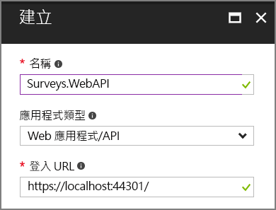
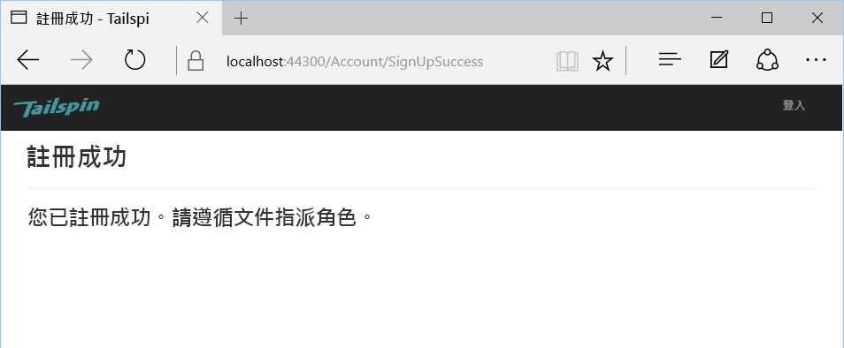
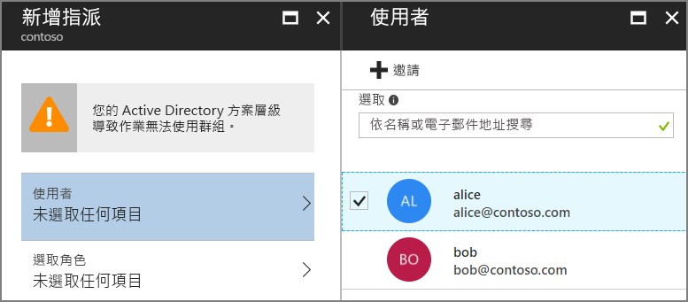
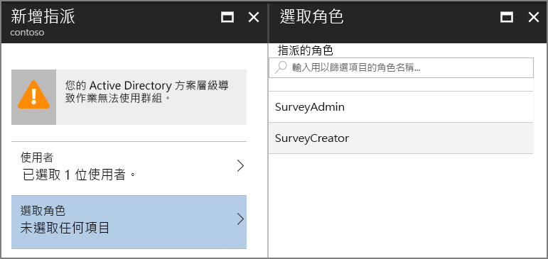

# <a name="run-the-surveys-application"></a>執行問卷應用程式

本文說明如何從 Visual Studio 在本機執行 [Tailspin 問卷](./tailspin.md)應用程式。 在這些步驟中，您不會將應用程式部署至 Azure。 不過，您將需要建立 Azure Active Directory (Azure AD) 目錄和 Redis 快取等 Azure 資源。

以下是步驟的摘要：

1. 為虛構的 Tailspin 公司建立 Azure AD 目錄 (租用戶)。
2. 向 Azure AD 註冊問卷應用程式和後端 Web API。
3. 建立 Azure Redis 快取執行個體。
4. 設定應用程式設定和建立本機資料庫。
5. 執行應用程式和註冊新的租用戶。
6. 新增使用者的應用程式角色。

## <a name="prerequisites"></a>必要條件

- 已安裝包含 [ASP.NET 和 Web 開發工作負載](https://visualstudio.microsoft.com/vs/support/selecting-workloads-visual-studio-2017)的 [Visual Studio 2017][VS2017]
- [Microsoft Azure](https://azure.microsoft.com) 帳戶

## <a name="create-the-tailspin-tenant"></a>建立 Tailspin 租用戶

Tailspin 是主控問卷應用程式的虛構公司。 Tailspin 使用 Azure AD 讓其他租用戶註冊應用程式。 這些客戶就可使用其 Azure AD 認證來登入應用程式。

在此步驟中，您將為 Tailspin 建立 Azure AD 目錄。

1. 登入 [Azure 入口網站][portal]。

2. 按一下 [+ 建立資源] > [身分識別] > [Azure Active Directory]。

3. 輸入 `Tailspin` 作為組織名稱，並輸入網域名稱。 網域名稱格式將為 `xxxx.onmicrosoft.com`，而且必須是全域唯一的。

    

4. 按一下頁面底部的 [新增] 。 系統可能需要幾分鐘的時間來建立新目錄。

若要完成完整的案例，您將需要第二個 Azure AD 目錄來代表註冊應用程式的客戶。 您可以使用預設的 Azure AD 目錄 (非 Tailspin)，或針對此用途建立新的目錄。 在範例中，我們使用 Contoso 作為虛構客戶。

## <a name="register-the-surveys-web-api"></a>註冊問卷 Web API

1. 在 [Azure 入口網站][portal]中，於入口網站右上角選取您的帳戶，以切換至新的 Tailspin 目錄。

2. 選擇左側導覽窗格中的 [Azure Active Directory]。

3. 按一下 [應用程式註冊] > [新增應用程式註冊]。

4. 在 [建立] 刀鋒視窗中，輸入下列資訊：

   - **名稱**：`Surveys.WebAPI`

   - **應用程式類型**：`Web app / API`

   - **登入 URL**：`https://localhost:44301/`

   

5. 按一下頁面底部的 [新增] 。

6. 在 [應用程式註冊] 刀鋒視窗中，選取新的 **Surveys.WebAPI** 應用程式。

7. 然後按一下 [設定] > [屬性]。

8. 在 [應用程式識別碼 URI] 編輯方塊中輸入 `https://<domain>/surveys.webapi`，其中 `<domain>` 是目錄的網域名稱。 例如：`https://tailspin.onmicrosoft.com/surveys.webapi`

    

9. 將 [多重租用戶] 設為 [是]。

10. 按一下 [檔案] 。

## <a name="register-the-surveys-web-app"></a>註冊問卷 Web 應用程式

1. 瀏覽回到 [應用程式註冊] 刀鋒視窗，然後按一下 [新增應用程式註冊]。

2. 在 [建立] 刀鋒視窗中，輸入下列資訊：

    - **名稱**：`Surveys`
    - **應用程式類型**：`Web app / API`
    - **登入 URL**：`https://localhost:44300/`

    請注意，登入 URL 的連接埠號碼不同於上一個步驟中的 `Surveys.WebAPI` 應用程式。

3. 按一下頁面底部的 [新增] 。

4. 在 [應用程式註冊] 刀鋒視窗中，選取新的 [問卷] 應用程式。

5. 複製應用程式識別碼。 稍後您將會需要此資訊。

    

6. 按一下 [內容] 。

7. 在 [應用程式識別碼 URI] 編輯方塊中輸入 `https://<domain>/surveys`，其中 `<domain>` 是目錄的網域名稱。

    

8. 將 [多重租用戶] 設為 [是]。

9. 按一下 [檔案] 。

10. 在 [設定] 刀鋒視窗中，按一下 [回覆 URL]。

11. 加入下列回覆 URL：`https://localhost:44300/signin-oidc`。

12. 按一下 [檔案] 。

13. 在 [API 存取權] 底下，按一下 [金鑰]。

14. 輸入描述，例如 `client secret`。

15. 在 [選取持續時間] 下拉式清單中，選取 [1 年]。

16. 按一下 [檔案] 。 當您儲存時，便會產生金鑰。

17. 離開此刀鋒視窗之前，請複製金鑰的值。

    > [!NOTE]
    > 當您離開刀鋒視窗後，就不會再看到金鑰。

18. 在 [API 存取權] 底下，按一下 [必要權限]。

19. 按一下 [新增] > [選取 API]。

20. 在搜尋方塊中搜尋 `Surveys.WebAPI`。

    

21. 選取 `Surveys.WebAPI`，然後按一下 [選取]。

22. 在 [委派的權限] 底下勾選 [存取 Surveys.WebAPI]。

    

23. 按一下 [選取] > [完成]。

## <a name="update-the-application-manifests"></a>更新應用程式資訊清單

1. 瀏覽回到 `Surveys.WebAPI` 應用程式的 [設定] 刀鋒視窗。

2. 按一下 [資訊清單] > [編輯]。

    

3. 將下列 JSON 新增至 `appRoles` 元素。 為 `id` 屬性產生新的 GUID。

   ```json
   {
     "allowedMemberTypes": ["User"],
     "description": "Creators can create surveys",
     "displayName": "SurveyCreator",
     "id": "<Generate a new GUID. Example: 1b4f816e-5eaf-48b9-8613-7923830595ad>",
     "isEnabled": true,
     "value": "SurveyCreator"
   },
   {
     "allowedMemberTypes": ["User"],
     "description": "Administrators can manage the surveys in their tenant",
     "displayName": "SurveyAdmin",
     "id": "<Generate a new GUID>",  
     "isEnabled": true,
     "value": "SurveyAdmin"
   }
   ```

4. 在 `knownClientApplications` 屬性中加入問卷 Web 應用程式的應用程式識別碼，即稍早註冊問卷應用程式時取得的應用程式識別碼。 例如︰

   ```json
   "knownClientApplications": ["be2cea23-aa0e-4e98-8b21-2963d494912e"],
   ```

   這項設定會將問卷應用程式加到獲授權呼叫 Web API 的用戶端清單中。

5. 按一下 [檔案] 。

現在針對問卷應用程式重複相同的步驟，但不要新增 `knownClientApplications` 的項目。 使用相同的角色定義，但為識別碼產生新的 GUID。

## <a name="create-a-new-redis-cache-instance"></a>建立新的 Redis 快取執行個體

問卷應用程式使用 Redis 來快取 OAuth 2 存取權杖。 若要建立快取：

1. 移至 [Azure 入口網站](https://portal.azure.com)，按一下 [+ 建立資源] > [資料庫] > [Redis 快取]。

2. 填妥必要的資訊，包括 DNS 名稱、資源群組、位置與定價層。 您可以建立新的資源群組或使用現有的資源群組。

3. 按一下頁面底部的 [新增] 。

4. 建立 Redis 快取之後，請巡覽至入口網站中的資源。

5. 按一下 [存取金鑰]，並複製主要金鑰。

如需如何建立 Redis 快取的詳細資訊，請參閱[如何使用 Azure Redis 快取](/azure/redis-cache/cache-dotnet-how-to-use-azure-redis-cache)。

## <a name="set-application-secrets"></a>設定應用程式祕密

1. 在 Visual Studio 中開啟 Tailspin.Surveys 方案。

2. 在 [方案總管] 中，以右鍵按一下 Tailspin.Surveys.Web 專案，然後選取 [管理使用者密碼] 。

3. 在 secrets.json 檔案中，貼上下列項目：

    ```json
    {
      "AzureAd": {
        "ClientId": "<Surveys application ID>",
        "ClientSecret": "<Surveys app client secret>",
        "PostLogoutRedirectUri": "https://localhost:44300/",
        "WebApiResourceId": "<Surveys.WebAPI app ID URI>"
      },
      "Redis": {
        "Configuration": "<Redis DNS name>.redis.cache.windows.net,password=<Redis primary key>,ssl=true"
      }
    }
    ```

    如下所示，取代角括弧中顯示的項目：

    - `AzureAd:ClientId`：問卷應用程式的應用程式識別碼。
    - `AzureAd:ClientSecret`：在 Azure AD 中註冊問卷應用程式時產生的金鑰。
    - `AzureAd:WebApiResourceId`：當您在 Azure AD 建立 Surveys.WebAPI 應用程式時所指定的應用程式識別碼 URI。 其格式應該為 `https://<directory>.onmicrosoft.com/surveys.webapi`
    - `Redis:Configuration`：從 Redis 快取的 DNS 名稱和主要存取金鑰建置這個字串。 例如，"tailspin.redis.cache.windows.net,password=2h5tBxxx,ssl=true"。

4. 儲存更新後的 secrets.json 檔案。

5. 針對 Tailspin.Surveys.WebAPI 專案重複這些步驟，但將下列項目貼入 secrets.json。 和先前一樣，取代角括弧中的項目。

    ```json
    {
      "AzureAd": {
        "WebApiResourceId": "<Surveys.WebAPI app ID URI>"
      },
      "Redis": {
        "Configuration": "<Redis DNS name>.redis.cache.windows.net,password=<Redis primary key>,ssl=true"
      }
    }
    ```

## <a name="initialize-the-database"></a>初始化資料庫

在此步驟中，您將使用 Entity Framework 7 以 LocalDB 來建立本機 SQL 資料庫。

1. 開啟命令視窗

2. 瀏覽至 Tailspin.Surveys.Data 專案。

3. 執行以下命令：

    ```bat
    dotnet ef database update --startup-project ..\Tailspin.Surveys.Web
    ```

## <a name="run-the-application"></a>執行應用程式

若要執行應用程式，請啟動 Tailspin.Surveys.Web 和 Tailspin.Surveys.WebAPI 專案。

您可以如下所示，設定在按 F5 時讓 Visual Studio 自動執行這兩個專案：

1. 在方案總管中，以滑鼠右鍵按一下方案，然後按一下 [設定啟始專案]。
2. 選取 [多個啟始專案]。
3. 為 Tailspin.Surveys.Web 和 Tailspin.Surveys.WebAPI 專案設定 [動作] = [啟動]。

## <a name="sign-up-a-new-tenant"></a>註冊新的租用戶

應用程式啟動時，您並未登入，因此會看到歡迎頁面：


若要註冊組織：

1. 按一下 [在 Tailspin 註冊您的公司]。
2. 登入代表使用問卷應用程式之組織的 Azure AD 目錄。 您必須以系統管理員使用者身分登入。
3. 接受同意提示。

應用程式會註冊租用戶，然後將您登出。應用程式將您登出是因為您需要先在 Azure AD 中設定應用程式角色，才能使用應用程式。



## <a name="assign-application-roles"></a>指派應用程式角色

當租用戶註冊時，租用戶的 AD 系統管理員必須指派應用程式角色給使用者。

1. 在 [Azure 入口網站][portal]中，切換至您用來註冊問卷應用程式的 Azure AD 目錄。

2. 選擇左側導覽窗格中的 [Azure Active Directory]。

3. 按一下 [企業應用程式] > [所有應用程式]。 入口網站將會列出 `Survey` 和 `Survey.WebAPI`。 如果沒有，請確定您已經完成註冊程序。

4. 在問卷應用程式上按一下。

5. 按一下 [使用者和群組]。

6. 按一下 [新增使用者] 。

7. 如果您有 Azure AD Premium，請按一下 [使用者和群組]。 否則，請按一下 [使用者]。 (將角色指派給群組需要 Azure AD Premium)。

8. 選取一或多個使用者，然後按一下 [選取]。

    

9. 選取角色，然後按一下 [選取]。

    

10. 按一下 [指派]。

重複相同步驟，以指派 Survey.WebAPI 應用程式的角色。

> [!IMPORTANT]
> 使用者在問卷和 Survey.WebAPI 中應永遠具有相同的角色。 否則，使用者將有不一致的權限，這可能導致 Web API 的 403 (禁止) 錯誤。

現在返回應用程式並再次登入。 按一下 [我的問卷]。 如果使用者被指派了 SurveyAdmin 或 SurveyCreator 角色，您就會看到 [建立問卷] 按鈕，指出使用者有權限可建立新的問卷。


<!-- links -->

[portal]: https://portal.azure.com
[VS2017]: https://www.visualstudio.com/vs/
