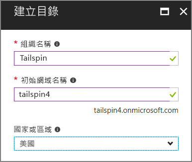
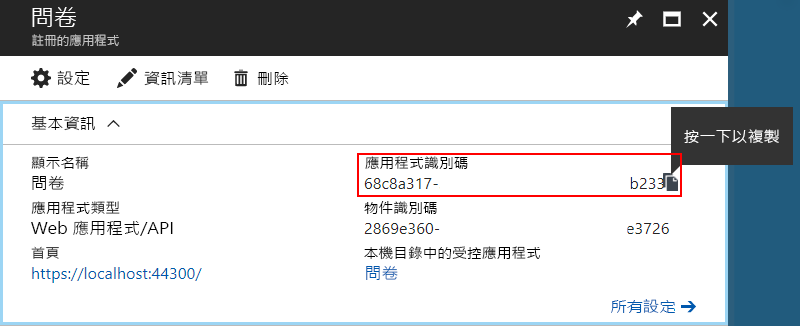
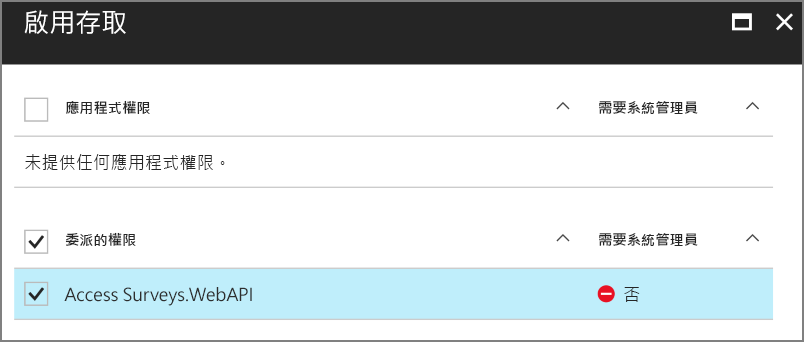
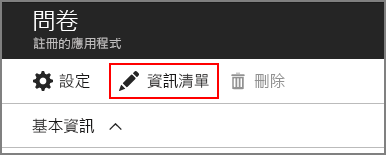
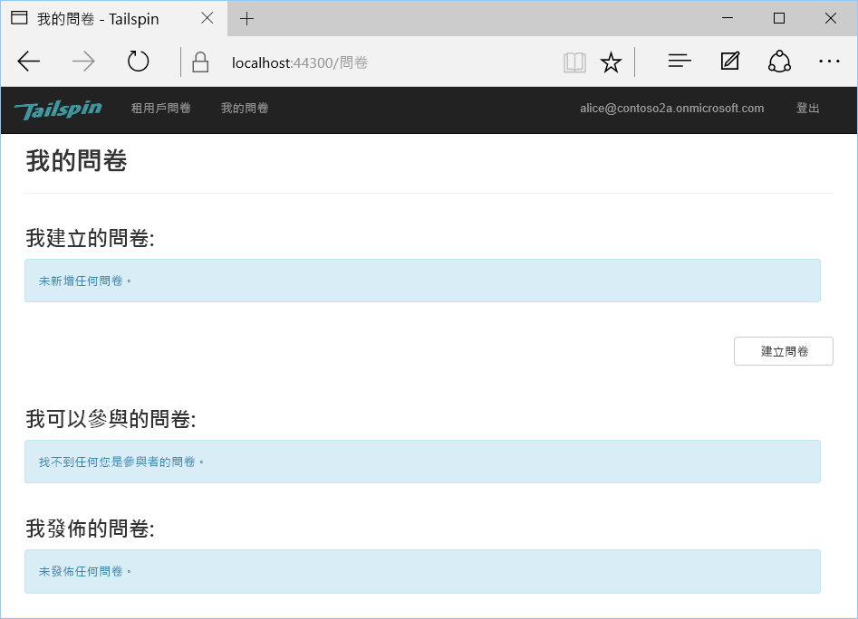

# <a name="run-the-surveys-application"></a><span data-ttu-id="40b85-103">執行問卷應用程式</span><span class="sxs-lookup"><span data-stu-id="40b85-103">Run the Surveys application</span></span>

<span data-ttu-id="40b85-104">本文說明如何從 Visual Studio 在本機執行 [Tailspin 問卷](./tailspin.md)應用程式。</span><span class="sxs-lookup"><span data-stu-id="40b85-104">This article describes how to run the [Tailspin Surveys](./tailspin.md) application locally, from Visual Studio.</span></span> <span data-ttu-id="40b85-105">在這些步驟中，您不會將應用程式部署至 Azure。</span><span class="sxs-lookup"><span data-stu-id="40b85-105">In these steps, you won't deploy the application to Azure.</span></span> <span data-ttu-id="40b85-106">不過，您將需要建立 Azure Active Directory (Azure AD) 目錄和 Redis 快取等 Azure 資源。</span><span class="sxs-lookup"><span data-stu-id="40b85-106">However, you will need to create some Azure resources &mdash; an Azure Active Directory (Azure AD) directory and a Redis cache.</span></span>

<span data-ttu-id="40b85-107">以下是步驟的摘要：</span><span class="sxs-lookup"><span data-stu-id="40b85-107">Here is a summary of the steps:</span></span>

1. <span data-ttu-id="40b85-108">為虛構的 Tailspin 公司建立 Azure AD 目錄 (租用戶)。</span><span class="sxs-lookup"><span data-stu-id="40b85-108">Create an Azure AD directory (tenant) for the fictitious Tailspin company.</span></span>
2. <span data-ttu-id="40b85-109">向 Azure AD 註冊問卷應用程式和後端 Web API。</span><span class="sxs-lookup"><span data-stu-id="40b85-109">Register the Surveys application and the backend web API with Azure AD.</span></span>
3. <span data-ttu-id="40b85-110">建立 Azure Redis 快取執行個體。</span><span class="sxs-lookup"><span data-stu-id="40b85-110">Create an Azure Redis Cache instance.</span></span>
4. <span data-ttu-id="40b85-111">設定應用程式設定和建立本機資料庫。</span><span class="sxs-lookup"><span data-stu-id="40b85-111">Configure application settings and create a local database.</span></span>
5. <span data-ttu-id="40b85-112">執行應用程式和註冊新的租用戶。</span><span class="sxs-lookup"><span data-stu-id="40b85-112">Run the application and sign up a new tenant.</span></span>
6. <span data-ttu-id="40b85-113">新增使用者的應用程式角色。</span><span class="sxs-lookup"><span data-stu-id="40b85-113">Add application roles to users.</span></span>

## <a name="prerequisites"></a><span data-ttu-id="40b85-114">必要條件</span><span class="sxs-lookup"><span data-stu-id="40b85-114">Prerequisites</span></span>

- <span data-ttu-id="40b85-115">已安裝包含 [ASP.NET 和 Web 開發工作負載](https://visualstudio.microsoft.com/vs/support/selecting-workloads-visual-studio-2017)的 [Visual Studio 2017][VS2017]</span><span class="sxs-lookup"><span data-stu-id="40b85-115">[Visual Studio 2017][VS2017] with the [ASP.NET and web development workload](https://visualstudio.microsoft.com/vs/support/selecting-workloads-visual-studio-2017) installed</span></span>
- <span data-ttu-id="40b85-116">[Microsoft Azure](https://azure.microsoft.com) 帳戶</span><span class="sxs-lookup"><span data-stu-id="40b85-116">[Microsoft Azure](https://azure.microsoft.com) account</span></span>

## <a name="create-the-tailspin-tenant"></a><span data-ttu-id="40b85-117">建立 Tailspin 租用戶</span><span class="sxs-lookup"><span data-stu-id="40b85-117">Create the Tailspin tenant</span></span>

<span data-ttu-id="40b85-118">Tailspin 是主控問卷應用程式的虛構公司。</span><span class="sxs-lookup"><span data-stu-id="40b85-118">Tailspin is the fictitious company that hosts the Surveys application.</span></span> <span data-ttu-id="40b85-119">Tailspin 使用 Azure AD 讓其他租用戶註冊應用程式。</span><span class="sxs-lookup"><span data-stu-id="40b85-119">Tailspin uses Azure AD to enable other tenants to register with the app.</span></span> <span data-ttu-id="40b85-120">這些客戶就可使用其 Azure AD 認證來登入應用程式。</span><span class="sxs-lookup"><span data-stu-id="40b85-120">Those customers can then use their Azure AD credentials to sign into the app.</span></span>

<span data-ttu-id="40b85-121">在此步驟中，您將為 Tailspin 建立 Azure AD 目錄。</span><span class="sxs-lookup"><span data-stu-id="40b85-121">In this step, you'll create an Azure AD directory for Tailspin.</span></span>

1. <span data-ttu-id="40b85-122">登入 [Azure 入口網站][portal]。</span><span class="sxs-lookup"><span data-stu-id="40b85-122">Sign into the [Azure portal][portal].</span></span>

2. <span data-ttu-id="40b85-123">按一下 [+ 建立資源] > [身分識別] > [Azure Active Directory]。</span><span class="sxs-lookup"><span data-stu-id="40b85-123">Click **+ Create a Resource** > **Identity** > **Azure Active Directory**.</span></span>

3. <span data-ttu-id="40b85-124">輸入 `Tailspin` 作為組織名稱，並輸入網域名稱。</span><span class="sxs-lookup"><span data-stu-id="40b85-124">Enter `Tailspin` for the organization name, and enter a domain name.</span></span> <span data-ttu-id="40b85-125">網域名稱格式將為 `xxxx.onmicrosoft.com`，而且必須是全域唯一的。</span><span class="sxs-lookup"><span data-stu-id="40b85-125">The domain name will have the form `xxxx.onmicrosoft.com` and must be globally unique.</span></span>

    

4. <span data-ttu-id="40b85-127">按一下頁面底部的 [新增] 。</span><span class="sxs-lookup"><span data-stu-id="40b85-127">Click **Create**.</span></span> <span data-ttu-id="40b85-128">系統可能需要幾分鐘的時間來建立新目錄。</span><span class="sxs-lookup"><span data-stu-id="40b85-128">It may take a few minutes to create the new directory.</span></span>

<span data-ttu-id="40b85-129">若要完成完整的案例，您將需要第二個 Azure AD 目錄來代表註冊應用程式的客戶。</span><span class="sxs-lookup"><span data-stu-id="40b85-129">To complete the end-to-end scenario, you'll need a second Azure AD directory to represent a customer that signs up for the application.</span></span> <span data-ttu-id="40b85-130">您可以使用預設的 Azure AD 目錄 (非 Tailspin)，或針對此用途建立新的目錄。</span><span class="sxs-lookup"><span data-stu-id="40b85-130">You can use your default Azure AD directory (not Tailspin), or create a new directory for this purpose.</span></span> <span data-ttu-id="40b85-131">在範例中，我們使用 Contoso 作為虛構客戶。</span><span class="sxs-lookup"><span data-stu-id="40b85-131">In the examples, we use Contoso as the fictitious customer.</span></span>

## <a name="register-the-surveys-web-api"></a><span data-ttu-id="40b85-132">註冊問卷 Web API</span><span class="sxs-lookup"><span data-stu-id="40b85-132">Register the Surveys web API</span></span>

1. <span data-ttu-id="40b85-133">在 [Azure 入口網站][portal]中，於入口網站右上角選取您的帳戶，以切換至新的 Tailspin 目錄。</span><span class="sxs-lookup"><span data-stu-id="40b85-133">In the [Azure portal][portal], switch to the new Tailspin directory by selecting your account in the top right corner of the portal.</span></span>

2. <span data-ttu-id="40b85-134">選擇左側導覽窗格中的 [Azure Active Directory]。</span><span class="sxs-lookup"><span data-stu-id="40b85-134">In the left-hand navigation pane, choose **Azure Active Directory**.</span></span>

3. <span data-ttu-id="40b85-135">按一下 [應用程式註冊] > [新增應用程式註冊]。</span><span class="sxs-lookup"><span data-stu-id="40b85-135">Click **App registrations** > **New application registration**.</span></span>

4. <span data-ttu-id="40b85-136">在 [建立] 刀鋒視窗中，輸入下列資訊：</span><span class="sxs-lookup"><span data-stu-id="40b85-136">In the **Create** blade, enter the following information:</span></span>

   - <span data-ttu-id="40b85-137">**名稱**：`Surveys.WebAPI`</span><span class="sxs-lookup"><span data-stu-id="40b85-137">**Name**: `Surveys.WebAPI`</span></span>

   - <span data-ttu-id="40b85-138">**應用程式類型**：`Web app / API`</span><span class="sxs-lookup"><span data-stu-id="40b85-138">**Application type**: `Web app / API`</span></span>

   - <span data-ttu-id="40b85-139">**登入 URL**：`https://localhost:44301/`</span><span class="sxs-lookup"><span data-stu-id="40b85-139">**Sign-on URL**: `https://localhost:44301/`</span></span>

   

5. <span data-ttu-id="40b85-141">按一下頁面底部的 [新增] 。</span><span class="sxs-lookup"><span data-stu-id="40b85-141">Click **Create**.</span></span>

6. <span data-ttu-id="40b85-142">在 [應用程式註冊] 刀鋒視窗中，選取新的 **Surveys.WebAPI** 應用程式。</span><span class="sxs-lookup"><span data-stu-id="40b85-142">In the **App registrations** blade, select the new **Surveys.WebAPI** application.</span></span>

7. <span data-ttu-id="40b85-143">然後按一下 [設定] > [屬性]。</span><span class="sxs-lookup"><span data-stu-id="40b85-143">Click **Settings** > **Properties**.</span></span>

8. <span data-ttu-id="40b85-144">在 [應用程式識別碼 URI] 編輯方塊中輸入 `https://<domain>/surveys.webapi`，其中 `<domain>` 是目錄的網域名稱。</span><span class="sxs-lookup"><span data-stu-id="40b85-144">In the **App ID URI** edit box, enter `https://<domain>/surveys.webapi`, where `<domain>` is the domain name of the directory.</span></span> <span data-ttu-id="40b85-145">例如：`https://tailspin.onmicrosoft.com/surveys.webapi`</span><span class="sxs-lookup"><span data-stu-id="40b85-145">For example: `https://tailspin.onmicrosoft.com/surveys.webapi`</span></span>

    

9. <span data-ttu-id="40b85-147">將 [多重租用戶] 設為 [是]。</span><span class="sxs-lookup"><span data-stu-id="40b85-147">Set **Multi-tenanted** to **YES**.</span></span>

10. <span data-ttu-id="40b85-148">按一下 [檔案] 。</span><span class="sxs-lookup"><span data-stu-id="40b85-148">Click **Save**.</span></span>

## <a name="register-the-surveys-web-app"></a><span data-ttu-id="40b85-149">註冊問卷 Web 應用程式</span><span class="sxs-lookup"><span data-stu-id="40b85-149">Register the Surveys web app</span></span>

1. <span data-ttu-id="40b85-150">瀏覽回到 [應用程式註冊] 刀鋒視窗，然後按一下 [新增應用程式註冊]。</span><span class="sxs-lookup"><span data-stu-id="40b85-150">Navigate back to the **App registrations** blade, and click **New application registration**.</span></span>

2. <span data-ttu-id="40b85-151">在 [建立] 刀鋒視窗中，輸入下列資訊：</span><span class="sxs-lookup"><span data-stu-id="40b85-151">In the **Create** blade, enter the following information:</span></span>

    - <span data-ttu-id="40b85-152">**名稱**：`Surveys`</span><span class="sxs-lookup"><span data-stu-id="40b85-152">**Name**: `Surveys`</span></span>
    - <span data-ttu-id="40b85-153">**應用程式類型**：`Web app / API`</span><span class="sxs-lookup"><span data-stu-id="40b85-153">**Application type**: `Web app / API`</span></span>
    - <span data-ttu-id="40b85-154">**登入 URL**：`https://localhost:44300/`</span><span class="sxs-lookup"><span data-stu-id="40b85-154">**Sign-on URL**: `https://localhost:44300/`</span></span>

    <span data-ttu-id="40b85-155">請注意，登入 URL 的連接埠號碼不同於上一個步驟中的 `Surveys.WebAPI` 應用程式。</span><span class="sxs-lookup"><span data-stu-id="40b85-155">Notice that the sign-on URL has a different port number from the `Surveys.WebAPI` app in the previous step.</span></span>

3. <span data-ttu-id="40b85-156">按一下頁面底部的 [新增] 。</span><span class="sxs-lookup"><span data-stu-id="40b85-156">Click **Create**.</span></span>

4. <span data-ttu-id="40b85-157">在 [應用程式註冊] 刀鋒視窗中，選取新的 [問卷] 應用程式。</span><span class="sxs-lookup"><span data-stu-id="40b85-157">In the **App registrations** blade, select the new **Surveys** application.</span></span>

5. <span data-ttu-id="40b85-158">複製應用程式識別碼。</span><span class="sxs-lookup"><span data-stu-id="40b85-158">Copy the application ID.</span></span> <span data-ttu-id="40b85-159">稍後您將會需要此資訊。</span><span class="sxs-lookup"><span data-stu-id="40b85-159">You will need this later.</span></span>

    

6. <span data-ttu-id="40b85-161">按一下 [內容] 。</span><span class="sxs-lookup"><span data-stu-id="40b85-161">Click **Properties**.</span></span>

7. <span data-ttu-id="40b85-162">在 [應用程式識別碼 URI] 編輯方塊中輸入 `https://<domain>/surveys`，其中 `<domain>` 是目錄的網域名稱。</span><span class="sxs-lookup"><span data-stu-id="40b85-162">In the **App ID URI** edit box, enter `https://<domain>/surveys`, where `<domain>` is the domain name of the directory.</span></span>

    

8. <span data-ttu-id="40b85-164">將 [多重租用戶] 設為 [是]。</span><span class="sxs-lookup"><span data-stu-id="40b85-164">Set **Multi-tenanted** to **YES**.</span></span>

9. <span data-ttu-id="40b85-165">按一下 [檔案] 。</span><span class="sxs-lookup"><span data-stu-id="40b85-165">Click **Save**.</span></span>

10. <span data-ttu-id="40b85-166">在 [設定] 刀鋒視窗中，按一下 [回覆 URL]。</span><span class="sxs-lookup"><span data-stu-id="40b85-166">In the **Settings** blade, click **Reply URLs**.</span></span>

11. <span data-ttu-id="40b85-167">加入下列回覆 URL：`https://localhost:44300/signin-oidc`。</span><span class="sxs-lookup"><span data-stu-id="40b85-167">Add the following reply URL: `https://localhost:44300/signin-oidc`.</span></span>

12. <span data-ttu-id="40b85-168">按一下 [檔案] 。</span><span class="sxs-lookup"><span data-stu-id="40b85-168">Click **Save**.</span></span>

13. <span data-ttu-id="40b85-169">在 [API 存取權] 底下，按一下 [金鑰]。</span><span class="sxs-lookup"><span data-stu-id="40b85-169">Under **API ACCESS**, click **Keys**.</span></span>

14. <span data-ttu-id="40b85-170">輸入描述，例如 `client secret`。</span><span class="sxs-lookup"><span data-stu-id="40b85-170">Enter a description, such as `client secret`.</span></span>

15. <span data-ttu-id="40b85-171">在 [選取持續時間] 下拉式清單中，選取 [1 年]。</span><span class="sxs-lookup"><span data-stu-id="40b85-171">In the **Select Duration** dropdown, select **1 year**.</span></span>

16. <span data-ttu-id="40b85-172">按一下 [檔案] 。</span><span class="sxs-lookup"><span data-stu-id="40b85-172">Click **Save**.</span></span> <span data-ttu-id="40b85-173">當您儲存時，便會產生金鑰。</span><span class="sxs-lookup"><span data-stu-id="40b85-173">The key will be generated when you save.</span></span>

17. <span data-ttu-id="40b85-174">離開此刀鋒視窗之前，請複製金鑰的值。</span><span class="sxs-lookup"><span data-stu-id="40b85-174">Before you navigate away from this blade, copy the value of the key.</span></span>

    > [!NOTE]
    > <span data-ttu-id="40b85-175">當您離開刀鋒視窗後，就不會再看到金鑰。</span><span class="sxs-lookup"><span data-stu-id="40b85-175">The key won't be visible again after you navigate away from the blade.</span></span>

18. <span data-ttu-id="40b85-176">在 [API 存取權] 底下，按一下 [必要權限]。</span><span class="sxs-lookup"><span data-stu-id="40b85-176">Under **API ACCESS**, click **Required permissions**.</span></span>

19. <span data-ttu-id="40b85-177">按一下 [新增] > [選取 API]。</span><span class="sxs-lookup"><span data-stu-id="40b85-177">Click **Add** > **Select an API**.</span></span>

20. <span data-ttu-id="40b85-178">在搜尋方塊中搜尋 `Surveys.WebAPI`。</span><span class="sxs-lookup"><span data-stu-id="40b85-178">In the search box, search for `Surveys.WebAPI`.</span></span>

    

21. <span data-ttu-id="40b85-180">選取 `Surveys.WebAPI`，然後按一下 [選取]。</span><span class="sxs-lookup"><span data-stu-id="40b85-180">Select `Surveys.WebAPI` and click **Select**.</span></span>

22. <span data-ttu-id="40b85-181">在 [委派的權限] 底下勾選 [存取 Surveys.WebAPI]。</span><span class="sxs-lookup"><span data-stu-id="40b85-181">Under **Delegated Permissions**, check **Access Surveys.WebAPI**.</span></span>

    

23. <span data-ttu-id="40b85-183">按一下 [選取] > [完成]。</span><span class="sxs-lookup"><span data-stu-id="40b85-183">Click **Select** > **Done**.</span></span>

## <a name="update-the-application-manifests"></a><span data-ttu-id="40b85-184">更新應用程式資訊清單</span><span class="sxs-lookup"><span data-stu-id="40b85-184">Update the application manifests</span></span>

1. <span data-ttu-id="40b85-185">瀏覽回到 `Surveys.WebAPI` 應用程式的 [設定] 刀鋒視窗。</span><span class="sxs-lookup"><span data-stu-id="40b85-185">Navigate back to the **Settings** blade for the `Surveys.WebAPI` app.</span></span>

2. <span data-ttu-id="40b85-186">按一下 [資訊清單] > [編輯]。</span><span class="sxs-lookup"><span data-stu-id="40b85-186">Click **Manifest** > **Edit**.</span></span>

    

3. <span data-ttu-id="40b85-188">將下列 JSON 新增至 `appRoles` 元素。</span><span class="sxs-lookup"><span data-stu-id="40b85-188">Add the following JSON to the `appRoles` element.</span></span> <span data-ttu-id="40b85-189">為 `id` 屬性產生新的 GUID。</span><span class="sxs-lookup"><span data-stu-id="40b85-189">Generate new GUIDs for the `id` properties.</span></span>

   ```json
   {
     "allowedMemberTypes": ["User"],
     "description": "Creators can create surveys",
     "displayName": "SurveyCreator",
     "id": "<Generate a new GUID. Example: 1b4f816e-5eaf-48b9-8613-7923830595ad>",
     "isEnabled": true,
     "value": "SurveyCreator"
   },
   {
     "allowedMemberTypes": ["User"],
     "description": "Administrators can manage the surveys in their tenant",
     "displayName": "SurveyAdmin",
     "id": "<Generate a new GUID>",  
     "isEnabled": true,
     "value": "SurveyAdmin"
   }
   ```

4. <span data-ttu-id="40b85-190">在 `knownClientApplications` 屬性中加入問卷 Web 應用程式的應用程式識別碼，即稍早註冊問卷應用程式時取得的應用程式識別碼。</span><span class="sxs-lookup"><span data-stu-id="40b85-190">In the `knownClientApplications` property, add the application ID for the Surveys web application, which you got when you registered the Surveys application earlier.</span></span> <span data-ttu-id="40b85-191">例如︰</span><span class="sxs-lookup"><span data-stu-id="40b85-191">For example:</span></span>

   ```json
   "knownClientApplications": ["be2cea23-aa0e-4e98-8b21-2963d494912e"],
   ```

   <span data-ttu-id="40b85-192">這項設定會將問卷應用程式加到獲授權呼叫 Web API 的用戶端清單中。</span><span class="sxs-lookup"><span data-stu-id="40b85-192">This setting adds the Surveys app to the list of clients authorized to call the web API.</span></span>

5. <span data-ttu-id="40b85-193">按一下 [檔案] 。</span><span class="sxs-lookup"><span data-stu-id="40b85-193">Click **Save**.</span></span>

<span data-ttu-id="40b85-194">現在針對問卷應用程式重複相同的步驟，但不要新增 `knownClientApplications` 的項目。</span><span class="sxs-lookup"><span data-stu-id="40b85-194">Now repeat the same steps for the Surveys app, except do not add an entry for `knownClientApplications`.</span></span> <span data-ttu-id="40b85-195">使用相同的角色定義，但為識別碼產生新的 GUID。</span><span class="sxs-lookup"><span data-stu-id="40b85-195">Use the same role definitions, but generate new GUIDs for the IDs.</span></span>

## <a name="create-a-new-redis-cache-instance"></a><span data-ttu-id="40b85-196">建立新的 Redis 快取執行個體</span><span class="sxs-lookup"><span data-stu-id="40b85-196">Create a new Redis Cache instance</span></span>

<span data-ttu-id="40b85-197">問卷應用程式使用 Redis 來快取 OAuth 2 存取權杖。</span><span class="sxs-lookup"><span data-stu-id="40b85-197">The Surveys application uses Redis to cache OAuth 2 access tokens.</span></span> <span data-ttu-id="40b85-198">若要建立快取：</span><span class="sxs-lookup"><span data-stu-id="40b85-198">To create the cache:</span></span>

1. <span data-ttu-id="40b85-199">移至 [Azure 入口網站](https://portal.azure.com)，按一下 [+ 建立資源] > [資料庫] > [Redis 快取]。</span><span class="sxs-lookup"><span data-stu-id="40b85-199">Go to [Azure Portal](https://portal.azure.com) and click **+ Create a Resource** > **Databases** > **Redis Cache**.</span></span>

2. <span data-ttu-id="40b85-200">填妥必要的資訊，包括 DNS 名稱、資源群組、位置與定價層。</span><span class="sxs-lookup"><span data-stu-id="40b85-200">Fill in the required information, including DNS name, resource group, location, and pricing tier.</span></span> <span data-ttu-id="40b85-201">您可以建立新的資源群組或使用現有的資源群組。</span><span class="sxs-lookup"><span data-stu-id="40b85-201">You can create a new resource group or use an existing resource group.</span></span>

3. <span data-ttu-id="40b85-202">按一下頁面底部的 [新增] 。</span><span class="sxs-lookup"><span data-stu-id="40b85-202">Click **Create**.</span></span>

4. <span data-ttu-id="40b85-203">建立 Redis 快取之後，請巡覽至入口網站中的資源。</span><span class="sxs-lookup"><span data-stu-id="40b85-203">After the Redis cache is created, navigate to the resource in the portal.</span></span>

5. <span data-ttu-id="40b85-204">按一下 [存取金鑰]，並複製主要金鑰。</span><span class="sxs-lookup"><span data-stu-id="40b85-204">Click **Access keys** and copy the primary key.</span></span>

<span data-ttu-id="40b85-205">如需如何建立 Redis 快取的詳細資訊，請參閱[如何使用 Azure Redis 快取](/azure/redis-cache/cache-dotnet-how-to-use-azure-redis-cache)。</span><span class="sxs-lookup"><span data-stu-id="40b85-205">For more information about creating a Redis cache, see [How to Use Azure Redis Cache](/azure/redis-cache/cache-dotnet-how-to-use-azure-redis-cache).</span></span>

## <a name="set-application-secrets"></a><span data-ttu-id="40b85-206">設定應用程式祕密</span><span class="sxs-lookup"><span data-stu-id="40b85-206">Set application secrets</span></span>

1. <span data-ttu-id="40b85-207">在 Visual Studio 中開啟 Tailspin.Surveys 方案。</span><span class="sxs-lookup"><span data-stu-id="40b85-207">Open the Tailspin.Surveys solution in Visual Studio.</span></span>

2. <span data-ttu-id="40b85-208">在 [方案總管] 中，以右鍵按一下 Tailspin.Surveys.Web 專案，然後選取 [管理使用者密碼] 。</span><span class="sxs-lookup"><span data-stu-id="40b85-208">In Solution Explorer, right-click the Tailspin.Surveys.Web project and select **Manage User Secrets**.</span></span>

3. <span data-ttu-id="40b85-209">在 secrets.json 檔案中，貼上下列項目：</span><span class="sxs-lookup"><span data-stu-id="40b85-209">In the secrets.json file, paste in the following:</span></span>

    ```json
    {
      "AzureAd": {
        "ClientId": "<Surveys application ID>",
        "ClientSecret": "<Surveys app client secret>",
        "PostLogoutRedirectUri": "https://localhost:44300/",
        "WebApiResourceId": "<Surveys.WebAPI app ID URI>"
      },
      "Redis": {
        "Configuration": "<Redis DNS name>.redis.cache.windows.net,password=<Redis primary key>,ssl=true"
      }
    }
    ```

    <span data-ttu-id="40b85-210">如下所示，取代角括弧中顯示的項目：</span><span class="sxs-lookup"><span data-stu-id="40b85-210">Replace the items shown in angle brackets, as follows:</span></span>

    - <span data-ttu-id="40b85-211">`AzureAd:ClientId`：問卷應用程式的應用程式識別碼。</span><span class="sxs-lookup"><span data-stu-id="40b85-211">`AzureAd:ClientId`: The application ID of the Surveys app.</span></span>
    - <span data-ttu-id="40b85-212">`AzureAd:ClientSecret`：在 Azure AD 中註冊問卷應用程式時產生的金鑰。</span><span class="sxs-lookup"><span data-stu-id="40b85-212">`AzureAd:ClientSecret`: The key that you generated when you registered the Surveys application in Azure AD.</span></span>
    - <span data-ttu-id="40b85-213">`AzureAd:WebApiResourceId`：當您在 Azure AD 建立 Surveys.WebAPI 應用程式時所指定的應用程式識別碼 URI。</span><span class="sxs-lookup"><span data-stu-id="40b85-213">`AzureAd:WebApiResourceId`: The App ID URI that you specified when you created the Surveys.WebAPI application in Azure AD.</span></span> <span data-ttu-id="40b85-214">其格式應該為 `https://<directory>.onmicrosoft.com/surveys.webapi`</span><span class="sxs-lookup"><span data-stu-id="40b85-214">It should have the form `https://<directory>.onmicrosoft.com/surveys.webapi`</span></span>
    - <span data-ttu-id="40b85-215">`Redis:Configuration`：從 Redis 快取的 DNS 名稱和主要存取金鑰建置這個字串。</span><span class="sxs-lookup"><span data-stu-id="40b85-215">`Redis:Configuration`: Build this string from the DNS name of the Redis cache and the primary access key.</span></span> <span data-ttu-id="40b85-216">例如，"tailspin.redis.cache.windows.net,password=2h5tBxxx,ssl=true"。</span><span class="sxs-lookup"><span data-stu-id="40b85-216">For example, "tailspin.redis.cache.windows.net,password=2h5tBxxx,ssl=true".</span></span>

4. <span data-ttu-id="40b85-217">儲存更新後的 secrets.json 檔案。</span><span class="sxs-lookup"><span data-stu-id="40b85-217">Save the updated secrets.json file.</span></span>

5. <span data-ttu-id="40b85-218">針對 Tailspin.Surveys.WebAPI 專案重複這些步驟，但將下列項目貼入 secrets.json。</span><span class="sxs-lookup"><span data-stu-id="40b85-218">Repeat these steps for the Tailspin.Surveys.WebAPI project, but paste the following into secrets.json.</span></span> <span data-ttu-id="40b85-219">和先前一樣，取代角括弧中的項目。</span><span class="sxs-lookup"><span data-stu-id="40b85-219">Replace the items in angle brackets, as before.</span></span>

    ```json
    {
      "AzureAd": {
        "WebApiResourceId": "<Surveys.WebAPI app ID URI>"
      },
      "Redis": {
        "Configuration": "<Redis DNS name>.redis.cache.windows.net,password=<Redis primary key>,ssl=true"
      }
    }
    ```

## <a name="initialize-the-database"></a><span data-ttu-id="40b85-220">初始化資料庫</span><span class="sxs-lookup"><span data-stu-id="40b85-220">Initialize the database</span></span>

<span data-ttu-id="40b85-221">在此步驟中，您將使用 Entity Framework 7 以 LocalDB 來建立本機 SQL 資料庫。</span><span class="sxs-lookup"><span data-stu-id="40b85-221">In this step, you will use Entity Framework 7 to create a local SQL database, using LocalDB.</span></span>

1. <span data-ttu-id="40b85-222">開啟命令視窗</span><span class="sxs-lookup"><span data-stu-id="40b85-222">Open a command window</span></span>

2. <span data-ttu-id="40b85-223">瀏覽至 Tailspin.Surveys.Data 專案。</span><span class="sxs-lookup"><span data-stu-id="40b85-223">Navigate to the Tailspin.Surveys.Data project.</span></span>

3. <span data-ttu-id="40b85-224">執行以下命令：</span><span class="sxs-lookup"><span data-stu-id="40b85-224">Run the following command:</span></span>

    ```bat
    dotnet ef database update --startup-project ..\Tailspin.Surveys.Web
    ```

## <a name="run-the-application"></a><span data-ttu-id="40b85-225">執行應用程式</span><span class="sxs-lookup"><span data-stu-id="40b85-225">Run the application</span></span>

<span data-ttu-id="40b85-226">若要執行應用程式，請啟動 Tailspin.Surveys.Web 和 Tailspin.Surveys.WebAPI 專案。</span><span class="sxs-lookup"><span data-stu-id="40b85-226">To run the application, start both the Tailspin.Surveys.Web and Tailspin.Surveys.WebAPI projects.</span></span>

<span data-ttu-id="40b85-227">您可以如下所示，設定在按 F5 時讓 Visual Studio 自動執行這兩個專案：</span><span class="sxs-lookup"><span data-stu-id="40b85-227">You can set Visual Studio to run both projects automatically on F5, as follows:</span></span>

1. <span data-ttu-id="40b85-228">在方案總管中，以滑鼠右鍵按一下方案，然後按一下 [設定啟始專案]。</span><span class="sxs-lookup"><span data-stu-id="40b85-228">In Solution Explorer, right-click the solution and click **Set Startup Projects**.</span></span>
2. <span data-ttu-id="40b85-229">選取 [多個啟始專案]。</span><span class="sxs-lookup"><span data-stu-id="40b85-229">Select **Multiple startup projects**.</span></span>
3. <span data-ttu-id="40b85-230">為 Tailspin.Surveys.Web 和 Tailspin.Surveys.WebAPI 專案設定 [動作] = [啟動]。</span><span class="sxs-lookup"><span data-stu-id="40b85-230">Set **Action** = **Start** for the Tailspin.Surveys.Web and Tailspin.Surveys.WebAPI projects.</span></span>

## <a name="sign-up-a-new-tenant"></a><span data-ttu-id="40b85-231">註冊新的租用戶</span><span class="sxs-lookup"><span data-stu-id="40b85-231">Sign up a new tenant</span></span>

<span data-ttu-id="40b85-232">應用程式啟動時，您並未登入，因此會看到歡迎頁面：</span><span class="sxs-lookup"><span data-stu-id="40b85-232">When the application starts, you are not signed in, so you see the welcome page:</span></span>


<span data-ttu-id="40b85-234">若要註冊組織：</span><span class="sxs-lookup"><span data-stu-id="40b85-234">To sign up an organization:</span></span>

1. <span data-ttu-id="40b85-235">按一下 [在 Tailspin 註冊您的公司]。</span><span class="sxs-lookup"><span data-stu-id="40b85-235">Click **Enroll your company in Tailspin**.</span></span>
2. <span data-ttu-id="40b85-236">登入代表使用問卷應用程式之組織的 Azure AD 目錄。</span><span class="sxs-lookup"><span data-stu-id="40b85-236">Sign in to the Azure AD directory that represents the organization using the Surveys app.</span></span> <span data-ttu-id="40b85-237">您必須以系統管理員使用者身分登入。</span><span class="sxs-lookup"><span data-stu-id="40b85-237">You must sign in as an admin user.</span></span>
3. <span data-ttu-id="40b85-238">接受同意提示。</span><span class="sxs-lookup"><span data-stu-id="40b85-238">Accept the consent prompt.</span></span>

<span data-ttu-id="40b85-239">應用程式會註冊租用戶，然後將您登出。應用程式將您登出是因為您需要先在 Azure AD 中設定應用程式角色，才能使用應用程式。</span><span class="sxs-lookup"><span data-stu-id="40b85-239">The application registers the tenant, and then signs you out. The app signs you out because you need to set up the application roles in Azure AD, before using the application.</span></span>


## <a name="assign-application-roles"></a><span data-ttu-id="40b85-241">指派應用程式角色</span><span class="sxs-lookup"><span data-stu-id="40b85-241">Assign application roles</span></span>

<span data-ttu-id="40b85-242">當租用戶註冊時，租用戶的 AD 系統管理員必須指派應用程式角色給使用者。</span><span class="sxs-lookup"><span data-stu-id="40b85-242">When a tenant signs up, an AD admin for the tenant must assign application roles to users.</span></span>

1. <span data-ttu-id="40b85-243">在 [Azure 入口網站][portal]中，切換至您用來註冊問卷應用程式的 Azure AD 目錄。</span><span class="sxs-lookup"><span data-stu-id="40b85-243">In the [Azure portal][portal], switch to the Azure AD directory that you used to sign up for the Surveys app.</span></span>

2. <span data-ttu-id="40b85-244">選擇左側導覽窗格中的 [Azure Active Directory]。</span><span class="sxs-lookup"><span data-stu-id="40b85-244">In the left-hand navigation pane, choose **Azure Active Directory**.</span></span>

3. <span data-ttu-id="40b85-245">按一下 [企業應用程式] > [所有應用程式]。</span><span class="sxs-lookup"><span data-stu-id="40b85-245">Click **Enterprise applications** > **All applications**.</span></span> <span data-ttu-id="40b85-246">入口網站將會列出 `Survey` 和 `Survey.WebAPI`。</span><span class="sxs-lookup"><span data-stu-id="40b85-246">The portal will list `Survey` and `Survey.WebAPI`.</span></span> <span data-ttu-id="40b85-247">如果沒有，請確定您已經完成註冊程序。</span><span class="sxs-lookup"><span data-stu-id="40b85-247">If not, make sure that you completed the sign up process.</span></span>

4. <span data-ttu-id="40b85-248">在問卷應用程式上按一下。</span><span class="sxs-lookup"><span data-stu-id="40b85-248">Click on the Surveys application.</span></span>

5. <span data-ttu-id="40b85-249">按一下 [使用者和群組]。</span><span class="sxs-lookup"><span data-stu-id="40b85-249">Click **Users and Groups**.</span></span>

6. <span data-ttu-id="40b85-250">按一下 [新增使用者] 。</span><span class="sxs-lookup"><span data-stu-id="40b85-250">Click **Add user**.</span></span>

7. <span data-ttu-id="40b85-251">如果您有 Azure AD Premium，請按一下 [使用者和群組]。</span><span class="sxs-lookup"><span data-stu-id="40b85-251">If you have Azure AD Premium, click **Users and groups**.</span></span> <span data-ttu-id="40b85-252">否則，請按一下 [使用者]。</span><span class="sxs-lookup"><span data-stu-id="40b85-252">Otherwise, click **Users**.</span></span> <span data-ttu-id="40b85-253">(將角色指派給群組需要 Azure AD Premium)。</span><span class="sxs-lookup"><span data-stu-id="40b85-253">(Assigning a role to a group requires Azure AD Premium.)</span></span>

8. <span data-ttu-id="40b85-254">選取一或多個使用者，然後按一下 [選取]。</span><span class="sxs-lookup"><span data-stu-id="40b85-254">Select one or more users and click **Select**.</span></span>

    

9. <span data-ttu-id="40b85-256">選取角色，然後按一下 [選取]。</span><span class="sxs-lookup"><span data-stu-id="40b85-256">Select the role and click **Select**.</span></span>

    

10. <span data-ttu-id="40b85-258">按一下 [指派]。</span><span class="sxs-lookup"><span data-stu-id="40b85-258">Click **Assign**.</span></span>

<span data-ttu-id="40b85-259">重複相同步驟，以指派 Survey.WebAPI 應用程式的角色。</span><span class="sxs-lookup"><span data-stu-id="40b85-259">Repeat the same steps to assign roles for the Survey.WebAPI application.</span></span>

> [!IMPORTANT]
> <span data-ttu-id="40b85-260">使用者在問卷和 Survey.WebAPI 中應永遠具有相同的角色。</span><span class="sxs-lookup"><span data-stu-id="40b85-260">A user should always have the same roles in both Survey and Survey.WebAPI.</span></span> <span data-ttu-id="40b85-261">否則，使用者將有不一致的權限，這可能導致 Web API 的 403 (禁止) 錯誤。</span><span class="sxs-lookup"><span data-stu-id="40b85-261">Otherwise, the user will have inconsistent permissions, which may lead to 403 (Forbidden) errors from the Web API.</span></span>

<span data-ttu-id="40b85-262">現在返回應用程式並再次登入。</span><span class="sxs-lookup"><span data-stu-id="40b85-262">Now go back to the app and sign in again.</span></span> <span data-ttu-id="40b85-263">按一下 [我的問卷]。</span><span class="sxs-lookup"><span data-stu-id="40b85-263">Click **My Surveys**.</span></span> <span data-ttu-id="40b85-264">如果使用者被指派了 SurveyAdmin 或 SurveyCreator 角色，您就會看到 [建立問卷] 按鈕，指出使用者有權限可建立新的問卷。</span><span class="sxs-lookup"><span data-stu-id="40b85-264">If the user is assigned to the SurveyAdmin or SurveyCreator role, you will see a **Create Survey** button, indicating that the user has permissions to create a new survey.</span></span>



<!-- links -->

[portal]: https://portal.azure.com
[VS2017]: https://www.visualstudio.com/vs/
