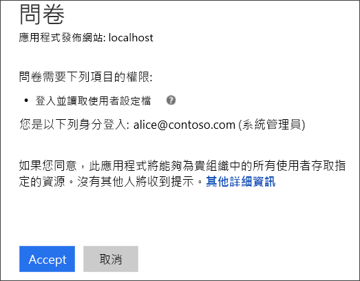
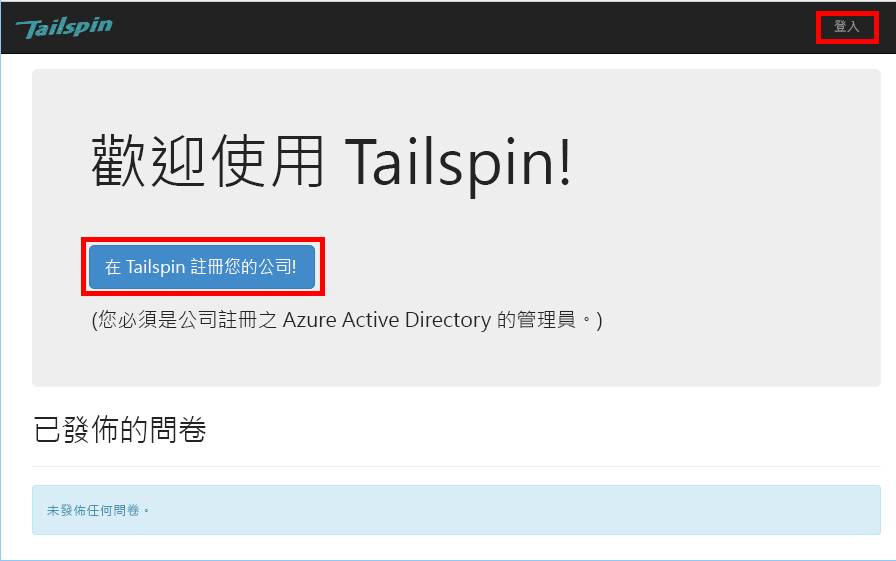

# <a name="tenant-sign-up-and-onboarding"></a>租用戶註冊和上線

[ 程式碼範例][sample application]

此文章說明如何在多租用戶應用程式中實作「註冊」程序，允許客戶註冊其組織以使用您的應用程式。
實作註冊程序的原因有幾個：

* 讓 AD 系統管理員能夠同意客戶的整個組織使用應用程式。
* 收取信用卡付款或收集其他客戶資訊。
* 執行您的應用程式所需的任何一次性個別租用戶設定。

## <a name="admin-consent-and-azure-ad-permissions"></a>系統管理員同意與 Azure AD 權限

為了向 Azure AD 驗證，應用程式需要存取使用者的目錄。 應用程式至少需有讀取使用者設定檔的權限。 使用者第一次登入時，Azure AD 會顯示列出所要求之權限的同意頁面。 按一下 [接受] ，使用者就會授與權限給應用程式。

依照預設，會以個別使用者為基礎來授與同意。 每個登入的使用者都會看到同意頁面。 但是，Azure AD 也支援「系統管理員同意」，可允許 AD 系統管理員代表整個組織來同意。

使用系統管理員同意流程時，同意頁面會說明 AD 系統管理員正代表整個租用戶授與權限：



在系統管理員按一下 [接受] 之後，同一租用戶內的其他使用者就都可以登入，且 Azure AD 將會略過同意畫面。

只有 AD 系統管理員可以提供系統管理員同意，因為他可以代表整個組織授與權限。 如果非系統管理員嘗試在系統管理員同意流程中驗證，Azure AD 會顯示錯誤：


如果應用程式之後需要其他權限，客戶將需要再次註冊並同意已更新的權限。

## <a name="implementing-tenant-sign-up"></a>實作租用戶註冊

對於 [Tailspin Surveys][Tailspin] 應用程式，我們定義了註冊程序的幾項需求：

* 租用戶必須先註冊，使用者才能登入。
* 註冊會使用系統管理員同意流程。
* 註冊會將使用者的租用戶新增至應用程式資料庫。
* 在租用戶註冊之後，應用程式會顯示上架頁面。

我們將在本節中詳細說明登入程序的實作步驟。
請務必瞭解「註冊」與「登入」乃是應用程式的概念。 在驗證流程期間，Azure AD 不會知道使用者是否正處於註冊程序中。 需由應用程式持續追蹤相關內容。

當匿名使用者造訪 Surveys 應用程式時，會向使用者顯示兩個按鈕，一個用來登入，另一個用來註冊您的公司 (註冊)。



這些按鈕會在 `AccountController` 類別中叫用動作。

`SignIn` 動作會傳回 **ChallegeResult**，這會使 OpenID Connect 中介軟體重新導向到驗證端點。 這是 ASP.NET Core 中觸發驗證的預設方式。

```csharp
[AllowAnonymous]
public IActionResult SignIn()
{
    return new ChallengeResult(
        OpenIdConnectDefaults.AuthenticationScheme,
        new AuthenticationProperties
        {
            IsPersistent = true,
            RedirectUri = Url.Action("SignInCallback", "Account")
        });
}
```

現在請比較 `SignUp` 動作：

```csharp
[AllowAnonymous]
public IActionResult SignUp()
{
    var state = new Dictionary<string, string> { { "signup", "true" }};
    return new ChallengeResult(
        OpenIdConnectDefaults.AuthenticationScheme,
        new AuthenticationProperties(state)
        {
            RedirectUri = Url.Action(nameof(SignUpCallback), "Account")
        });
}
```

和 `SignIn` 一樣，`SignUp` 動作也會傳回 `ChallengeResult`。 但是這次，我們在中 `AuthenticationProperties` in the `ChallengeResult`：

* 註冊：這是一個布林值旗標，指示使用者已經開始註冊程序。

`AuthenticationProperties` 中的狀態資訊會新增至 OpenID Connect [state] 參數，該參數會在驗證流程中來回傳遞。


在使用者於 Azure AD 驗證並被重新導向回應用程式之後，驗證票證就會包含狀態。 我們會使用此事實來確保 "signup" 值可在整個驗證流程中保留。

## <a name="adding-the-admin-consent-prompt"></a>新增系統管理員同意提示

在 Azure AD 中，是透過將 "prompt" 參數新增至驗證要求中的查詢字串來觸發系統管理員同意流程：

<!-- markdownlint-disable MD040 -->

```
/authorize?prompt=admin_consent&...
```

<!-- markdownlint-enable MD040 -->

Surveys 應用程式會在 `RedirectToAuthenticationEndpoint` 事件期間新增提示。 在中介軟體重新導向至驗證端點之前會呼叫此事件。

```csharp
public override Task RedirectToAuthenticationEndpoint(RedirectContext context)
{
    if (context.IsSigningUp())
    {
        context.ProtocolMessage.Prompt = "admin_consent";
    }

    _logger.RedirectToIdentityProvider();
    return Task.FromResult(0);
}
```

設定 `ProtocolMessage.Prompt` 可告知中介軟體將 "prompt" 參數新增至驗證要求。

請注意，只有在註冊期間才需要提示。 一般登入不應該包括提示。 為區分它們，我們會檢查驗證狀態中的 `signup` 值。 以下的擴充方法會檢查這個條件：

```csharp
internal static bool IsSigningUp(this BaseControlContext context)
{
    Guard.ArgumentNotNull(context, nameof(context));

    string signupValue;
    // Check the HTTP context and convert to string
    if ((context.Ticket == null) ||
        (!context.Ticket.Properties.Items.TryGetValue("signup", out signupValue)))
    {
        return false;
    }

    // We have found the value, so see if it's valid
    bool isSigningUp;
    if (!bool.TryParse(signupValue, out isSigningUp))
    {
        // The value for signup is not a valid boolean, throw

        throw new InvalidOperationException($"'{signupValue}' is an invalid boolean value");
    }

    return isSigningUp;
}
```

## <a name="registering-a-tenant"></a>註冊租用戶

Surveys 應用程式會將每個租用戶與使用者的一些相關資訊儲存在應用程式資料庫中。


在租用戶資料表中，IssuerValue 為簽發者為租用戶宣告的值。 對於 Azure AD 而言，這是 `https://sts.windows.net/<tentantID>` 並為每個租用戶提供唯一的值。

當新的租用戶註冊時，Surveys 應用程式就會將租用戶記錄寫入資料庫。 這是在 `AuthenticationValidated` 事件內部發生。 (請勿在此事件發生之前這樣做，因為識別碼權杖當時將尚未生效，所以您無法信任宣告值。 請參閱 [驗證]。

以下是來自 Surveys 應用程式的相關程式碼：

```csharp
public override async Task TokenValidated(TokenValidatedContext context)
{
    var principal = context.AuthenticationTicket.Principal;
    var userId = principal.GetObjectIdentifierValue();
    var tenantManager = context.HttpContext.RequestServices.GetService<TenantManager>();
    var userManager = context.HttpContext.RequestServices.GetService<UserManager>();
    var issuerValue = principal.GetIssuerValue();
    _logger.AuthenticationValidated(userId, issuerValue);

    // Normalize the claims first.
    NormalizeClaims(principal);
    var tenant = await tenantManager.FindByIssuerValueAsync(issuerValue)
        .ConfigureAwait(false);

    if (context.IsSigningUp())
    {
        if (tenant == null)
        {
            tenant = await SignUpTenantAsync(context, tenantManager)
                .ConfigureAwait(false);
        }

        // In this case, we need to go ahead and set up the user signing us up.
        await CreateOrUpdateUserAsync(context.Ticket, userManager, tenant)
            .ConfigureAwait(false);
    }
    else
    {
        if (tenant == null)
        {
            _logger.UnregisteredUserSignInAttempted(userId, issuerValue);
            throw new SecurityTokenValidationException($"Tenant {issuerValue} is not registered");
        }

        await CreateOrUpdateUserAsync(context.Ticket, userManager, tenant)
            .ConfigureAwait(false);
    }
}
```

此程式碼會執行以下動作：

1. 檢查資料庫中是否已經有租用戶的簽發者值。 如果租用戶尚未註冊， `FindByIssuerValueAsync` 會傳回 null。
2. 如果使用者正在註冊：
   1. 將租用戶新增至資料庫 (`SignUpTenantAsync`)。
   2. 將已驗證的使用者新增至資料庫 (`CreateOrUpdateUserAsync`)。
3. 或者完成正常的登入流程：
   1. 如果資料庫中找不到租用戶的簽發者，這表示租用戶並未註冊，因此客戶需要註冊。 在該情況下，會擲回例外狀況來導致驗證失敗。
   2. 或者，如果還沒有使用者的話，就為此使用者建立資料庫記錄 (`CreateOrUpdateUserAsync`)。

以下是將租用戶新增至資料庫的 `SignUpTenantAsync` 方法。

```csharp
private async Task<Tenant> SignUpTenantAsync(BaseControlContext context, TenantManager tenantManager)
{
    Guard.ArgumentNotNull(context, nameof(context));
    Guard.ArgumentNotNull(tenantManager, nameof(tenantManager));

    var principal = context.Ticket.Principal;
    var issuerValue = principal.GetIssuerValue();
    var tenant = new Tenant
    {
        IssuerValue = issuerValue,
        Created = DateTimeOffset.UtcNow
    };

    try
    {
        await tenantManager.CreateAsync(tenant)
            .ConfigureAwait(false);
    }
    catch(Exception ex)
    {
        _logger.SignUpTenantFailed(principal.GetObjectIdentifierValue(), issuerValue, ex);
        throw;
    }

    return tenant;
}
```

以下是 Surveys 應用程式中整個註冊流程的摘要：

1. 使用者按一下 [註冊]  按鈕。
2. `AccountController.SignUp` 動作傳回查問結果。  驗證狀態包括 "signup" 值。
3. 在 `RedirectToAuthenticationEndpoint` 事件中，加入 `admin_consent` 提示。
4. OpenID Connect 中介軟體會重新導向到 Azure AD 與使用者驗證。
5. 在 `AuthenticationValidated` 事件中，尋找 "signup" 狀態。
6. 將租用戶新增至資料庫。

[**下一主題**][app roles]

<!-- links -->

[app roles]: app-roles.md
[Tailspin]: tailspin.md

[state]: https://openid.net/specs/openid-connect-core-1_0.html#AuthRequest
[驗證]: authenticate.md
[sample application]: https://github.com/mspnp/multitenant-saas-guidance
