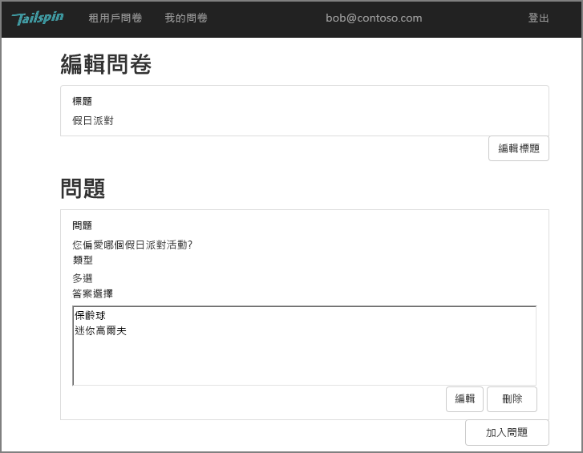
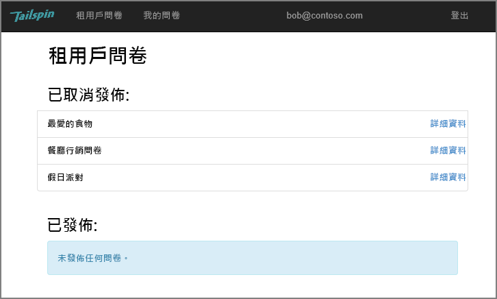
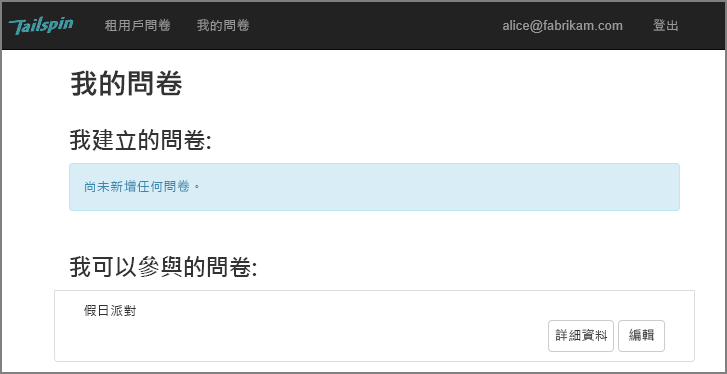
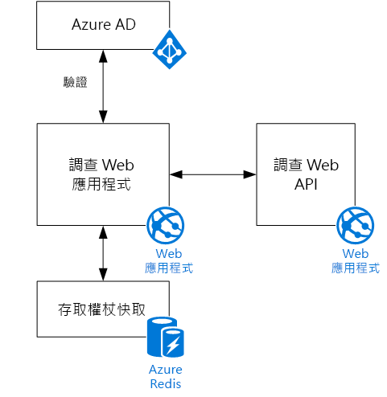

# Tailspin 情節The Tailspin scenario

[ 範例程式碼][sample application][ Sample code][sample application]

Tailspin 是虛構的公司，他們正在開發名為 Surveys 的 SaaS 應用程式。Tailspin is a fictitious company that is developing a SaaS application named Surveys. 此應用程式可讓組織建立並發佈線上問卷。This application enables organizations to create and publish online surveys.

* 組織可以註冊該應用程式。An organization can sign up for the application.
* 組織註冊之後，使用者可以使用他們組織的認證登入應用程式。After the organization is signed up, users can sign into the application with their organizational credentials.
* 使用者可以建立、編輯和發佈問卷。Users can create, edit, and publish surveys.

> [!NOTE]
> 若要開始使用應用程式，請參閱[執行調查應用程式]。To get started with the application, see [Run the Surveys application].
> 
> 

## 使用者可以建立、編輯和檢視問卷Users can create, edit, and view surveys
驗證的使用者可以檢視他或她所建立或具有參與者權限的所有調查，以及建立新的調查。An authenticated user can view all the surveys that he or she has created or has contributor rights to, and create new surveys. 請注意，該使用者是使用他的組織身分識別 `bob@contoso.com`登入。Notice that the user is signed in with his organizational identity, `bob@contoso.com`.

此螢幕擷取畫面顯示 [Edit Survey] (編輯問卷) 頁面：This screenshot shows the Edit Survey page:

使用者也可以檢視相同租用戶中的其他使用者所建立的問卷。Users can also view any surveys created by other users within the same tenant.

## 調查擁有者可以邀請參與者Survey owners can invite contributors
當使用者建立問卷時，他或她可以邀請其他人參與該問卷。When a user creates a survey, he or she can invite other people to be contributors on the survey. 參與者可以編輯問卷，但不能刪除或發佈問卷。Contributors can edit the survey, but cannot delete or publish it.  

使用者可以從其他租用戶加入參與者，因此能夠跨租用戶共用資源。A user can add contributors from other tenants, which enables cross-tenant sharing of resources. 在此螢幕擷取畫面中，Bob (`bob@contoso.com`) 正在將 Alice (`alice@fabrikam.com`) 新增為 Bob 所建立的問卷調查的參與者。In this screenshot, Bob (`bob@contoso.com`) is adding Alice (`alice@fabrikam.com`) as a contributor to a survey that Bob created.

當 Alice 登入時，她會看見該問卷列在 [Surveys I can contribute to] (我可以參與的問卷) 之下。When Alice logs in, she sees the survey listed under "Surveys I can contribute to".

請留意，Alice 是用自己的租用戶登入，而不是以 Contoso 租用戶之來賓的身分登入。Note that Alice signs into her own tenant, not as a guest of the Contoso tenant. Alice 只針對該調查擁有參與者權限 &mdash; 她無法檢視來自 Contoso 租用戶的其他問卷。Alice has contributor permissions only for that survey &mdash; she cannot view other surveys from the Contoso tenant.

## 架構Architecture
Surveys 應用程式由 Web 前端和 Web API 後端組成。The Surveys application consists of a web front end and a web API backend. 兩者都使用 [ASP.NET Core] 實作。Both are implemented using [ASP.NET Core].

該 Web 應用程式使用 Azure Active Directory (Azure AD) 來驗證使用者。The web application uses Azure Active Directory (Azure AD) to authenticate users. 該 Web 應用程式也會呼叫 Azure AD 來取得 Web API 的 OAuth 2 存取權杖。The web application also calls Azure AD to get OAuth 2 access tokens for the Web API. 取存取權杖快取在 Azure Redis Cache 中。Access tokens are cached in Azure Redis Cache. 快取可讓多個執行個體共用相同的權杖快取 (例如，在伺服器陣列中)。The cache enables multiple instances to share the same token cache (e.g., in a server farm).

[**下一步**][authentication][**Next**][authentication]

<!-- Links -->

[authentication]: authenticate.md

[執行調查應用程式]: ./run-the-app.md
[Run the Surveys application]: ./run-the-app.md
[ASP.NET Core]: /aspnet/core
[sample application]: https://github.com/mspnp/multitenant-saas-guidance
