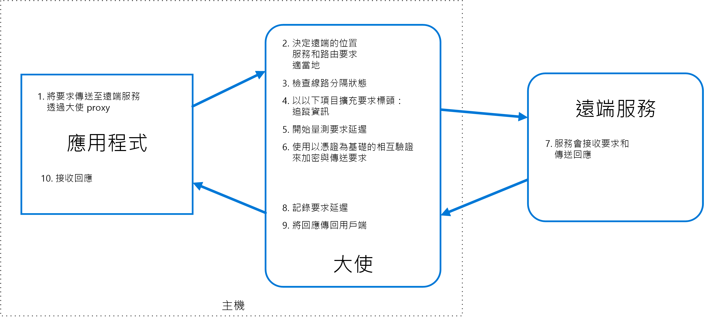

# 大使模式Ambassador pattern

建立會代表取用者服務或應用程式傳送網路要求的協助程式服務。Create helper services that send network requests on behalf of a consumer service or application. 大使服務可以視為是與用戶端位於相同位置的處理序外 proxy。An ambassador service can be thought of as an out-of-process proxy that is co-located with the client.

此模式非常適合用於以與語言無關的方式卸載常見的用戶端連線工作，例如監視、記錄、路由、安全性 (如 TLS)、和[復原模式][resiliency-patterns]。This pattern can be useful for offloading common client connectivity tasks such as monitoring, logging, routing, security (such as TLS), and [resiliency patterns][resiliency-patterns] in a language agnostic way. 它通常會用於舊版的應用程式或其他難以修改應用程式，以擴充其網路功能。It is often used with legacy applications, or other applications that are difficult to modify, in order to extend their networking capabilities. 它也可以讓專門的小組來實作這些功能。It can also enable a specialized team to implement those features.

## 內容和問題Context and problem

具有復原功能的雲端型應用程式需要許多功能，像是[斷路][circuit-breaker]、路由、計量、監視，以及進行網路相關的設定更新能力。Resilient cloud-based applications require features such as [circuit breaking][circuit-breaker], routing, metering and monitoring, and the ability to make network-related configuration updates. 舊版應用程式或現有的程式碼程式庫可能會難以或無法更新加入這些功能，因為程式碼已不再維護或無法由開發小組輕易修改。It may be difficult or impossible to update legacy applications or existing code libraries to add these features, because the code is no longer maintained or can't be easily modified by the development team.

網路呼叫也可能需要連線、驗證、授權方面的大幅度設定。Network calls may also require substantial configuration for connection, authentication, and authorization. 如果這些呼叫由多個應用程式使用，且是以多個語言和架構建立，則必須為牽涉到的每一個執行個體設定呼叫。If these calls are used across multiple applications, built using multiple languages and frameworks, the calls must be configured for each of these instances. 此外，您組織內的中心小組可能需要管理網路和安全性功能。In addition, network and security functionality may need to be managed by a central team within your organization. 由於有大量的程式碼，讓小組人員更新他們不熟悉的應用程式程式碼風險很大。With a large code base, it can be risky for that team to update application code they aren't familiar with.

## 方案Solution

將用戶端架構和程式庫放入外部處理序，外部處理序此作為應用程式和外部服務之間的 proxy。Put client frameworks and libraries into an external process that acts as a proxy between your application and external services. 將 proxy 部署在與您的應用程式相同的主機環境上，以便控制路由、復原、安全性的功能，以及避免任何與主機相關的存取限制。Deploy the proxy on the same host environment as your application to allow control over routing, resiliency, security features, and to avoid any host-related access restrictions. 您也可以使用大使模式來將檢測設備標準化及擴充。You can also use the ambassador pattern to standardize and extend instrumentation. proxy 可以監視效能計量，例如延遲、資源使用狀況，而且監視發生在與應用程式相同的主機環境中。The proxy can monitor performance metrics such as latency or resource usage, and this monitoring happens in the same host environment as the application.

卸載至大使的功能可以和應用程式分開獨立管理。Features that are offloaded to the ambassador can be managed independently of the application. 您可以更新並修改大使，而不會干擾應用程式的舊有功能。You can update and modify the ambassador without disturbing the application's legacy functionality. 它也可讓不同的專門小組實作和維護已移至大使的安全性、網路或驗證功能。It also allows for separate, specialized teams to implement and maintain security, networking, or authentication features that have been moved to the ambassador.

可將大使服務部署為[側車][sidecar]，伴隨著取用的應用程式或服務的生命週期。Ambassador services can be deployed as a [sidecar][sidecar] to accompany the lifecycle of a consuming application or service. 或者，如果大使由共同主機上的多個個別處理序共用，可將它部署為精靈或 Windows 服務。Alternatively, if an ambassador is shared by multiple separate processes on a common host, it can be deployed as a daemon or Windows service. 如果取用的服務已容器化，應該將大使建立為相同主機上的不同容器，並針對通訊設定適當的連結。If the consuming service is containerized, the ambassador should be created as a separate container on the same host, with the appropriate links configured for communication.

## 問題和考量Issues and considerations

- proxy 會增加一些延遲負擔。The proxy adds some latency overhead. 考慮用戶端程式庫 (直接由應用程式叫用) 是否為更好的做法。Consider whether a client library, invoked directly by the application, is a better approach.
- 考慮在 proxy 中加入一般化功能可能造成的影響。Consider the possible impact of including generalized features in the proxy. 例如，大使可以處理重試，但除非所有作業都是等冪，不然可能不安全。For example, the ambassador could handle retries, but that might not be safe unless all operations are idempotent.
- 考慮這個機制：允許用戶端傳遞一些內容到 proxy，也允許 proxy 傳給用戶端。Consider a mechanism to allow the client to pass some context to the proxy, as well as back to the client. 例如，加入 HTTP 要求標頭來退出重試，或指定重試的次數上限。For example, include HTTP request headers to opt out of retry or specify the maximum number of times to retry.
- 考慮您將如何封裝和部署 proxy。Consider how you will package and deploy the proxy.
- 考慮是否要使用單一共用執行個體讓所有用戶端共用，或是一個用戶端一個執行個體。Consider whether to use a single shared instance for all clients or an instance for each client.

## 使用此模式的時機When to use this pattern

使用此模式的時機包括：Use this pattern when you:

- 需要建立一組常用的多語言或架構的用戶端連線功能。Need to build a common set of client connectivity features for multiple languages or frameworks.
- 需要將跨領域用戶端連線的重要項目卸載至基礎結構開發人員或其他更專業的小組。Need to offload cross-cutting client connectivity concerns to infrastructure developers or other more specialized teams.
- 需要在舊版應用程式或難以修改的應用程式中支援雲端或叢集的連線需求。Need to support cloud or cluster connectivity requirements in a legacy application or an application that is difficult to modify.

此模式可能不適合用於︰This pattern may not be suitable:

- 當網路要求延遲很重要。When network request latency is critical. 雖然很小，但 proxy 會帶來一些額外負荷，而在某些情況下，這可能會影響應用程式。A proxy will introduce some overhead, although minimal, and in some cases this may affect the application.
- 當用戶端連線功能是由單一語言耗用。When client connectivity features are consumed by a single language. 在此情況下，較好的選擇可能是以套件形式散發到開發小組的用戶端程式庫。In that case, a better option might be a client library that is distributed to the development teams as a package.
- 當連線功能無法一般化，且需要與用戶端應用程式更深入的整合。When connectivity features cannot be generalized and require deeper integration with the client application.

## 範例Example

下圖顯示應用程式透過大使 proxy 向遠端服務提出要求。The following diagram shows an application making a request to a remote service via an ambassador proxy. 大使提供路由、斷路、記錄。The ambassador provides routing, circuit breaking, and logging. 它會呼叫遠端服務，然後將回應傳回用戶端應用程式：It calls the remote service and then returns the response to the client application:

 

## 相關的指引Related guidance

- [側車模式Sidecar pattern](./sidecar.md)

<!-- links -->

[circuit-breaker]: ./circuit-breaker.md
[resiliency-patterns]: ./category/resiliency.md
[sidecar]: ./sidecar.md
