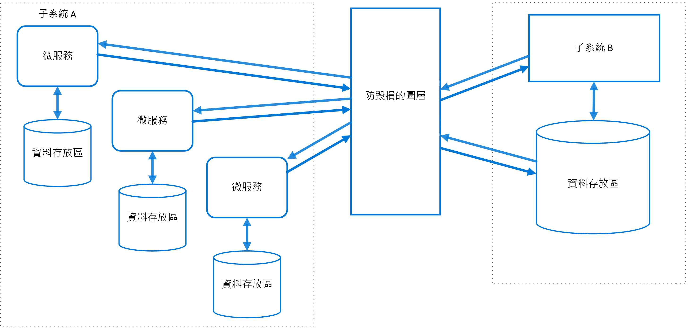

# 防損毀層模式Anti-Corruption Layer pattern

在不共用相同語意的不同子系統間實作外觀或配接層。Implement a façade or adapter layer between different subsystems that don't share the same semantics. 此層會轉譯一個子系統對其他子系統所提出的要求。This layer translates requests that one subsystem makes to the other subsystem. 您可以使用此模式來確保應用程式的設計不會受限於外部子系統上的相依性。Use this pattern to ensure that an application's design is not limited by dependencies on outside subsystems. 此模式最早的相關描述，是在 Eric Evans 所著的《Domain-Driven Design (網域導向的設計)》一書中出現。This pattern was first described by Eric Evans in *Domain-Driven Design*.

## 內容和問題Context and problem

大部分的應用程式依賴其他系統提供某些資料或功能。Most applications rely on other systems for some data or functionality. 例如，將舊版應用程式移轉至現代系統時，仍可能需要現有的舊版資源。For example, when a legacy application is migrated to a modern system, it may still need existing legacy resources. 新功能必須能夠呼叫舊版系統。New features must be able to call the legacy system. 對於較大型應用程式的不同功能會隨著時間移動到現代系統的漸進式移轉尤其是如此。This is especially true of gradual migrations, where different features of a larger application are moved to a modern system over time.

通常這些舊版系統會為品質問題所苦，例如迂迴的資料結構描述或過時的 API。Often these legacy systems suffer from quality issues such as convoluted data schemas or obsolete APIs. 舊版系統中所使用的功能和技術可能與更現代系統大不相同。The features and technologies used in legacy systems can vary widely from more modern systems. 為了與舊版系統交互操作，新應用程式可能需要支援過時的基礎結構、通訊協定、資料模型、API 或是您不會放入現代應用程式的其他功能。To interoperate with the legacy system, the new application may need to support outdated infrastructure, protocols, data models, APIs, or other features that you wouldn't otherwise put into a modern application.

維護新版與舊版系統之間的存取權可以強制新系統遵守至少一些舊版系統的 API 或其他語意。Maintaining access between new and legacy systems can force the new system to adhere to at least some of the legacy system's APIs or other semantics. 當這些舊版功能有品質問題時，支援它們發生「損毀」，否則可能需要全新設計的現代化應用程式。When these legacy features have quality issues, supporting them "corrupts" what might otherwise be a cleanly designed modern application. 

不受您的開發小組控制的任何外部系統 (不只舊有系統) 都可能發生類似問題。Similar issues can arise with any external system that your development team doesn't control, not just legacy systems. 

## 解決方法Solution

藉由在它們之間放置防損毀層來隔離不同的子系統。Isolate the different subsystems by placing an anti-corruption layer between them. 此層會轉譯兩個系統之間的通訊，讓一個系統維持不變，而另一個系統可以避免損害其設計和技術方法。This layer translates communications between the two systems, allowing one system to remain unchanged while the other can avoid compromising its design and technological approach.

 

上圖顯示具有兩個子系統的應用程式。The diagram above shows an application with two subsystems. 子系統 A 會透過防損毀層呼叫子系統 B。Subsystem A calls to subsystem B through an anti-corruption layer. 子系統 A 與防損毀層之間的通訊一律使用子系統 B 的資料模型和架構。由反損毀層對子系統 A 的呼叫會符合該子系統的資料模型或方法。Communication between subsystem A and the anti-corruption layer always uses the data model and architecture of subsystem A. Calls from the anti-corruption layer to subsystem B conform to that subsystem's data model or methods. 防損毀層包含在兩個系統之間進行轉譯所需的所有邏輯。The anti-corruption layer contains all of the logic necessary to translate between the two systems. 可以將層實作為應用程式內的元件或獨立的服務。The layer can be implemented as a component within the application or as an independent service.

## 問題和考量Issues and considerations

- 防損毀層可以對兩個系統之間的呼叫新增延遲。The anti-corruption layer may add latency to calls made between the two systems.
- 防損毀層會新增必須管理和維護的一項額外服務。The anti-corruption layer adds an additional service that must be managed and maintained.
- 考慮您的防損毀層如何將如何調整。Consider how your anti-corruption layer will scale.
- 考慮您是否需要多個防損毀層。Consider whether you need more than one anti-corruption layer. 您可能想要將功能分解成使用不同的技術或語言的多個服務，或分割防損毀層可能有其他原因。You may want to decompose functionality into multiple services using different technologies or languages, or there may be other reasons to partition the anti-corruption layer.
- 考慮關於您的其他應用程式或服務，防損毀層的管理方式。Consider how the anti-corruption layer will be managed in relation with your other applications or services. 如何將它整合到您的監視、發行和設定程序？How will it be integrated into your monitoring, release, and configuration processes?
- 確定會保有交易和資料的一致性，並且可加以監視。Make sure transaction and data consistency are maintained and can be monitored.
- 考慮防損毀層是否需要處理不同子系統之間的通訊，或只需處理功能子集。Consider whether the anti-corruption layer needs to handle all communication between different subsystems, or just a subset of features. 
- 如果防損毀層是應用程式移轉策略的一部分，請考慮它會是永久的，或是會在移轉所有舊版功能之後遭到淘汰。If the anti-corruption layer is part of an application migration strategy, consider whether it will be permanent, or will be retired after all legacy functionality has been migrated.

## 使用此模式的時機When to use this pattern

使用此模式的時機包括：Use this pattern when:

- 移轉規劃分多個階段進行，但需要保有新版與舊版系統之間的整合。A migration is planned to happen over multiple stages, but integration between new and legacy systems needs to be maintained.
- 兩個以上的子系統有不同的語意，但仍然需要進行通訊。Two or more subsystems have different semantics, but still need to communicate. 

如果有新版與舊版系統之間沒有顯著的語意差異，此模式可能不適用。This pattern may not be suitable if there are no significant semantic differences between new and legacy systems. 

## 相關的指引Related guidance

- [扼制模式Strangler pattern](./strangler.md)
