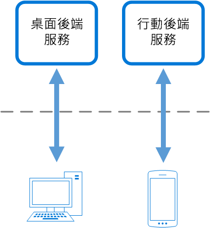

# 前端模式的後端Backends for Frontends pattern

建立由特定前端應用程式或介面取用的個別後端服務。Create separate backend services to be consumed by specific frontend applications or interfaces. 想要避免為多個介面自訂單一後端時，此模式相當有用。This pattern is useful when you want to avoid customizing a single backend for multiple interfaces. 此模式最早是由 Sam Newman 所提及。This pattern was first described by Sam Newman.

## 內容和問題Context and problem

應用程式一開始的目標可能是桌面 Web UI。An application may initially be targeted at a desktop web UI. 一般而言，後端服務會平行開發，提供該 UI 所需的功能。Typically, a backend service is developed in parallel that provides the features needed for that UI. 隨著應用程式的使用者數量成長，即會開發必須與相同後端互動的行動應用程式。As the application's user base grows, a mobile application is developed that must interact with the same backend. 後端服務會變成一般用途的後端，同時為桌面和行動裝置介面的需求提供服務。The backend service becomes a general-purpose backend, serving the requirements of both the desktop and mobile interfaces.

但行動裝置的功能與明顯桌面瀏覽器不同，就螢幕大小、效能與顯示限制而言。But the capabilities of a mobile device differ significantly from a desktop browser, in terms of screen size, performance, and display limitations. 因此，行動應用程式後端的需求與桌面 Web UI 的需求不同。As a result, the requirements for a mobile application backend differ from the desktop web UI. 

這些差異導致後端的競爭需求。These differences result in competing requirements for the backend. 後端需要進行定期重大變更，才能同時對桌面 Web UI 和行動應用程式提供服務。The backend requires regular and significant changes to serve both the desktop web UI and the mobile application. 通常，個別介面小組會在每個前端上運作，導致後端變成開發程序中的瓶頸。Often, separate interface teams work on each frontend, causing the backend to become a bottleneck in the development process. 衝突的更新需求以及需要讓服務保持對這兩個前端運作，會導致花費大量精力於單一可部署資源上。Conflicting update requirements, and the need to keep the service working for both frontends, can result in spending a lot of effort on a single deployable resource.

 

因為開發活動的重點在於後端服務，可能會建立個別小組來管理和維護後端。As the development activity focuses on the backend service, a separate team may be created to manage and maintain the backend. 最後，這會導致介面和後端開發小組之間無法連繫，在後端小組上增加負擔，以平衡不同 UI 小組之間的競爭需求。Ultimately, this results in a disconnect between the interface and backend development teams, placing a burden on the backend team to balance the competing requirements of the different UI teams. 當一個介面小組需要對後端進行變更時，必須先向其他介面小組驗證這些變更，之後才能將變更整合到後端。When one interface team requires changes to the backend, those changes must be validated with other interface teams before they can be integrated into the backend. 

## 解決方法Solution

每個使用者介面建立一個後端。Create one backend per user interface. 微調每個後端的行為與效能，以最符合前端環境的需求，而不需擔心影響其他前端的體驗。Fine tune the behavior and performance of each backend to best match the needs of the frontend environment, without worrying about affecting other frontend experiences.

 

因為每個後端相對於一個特定介面，可以為該介面最佳化。Because each backend is specific to one interface, it can be optimized for that interface. 如此一來，它會較小、較簡單且可能快於嘗試滿足所有介面需求的一般後端。As a result, it will be smaller, less complex, and likely faster than a generic backend that tries to satisfy the requirements for all interfaces. 每個介面小組有控制自己後端的自主權，並且不依賴於集中式後端開發小組。Each interface team has autonomy to control their own backend and doesn't rely on a centralized backend development team. 這讓介面小組對於後端的語言選擇、發佈日程、工作負載的優先順序以及功能整合有彈性。This gives the interface team flexibility in language selection, release cadence, prioritization of workload, and feature integration in their backend.

如需詳細資訊，請參閱[模式：前端的後端](http://samnewman.io/patterns/architectural/bff/)。For more information, see [Pattern: Backends For Frontends](http://samnewman.io/patterns/architectural/bff/).

## 問題和考量Issues and considerations

- 考慮要部署的後端數量。Consider how many backends to deploy.
- 如果不同的介面 (例如行動用戶端) 將進行相同的要求，請考慮是否需要為每個介面實作後端，或單一後端即已足夠。If different interfaces (such as mobile clients) will make the same requests, consider whether it is necessary to implement a backend for each interface, or if a single backend will suffice.
- 實作此模式時，服務間的程式碼很有高的可能性會重複。Code duplication across services is highly likely when implementing this pattern.
- 以前端為焦點的後端服務應該只包含用戶端的特定邏輯和行為。Frontend-focused backend services should only contain client-specific logic and behavior. 應該在您的應用程式中任意處管理一般商務邏輯和其他通用功能。General business logic and other global features should be managed elsewhere in your application.
- 請思考此模式如何反映在開發小組的責任中。Think about how this pattern might be reflected in the responsibilities of a development team.
- 考慮實作此模式需要的時間。Consider how long it will take to implement this pattern. 在您繼續支援現有的一般後端的同時，建立新後端的投入時間是否會衍生技術債務？Will the effort of building the new backends incur technical debt, while you continue to support the existing generic backend?

## 使用此模式的時機When to use this pattern

使用此模式的時機包括：Use this pattern when:

- 共用或一般用途的後端服務必須以大量的開發負荷加以維護。A shared or general purpose backend service must be maintained with significant development overhead.
- 您想要針對特定用戶端介面的需求將後端最佳化。You want to optimize the backend for the requirements of specific client interfaces.
- 自訂作業會對一般用途的後端進行，以容納多個介面。Customizations are made to a general-purpose backend to accommodate multiple interfaces.
- 替代語言更適合用於不同的使用者介面的後端。An alternative language is better suited for the backend of a different user interface.

此模式可能不適合下列時機：This pattern may not be suitable:

- 當介面對後端進行相同或類似的要求時。When interfaces make the same or similar requests to the backend.
- 只有一個介面用來與後端互動時。When only one interface is used to interact with the backend.

## 相關的指引Related guidance

- [閘道彙總模式Gateway Aggregation pattern](./gateway-aggregation.md)
- [閘道卸載模式Gateway Offloading pattern](./gateway-offloading.md)
- [閘道路由模式Gateway Routing pattern](./gateway-routing.md)

