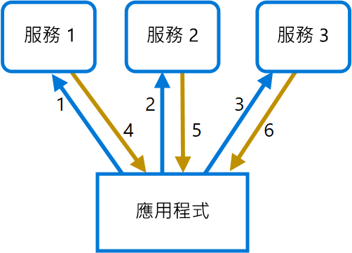

# <a name="gateway-aggregation-pattern"></a>閘道彙總模式

您可以使用閘道來將多個個別的要求彙總成單一要求。 當用戶端必須對不同的後端系統進行多個呼叫以執行作業時，此模式相當有用。

## <a name="context-and-problem"></a>內容和問題

若要執行單一工作，用戶端可能需要向各種後端服務進行多次呼叫。 依賴許多服務執行工作的應用程式，必然會耗費資源於每個要求。 當應用程式加入任何新功能或服務時，便需要額外的要求，也因此進一步增加了資源需求和網路呼叫。 用戶端與後端之間的對話，會對應用程式的效能和等級造成負面影響。  微服務架構使得這個問題更常見，因為應用程式建置於許多小型服務之上，自然會有更多數量的跨服務呼叫。 

在下列圖表中，用戶端將要求傳送至每個服務 (1、2、3)。 每個服務會處理要求，並傳送回應給應用程式 (4、5、6)。 在通常具有高延遲的行動電話通訊網路上，以這種方式使用個別要求是缺乏效率的，並可能會導致連線中斷或未完成的要求。 雖然可能會平行執行每個要求，但是應用程式必須在個別的連線上傳送、等待和處理每個要求的資料，因而提高了失敗的機率。

 

## <a name="solution"></a>方案

使用閘道可減少用戶端與服務之間的對話。 閘道收到用戶端要求之後，將要求分派至不同的後端系統，然後將結果彙總後再傳送回要求的用戶端。

此模式可減少應用程式對後端服務的要求數目，並改善透過高延遲網路的應用程式效能。

在下列圖表中，應用程式傳送要求至閘道 (1)。 此要求包含一組額外的要求。 閘道會分解這些要求，並將之傳送至相關服務以處理個別要求 (2)。 每個服務會傳回一個回應給閘道 (3)。 閘道會合併來自每個服務的回應，並傳送回應給應用程式 (4)。 應用程式進行單一要求，並只會收到來自閘道的單一回應。


## <a name="issues-and-considerations"></a>問題和考量

- 閘道不應引入跨後端服務的服務結合。
- 閘道應位於後端服務附近，以儘可能降低延遲。
- 閘道服務可能會導致單一失敗點。 請確定已適當地設計閘道，以符合您的應用程式可用性需求。
- 閘道可能會造成瓶頸。 請確定閘道有足夠的效能可處理負載，而且可以調整規模以符合您預期的成長。
- 對閘道執行負載測試，以確保不會導致一連串的服務失敗。
- 實作具有彈性的設計，使用如[艙壁模式][bulkhead]、[斷路][circuit-breaker]、[重試][retry]及「逾時」等技術。
- 如果一或多個服務呼叫時間過長，則可以接受逾時並傳回部分的資料。 請考慮您的應用程式將如何處理此案例。
- 使用非同步 I/O，以確保後端的延遲不會造成應用程式的效能問題。
- 使用相互關聯識別碼來實作分散式追蹤，以追蹤每個個別呼叫。
- 監視要求計量和回應大小。
- 請考慮傳回快取資料作為處理失敗時的容錯移轉策略。
- 請考慮將彙總服務置於閘道後方，而不是建置於閘道中。 要求彙總可能會有不同於閘道中其他服務的資源需求，並可能影響閘道的路由和卸載功能。

## <a name="when-to-use-this-pattern"></a>使用此模式的時機

使用此模式的時機包括：

- 用戶端必須與多個後端服務通訊以執行作業。
- 用戶端可能使用具有明顯延遲的網路，例如行動電話通訊網路。

此模式可能不適合下列時機︰

- 您想要減少多個作業中用戶端與單一服務之間的呼叫數。 在該案例中，可能比較適合將批次作業加入服務。
- 用戶端或應用程式位於後端服務附近，且延遲不是重要因素。

## <a name="example"></a>範例

下列範例說明如何使用 Lua 建立簡單的閘道彙總 NGINX 服務。

```lua
worker_processes  4;

events {
  worker_connections 1024;
}

http {
  server {
    listen 80;

    location = /batch {
      content_by_lua '
        ngx.req.read_body()

        -- read json body content
        local cjson = require "cjson"
        local batch = cjson.decode(ngx.req.get_body_data())["batch"]

        -- create capture_multi table
        local requests = {}
        for i, item in ipairs(batch) do
          table.insert(requests, {item.relative_url, { method = ngx.HTTP_GET}})
        end

        -- execute batch requests in parallel
        local results = {}
        local resps = { ngx.location.capture_multi(requests) }
        for i, res in ipairs(resps) do
          table.insert(results, {status = res.status, body = cjson.decode(res.body), header = res.header})
        end

        ngx.say(cjson.encode({results = results}))
      ';
    }

    location = /service1 {
      default_type application/json;
      echo '{"attr1":"val1"}';
    }

    location = /service2 {
      default_type application/json;
      echo '{"attr2":"val2"}';
    }
  }
}
```

## <a name="related-guidance"></a>相關的指引

- [針對前端的後端模式](./backends-for-frontends.md)
- [閘道卸載模式](./gateway-offloading.md)
- [閘道路由模式](./gateway-routing.md)

[bulkhead]: ./bulkhead.md
[circuit-breaker]: ./circuit-breaker.md
[retry]: ./retry.md