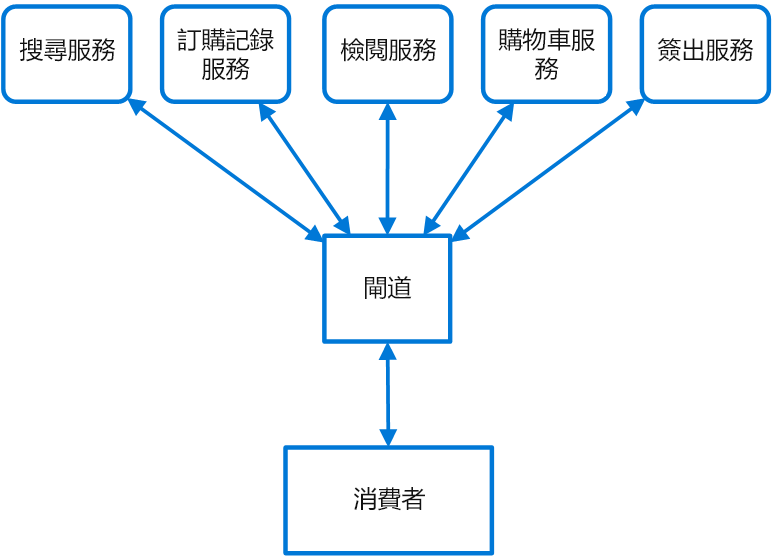

# <a name="gateway-routing-pattern"></a>閘道路由模式

使用單一端點將要求路由至多個服務。 當您想要在單一端點公開多個服務，並根據要求路由至適當的服務，此模式相當有用。

## <a name="context-and-problem"></a>內容和問題

當用戶端需要使用多個服務時，為每個服務端點設定個別的端點，以及讓用戶端管理每個端點會是一項挑戰。 例如，電子商務應用程式可能會提供服務，例如搜尋、評論、購物車、結帳和訂單記錄。 每個服務都有用戶端必須與其互動的不同 API，而用戶端必須了解每個端點，才能連接到服務。 如果 API 變更，則必須一併更新用戶端。 如果您將服務重構為兩個或多個個別的服務，則必須變更服務和用戶端中的程式碼。

## <a name="solution"></a>解決方法

將閘道放置在一組應用程式、服務或部署的前方。 使用應用程式第 7 層路由來將要求路由至適當的執行個體。

利用此模式，用戶端應用程式只需要知道單一端點並與其進行通訊。 如果服務已彙總或分解，則不一定需要更新用戶端。 它可以繼續對閘道進行要求，並且只有路由會變更。

閘道也可讓您從用戶端擷取後端服務，使得在閘道後的後端服務中啟用變更的同時，保持用戶端呼叫簡易。 您可以將用戶端呼叫路由至需要處理預期的用戶端行為的任何服務，讓您新增、分割和重新組織閘道後的服務，而不需要變更用戶端。



透過讓您管理將更新發佈給使用者的方式，此模式也有助於部署。 部署您的服務的新版本時，可以將它與現有版本平行部署。 路由可讓您控制將呈現給用戶端哪個版本的服務，讓您彈性地使用各種版本策略，無論是更新的累加、平行或完全首度推出。 在新服務部署後探索到的任何問題可以藉由在閘道上進行設定變更來快速還原，而不會影響用戶端。

## <a name="issues-and-considerations"></a>問題和考量

- 閘道服務可能會導致單一失敗點。 請確定已適當地設計，以符合您的可用性需求。 實作時考慮復原和容錯功能。
- 閘道服務可能會造成瓶頸。 請確定閘道具有足夠效能可處理負載，而且可以輕鬆配合您的成長預期進行調整。
- 對閘道執行負載測試，以確保不會導致一連串的服務失敗。
- 閘道路由是等級 7。 它可以基於 IP、連接埠、標頭或 URL。

## <a name="when-to-use-this-pattern"></a>使用此模式的時機

使用此模式的時機包括：

- 用戶端必須使用可在閘道後存取的多個服務。
- 您想要使用單一端點來簡化用戶端應用程式。
- 您需要將要求從外部可定址端點路由至內部虛擬端點，例如對叢集虛擬 IP 位址公開 VM 上的連接埠。

當您有只使用一或兩個服務的簡單應用程式時，此模式可能不適用。

## <a name="example"></a>範例

使用 Nginx 做為路由器，以下是伺服器的簡單設定檔範例，該伺服器會將位於不同虛擬目錄上應用程式的要求路由到後端不同電腦。

```console
server {
    listen 80;
    server_name domain.com;

    location /app1 {
        proxy_pass http://10.0.3.10:80;
    }

    location /app2 {
        proxy_pass http://10.0.3.20:80;
    }

    location /app3 {
        proxy_pass http://10.0.3.30:80;
    }
}
```

## <a name="related-guidance"></a>相關的指引

- [針對前端的後端模式](./backends-for-frontends.md)
- [閘道彙總模式](./gateway-aggregation.md)
- [閘道卸載模式](./gateway-offloading.md)
