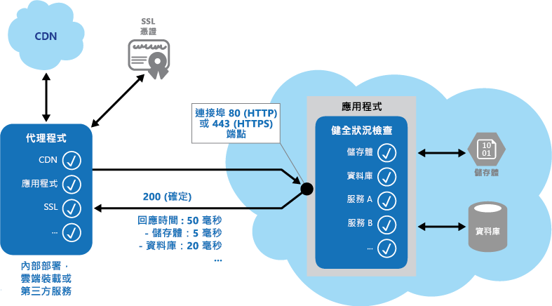

# <a name="health-endpoint-monitoring-pattern"></a>健康情況端點監視模式

[!INCLUDE [header](../_includes/header.md)]

實作應用程式中的功能檢查，而外部工具可透過公開的端點定期存取此應用程式。 這可協助確認應用程式和服務正確執行。

## <a name="context-and-problem"></a>內容和問題

監視 Web 應用程式和後端服務以確保它們可用且正確執行，是良好的做法，而且通常是商務需求。 不過，監視在雲端中執行的服務比監視內部部署服務還要困難。 例如，您沒有裝載環境的完整控制權，服務通常相依於平台廠商和其他人所提供的其他服務。

有許多因素會影響雲端裝載應用程式，例如網路延遲、基礎運算和儲存體裝置的效能和可用性，以及它們之間的網路頻寬。 服務會因為這些因素任何一項而部分或完全失敗。 因此，您必須定期確認服務正確執行，以確保可用性的必要層級，這可能是您的服務等級協定 (SLA) 的一部分。

## <a name="solution"></a>方案

藉由將要求傳送到應用程式上的端點，實作健康情況監視。 應用程式應執行所需的檢查，並傳回其狀態的表示。

健康情況監視檢查通常結合兩個因素：

- 應用程式或服務執行的檢查 (如果有的話)，以回應健康情況驗證端點的要求。
- 依據執行健康情況驗證檢查的工作或架構，分析結果。

回應碼表示應用程式的狀態，以及選擇性表示任何元件或其使用之服務的狀態。 延遲或回應時間檢查是由監視工具或架構執行。 此圖提供模式的概觀。



應用程式中健康情況監視程式碼可能會執行的其他檢查包括：
- 檢查雲端儲存體或資料庫的可用性和回應時間。
- 檢查其他資源或服務位於應用程式，或位於其他位置但是由應用程式使用。

服務和工具可以用來監視 Web 應用程式，方法是將要求提交至一組可設定的端點，並且根據一組可設定的規則來評估結果。 建立其唯一目的是要在系統上執行某些功能測試的服務端點相對容易。

可以由監視工具執行的典型檢查包括：

- 驗證回應碼。 例如，200 (良好) 的 HTTP 回應表示應用程式回應且沒有錯誤。 監視系統也可能會檢查其他回應碼，以提供更完整的結果。
- 檢查回應內容來偵測錯誤，即使已傳回 200 (良好) 狀態碼。 這樣可以偵測只會影響已傳回網頁或服務回應區段的錯誤。 例如，檢查分頁標題或尋找特定片語，這些項目會指出已傳回正確的分頁。
- 測量回應時間，這表示網路延遲與應用程式執行要求所花費之時間的組合。 遞增值表示應用程式或網路出現問題。
- 檢查位於應用程式外部的資源或服務，例如應用程式用來從全域快取傳遞內容的內容傳遞網路。
- 檢查 SSL 憑證是否到期。
- 測量 DNS 查閱應用程式 URL 的回應時間，以測量 DNS 延遲和 DNS 失敗。
- 驗證 DNS 查閱傳回的 URL，以確保正確的項目。 這樣可協助避免透過 DNS 伺服器上成功攻擊導致的惡意要求重新導向。

如果從不同的內部部署或裝載位置執行這些檢查，以測量和比較回應時間，也很有用。 在理想情況下，您應該從靠近客戶的位置監視應用程式，以從每個位置取得準確的效能檢視。 除了提供更強固的檢查機制，結果可以協助您決定應用程式的部署位置 &mdash; 以及是否將它部署在多個資料中心。

測試也應該針對客戶使用的所有服務執行個體執行，以確保應用程式為所有客戶都正確運作。 例如，如果客戶儲存體分散到多個儲存體帳戶，監視處理程序應該全部檢查。

## <a name="issues-and-considerations"></a>問題和考量

當您決定如何實作此模式時，請考慮下列幾點：

如何驗證回應。 例如，只要單一 200 (良好) 狀態碼就足以確認應用程式正常運作嗎？ 提供最基本應用程式可用性的量值，也是此模式最小實作的同時，提供應用程式中作業、趨勢和可能即將發生問題的少數資訊。

   >  請確定只有當找到目標資源並且處理時，應用程式才會正確傳回 200 (良好)。 在某些情況下，例如當使用主版頁面裝載目標網頁時，伺服器會傳回 200 (良好) 狀態碼，而不是 404 (找不到) 狀態碼，即使找不到目標內容頁。

針對應用程式公開的端點數目。 其中一個方法是為應用程式使用的核心服務公開至少一個端點，而為優先順序較低的服務公開另一個端點，對每個監視結果指派不同層級重要性。 另請考慮公開多個端點，例如為每個核心服務公開一個端點，以取得額外監視細微性。 例如，健康情況驗證檢查可能會檢查應用程式使用之資料庫、儲存體，以及外部地理編碼服務，各個需要不同層級的執行時間和回應時間。 如果地理編碼服務或某些其他背景工作在幾分鐘內無法使用，應用程式可能依然狀況良好。

是否使用相同端點以進行監視，如同用於一般存取，但是使用為健康情況驗證檢查設計的特定路徑，例如，一般存取端點上的 /HealthCheck/{GUID}/。 這可以讓應用程式中的某些功能測試由監視工具執行，例如新增新的使用者註冊、登入以及下測試訂單，同時確認一般存取端點可供使用。

要在服務中收集以回應監視要求的資訊類型，以及如何傳回這項資訊。 大部分現有工具和架構只著眼於端點傳回的 HTTP 狀態碼。 若要傳回並驗證其他資訊，您可能必須建立自訂監視公用程式或服務。

要收集多少資訊。 在檢查期間執行過多處理會讓應用程式多載，並且會影響其他使用者。 花費的時間可能會超過監視系統的逾時，因此它會將應用程式標示為無法使用。 大部分應用程式包含檢測，例如會記錄效能和詳細錯誤資訊的錯誤處理常式和效能計數器，這樣可能足夠，而不用從健康情況驗證檢查傳回其他資訊。

快取端點狀態。 如果太頻繁地執行健康情況檢查，成本可能相當昂貴。 例如，如果健康情況狀態是透過儀表板報告，您不想要讓來自儀表板的每個要求都觸發健康情況檢查。 相反地，定期檢查系統健康情況並快取狀態。 公開會傳回快取狀態的端點。

如何設定監視端點的安全性，保護它們免於公用存取，公用存取可能會讓應用程式公開於惡意攻擊、暴露機密資訊的風險，或吸引阻絕服務 (DoS) 攻擊。 通常這應該在應用程式組態中完成，以便不需要重新啟動應用程式就可以輕鬆地更新。 請考慮使用下列一或多個技術：

- 透過要求驗證來保護端點。 您可以藉由以下方法來完成這項操作：在要求標頭中使用驗證安全性金鑰，或是隨著要求傳遞認證，前提是監視服務或工具支援驗證。

 - 使用隱晦或隱藏的端點。 例如，將不同 IP 位址上的端點公開至預設應用程式 URL 使用的 IP 位址，在非標準 HTTP 連接埠上設定端點，和/或使用測試分頁的複雜路徑。 您通常可以在應用程式組態中指定其他端點位址和連接埠，視需要將這些端點的項目新增至 DNS 伺服器以避免直接指定 IP 位址。

 - 在端點上公開方法，可接受例如索引鍵值或作業模式值的參數。 根據為此參數提供的值，當收到要求時程式碼可以執行特定測試或一組測試，或者在無法辨識參數值時傳回 404 (找不到) 錯誤。 辨識的參數值可以在應用程式組態中設定。

     >  DoS 攻擊對於執行基本功能測試而不會危害應用程式作業之個別端點的影響較低。 在理想情況下，請避免使用可能會公開機密資訊的測試。 如果您必須傳回可能對攻擊者很有用的資訊，請考慮如何保護端點和資料免於未經授權的存取。 在此情況下，只依賴隱晦程度是不夠的。 您也應該考慮使用 HTTPS 連線並加密所有敏感性資料，雖然這樣會增加伺服器的負載。

- 如何存取使用驗證保護的端點。 並非所有工具和架構都可以設定為包含具有健康情況驗證要求的認證。 例如，Microsoft Azure 內建健康情況驗證功能無法提供驗證認證。 某些協力廠商替代項目為 [Pingdom](https://www.pingdom.com/)、[Panopta](http://www.panopta.com/)、[NewRelic](https://newrelic.com/) 和 [Statuscake](https://www.statuscake.com/)。

- 如何確定監視代理程式正確執行。 其中一個方法是公開端點，該端點只會傳回應用程式組態的值，或者可以用來測試代理程式的隨機值。

   >  同時，確定監視系統會對本身執行檢查，例如自我測試與內建測試，以避免它發出誤判結果。

## <a name="when-to-use-this-pattern"></a>使用此模式的時機

這種模式在下列情況中非常有用：
- 監視網站和 Web 應用程式來驗證可用性。
- 監視網站和 Web 應用程式來檢查是否正常運作。
- 監視中介層或共用服務以偵測可能會中斷其他應用程式的失敗，並加以隔離。
- 在應用程式中補充現有檢測，例如效能計數器和錯誤處理常式。 健康情況驗證檢查不會取代在應用程式中記錄和稽核的需求。 檢測可以提供現有架構的重要資訊，它會監視計數器和錯誤記錄以偵測失敗或其他問題。 不過，如果應用程式無法使用，它無法提供資訊。

## <a name="example"></a>範例

下列程式碼範例擷取自 `HealthCheckController` 類別 (示範這個模式可用於 [GitHub](https://github.com/mspnp/cloud-design-patterns/tree/master/health-endpoint-monitoring) 的範例)，示範公開端點以執行範圍的健康情況檢查。

`CoreServices` 方法在下方以 C# 顯示，會對應用程式中使用之服務執行一系列的檢查。 如果所有測試執行都沒有錯誤，則方法會傳回 200 (良好) 狀態碼。 如果任何測試引發例外狀況，則方法會傳回 500 (內部錯誤) 狀態碼。 如果監視工具或架構可加以利用，方法會在發生錯誤時選擇性地傳回其他資訊。

```csharp
public ActionResult CoreServices()
{
  try
  {
    // Run a simple check to ensure the database is available.
    DataStore.Instance.CoreHealthCheck();

    // Run a simple check on our external service.
    MyExternalService.Instance.CoreHealthCheck();
  }
  catch (Exception ex)
  {
    Trace.TraceError("Exception in basic health check: {0}", ex.Message);

    // This can optionally return different status codes based on the exception.
    // Optionally it could return more details about the exception.
    // The additional information could be used by administrators who access the
    // endpoint with a browser, or using a ping utility that can display the
    // additional information.
    return new HttpStatusCodeResult((int)HttpStatusCode.InternalServerError);
  }
  return new HttpStatusCodeResult((int)HttpStatusCode.OK);
}
```
`ObscurePath` 方法顯示如何從應用程式組態讀取路徑，並且使用它作為測試端點。 以 C# 表示的這個範例，也會顯示如何接受識別碼作為參數，並且使用它來檢查有效的要求。

```csharp
public ActionResult ObscurePath(string id)
{
  // The id could be used as a simple way to obscure or hide the endpoint.
  // The id to match could be retrieved from configuration and, if matched,
  // perform a specific set of tests and return the result. If not matched it
  // could return a 404 (Not Found) status.

  // The obscure path can be set through configuration to hide the endpoint.
  var hiddenPathKey = CloudConfigurationManager.GetSetting("Test.ObscurePath");

  // If the value passed does not match that in configuration, return 404 (Not Found).
  if (!string.Equals(id, hiddenPathKey))
  {
    return new HttpStatusCodeResult((int)HttpStatusCode.NotFound);
  }

  // Else continue and run the tests...
  // Return results from the core services test.
  return this.CoreServices();
}
```

`TestResponseFromConfig` 方法顯示如何公開端點，執行指定組態集值的檢查。

```csharp
public ActionResult TestResponseFromConfig()
{
  // Health check that returns a response code set in configuration for testing.
  var returnStatusCodeSetting = CloudConfigurationManager.GetSetting(
                                                          "Test.ReturnStatusCode");

  int returnStatusCode;

  if (!int.TryParse(returnStatusCodeSetting, out returnStatusCode))
  {
    returnStatusCode = (int)HttpStatusCode.OK;
  }

  return new HttpStatusCodeResult(returnStatusCode);
}
```
## <a name="monitoring-endpoints-in-azure-hosted-applications"></a>監視 Azure 裝載應用程式中的端點

監視 Azure 應用程式中端點的一些選項如下：

- 使用 Azure 的內建監視功能。

- 使用協力廠商服務或架構，例如 Microsoft System Center Operations Manager。

- 建立自訂公用程式或服務，在您自己的伺服器或裝載的伺服器上執行。

   >  雖然 Azure 提供一組相當完整的監視選項，您還是可以使用其他服務和工具，以提供額外的資訊。 Azure 管理服務提供適用於警示規則的內建監視機制。 Azure 入口網站中管理服務分頁的警示區段，可讓您為服務的每個訂用帳戶設定最多十個警示規則。 這些規則指定服務的條件和臨界值，例如 CPU 負載或者每秒要求或錯誤數目，服務可以自動將電子郵件通知傳送到您在每個規則中定義的地址。

您可以監視的條件取決於您為應用程式選擇的裝載機制 (例如網站、雲端服務、虛擬機器或行動服務)，但是這些項目都包括建立警示規則的能力，使用您在服務設定中指定的 Web 端點。 此端點應該會以即時方式回應，讓警示系統可以偵測應用程式是否運作正常。

>  深入了解[建立警示通知][portal-alerts]。

如果您將應用程式裝載在 Azure 雲端服務 Web 和背景工作角色或虛擬機器，您可以利用 Azure 其中一項稱為「流量管理員」的內建服務。 「流量管理員」是路由和負載平衡服務，可以根據規則和設定的範圍，將要求散發到雲端服務裝載應用程式的特定執行個體。

除了路由要求，「流量管理員」會偵測您定期指定的 URL、連接埠和相對路徑，以判斷在其規則中定義之應用程式的哪些執行個體正在使用中並且回應要求。 如果它偵測到狀態碼 200 (良好)，它會將應用程式標示為可用。 任何其他狀態碼會讓「流量管理員」將應用程式標示為離線。 您可以在「流量管理員」主控台中檢視狀態，並設定規則以將要求重新路由到會回應的應用程式其他執行個體。

不過，「流量管理員」在接收監視 URL 的回應時只會等候 10 秒。 因此，您應該確定您的健康情況驗證程式碼在這段時間內執行，允許從「流量管理員」到您的應用程式再返回之來回行程的網路延遲。

>  深入了解使用[流量管理員監視應用程式](https://azure.microsoft.com/documentation/services/traffic-manager/)。 流量管理員也會在[多個資料中心部署指導方針](https://msdn.microsoft.com/library/dn589779.aspx)中討論。

## <a name="related-guidance"></a>相關的指引

下列指導方針在實作此模式時很有用：
- [檢測和遙測指引](https://msdn.microsoft.com/library/dn589775.aspx)。 檢查服務和元件的健康情況通常是藉由探查來完成，但是讓資訊就地監視應用程式效能及偵測執行階段發生的事件也很有用。 此資料可以傳輸回到監視工具，作為健康情況監視的額外資訊。 檢測和遙測指引會探索蒐集應用程式中檢測所收集的遠端診斷資訊。
- [接收警示通知][portal-alerts]。
- 此模式包含可下載的[範例應用程式](https://github.com/mspnp/cloud-design-patterns/tree/master/health-endpoint-monitoring)。

[portal-alerts]: https://azure.microsoft.com/documentation/articles/insights-receive-alert-notifications/
