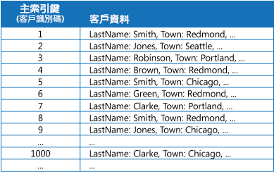
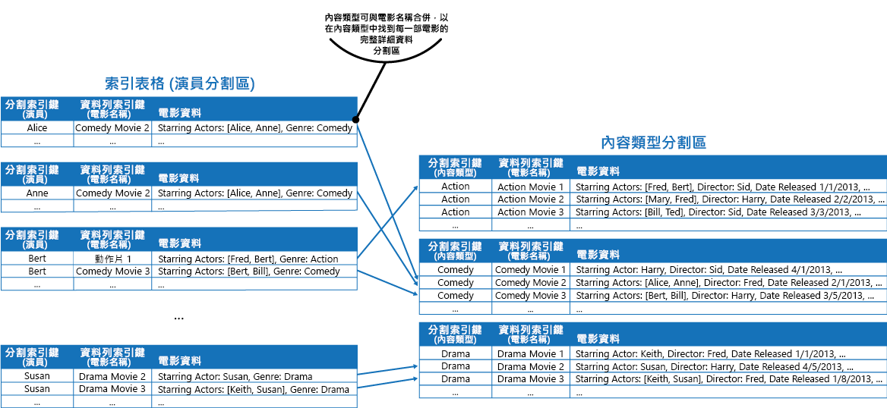

# 索引資料表模式

[!INCLUDE [header](../_includes/header.md)]

針對資料存放區中查詢經常參考的欄位建立索引。 此模式可以改進查詢效能，方法是讓應用程式更快找到要從資料存放區擷取的資料。

## 內容和問題

許多資料存放區會使用主索引鍵來組織實體集合的資料。 應用程式可以使用此索引鍵以找出並擷取資料。 此圖顯示保存客戶資訊的資料存放區範例。 主索引鍵是客戶識別碼。 此圖顯示依主索引鍵 (客戶識別碼) 組織的客戶資訊。

主索引鍵對於根據此索引鍵的值擷取資料之查詢相當重要，如果應用程式必須根據某些其他欄位來擷取資料，則應用程式可能無法使用主索引鍵。 在客戶範例中，如果應用程式單純藉由參考某些其他屬性的值 (例如客戶所在的城鎮) 來查詢資料，則應用程式無法使用客戶識別碼主索引鍵來擷取客戶。 若要執行這類的查詢，應用程式必須擷取並檢查每個客戶記錄，這樣可能會讓處理程序變慢。

許多關聯式資料庫管理系統支援次要索引。 次要索引是個別的資料結構，由一或多個非主要 (次要) 索引鍵欄位所組織，它會指出每個索引值的資料儲存之位置。 次要索引中的項目通常會依照次要索引鍵的值來儲存，以便快速查閱資料。 這些索引通常會由資料庫管理系統自動維護。

您可以建立您需要之數目的次要索引，以支援您的應用程式執行的不同查詢。 例如，在客戶識別碼是主索引鍵之關聯式資料庫的 [客戶] 資料表中，如果應用程式經常依據客戶所在的城鎮查閱客戶，則在城鎮欄位新增次要索引很有幫助。

不過，雖然次要索引在關聯式系統中很常見，但是雲端應用程式所使用的大部分 NoSQL 資料存放區不提供對等的功能。

## 解決方法

如果資料存放區不支援次要索引，您可以藉由建立您自己的索引資料表，以手動模擬它們。 索引資料表會依據指定的索引鍵來組織資料。 三個策略經常用於建構索引資料表，取決於所需的次要索引數目，以及應用程式執行之查詢的本質。

第一個策略是複製每個索引資料表中的資料，但是依據不同索引鍵來組織 (完整反正規化)。 下圖顯示索引資料表，依據 Town 和 LastName 來組織相同的客戶資訊。

如果資料相較於使用每個索引鍵查詢的次數相對靜態，則此策略是適當的。 如果資料更加動態，維護每個索引資料表的處理額外負荷會變得太大而無法使用這種方法。 此外，如果資料量非常大，儲存重複資料所需的空間量也會非常大。

第二個策略是建立依據不同索引鍵組織的正規化索引資料表，並且藉由使用主索引鍵來參考原始資料，而不是複製它，如下圖所示。 原始資料稱為事實資料表。

這個技術會節省空間，並減少維護重複資料的額外負荷。 缺點是應用程式必須執行兩個查閱作業以使用次要索引鍵尋找資料。 它必須在索引資料表中尋找資料的主索引鍵，然後使用主索引鍵查閱事實資料表中的資料。

第三個策略是建立依據不同索引鍵 (經常複製擷取的欄位) 組織的部分正規化索引資料表。 參考事實資料表以存取不常存取的欄位。 下圖顯示經常存取資料如何在每個索引資料表中複製。

您可以使用這個策略，打破前兩個策略之間的平衡。 空間與維護額外負荷不像複製整個資料集那麼大，經常查詢的資料可以藉由使用單一查閱來快速擷取。

如果應用程式經常藉由指定值的組合來查詢資料 (例如，「尋找住在 Redmond 且姓氏為 Smith 的所有客戶」)，您可以實作索引資料表中項目的索引鍵，作為 Town 屬性和 LastName 屬性的串連。 下圖顯示根據複合索引鍵的索引資料表。 索引鍵會依據 Town 排序，然後針對具有相同 Town 值的記錄依據 LastName 排序。

索引資料表可以透過分區化資料加速查詢作業，在分區索引鍵是雜湊時特別有用。 下圖顯示範例，其中分區索引鍵是客戶識別碼的雜湊。 索引資料表可以依據非雜湊值 (Town 和 LastName) 來組織資料，並提供雜湊分區索引鍵作為查閱資料。 如果應用程式必須擷取落在範圍內的資料，或者必須以非雜湊索引鍵的順序擷取資料，這樣可以讓應用程式免於重複計算雜湊索引鍵 (昂貴的作業)。 例如，「尋找住在 Redmond 的所有客戶」這類的查詢可以藉由在索引資料表中找出相符項目以快速解析，這些項目會儲存在連續區塊中。 然後，使用儲存在索引資料表中的分區索引鍵，遵循客戶資料的參考。

## 問題和考量

當您決定如何實作此模式時，請考慮下列幾點：

- 維護次要索引的額外負荷可能相當巨大。 您必須分析及了解應用程式使用的查詢。 只有在索引資料表會經常使用時才建立索引資料表。 請勿建立理論式索引資料表來支援應用程式不會執行，或只是偶爾執行的查詢。
- 複製索引資料表中的資料，會增加維護資料多個複本所需之儲存體成本和工作的巨大額外負荷。
- 以參考原始資料的正規化結構實作索引資料表，需要應用程式執行兩個查閱作業來尋找資料。 第一個作業會搜尋索引資料表以擷取主索引鍵，第二個作業會使用主索引鍵來擷取資料。
- 如果系統在非常大的資料集上併入一些索引資料表，會難以在索引資料表與原始資料之間維護一致性。 也許可以憑藉最終一致性模型來設計應用程式。 例如，若要插入、更新或刪除資料，應用程式可以將訊息張貼至佇列，並讓個別工作執行作業及維護會以非同步方式參考這個資料的索引資料表。 如需實作最終一致性的詳細資訊，請參閱[資料一致性入門](https://msdn.microsoft.com/library/dn589800.aspx)。

   >  Microsoft Azure 儲存體資料表針對相同資料分割 (稱為實體群組交易) 中保存的資料之變更，支援交易式更新。 如果您可以在相同資料分割中儲存事實資料表以及一或多個索引資料表的資料，可以使用這項功能來協助確保一致性。

- 索引資料表本身可能是資料分割或分區化。

## 使用此模式的時機

使用此模式以在應用程式經常需要使用主索引鍵 (或分區索引鍵) 以外的索引鍵擷取資料時，改善查詢效能。

此模式可能不適合下列時機︰

- 資料是暫時性的。 索引資料表會非常快過期，使其沒有效率，或者讓維護索引資料表的額外負荷超過使用它所能帶來的效益。
- 選取作為索引資料表之次要索引鍵的欄位沒有區別，而且只能有一小組的值 (例如性別)。
- 選取作為索引資料表之次要索引鍵的欄位資料值平衡有高度偏差。 例如，如果 90% 的記錄在欄位中包含相同值，則建立及維護索引資料表以根據此欄位查閱資料，會建立比循序掃描資料更多的額外負荷。 不過，如果非常頻繁地查詢位於剩餘 10% 記錄中的目標值，則索引很有用。 您應該了解您的應用程式執行的查詢，以及查詢的執行頻率。

## 範例

Azure 儲存體資料表為在雲端中執行的應用程式，提供可高度擴充的索引鍵/值資料存放區。 應用程式藉由指定索引鍵來儲存和擷取資料值。 資料值可以包含多個欄位，但是資料項目的結構對於資料表儲存體是不透明的，只會將資料項目處理為位元組陣列。

Azure 儲存體資料表也支援分區化。 分區化索引鍵包含兩個元素，資料分割索引鍵和資料列索引鍵。 具有相同資料分割索引鍵的項目會儲存在相同資料分割 (分區)，且項目是以資料列索引鍵順序儲存在分區內。 資料表儲存體已針對執行查詢最佳化，該查詢會擷取落在資料分割內資料列索引鍵值連續範圍的資料。 如果您建置會在 Azure 資料表中儲存資訊的雲端應用程式，您應該在建構資料時，將此功能謹記在心。

例如，請考慮儲存電影相關資訊的應用程式。 應用程式經常依據內容類型 (動作、紀錄、歷史、喜劇、戲劇等等) 查詢電影。 您可以為每個內容類型建立具有資料分割的 Azure 資料表，方法是使用內容類型作為資料分割索引鍵，指定電影名稱作為資料列索引鍵，如下圖所示。

如果應用程式也必須依據主演演員來查詢電影，則這個方法比較沒有效率。 在此情況下，您可以建立不同的 Azure 資料表作為索引資料表。 資料分割索引鍵是演員，資料列索引鍵是電影名稱。 每個演員的資料會儲存在不同的資料分割。 如果有一位以上的電影明星，相同電影會出現在多個資料分割中。

您可以使用每個資料分割保存的值來複製電影資料，方法是採用上述「解決方案」一節中描述的第一個方法。 不過，很可能每部電影都會複寫數次 (每位演員一次)，因此以下做法可能更有效率：部分反正規化資料以支援最常用的查詢 (例如其他演員的名稱)，並讓應用程式擷取任何剩餘的詳細資料，方法是包含所需的資料分割索引鍵，以在內容類型資料分割中尋找完整資訊。 這個方法會在「解決方案」一節中的第三個選項說明。 下圖顯示這個方法。

## 相關的模式和指導方針

實作此模式時，下列模式和指導方針可能也相關：

- [資料一致性入門](https://msdn.microsoft.com/library/dn589800.aspx)。 索引資料表必須隨著資料索引變更維護。 在雲端中，可能無法或不適合執行在修改資料的相同交易中更新索引的作業。 在此情況下，最終一致方法比較適合。 提供關於最終一致性問題的資訊。
- [分區化模式](./sharding.md)。 索引資料表模式經常與使用分區的資料分割搭配使用。 分區化模式會提供有關如何將資料存放區分割成分區集的詳細資訊。
- [具體化檢視模式](./materialized-view.md)。 並非索引資料以支援彙總資料的查詢，可能更適合建立資料的具體化檢視。 描述如何藉由對資料產生預先填入的檢視來支援有效率的摘要查詢。
