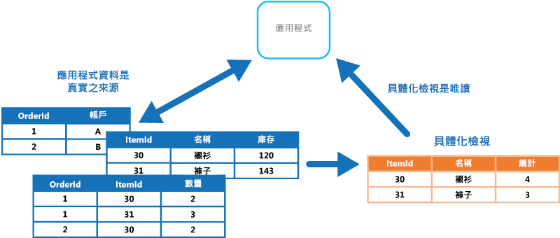

# 具體化檢視模式

[!INCLUDE [header](../_includes/header.md)]

當資料格式對必要的查詢作業而言不理想時，對一或多個資料存放區中的資料產生預先填入的檢視。 這可以協助支援人員有效進行查詢和資料擷取，並改善應用程式效能。

## 內容和問題

儲存資料時，開發人員和資料管理員的優先順序通常專注於資料儲存的方式，而不是讀取資料的方式。 所選儲存體格式通常與資料的格式、管理資料大小和資料完整性的需求，以及使用中存放區的類型密切相關。 比方說，使用 NoSQL 文件存放區時，資料通常呈現為一系列的彙總，每一個都會包含該實體的所有資訊。

不過，這對查詢會有負面影響。 如果查詢只需要來自某些實體的資料子集，例如：數個客戶的訂單摘要 (而不需要訂單的所有詳細資料)，它必須擷取相關實體的所有資料，才能取得所需的資訊。

## 解決方法

為了支援有效率的查詢，一般會預先產生將資料以適合所需結果集的格式具體化的檢視。 具體化檢視模式描述在下列環境中產生預先填入的資料檢視：當來源資料格式不適合查詢時、要產生合適的查詢很困難時，或是由於資料或資料存放區的本質查詢效能不佳時。

這些只包含查詢所需資料的具體化檢視，可讓應用程式快速取得所需的資訊。 為了聯結資料表或結合資料實體，具體化檢視可以包含目前計算的資料行或資料項目的值、結合值或對資料項目執行轉換的結果，以及指定為查詢一部分的值。 具體化檢視甚至可以只為單一查詢最佳化。

重點是，具體化檢視和它所包含的資料完全可處置，因為資料完全可以從來源資料存放區重建。 具體化檢視絕不會直接由應用程式更新，因此它是特製的快取。

當檢視的來源資料變更時，必須更新檢視，以包含新的資訊。 您可以將此動作排程為自動發生，或是在系統偵測到對原始資料的變更時發生。 在某些情況下可能需要手動重新產生檢視。 此圖顯示如何使用具體化檢視模式的範例。

## 問題和考量

當您決定如何實作此模式時，請考慮下列幾點：

如何及何時會更新檢視。 在理想情況下，它會重新產生以回應指出對來源資料變更的事件，不過，如果來源資料快速變更，這可能會導致過多的額外負荷。 或者，請考慮使用排程的工作、外部觸發程序或手動動作來重新產生檢視。

在某些系統上，例如使用事件來源模式來維護僅修改資料的事件存放區時，具體化檢視即為必要。 藉由檢查所有事件以預先填入檢視，判斷目前的狀態，可能是從事件存放區取得資訊的唯一方式。 如果您不使用事件來源，必須考慮具體化檢視是否有幫助。 具體化檢視通常專為一個或少數查詢量身訂做。 如果使用許多查詢，具體化檢視可能導致無法接受的儲存體容量需求及儲存體成本。

如果問題發生在排程時，於產生檢視以及更新檢視時，請考量對資料一致性的影響。 如果來源資料是在產生檢視時變更，檢視中的資料的副本與原始資料不會完全一致。

考慮您要在其中儲存檢視的位置。 檢視不一定要位於與原始資料相同的存放區或磁碟分割。 它可以是來自幾個不同的分割合併的子集。

如果檢視遺失，可以重建檢視。 因此，如果檢視是暫時性且僅用於透過反映資料的目前狀態來改善查詢效能，或用於改善延展性，則可以將它儲存在快取或在較不可靠的位置。

定義具體化檢視時，根據現有資料項目的計算或轉換、根據在查詢中傳遞的值，或根據這些值的組合 (適當時) 來將資料項目或資料行新增至該檢視，將其價值最大化。

在儲存機制支援時，請考慮將具體化檢視建立索引，以進一步提高效能。 大部分關聯式資料庫支援對檢視建立索引，根據 Apache Hadoop 的巨量資料解決方案也一樣。

## 使用此模式的時機

此模式在下列情況中非常有用：

- 對難以直接查詢的資料，或查詢非常複雜而無法擷取以標準化、半結構化或非結構化方式儲存的資料建立具體化檢視。
- 建立暫存檢視可以大幅改善查詢效能，或可直接作為 UI、報告或顯示的來源檢視或資料傳輸物件。
- 支援對資料存放區的連接不一定可用、偶爾會連接或中斷連接的情節。 在此情況下，可以在本機快取檢視。
- 以不需要知道來源資料格式的方式，為實驗簡化查詢並公開資料。 例如，透過聯結一個或多個資料庫中的不同資料表，或是 NoSQL 存放區中的一或多個網域，然後設定資料格式以符合其最終使用方式。
- 針對安全性或隱私權的理由，提供不應該普遍可供存取、開放修改或完全公開給使用者的來源資料特定子集的存取。
- 橋接不同的資料存放區，以利用其個別的功能。 例如，使用足以寫入的雲端存放區作為參考資料存放區，以及使用提供良好查詢和讀取效能的關聯式資料庫來保存具體化檢視。

此模式在下列情況下不是很有用：

- 來源資料簡單並容易查詢。
- 來源資料變更快速，或不使用檢視就能存取。 在這些情況下，您應該避免建立檢視的處理負擔。
- 一致性是高優先順序。 檢視不一定都與原始資料完全一致。

## 範例

下圖顯示使用具體化檢視模式來產生銷售摘要的範例。 Azure 儲存體帳戶中個別分割中 Order、OrderItem 和 Customer 資料表中的資料會結合，以便產生檢視，其中包含在 Electronics 類別中每個產品的總銷售值，以及對每個項目進行購買之客戶數目的計數。

建立此具體化檢視需要複雜的查詢。 不過，藉由以具體化檢視的形式公開查詢的結果，使用者可以輕鬆地取得結果，並直接使用它們或在另一個查詢中將它們併入。 檢視可能會用於報告系統或儀表板，並可以根據排程來更新 (例如每週)。

> 雖然此範例會利用 Azure 資料表儲存體，許多關聯式資料庫管理系統也為具體化檢視提供原生支援。

## 相關的模式和指導方針

實作此模式時，下列模式和指導方針可能也相關：

- [資料一致性入門](https://msdn.microsoft.com/library/dn589800.aspx)。 必須維護具體化檢視中的摘要資訊，使得它能夠反映基礎資料值。 當資料值變更時，即時更新摘要資料可能不夠實際，而相反地，您就必須採用最終一致的方法。 摘要說明維護分散式資料一致性的相關問題，並說明不同的一致性模型的優點和權衡取捨。
- [命令與查詢責任隔離 (CQRS) 模式](./cqrs.md)。 用來透過回應基礎資料值變更時發生的事件，更新具體化檢視中的資訊。
- [事件來源模式](./event-sourcing.md)。 搭配 CQRS 模式使用，以維護具體化檢視中的資訊。 當具體化檢視依據的資料值變更時，系統就可以引發事件，說明這些變更並將它們儲存在事件存放區。
- [索引表格模式](./index-table.md)。 具體化檢視中的資料通常依照主索引鍵組織，但查詢可能需要藉由檢查其他欄位中的資料，從此檢視擷取資訊。 用來對不支援原生次要索引之資料存放區的資料集建立次要索引。
