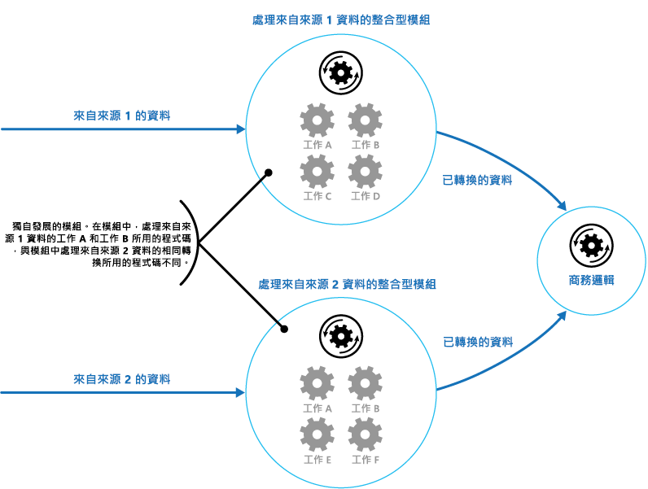
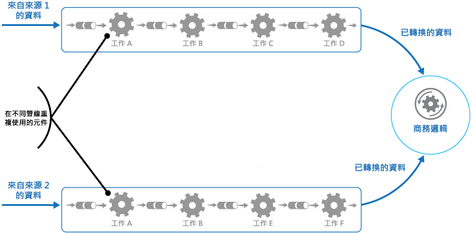

# <a name="pipes-and-filters-pattern"></a>管道與篩選器模式

[!INCLUDE [header](../_includes/header.md)]

將執行複雜處理程序的工作，分解成一系列可重複使用的個別元素。 這樣可以藉由讓執行處理的工作元素個別部署和調整，來改善效能、延展性及重複使用性。

## <a name="context-and-problem"></a>內容和問題

應用程式可能需要在其處理的資訊上，執行具有不同複雜度的各種工作。 有一項實作應用程式簡單但具彈性的方法，此方法為將這項處理序作為整合模組執行。 不過，這種方法可能會降低重構程式碼、最佳化它，或在應用程式的其他位置需要相同處理程序的部分時，重複使用它的機會。

此圖說明使用整合型方法處理資料的問題。 應用程式會從兩個來源接收及處理資料。 每個來源的資料是由執行一系列工作的個別模組處理以轉換此資料，再將結果傳遞至應用程式的商務邏輯。



整合型模組執行的某些工作在功能上十分相似，但是模組已個別設計。 實作工作的程式碼在模組中會緊密結合，開發時稍微或完全沒有考量重複使用或延展性。

不過，每個模組執行的處理工作，或每個工作的部署需求，會隨著商務需求更新而變更。 某些工作可能是計算密集型，而且可以從在功能強大的硬體上執行而獲益，其他工作則可能不需要如此昂貴的資源。 此外，未來可能需要其他處理程序，或者處理執行之工作的順序可能會變更。 解決方案需要能夠解決這些問題，而且增加程式碼重複使用的可能性。

## <a name="solution"></a>解決方法

將每個串流所需的處理程序細分為一組個別元件 (或篩選器)，各個執行單一工作。 藉由標準化每個元件接收和傳送之資料的格式，這些篩選器可以一起合併到管道中。 這有助於避免重複的程式碼，並且在處理需求變更時，輕鬆地移除、取代或整合其他元件。 下圖顯示使用管道和篩選器實作的解決方案。




處理單一要求所需的時間取決於管道中最慢篩選器的速度。 一或多個篩選器可能是瓶頸，特別是當特定資料來源的串流中出現大量要求時。 管道結構的主要優點是，它會提供機會來平行執行緩慢篩選器的執行個體，讓系統分散負載並改善輸送量。

構成管道的篩選器可以在不同的機器上執行，讓它們能夠獨立調整並且利用許多雲端環境都會提供的彈性。 計算密集型篩選器可以在高效能硬體上執行，而要求較少的其他篩選器可以裝載在成本較低的商用硬體上。 篩選器甚至不需要位於相同資料中心或地理位置，讓管線中的每個元素可以在接近其查詢資源的環境中執行。  下一張圖表顯示套用至來源 1 資料之管線的範例。


如果篩選器的輸入和輸出結構化為串流，可能可以平行執行每個篩選器的處理。 管線中的第一個篩選器可以啟動其工作並且輸出其結果，在第一個篩選器完成其工作之前，會直接傳遞給順序的下一個篩選器。

另一個優點是此模型可以提供的復原。 如果篩選器失敗，或者它執行所在的機器再也無法使用，管線可以重新排程執行篩選器的工作，並且將此工作導向至元件的另一個執行個體。 單一篩選器失敗不一定會導致整個管線失敗。

搭配[補償交易模式](compensating-transaction.md)使用管道和篩選器模式，是實作分散式交易的另一個方法。 分散式交易可以細分成個別、可補償工作，每個工作都可以藉由使用會實作補償交易模式的篩選器來實作。 管線中的篩選器可以實作為個別裝載工作，與它們維護的資料緊密執行。

## <a name="issues-and-considerations"></a>問題和考量

當您在決定如何實作此模式時，應考慮下列幾點：
- **複雜度**。 此模式提供的增強彈性也會帶來複雜性，特別是當管線中的篩選器分散到不同伺服器時。

- **可靠性**。 使用基礎結構，確保管線中篩選器之間流動的資料不會遺失。

- **等冪**。 如果管線中的篩選器在收到訊息之後失敗，且工作重新排程至篩選器的另一個執行個體，部分工作可能已經完成。 如果此工作會更新全域狀態 (例如儲存在資料庫中的資訊) 的某些層面，就無法重複相同的更新。 如果篩選器在將其結果張貼至管線中的下一個篩選器之後，但是在表示成功完成其工作之前失敗，可能會發生類似問題。 在這些情況下，相同工作會由篩選器的另一個執行個體重複，導致相同結果張貼兩次。 這樣可能會導致管線中的後續篩選器處理相同資料兩次。 因此管線中的篩選器應該設計為等冪。 如需詳細資訊，請參閱 Jonathan Oliver 部落格上的[等冪模式](https://blog.jonathanoliver.com/idempotency-patterns/)。

- **重複訊息**。 如果管線中的篩選器在將訊息張貼至管線的下一個階段之後失敗，篩選器的另一個執行個體可能會執行，它會將相同訊息的複本張貼至管線。 這可能會導致相同訊息的兩個執行個體傳遞至下一個篩選器。 若要避免這個問題，管線應該偵測並排除重複的訊息。

    >  如果您藉由使用訊息佇列 (例如 Microsoft Azure 服務匯流排佇列) 來實作管線，訊息佇列基礎結構可能會提供自動重複訊息偵測和移除。

- **內容和狀態**。 在管線中，每個篩選基本上是在隔離狀態執行，不應該假設它的叫用方式。 這表示每個篩選器應該提供足夠內容，以執行其工作。 此內容可以包含大量狀態資訊。

## <a name="when-to-use-this-pattern"></a>使用此模式的時機

使用此模式的時機包括：
- 應用程式所需的處理可以輕易地細分為一組獨立的步驟。

- 應用程式所執行的處理步驟有不同的延展性需求。

    >  可以在相同處理中將應該調整的篩選器群組在一起。 如需詳細資訊，請參閱[計算資源彙總模式](compute-resource-consolidation.md)。

- 需要彈性才能重新排序應用程式執行的處理步驟，或者新增和移除步驟的功能。

- 系統可以受益於將步驟的處理程序分配給不同的伺服器。

- 可靠的解決方案是在處理資料的同時，將步驟中失敗的影響降至最低。

此模式可能不適合下列時機︰
- 應用程式執行的處理步驟不是獨立的，或者必須在相同交易中一起執行。

- 步驟所需之內容或狀態資訊的數量，會讓這個方法的效率不佳。 可能可以改為將狀態資訊保存到資料庫，但是如果資料庫上的額外負載會造成過多的爭用，則不要使用這個策略。

## <a name="example"></a>範例

您可以使用一系列訊息佇列，提供實作管線所需的基礎結構。 初始訊息佇列會接收未處理的訊息。 實作為篩選器工作以接聽此佇列上訊息的元件，會執行其工作，然後將轉換的訊息張貼至序列中的下一個佇列。 另一個篩選器工作可以接聽此佇列上的訊息、加以處理，將結果張貼至另一個佇列，依此類推，直到完整轉換的資料出現在佇列中的最後一個訊息。 下圖說明使用訊息佇列來實作管線。


如果您在 Azure 上建置解決方案，您可以使用服務匯流排佇列以提供可靠且可調整的佇列機制。 `ServiceBusPipeFilter` 類別在下方以 C# 表示，示範如何實作篩選器，從佇列接收輸入訊息、處理這些訊息，然後將結果張貼至另一個佇列。

>  `ServiceBusPipeFilter` 類別是在可從 [GitHub](https://github.com/mspnp/cloud-design-patterns/tree/master/pipes-and-filters) 取得的 PipesAndFilters.Shared 專案中定義。

```csharp
public class ServiceBusPipeFilter
{
  ...
  private readonly string inQueuePath;
  private readonly string outQueuePath;
  ...
  private QueueClient inQueue;
  private QueueClient outQueue;
  ...

  public ServiceBusPipeFilter(..., string inQueuePath, string outQueuePath = null)
  {
     ...
     this.inQueuePath = inQueuePath;
     this.outQueuePath = outQueuePath;
  }

  public void Start()
  {
    ...
    // Create the outbound filter queue if it doesn't exist.
    ...
    this.outQueue = QueueClient.CreateFromConnectionString(...);

    ...
    // Create the inbound and outbound queue clients.
    this.inQueue = QueueClient.CreateFromConnectionString(...);
  }

  public void OnPipeFilterMessageAsync(
    Func<BrokeredMessage, Task<BrokeredMessage>> asyncFilterTask, ...)
  {
    ...

    this.inQueue.OnMessageAsync(
      async (msg) =>
    {
      ...
      // Process the filter and send the output to the
      // next queue in the pipeline.
      var outMessage = await asyncFilterTask(msg);

      // Send the message from the filter processor
      // to the next queue in the pipeline.
      if (outQueue != null)
      {
        await outQueue.SendAsync(outMessage);
      }

      // Note: There's a chance that the same message could be sent twice
      // or that a message gets processed by an upstream or downstream
      // filter at the same time.
      // This would happen in a situation where processing of a message was
      // completed, it was sent to the next pipe/queue, and then failed
      // to complete when using the PeekLock method.
      // Idempotent message processing and concurrency should be considered
      // in a real-world implementation.
    },
    options);
  }

  public async Task Close(TimeSpan timespan)
  {
    // Pause the processing threads.
    this.pauseProcessingEvent.Reset();

    // There's no clean approach for waiting for the threads to complete
    // the processing. This example simply stops any new processing, waits
    // for the existing thread to complete, then closes the message pump
    // and finally returns.
    Thread.Sleep(timespan);

    this.inQueue.Close();
    ...
  }

  ...
}
```

`ServiceBusPipeFilter` 類別中的 `Start` 方法會連線到一組輸入和輸出佇列，而 `Close` 方法則會與輸入佇列中斷連線。 `OnPipeFilterMessageAsync` 方法會執行訊息的實際處理，這個方法的 `asyncFilterTask` 參數會指定要執行的處理。 `OnPipeFilterMessageAsync` 方法會等候輸入佇列上的內送郵件，執行 `asyncFilterTask` 參數在每次訊息抵達時指定的程式碼，然後將結果張貼到輸出佇列。 佇列本身是由建構函式指定。

範例解決方案會在一組背景工作角色中實作篩選器。 每個背景工作角色可以獨立調整，根據其執行之商務處理的複雜性，或處理所需的資源。 此外，每個背景工作角色的多個執行個體可以平行執行以改善輸送量。

下列程式碼會示範名為 `PipeFilterARoleEntry` 的 Azure 背景工作角色，在範例解決方案中的 PipeFilterA 專案中定義。

```csharp
public class PipeFilterARoleEntry : RoleEntryPoint
{
  ...
  private ServiceBusPipeFilter pipeFilterA;

  public override bool OnStart()
  {
    ...
    this.pipeFilterA = new ServiceBusPipeFilter(
      ...,
      Constants.QueueAPath,
      Constants.QueueBPath);

    this.pipeFilterA.Start();
    ...
  }

  public override void Run()
  {
    this.pipeFilterA.OnPipeFilterMessageAsync(async (msg) =>
    {
      // Clone the message and update it.
      // Properties set by the broker (Deliver count, enqueue time, ...)
      // aren't cloned and must be copied over if required.
      var newMsg = msg.Clone();

      await Task.Delay(500); // DOING WORK

      Trace.TraceInformation("Filter A processed message:{0} at {1}",
        msg.MessageId, DateTime.UtcNow);

      newMsg.Properties.Add(Constants.FilterAMessageKey, "Complete");

      return newMsg;
    });

    ...
  }

  ...
}
```

這個角色包含 `ServiceBusPipeFilter` 物件。 角色中的 `OnStart` 方法會連線到佇列，以接收輸入訊息和張貼輸出訊息 (佇列的名稱是在 `Constants` 類別中定義)。 `Run` 方法會叫用 `OnPipeFilterMessagesAsync` 方法，以在收到的每個訊息上執行一些處理 (在此範例中，處理是由等候一段簡短時間來模擬)。 當處理完成時，會建構包含結果的新訊息 (在此情況下，輸入訊息具有新增的自訂屬性)，然後此訊息會張貼至輸出佇列。

範例程式碼在 PipeFilterB 專案中包含名為 `PipeFilterBRoleEntry` 的另一個背景工作角色。 這個角色類似於 `PipeFilterARoleEntry`，不同之處在於它會在 `Run` 方法中執行不同的處理。 在範例解決方案中，這兩個角色合併以建構管線，`PipeFilterARoleEntry` 角色的輸出佇列是 `PipeFilterBRoleEntry` 角色的輸入佇列。

範例解決方案也會提供兩個額外的角色，名為 `InitialSenderRoleEntry` (在 InitialSender 專案中) 和 `FinalReceiverRoleEntry` (在 FinalReceiver 專案中)。 `InitialSenderRoleEntry` 角色在管線中提供初始訊息。 `OnStart` 方法連線到單一佇列，`Run` 方法將方法張貼到此佇列。 此佇列是 `PipeFilterARoleEntry` 角色所使用的輸入佇列，因此將訊息張貼給它會導致訊息由 `PipeFilterARoleEntry` 角色接收及處理。 然後已處理的訊息會通過 `PipeFilterBRoleEntry` 角色。

`FinalReceiveRoleEntry` 角色的輸入佇列是 `PipeFilterBRoleEntry` 角色的輸出佇列。 `FinalReceiveRoleEntry` 角色中的 `Run` 方法，如下所示，會接收訊息及執行某些最終處理。 然後它會將管線中篩選器新增的自訂屬性值寫入至追蹤輸出。

```csharp
public class FinalReceiverRoleEntry : RoleEntryPoint
{
  ...
  // Final queue/pipe in the pipeline to process data from.
  private ServiceBusPipeFilter queueFinal;

  public override bool OnStart()
  {
    ...
    // Set up the queue.
    this.queueFinal = new ServiceBusPipeFilter(...,Constants.QueueFinalPath);
    this.queueFinal.Start();
    ...
  }

  public override void Run()
  {
    this.queueFinal.OnPipeFilterMessageAsync(
      async (msg) =>
      {
        await Task.Delay(500); // DOING WORK

        // The pipeline message was received.
        Trace.TraceInformation(
          "Pipeline Message Complete - FilterA:{0} FilterB:{1}",
          msg.Properties[Constants.FilterAMessageKey],
          msg.Properties[Constants.FilterBMessageKey]);

        return null;
      });
    ...
  }

  ...
}
```

## <a name="related-patterns-and-guidance"></a>相關的模式和指導方針

實作此模式時，下列模式和指導方針可能也相關：
- [GitHub](https://github.com/mspnp/cloud-design-patterns/tree/master/pipes-and-filters) 上有提供示範此模式的範例。
- [競爭取用者模式](competing-consumers.md)。 管線可以包含一或多個篩選器的多個執行個體。 這個方法對於執行緩慢篩選器的平行執行個體很有用，讓系統分散負載及改善輸送量。 篩選器的每個執行個體會與其他執行個體爭用輸入，篩選器的兩個執行個體應該不能處理相同的資料。 提供這個方法的說明。
- [計算資源彙總模式](compute-resource-consolidation.md)。 可以在相同處理中將應該調整的篩選器群組在一起。 提供有關此策略之優點和權衡取捨的詳細資訊。
- [補償交易模式](compensating-transaction.md)。 篩選器可以實作為可反轉的作業，或者具有補償作業的作業，在失敗時將狀態還原為先前版本。 說明如何實作這個作業以維護或達到最終一致性。
- Jonathan Oliver 部落格上的[等冪模式](https://blog.jonathanoliver.com/idempotency-patterns/)。
