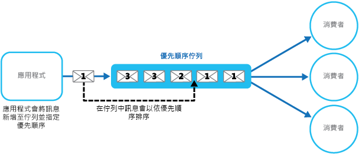
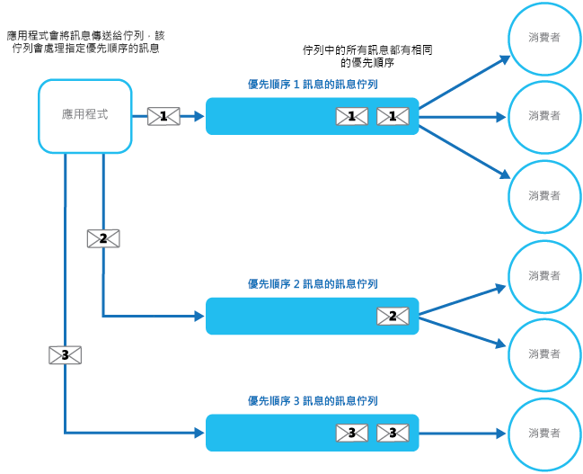

# <a name="priority-queue-pattern"></a>優先順序佇列模式

[!INCLUDE [header](../_includes/header.md)]

針對傳送給服務的要求排列優先順序，讓高優先順序要求的接收和處理順序在低優先順序要求之前。 在針對個別用戶端提供不同服務等級保證的應用程式中，此模式相當有用。

## <a name="context-and-problem"></a>內容和問題

應用程式可以將特定工作委派給其他服務，例如用以執行背景處理，或是與其他應用程式或服務整合。 在雲端，訊息佇列通常是用來將工作委派給背景處理。 在許多情況下，服務接收要求的順序並不重要。 不過，在某些情況下，則有必要針對特定要求排列優先順序。 這些要求的處理順序應該要在應用程式先前傳送的低優先順序要求之前。

## <a name="solution"></a>方案

佇列通常採用先進先出 (FIFO) 結構，而取用者接收訊息的順序通常與訊息被張貼至佇列的順序相同。 不過，有些訊息佇列可支援優先順序傳訊。 張貼訊息的應用程式可以指派優先順序，而佇列中的訊息將會自動重新排列順序，讓高優先順序訊息的接收順序在低優先順序訊息之前。 下圖說明使用優先順序傳訊的佇列。



> 大多數訊息佇列實作都支援多個取用者 (依循[競爭取用者模式](https://msdn.microsoft.com/library/dn568101.aspx) \(英文\))，並且可以依需求增加或減少取用者處理序數目。

在不支援優先順序型佇列的系統中，替代的解決方案是針對每個優先順序維護一個個別的佇列。 應用程式需負責將訊息張貼至適當的佇列。 每個佇列可以有一個個別的取用者集區。 高優先順序佇列的取用者集區，可以比低優先順序佇列的執行於更快速的硬體上，且可以有較大的集區。 下一張圖說明針對每個優先順序使用個別的訊息佇列。




此策略的一種變換方式是使用單一取用者集區，並讓這些取用者先檢查高優先順序佇列上的訊息，然後才開始從較低優先順序的佇列擷取訊息。 使用單一取用者處理序集區 (不論是搭配支援具有不同優先順序之訊息的單一佇列，還是搭配各處理單一優先順序之訊息的多個佇列) 的解決方案與使用多個佇列且每個佇列具有個別集區的解決方案之間，有一些語意差異。

在單一集區方法中，高優先順序訊息的接收和處理順序一律是在低優先順序訊息之前。 理論上，優先順序非常低的訊息有可能不斷地被取代而永遠不被處理。 在多集區方法中，一律會處理較低優先順序的訊息，只是處理順序會在較高優先順序的訊息之後 (視集區的相對大小及其可用的資源而定)。

使用優先順序佇列機制可提供下列優點：

- 它可讓應用程式符合要求針對可用性或效能排列優先順序的業務需求，例如針對特定的客戶群組提供不同等級的服務。

- 它可協助將營運成本降到最低。 在單一佇列方法中，您可以視需要縮減取用者數目。 系統仍然會先處理高優先順序訊息 (雖然處理速度可能較慢)，而低優先順序訊息可能會被延遲更久。 如果您已實作每個佇列搭配個別取用者集區的多訊息佇列方法，您可以將較低優先順序佇列的取用者集區縮小，或甚至是將接聽優先順序非常低之佇列上訊息的所有取用者停止，來暫停處理這些佇列。

- 多訊息佇列方法可根據處理需求來分割訊息，協助將應用程式的效能和延展性發揮到極致。 例如，可以將重要的工作優先交由立即執行的接收者處理，而將較不重要的背景工作交由排定在較不忙碌時段執行的接收者處理。

## <a name="issues-and-considerations"></a>問題和考量

當您決定如何實作此模式時，請考慮下列幾點：

在解決方案的內容中定義優先順序。 例如，高優先順序可能意謂著應該在十秒內處理訊息。 識別處理高優先順序項目的需求，以及其他應該配置以符合這些準則的資源。

決定是否所有高優先順序項目的處理順序都必須在低優先順序項目之前。 如果是由單一取用者集區處理訊息，您就必須提供一個機制，它在高優先順序訊息變成可處理時，能先佔並暫停處理低優先順序訊息的工作。

在多佇列方法中，當使用單一取用者處理序集區來接聽所有佇列，而不是每個佇列使用一個專用取用者集區時，取用者必須套用演算法來確保一律會先為來自高優先順序佇列的訊息提供服務，然後才為來自低優先順序佇列的訊息提供服務。

監視高低優先順序佇列上的處理速度，以確保依預期的速率處理這些佇列中的訊息。

如果您需要保證處理低優先順序訊息，就必須實作搭配多個取用者集區的多訊息佇列方法。 或者，在支援訊息優先順序的佇列中，也可以隨著所佇列的訊息老化而動態地提高其優先順序。 不過，此方法有賴於訊息佇列提供這項功能。

對於只有少量妥善定義之優先順序的系統來說，針對每個訊息優先順序使用個別佇列的效果最佳。

訊息優先順序可以由系統以邏輯方式決定。 例如，可以不使用明確的高低優先順序訊息，而是指定為「付費客戶」或「非付費客戶」。 視您的業務模式而定，您的系統可以配置比非付費客戶更多的資源來處理來自付費客戶的訊息。

可能會有與檢查佇列訊息關聯的財務和處理成本　(有些商業傳訊系統會在每次張貼或接收訊息以及每次查詢佇列訊息時，收取一小筆費用)。 當檢查多個佇列時，此成本會增加。

您可以根據取用者集區所服務的佇列長度，動態地調整該集區的大小。 如需詳細資訊，請參閱[自動調整指導方針](https://msdn.microsoft.com/library/dn589774.aspx) \(英文\)。

## <a name="when-to-use-this-pattern"></a>使用此模式的時機

此模式在具有下列情況的案例中相當有用：

- 系統必須處理具有不同優先順序的多個工作。

- 應該以不同的優先順序服務不同的使用者或租用戶。

## <a name="example"></a>範例

Microsoft Azure 並未提供原生地支援透過排序即可自動排列訊息優先順序的佇列機制。 不過，有提供支援佇列機制的「Azure 服務匯流排」主題和訂用帳戶，此機制除了提供訊息篩選功能之外，還提供廣泛的彈性功能，使得它適用於大多數優先順序佇列實作。

Azure 解決方案可以用實作佇列的相同方式，實作可供應用程式張貼訊息的「服務匯流排」主題。 訊息可以包含以應用程式所定義之自訂屬性形式呈現的中繼資料。 「服務匯流排」訂用帳戶可以與該主題建立關聯，然後這些訂用帳戶便可根據訊息的屬性來篩選訊息。 當應用程式將訊息傳送給主題時，系統會將訊息導向到可供取用者讀取的適當訂用帳戶。 取用者處理序可以使用與訊息佇列 (訂用帳戶是邏輯佇列) 相同的語意從訂用帳戶擷取訊息。 下圖說明如何使用「Azure 服務匯流排」主題和訂用帳戶來實作優先順序佇列。


在上圖中，應用程式建立數個訊息，並在每個訊息中指派一個名為 `Priority` 且值為 `High` 或 `Low` 的自訂屬性。 應用程式會將這些訊息張貼至主題。 此主題有兩個關聯的訂用帳戶，這兩個訂用帳戶都會檢查 `Priority` 屬性來篩選訊息。 其中一個訂用帳戶會接受 `Priority` 屬性設定為 `High` 的訊息，另一個訂用帳戶則會接受 `Priority` 屬性設定為 `Low` 的訊息。 取用者集區會從每個訂用帳戶讀取訊息。 高優先順序訂用帳戶具有較大的集區，而這些取用者相較於低優先順序集區中的取用者，可能執行於更強大的電腦且有更多可用資源。

請注意，在此範例中，關於指定高低優先順序訊息方面並無任何特別之處。 它們只是標籤，在每個訊息中是以屬性的形式指定的，並且用來將訊息導向到特定的訂用帳戶。 如果需要其他屬性，相當容易即可建立進一步的訂用帳戶和取用者處理序集區來處理這些優先順序。

[GitHub](https://github.com/mspnp/cloud-design-patterns/tree/master/priority-queue) \(英文\) 上提供的 PriorityQueue 解決方案即包含此方法的實作。 此解決方案包含名為 `PriorityQueue.High` 和 `PriorityQueue.Low` 的兩個背景工作角色專案。 這些背景工作角色會從 `PriorityWorkerRole` 類別繼承，此類別包含可連線到 `OnStart` 方法中所指定訂用帳戶的功能。

`PriorityQueue.High` 和 `PriorityQueue.Low` 背景工作角色會連線到其組態設定所定義的不同訂用帳戶。 系統管理員可以為每個要執行的角色設定不同的數目。 通常 `PriorityQueue.High` 背景工作角色的執行個體會比 `PriorityQueue.Low` 背景工作角色的多。

`PriorityWorkerRole` 類別中的 `Run` 方法會安排針對佇列上收到的每個訊息執行虛擬 `ProcessMessage` 方法 (也定義於 `PriorityWorkerRole` 類別中)。 下列程式碼顯示 `Run` 和 `ProcessMessage` 方法。 PriorityQueue.Shared 專案中定義的 `QueueManager` 類別會提供使用「Azure 服務匯流排」的協助程式方法。

```csharp
public class PriorityWorkerRole : RoleEntryPoint
{
  private QueueManager queueManager;
  ...

  public override void Run()
  {
    // Start listening for messages on the subscription.
    var subscriptionName = CloudConfigurationManager.GetSetting("SubscriptionName");
    this.queueManager.ReceiveMessages(subscriptionName, this.ProcessMessage);
    ...;
  }
  ...

  protected virtual async Task ProcessMessage(BrokeredMessage message)
  {
    // Simulating processing.
    await Task.Delay(TimeSpan.FromSeconds(2));
  }
}
```
`PriorityQueue.High` 和 `PriorityQueue.Low` 背景工作角色都會覆寫 `ProcessMessage` 方法的預設功能。 下方程式碼顯示 `PriorityQueue.High` 背景工作角色的 `ProcessMessage` 方法。

```csharp
protected override async Task ProcessMessage(BrokeredMessage message)
{
  // Simulate message processing for High priority messages.
  await base.ProcessMessage(message);
  Trace.TraceInformation("High priority message processed by " +
    RoleEnvironment.CurrentRoleInstance.Id + " MessageId: " + message.MessageId);
}
```

當應用程式將訊息張貼至與 `PriorityQueue.High` 和 `PriorityQueue.Low` 背景工作角色所用訂用帳戶關聯的主題時，它會使用 `Priority` 自訂屬性來指定優先順序，如下列程式碼範例所示。 此程式碼 (在 PriorityQueue.Sender 專案的 `WorkerRole` 類別中實作) 會使用 `QueueManager` 類別的 `SendBatchAsync` 協助程式方法將訊息批次張貼至主題。

```csharp
// Send a low priority batch.
var lowMessages = new List<BrokeredMessage>();

for (int i = 0; i < 10; i++)
{
  var message = new BrokeredMessage() { MessageId = Guid.NewGuid().ToString() };
  message.Properties["Priority"] = Priority.Low;
  lowMessages.Add(message);
}

this.queueManager.SendBatchAsync(lowMessages).Wait();
...

// Send a high priority batch.
var highMessages = new List<BrokeredMessage>();

for (int i = 0; i < 10; i++)
{
  var message = new BrokeredMessage() { MessageId = Guid.NewGuid().ToString() };
  message.Properties["Priority"] = Priority.High;
  highMessages.Add(message);
}

this.queueManager.SendBatchAsync(highMessages).Wait();
```

## <a name="related-patterns-and-guidance"></a>相關的模式和指導方針

實作此模式時，下列模式和指導方針可能也相關：

- [GitHub](https://github.com/mspnp/cloud-design-patterns/tree/master/priority-queue) \(英文\) 上有提供示範此模式的範例。

- [非同步傳訊入門](https://msdn.microsoft.com/library/dn589781.aspx) \(英文\)。 處理要求的取用者服務可能需要傳送回覆給張貼要求的應用程式執行個體。 提供有關您可用來實作要求/回應傳訊之策略的資訊。

- [競爭取用者模式](competing-consumers.md)。 若要增加佇列的輸送量，您可以讓多個取用者接聽相同的佇列，然後平行處理工作。 這些取用者將會競用訊息，但每個訊息應只能由一個取用者處理。 提供有關實作此方法之優點和權衡取捨的詳細資訊。

- [節流模式](throttling.md)。 您可以使用佇列來實作節流。 優先順序傳訊可用來確保為來自重要應用程式的要求或由高價值客戶執行的應用程式，賦予比來自較不重要應用程式的要求更高的優先順序。

- [自動調整指導方針](https://msdn.microsoft.com/library/dn589774.aspx) \(英文\)。 您可以根據佇列的長度，調整處理佇列之取用者處理序集區的大小。 此策略有助於改善效能，特別是針對處理高優先順序訊息的集區。

- Abhishek Lal 部落格上的[搭配服務匯流排的企業整合模式](http://abhishekrlal.com/2013/01/11/enterprise-integration-patterns-with-service-bus-part-2/) \(英文\)。

