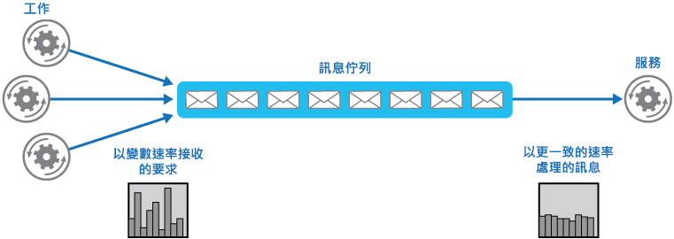
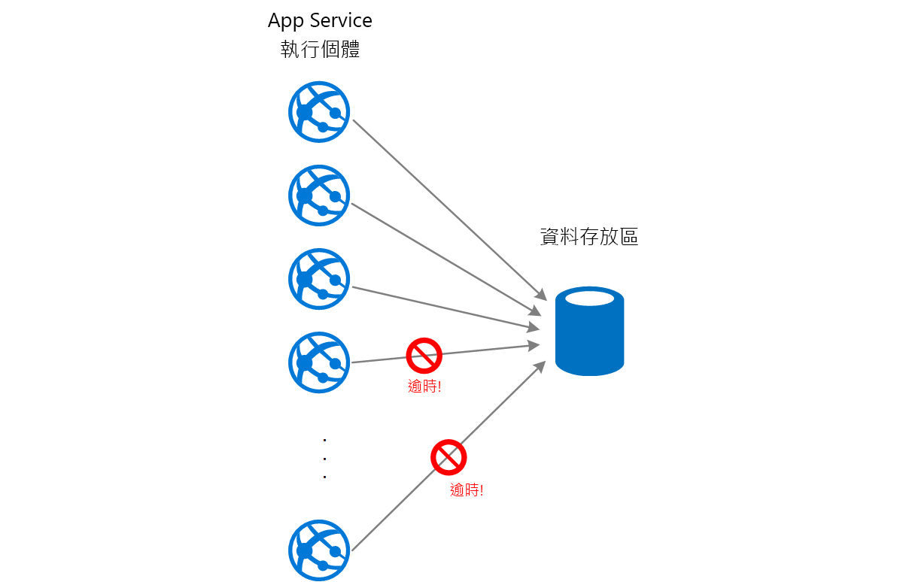

# 佇列型負載調節模式

[!INCLUDE [header](../_includes/header.md)]

使用佇列來作為工作與其所叫用服務之間的緩衝區，以緩和導致服務失敗或工作逾時之間歇性的繁重負載。這可協助將需求尖峰對工作及服務之可用性和回應性的影響降到最低。

## 內容和問題

許多雲端解決方案都涉及執行叫用服務的工作。 在此環境中，如果服務受間歇性的繁重負載限制，就可能造成效能或可靠性問題。

服務可以與使用它的工作屬於同一個解決方案，也可以是提供對常用資源 (例如快取或儲存體服務) 之存取權的協力廠商服務。 如果一些同時執行的工作使用相同的服務，則可能在任何時間都很難預測對該服務的要求量。

服務可能會經歷造成它多載的需求尖峰，而無法及時回應要求。 讓大量的並行要求湧入服務時，如果服務無法處理這些要求所造成的爭用，就也可能導致服務失敗。

## 解決方法

重構解決方案並在工作與服務之間導入佇列。 工作與服務會以非同步方式執行。 工作會將包含服務所需資料的訊息張貼至佇列。 佇列會作為緩衝區來儲存訊息，直到服務擷取該訊息為止。 服務會從佇列擷取訊息，然後處理這些訊息。 來自一些工作的要求 (可能以高變動的速率產生) 可以透過相同的訊息佇列傳遞給服務。 下圖顯示如何使用佇列來調節服務上的負載。

佇列會將工作與服務分離，服務可以用自己的步調來處理訊息，而不需顧及來自並行工作的要求量。 此外，在工作將訊息張貼至佇列時，如果服務無法供使用，也不會對工作造成延遲。

此模式提供下列優點：

- 它可協助將可用性提升到最高，因為在服務增加的延遲對應用程式不會有立即且直接的影響，即使服務無法供使用或目前並沒有在處理訊息，應用程式仍可繼續將訊息張貼至佇列。
- 它可協助將延展性擴充到最大，因為佇列數目和服務數目都可因應需求進行調整。
- 它可協助控制成本，因為只需部署適當數目的服務執行個體來滿足平均負載需求即可，無須考慮尖峰負載需求。

    >  有些服務會在需求達到臨界值時實作節流，超出此臨界值時系統可能就會發生失敗。 節流會縮減可用的功能。 您可以搭配這些服務實作負載調節，以確保不會達到此臨界值。

## 問題和考量

當您決定如何實作此模式時，請考慮下列幾點：

- 必須實作應用程式邏輯來控制服務處理訊息的速率，以避免超出目標資源負荷。 避免將需求尖峰傳遞到下一個系統階段。 測試負載中的系統以確保它提供所需的調節，並調整處理訊息的佇列數目和服務執行個體數目以達到此目的。
- 訊息佇列是一種單向通訊機制。 如果工作預期要從服務收到回覆，可能就必須實作可供服務用來傳送回應的機制。 如需詳細資訊，請參閱[非同步傳訊入門](https://msdn.microsoft.com/library/dn589781.aspx) \(英文\)。
- 對接聽佇列上要求的服務套用自動調整時，請小心。 這可能導致對這些服務所共用之任何資源發生爭用的情況增加，而降低使用佇列來調節負載的效果。

## 使用此模式的時機

如果應用程式使用受多載限制的服務，就適用此模式。

如果應用程式預期要在最短的延遲時間內從服務收到回應，則不適用此模式。

## 範例

Microsoft Azure Web 角色會使用個別的儲存體服務來儲存資料。 如果有大量 Web 角色執行個體同時執行，儲存體服務回應要求的速度可能會不夠快，而無法防止這些要求發生逾時或失敗。 下圖說明來自 Web 角色執行個體的大量並行要求導致超出服務負荷。

若要解決此問題，您可以使用佇列來調節 Web 角色執行個體與儲存體服務之間的負載。 不過，儲存體服務的設計是會接受同步要求，無法輕易修改來讀取訊息和管理輸送量。 您可以導入背景工作角色來作為 Proxy 服務，以從佇列接收要求再將要求轉送給儲存體服務。 背景工作角色中的應用程式邏輯可以控制將要求傳遞給儲存體服務的速率，以防止超出儲存體服務負荷。 下圖說明如何使用佇列和背景工作角色來調節 Web 角色執行個體與服務之間的負載。

## 相關的模式和指導方針

實作此模式時，下列模式和指導方針可能也相關：

- [非同步傳訊入門](https://msdn.microsoft.com/library/dn589781.aspx)。 訊息佇列原本就是非同步的。 如果將工作從與服務直接通訊改成使用訊息佇列，可能就必須重新設計工作中的應用程式邏輯。 同樣地，可能必須重構服務以從訊息佇列接受要求。 或者，也可以實作 Proxy 服務，如範例中所述。
- [競爭取用者模式](competing-consumers.md)。 您可以執行多個服務執行個體，每個執行個體都作為來自負載調節佇列的訊息取用者。 您可以使用此方法來調整接收訊息並將訊息傳遞給服務的速率。
- [節流模式](throttling.md)。 有一個搭配服務實作節流的簡單方式，就是使用佇列型負載調節，然後透過訊息佇列將所有要求路由傳送至服務。 服務可以用確保服務所需資源不會耗盡且可減少可能發生之爭用情況的速率來處理要求。
- [佇列服務概念](https://msdn.microsoft.com/library/azure/dd179353.aspx) \(英文\)。 有關 Azure 應用程式中選擇傳訊和佇列機制的資訊。
