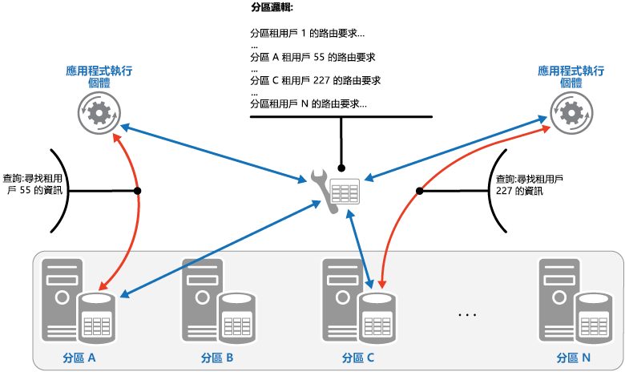

# <a name="sharding-pattern"></a>分區化模式

[!INCLUDE [header](../_includes/header.md)]

將資料存放區分割為一組水平分割或分區。 這可改善在儲存及存取大量資料時的延展性。

## <a name="context-and-problem"></a>內容和問題

單一伺服器所裝載的資料存放區必須遵守下列限制：

- **儲存體空間**。 大規模雲端應用程式的資料存放區預計會包含可能隨著時間大幅增加的大量資料。 伺服器通常只會提供有限數量的磁碟儲存體，但您可以用較大型的磁碟取代現有的磁碟，或隨著資料量成長將更多磁碟新增到機器。 不過，系統最終會達到限制，而不可能輕易在指定的伺服器上增加儲存體容量。

- **計算資源**。 需有雲端應用程式，才能支援大量的並行使用者，而每個並行使用者會執行查詢以從資料存放區擷取資訊。 裝載資料存放區的單一伺服器可能無法提供支援此負載所需的運算能力，以致使用者回應時間延長和頻繁發生錯誤，因為嘗試儲存和擷取資料的應用程式逾時。有可能新增記憶體或升級處理器，但系統將會達到限制，而不可能進一步增加計算資源。

- **網路頻寬**。 最後，在單一伺服器上執行之資料存放區的效能是由伺服器可以接收要求和傳送回覆的比率控管。 網路流量可能會超過用來連線到伺服器的網路容量，進而導致要求失敗。

- **地理**。 有可能需要儲存相同區域中的特定使用者為了法律、合規性或效能因素，或為了降低資料存取延遲而產生的資料。 如果使用者散佈於不同的國家或區域，則可能無法將應用程式的整個資料儲存在單一資料存放區中。

藉由新增更多容量、處理能力、記憶體和網路連線來進行垂直調整，可以延後其中某些限制的影響，但可能只是暫時的解決方案。 能夠支援大量使用者和大量資料的商業雲端應用程式，必須能夠幾乎無限期地調整，所以垂直調整不一定是最佳的解決方案。

## <a name="solution"></a>解決方法

將資料存放區分割為水平分割區或分區。 每個分區具有相同的結構描述，但會保存自己的相異資料子集。 分區本身就是資料存放區 (它可以包含各類型實體的資料)，其在伺服器上當作儲存體節點執行。

此模式具有下列優點：

- 藉由新增在其他儲存體節點上執行的更多分區，即可相應放大系統。

- 系統可以使用現成的硬體，而不是特殊且昂貴的電腦作為每個儲存體節點。

- 您可以透過平衡分區的工作負載，減少爭用情況並改善效能。

- 在雲端，分區實體可以位於接近將存取資料的使用者。

將資料存放區分割成多個分區時，請決定每個分區應放入哪些資料。 分區包含的項目通常落在由資料的一或多個屬性所決定的指定範圍內。 這些屬性會形成分區化引鍵 (有時稱為分割區索引鍵)。 分區索引鍵應該是靜態的。 它不該以可能變更的資料為基礎。

分區化實際上會組織資料。 當應用程式儲存和擷取資料時，分區化邏輯會將應用程式導向至適當的分區。 此分區化邏輯可在應用程式中當作資料存取程式碼的一部分來實作，而如果它明確支援分區化，則可能由資料儲存系統來實作。

提取分區化邏輯中資料的實體位置，可提供哪些分區包含哪些資料的高階控制。 如果分區中的資料稍後需要重新分配 (例如，分區變得不平衡時)，這也可讓資料在分區之間移轉，而不需修改應用程式的商務邏輯。 代價是在擷取每個資料項目時判斷其位置所需的額外資料存取負荷。

若要確保最佳效能和延展性，務必以適合應用程式所執行之查詢類型的方式將資料分割。 在許多情況下，分區化配置不可能完全符合每個查詢的需求。 例如，在多租用戶系統中，應用程式可能需要使用租用戶識別碼來擷取租用戶資料，但也可能需要根據其他屬性 (例如租用戶的名稱或位置) 來查閱此資料。 若要處理這些情況，請使用支援最常執行之查詢的分區化索引鍵來實作分區化策略。

如果查詢使用屬性值組合來定期擷取資料，您有可能將屬性連結在一起來定義複合分區索引鍵。 或者，使用[索引表格](index-table.md)等模式，根據分區索引鍵所未涵蓋的屬性來提供資料快速查閱。

## <a name="sharding-strategies"></a>分區化策略

選取分區索引鍵並決定如何將資料分散於各分區時經常使用三個策略。 請注意，分區與裝載它們的伺服器之間不一定是一對一對應關係&mdash;單一伺服器可以裝載多個分區。 策略如下：

**查閱策略**。 在此策略中，分區化邏輯會實作以下對應：使用分區索引鍵將資料要求傳送至包含該資料的分區。 在多租用戶應用程式中，可使用租用戶識別碼作為分區索引鍵，將租用戶的所有資料一起儲存在一個分區中。 多個租用戶可以共用相同的分區，但是單一租用戶的資料將不會分散於多個分區。 下圖說明如何根據租用戶識別碼將租用戶資料分區。

   


   分區索引鍵與實體儲存體之間的對應可以實體分區為基礎，其中每個分區索引鍵都會對應至一個實體分割區。 此外，虛擬資料分割是較有彈性的重新平衡分區技巧，其中的分區索引鍵會對應至相同數目的虛擬分區，然後再對應至較少的實體資料分割。 採用這種方法，應用程式可使用參照虛擬分區的分區索引鍵來找出資料，而系統會明確將虛擬分區對應至實體分割區。 不需將應用程式程式碼修改成使用一組不同的分區索引鍵，即可變更虛擬分區和實體分割區之間的對應。

**範圍策略**。 此策略會將相關項目一起分在相同的分區中，並依照分區索引鍵進行排序&mdash;分區索引鍵是連續的。 對於經常使用範圍查詢 (針對落在指定範圍內的分區索引鍵傳回一組資料項目的查詢) 來擷取項目集的應用程式而言，這個策略很實用。 例如，如果應用程式需要定期尋找在特定月份下單的所有訂單，若一個月份的所有訂單依照日期和時間順序儲存在相同的分區中，即可更快速地擷取此資料。 如果每筆訂單儲存在不同的分區中，他們必須藉由執行大量的點查詢 (可傳回單一資料項目的查詢) 來個別擷取。 下圖說明如何在分區中儲存連續的資料集 (範圍)。

   

在此範例中，分區索引鍵是複合索引鍵，其中包含訂單月份 (作為最重要元素)，後面接著訂單日期和時間。 建立新訂單並將其新增到分區時，訂單資料會自然排序。 某些資料存放區支援兩個部分的分區索引鍵：包含可識別分區的分割區索引鍵元素，以及可唯一識別分區中項目的資料列索引鍵。 資料通常會依照資料列索引鍵順序保存在分區中。 受限於範圍查詢而且需要分組在一起的項目，可以使用具有相同分割區索引鍵值，但其資料列索引鍵值是唯一的分區索引鍵。

**雜湊策略**。 此策略的目的在於降低熱點 (接收不當負載量的分區) 的可能性。 它會將資料分散於各分區，方法是讓每個分區大小之間取得平衡，且每個分區的負載達到平均。 分區化邏輯會根據資料的一或多個屬性之雜湊，計算要在其中儲存項目的分區。 所選的雜湊函式應將資料平均分散於各分區，有可能是藉由在計算中引入某個隨機元素。 下圖說明如何根據租用戶識別碼的雜湊將租用戶資料分區。

   

若要了解雜湊策略超越其他分區化策略的優勢，請考慮陸續註冊新租用戶的多租用戶應用程式可能會如何將租用戶指派給資料存放區中的分區。 使用範圍策略時，租用戶 1 到 n 的資料會全部儲存在分區 A 中，資料租用戶 n+1 到 m 的資料會全部儲存在分區 B 中，依此類推。 如果最近註冊的租用戶也是最活躍的租用戶，則大部分的資料活動會發生在少量分區中，這可能會造成熱點。 相反地，雜湊策略會根據租用戶識別碼的雜湊，將租用戶配置到各分區。 這表示後續租用戶最有可能配置到不同的分區，進而將負載分散於它們之中。 上圖顯示租用戶 55 和 56 的這點。

這三個分區化策略具有下列優點和考量：

- **查閱**。 這能夠更充分掌控分區的設定和使用方式。 使用虛擬分區可降低重新平衡資料時的影響，因為可以新增實體分割區來讓工作負載平均。 您可以修改虛擬分區與實作分區的實體分割區之間的對應，而不會影響使用分區索引鍵來儲存和擷取資料的應用程式程式碼。 查閱分區位置也可能造成額外的負擔。

- **範圍**。 這很容易實作而且適用於範圍查詢，因為它們通常可以從單一作業中的單一分區擷取多個資料項目。 此策略提供更簡單的資料管理。 例如，如果相同區域中的使用者位於相同分區，則可根據本機負載和需求模式在每個時區排定更新。 不過，此策略不提供分區之間的最佳平衡。 如果大部分的活動是針對相鄰的分區索引鍵，則重新平衡分區很困難，而且可能無法解決負載不平均的問題。

- **雜湊**。 此策略更有機會達到更平均的資料和負載分配。 使用雜湊函式可以直接完成要求傳送。 不需要維護對應。 請注意，計算雜湊可能會造成額外的負擔。 此外，重新平衡分區很困難。

最常見的分區化系統會實作上述其中一種方法，但您也應該考量您的應用程式的商務需求及其資料使用模式。 例如，在多租用戶的應用程式中：

- 您可以根據工作負載將資料分區。 您可以針對個別分區中變動極大的租用戶，隔離資料。 其他租用戶的資料存取速度可能會因此獲得改善。

- 您可以根據租用戶的位置將資料分區。 您可以讓特定地理區域的租用戶資料離線，以便在該區域的離峰時段進行備份和維護，而其他區域的租用戶資料仍在線上並可在其上班期間存取。

- 高價值的租用戶可被指派自己的私用、高效能、輕量負載分區，然而較低價值的租用戶則有可能共用更緊密壓縮、忙碌的分區。

- 您可以將需要高度資料隔離和隱私權之租用戶的資料儲存在完全不同的伺服器上。

## <a name="scaling-and-data-movement-operations"></a>調整和資料移動作業

每個分區化策略都意味著用於管理相應縮小、相應放大、資料移動以及維護狀態的不同功能和複雜度層級。

查閱策略允許在使用者層級實行調整和資料移動作業 (線上或離線)。 技巧是暫停部分或所有的使用者活動 (也許是在離峰期間)、將資料移到新的虛擬分割區或實體分區、變更對應、停用或重新整理任何保存此資料的快取，然後允許使用者活動繼續進行。 通常可以集中管理這類型的作業。 查閱策略需要可高度快取且容易複寫的狀態。

範圍策略會對調整和資料移動作業強加一些限制，這些限制通常必須在部分或所有資料存放區離線時實行，因為資料必須跨分區進行分割與合併。 如果大部分的活動是針對相鄰的分區索引鍵或相同範圍內的資料識別項，則移動資料來重新平衡分區可能無法解決負載不平均的問題。 範圍策略也可能需要維護狀態，以便將範圍對應至實體分割區。

雜湊策略讓調整和資料移動作業變得更複雜，因為分割區索引鍵是分區索引鍵或資料識別項的雜湊。 必須從雜湊函式來決定每個分區的新位置，或修改此函式以提供正確的對應。 不過，雜湊策略不需要維護狀態。

## <a name="issues-and-considerations"></a>問題和考量

當您決定如何實作此模式時，請考慮下列幾點：

- 分區化可補足其他形式的資料分割，例如垂直資料分割和功能性資料分割。 例如，單一分區可以包含已垂直分割的實體，而功能性分割區可以實作為多個分區。 如需資料分割的詳細資訊，請參閱[資料分割指引](https://msdn.microsoft.com/library/dn589795.aspx)。

- 讓分區保持平衡，它們才能處理類似的 I/O 數量。 插入和刪除資料時，必須定期重新平衡分區，才能保證平均分配並降低熱點的可能性。 重新平衡是一項成本高昂的作業。 若要減少重新平衡的必要性，請確保每個分區都包含足夠的可用空間可處理預期的變更量，藉此規劃成長。 如有必須重新平衡，您也應該開發出可用來快速重新平衡分區的策略和指令碼。

- 使用穩定的資料作為分區索引鍵。 如果分區索引鍵變更，則可能必須在分區之間移動對應的資料項目，因而增加更新作業所執行的工作量。 基於這個理由，避免以可能易變的資訊作為分區化索引鍵的基礎。 請改為尋找不變或自然形成索引鍵的屬性。

- 確定分區索引鍵是唯一的。 例如，避免使用自動遞增欄位作為分區索引鍵。 在某些系統中，自動遞增欄位無法跨分區協調，而可能導致不同分區中的項目具有相同的分區索引鍵。

    >  其他欄位中不是分區索引鍵的自動遞增值也可能造成問題。 例如，如果您使用自動遞增欄位來產生唯一識別碼，則不同分區中的兩個不同項目可能會被指定相同的識別碼。

- 有可能無法設計出符合每項可能資料查詢之需求的分區索引鍵。 將資料分區以支援最常執行的查詢，並視需要建立次要索引表格，以支援使用以不屬於分區索引鍵的屬性為基礎的準則來擷取資料的查詢。 如需詳細資訊，請參閱[索引表格模式](index-table.md)。

- 只存取單一分區的查詢會比從多個分區擷取資料的查詢更有效率，所以請避免實作以下所述的分區化系統：導致應用程式執行會聯結不同分區所保存資料的大量查詢。 請記住，單一分區可以包含多種實體類型的資料。 請考慮將資料反正規化，以將經常查詢的相關實體(例如客戶的詳細資料及其所下的訂單) 一起保留在相同的分區中，以減少應用程式執行的個別讀取次數。

    >  如果一個分區中的實體參考儲存在另一個分區中的實體，請將第二個實體的分區索引鍵納入第一個實體的結構描述中。 這有助於改善參考各分區相關資料的查詢效能。

- 如果應用程式必須執行可從多個分區擷取資料的查詢，則可能使用平行工作來擷取此資料。 範例包括展開傳送查詢，其中來自多個分區的資料是以平行方式擷取，然後彙總成單一結果。 不過，這種方法必然會使解決方案的資料存取邏輯增加一些複雜性。

- 對於許多應用程式而言，建立較多小型分區可能會比具有少量大型分區更有效率，因為它們可提供比較多的負載平衡機會。 如果您預料有在不同實體位置之間移轉分區的需求，這也很有用。 移動小型分區比移動大型分區還要快。

- 確保每個分區儲存體節點的可用資源充足，可處理資料大小和輸送量方面的延展性需求。 如需詳細資訊，請參閱[資料分割指引](https://msdn.microsoft.com/library/dn589795.aspx)中的「設計分割區的延展性」一節。

- 請考慮將參考資料複寫到所有分區。 如果從分區擷取資料的作業在相同查詢的過程中，也會參考靜態或移動緩慢的資料，請將此資料新增至該分區。 應用程式可以接著輕鬆擷取查詢的所有資料，而不需要對不同的資料存放區進而額外的來回行程。

    >  如果參考資料保存於多個分區變更中，則系統必須在所有分區間同步處理這些變更。 進行此同步處理時，系統可能遭遇某個程度的不一致。 如果您這麼做，您應該將應用程式設計成能夠處理這種情況。

- 分區之間的參考完整性和一致性難以維護，因此您應該將會影響多個分區中資料的作業減至最少。 如果應用程式必須修改跨分區的資料，請評估是否確實需要完全的資料一致性。 相反地，雲端中的常見方法是實作最終一致性。 每個分割區中的資料會分開更新，而應用程式邏輯必須負責確保成功完成所有更新，以及處理在執行最終一致的作業時，由查詢資料所引起的不一致。 如需實作最終一致性的詳細資訊，請參閱[資料一致性入門](https://msdn.microsoft.com/library/dn589800.aspx)。

- 設定和管理大量分區可能是一大挑戰。 必須在可能保存於多個位置的多個分區與伺服器上完成各項工作 (例如監視、備份、一致性檢查和記錄或稽核)。 這些工作可能是使用指令碼或其他自動化解決方案來實作，但是這不可能完全消除其他系統管理需求。

- 分區可以進行地理定位，所以其中包含的資料很接近使用該分區之應用程式的執行個體。 這種方法可以大幅改善效能，但是對於必須存取不同位置中多個分區的工作，則需要額外的考量。

## <a name="when-to-use-this-pattern"></a>使用此模式的時機

當資料存放區可能需要擴充超過單一儲存體節點可用的資源時，或藉由減少資料存放區中的爭用情形來改善效能時，請使用此模式。

>  分區化的主要焦點在於改善系統的效能和延展性，但其附帶結果是也可因為資料分割成不同分割區的方式而改善可用性。 一個分割區發生失敗不一定會使應用程式無法存取其他分割區中保存的資料，而操作人員可以執行一或多個分割區的維護或復原，而不會使應用程式的整個資料無法存取。 如需詳細資訊，請參閱[資料分割指引](https://msdn.microsoft.com/library/dn589795.aspx)。

## <a name="example"></a>範例

下列以 C# 撰寫的範例使用一組 SQL Server 資料庫作為分區。 每個資料庫都會保存應用程式所使用的資料子集。 應用程式會使用自己的分區化邏輯來擷取分散於各分區的資料 (這是展開傳送查詢範例)。 `GetShards` 方法會傳回各分區中資料的詳細資料。 這個方法會傳回可列舉的 `ShardInformation` 物件清單，其中 `ShardInformation` 類型包含每個分區的識別碼，以及應用程式應用於連線至分區的 SQL Server 連接字串 (此連接字串不會顯示在程式碼範例中)。

```csharp
private IEnumerable<ShardInformation> GetShards()
{
  // This retrieves the connection information from a shard store
  // (commonly a root database).
  return new[]
  {
    new ShardInformation
    {
      Id = 1,
      ConnectionString = ...
    },
    new ShardInformation
    {
      Id = 2,
      ConnectionString = ...
    }
  };
}
```

下列程式碼顯示應用程式如何使用 `ShardInformation` 清單物件來執行查詢，以從每個分區平行擷取資料。 不會顯示查詢的詳細資料，但在此範例中，如果分區包含客戶的詳細資料，則所擷取的資料包含可保存客戶名稱等資訊的字串。 結果會彙總成 `ConcurrentBag` 集合，以供應用程式處理。

```csharp
// Retrieve the shards as a ShardInformation[] instance.
var shards = GetShards();

var results = new ConcurrentBag<string>();

// Execute the query against each shard in the shard list.
// This list would typically be retrieved from configuration
// or from a root/master shard store.
Parallel.ForEach(shards, shard =>
{
  // NOTE: Transient fault handling isn't included,
  // but should be incorporated when used in a real world application.
  using (var con = new SqlConnection(shard.ConnectionString))
  {
    con.Open();
    var cmd = new SqlCommand("SELECT ... FROM ...", con);

    Trace.TraceInformation("Executing command against shard: {0}", shard.Id);

    var reader = cmd.ExecuteReader();
    // Read the results in to a thread-safe data structure.
    while (reader.Read())
    {
      results.Add(reader.GetString(0));
    }
  }
});

Trace.TraceInformation("Fanout query complete - Record Count: {0}",
                        results.Count);
```

## <a name="related-patterns-and-guidance"></a>相關的模式和指導方針

實作此模式時，下列模式和指導方針可能也相關：
- [資料一致性入門](https://msdn.microsoft.com/library/dn589800.aspx)。 有可能必須維護分散於不同分區之資料的一致性。 摘要說明維護分散式資料一致性的相關問題，並說明不同的一致性模型的優點和權衡取捨。
- [資料分割指引](https://msdn.microsoft.com/library/dn589795.aspx)。 將資料存放區分區化會造成其他各種問題。 說明在雲端分割資料存放區的相關問題，可改善延展性、減少爭用，以及將效能最佳化。
- [索引表格模式](index-table.md)。 有時不可能只透過分區化索引鍵的設計來完全支援查詢。 指定分區索引鍵以外的索引鍵，即可讓應用程式從大型資料存放區快速擷取資料。
- [具體化檢視模式](materialized-view.md)。 若要維護某些查詢作業的效能，建立可彙總及摘要資料的具體化檢視很實用，尤其在此摘要資料是以分散於各分區的資訊為基礎時。 說明如何產生及填入這些檢視。
