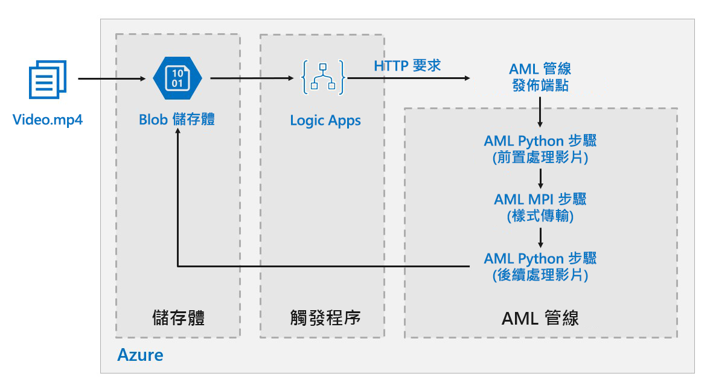

# Azure 上適用於深入學習模型的批次評分

此參考架構會示範如何使用 Azure Machine Learning 將類神經樣式傳輸套用到影片。 「樣式傳輸」是一種深入學習技術，可使用另一個影像的樣式來編撰現有影像。 此架構可以廣泛應用到任何搭配使用深入學習的批次評分案例。 [**部署這個解決方案**](#deploy-the-solution)。

**案例**：媒體組織想要讓他們的影片樣式看起來像是特定畫作。 組織想要及時且自動地將此樣式套用至影片的所有畫面。 如需類神經樣式傳輸演算法的詳細背景，請參閱[使用卷積神經網路的影像樣式傳輸][image-style-transfer] (PDF)。

| 樣式影像： | 輸入/內容影片： | 輸出影片： |
|--------|--------|---------|
|  |  按一下以檢視影片 |  按一下以檢視影片 |

此參考架構適用於當 Azure 儲存體中有新媒體出現時就會觸發的工作負載。

處理程序包含下列步驟：

1. 將影片檔案上傳至儲存體。
1. 影片檔案會觸發邏輯應用程式，以將要求傳送至 Azure Machine Learning 管線發佈的端點。
1. 此管線會處理影片、利用 MPI 套用樣式傳輸，以及後置處理影片。
1. 一旦管線完成，輸出就會存回 blob 儲存體。

## 架構

此架構由下列元件組成。

### 計算

**[Azure Machine Learning 服務][ amls]** 會使用 Azure Machine Learning 管線，來建立可重現且易於管理的計算順序。 它也會提供名為 [Azure Machine Learning Compute][aml-compute] 的受控計算目標 (管線計算可在其上執行)，用於對機器學習模型進行訓練、部署和評分。 

### 儲存體

**[Blob 儲存體][blob-storage]** 用來儲存所有影像 (輸入影像、樣式影像與輸出影像)。 Azure Machine Learning 服務會與 Blob 儲存體整合，以便使用者不必跨運算平台和 Blob 儲存體手動移動資料。 對於此工作負載需要的效能，Blob 儲存體也非常符合成本效益。

### 觸發程序/排程

**[Azure Logic Apps][logic-apps]** 會用來觸發工作流程。 當邏輯應用程式偵測到 Blob 已新增至容器時，它會觸發 Azure Machine Learning 管線。 Logic Apps 十分適合此參考架構，因為用它來偵測 Blob 儲存體的變更相當容易，並且還提供簡單的程序來變更觸發程序。

### 前置處理和後置處理我們的資料

此參考架構會使用有一隻猩猩在樹上的影片畫面。 您可以從[這裡][source-video]下載畫面。

1. 使用 [FFmpeg][ffmpeg] 從影片畫面擷取音訊檔案，以便稍後可以將音訊檔案拼接回輸出影片。
1. 使用 FFmpeg 將影片分成個別的畫面。 畫面會以平行方式獨立處理。
1. 此時，我們可以平行地將類神經樣式傳輸套用至每個個別畫面。
1. 一旦處理了每個畫面，就需要使用 FFmpeg 來重新拼接回這些畫面。
1. 最後我們會將音訊檔案重新附加至重新拼接的畫面。

## 效能考量

### GPU 與 CPU

針對深入學習工作負載，GPU 的效能通常遠勝於 CPU，但若只能使用 CPU，通常需要大量 CPU 才能擁有相當的效能。 雖然您在此架構中可以選擇只使用 CPU，但 GPU 將能提供成本/效能更好的設定檔。 我們建議使用最新 [NCv3 系列]vm-sizes-gpu 的 GPU 最佳化 VM。

並非所有區域都會將 GPU 預設為啟用。 請務必選取已啟用 GPU 的區域。 此外，針對 GPU 最佳化的 VM，訂用帳戶的預設核心配額為零。 您可以提出支援要求來提高這個配額。 請確定您訂用帳戶上的配額足以執行工作負載。

### 在 VM 與核心上平行處理

若以批次作業的形式來執行樣式傳輸程序，主要在 GPU 上執行的作業將必須在 VM 上平行進行處理。 這可能會有兩種方法：您可以建立較大的叢集，使用具有單一 GPU 的 VM，或建立較小的叢集，使用具有許多 GPU 的 VM。

針對此工作負載，這兩個選項會有相當的效能。 使用較少 VM (每個 VM 有多個 GPU) 有助於減少資料移動。 不過，此功能流程上每項作業的資料量都不是非常大，因此您不會看到 Blob 儲存體有太多節流動作。

### MPI 步驟 

在 Azure Machine Learning 中建立管線時，其中一個用來執行平行計算的步驟為 MPI 步驟。 MPI 步驟會協助將資料平均分割在可用節點之間。 直到準備好所要求的節點後，MPI 步驟才會執行。 如果某個節點失敗或失去先機 (若它是低優先順序虛擬機器)，則 MPI 步驟將必須重新執行。 

## 安全性考量

### 限制 Azure Blob 儲存體的存取

在此參考架構中，Azure Blob 儲存體是需要保護的主要儲存體元件。 GitHub 存放庫中所示的基準部署會使用儲存體帳戶金鑰來存取 Blob 儲存體。 如需進一步的控制和保護，請考慮改為使用共用存取簽章 (SAS)。 這會針對儲存體中的物件授與有限的存取權，而且無須對帳戶金鑰進行硬式編碼，或將它們儲存成純文字。 此方法特別實用，因為帳戶金鑰會以純文字形式顯示在邏輯應用程式的設計工具介面內。 使用 SAS 也有助於確保儲存體帳戶具有適當的控管，而且該存取權也只會授與應該擁有此權限的人員。

如果在具有很多敏感性資料的情況下，請確定所有儲存體金鑰都會受到保護，因為這些金鑰可授與工作負載中所有輸入和輸出資料的完整存取。

### 資料加密和資料移動

此參考架構會使用樣式傳輸作為批次評分程序的範例。 針對資料敏感性更高的案例，儲存體中的資料應該使用待用加密。 每當資料從一個位置移至下一個位置時，應使用 SSL 來保護資料轉送。 如需詳細資料，請參閱 [Azure 儲存體安全性指南][storage-security]。

### 保護虛擬網路中的計算

部署 Machine Learning 叢集時，您可以將叢集設定為在[虛擬網路][virtual-network]的子網路內佈建。 這可讓叢集中的計算節點與其他虛擬機器安全地通訊。 

### 防範惡意活動

在有多個使用者的案例中，請確定敏感性資料已受到保護，以防範惡意活動。 如果有其他使用者取得此部署的存取權，因而能自訂輸入資料，請注意下列預防措施和考量：

- 使用 RBAC 來限制使用者只能存取所需資源。
- 佈建兩個不同的儲存體帳戶。 將輸入和輸出資料儲存在第一個帳戶。 此帳戶可讓外部使用者存取。 將可執行檔的指令碼及輸出的記錄檔放在其他帳戶。 外部使用者不可存取此帳戶。 這可確保外部使用者無法修改任何可執行檔 (插入惡意程式碼)，並且無法存取可能保存著敏感資訊的記錄檔。
- 惡意使用者可以對作業佇列發動 DDOS，或將格式有誤的有害訊息插入作業佇列中，造成系統鎖住或導致清除佇列錯誤。

## 監視和記錄

### 監視 Batch 工作

當您執行工作時，務必監視進度，並確定一切運作正常。 不過，監視整個叢集上的使用中節點可能不容易。

若要了解叢集的整體狀態，請移至 Azure 入口網站的 Machine Learning 刀鋒視窗，以檢查叢集中的節點狀態。 如果節點狀態是非使用中或作業已失敗，則錯誤記錄會儲存在 Blob 儲存體中，您也可在 Azure 入口網站中存取錯誤記錄。

若要進一步擴充監視功能，您可以將記錄連線到 Application Insights，或執行不同處理程序來對叢集和其作業的狀態進行輪詢。

### 使用 Azure Machine Learning 來記錄

Azure Machine Learing 會自動記錄相關 Blob 儲存體帳戶的所有 stdout/stderr。 除非另有指定，否則您的 Azure Machine Learning 工作區會自動佈建儲存體帳戶，並將您的記錄傾印至其中。 您也可以使用儲存體總管之類的儲存體瀏覽工具，其可讓您更輕鬆地瀏覽記錄檔。

## 成本考量

相較於儲存體和排程元件，此參考架構中所使用的計算資源才是影響成本的關鍵。 其中一個最大的挑戰就是，在已啟用 GPU 的機器中，有效地平行進行叢集上的工作。

Machine Learning Compute 叢集大小可根據佇列中的作業，自動地相應增加和減少。 您可以藉由設定最小和最大節點數，以程式設計方式啟用自動調整。

對於不需要立即處理的工作，可設定自動調整，如此一來，預設狀態 (最小值) 就是零個節點的叢集。 使用此設定時，叢集一開始會有零個節點，並只在偵測到佇列中有作業時，才會相應增加。 如果批次評分程序一天只會發生幾次 (或更少)，則此設定可省下大量成本。

自動調整可能不適合間距太近的批次作業。 啟動及關閉叢集所花費的時間也會產生成本，因此如果批次工作負載會在前一個作業結束後的幾分鐘內啟動，那麼讓叢集在作業之間持續運作可能比較符合成本效益。

Machine Learning Compute 也支援低優先順序虛擬機器。 這可讓您在忽視的虛擬機器上執行計算，但注意它們可能隨時失去先機。 低優先順序虛擬機器非常適合於非關鍵性批次評分工作負載。

## 部署解決方案

若要部署此參考架構，請遵循 [GitHub 存放庫][deployment]中所述的步驟。

> [!NOTE]
> 您也可以使用 Azure Kubernetes Service，為深度學習模型部署批次評分架構。 請依照此 [Github][deployment2] 存放庫中所述的步驟。

<!-- links -->

[aml-compute]: /azure/machine-learning/service/how-to-set-up-training-targets#amlcompute
[amls]: /azure/machine-learning/service/overview-what-is-azure-ml
[azcopy]: /azure/storage/common/storage-use-azcopy-linux
[blob-storage]: /azure/storage/blobs/storage-blobs-introduction
[container-instances]: /azure/container-instances/
[container-registry]: /azure/container-registry/
[deployment]: https://github.com/Azure/Batch-Scoring-Deep-Learning-Models-With-AML
[deployment2]: https://github.com/Azure/Batch-Scoring-Deep-Learning-Models-With-AKS
[ffmpeg]: https://www.ffmpeg.org/
[image-style-transfer]: https://www.cv-foundation.org/openaccess/content_cvpr_2016/papers/Gatys_Image_Style_Transfer_CVPR_2016_paper.pdf
[logic-apps]: /azure/logic-apps/
[source-video]: https://happypathspublic.blob.core.windows.net/videos/orangutan.mp4
[storage-security]: /azure/storage/common/storage-security-guide
[vm-sizes-gpu]: /azure/virtual-machines/windows/sizes-gpu
[virtual-network]: /azure/machine-learning/service/how-to-enable-virtual-network
