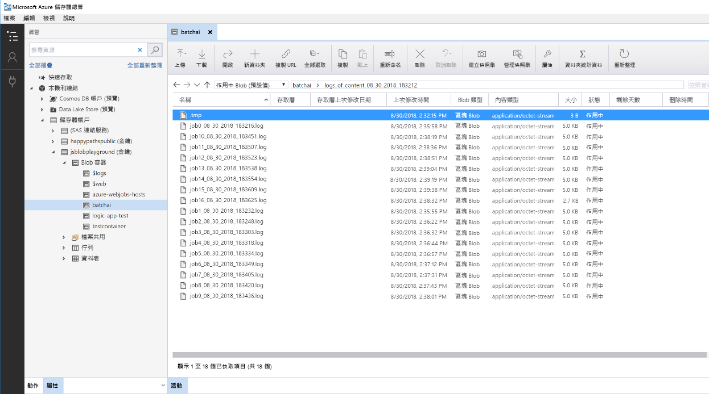

# Azure 上的 Python 模型批次評分

此參考架構會示範如何使用 Azure Batch AI 建置可根據排程同時對許多模型進行批次評分的可調整解決方案。 此方案可作為範本，並可廣泛用於不同的問題。

此架構的參考實作可在  [GitHub][github] 上取得。

**案例**：此解決方案可監視 IoT 設定中大量裝置的作業，這其中的每個裝置都會持續傳送感應器讀數。 我們假設每個裝置已預先定型異常偵測模型，可用來預測一系列的量值 (在預先定義的時間間隔內彙總) 是否會對應到異常狀況。 在真實案例中，這可能是需要先進行篩選和彙總的感應器讀數資料流，然後才能用於訓練和即時評分。 為了方便起見，此解決方案會在執行評分作業時使用相同的資料檔案。

## 架構

此架構由下列元件組成：

[Azure 事件中樞][event-hubs]。 此訊息擷取服務每秒可內嵌數百萬個事件訊息。 在此架構中，感應器會將資料流傳送到事件中樞。

[Azure 串流分析][stream-analytics]。 事件處理引擎。 串流分析作業會從事件中樞讀取資料流，並執行串流處理。

[Azure Batch AI][batch-ai]。 此分散式計算引擎會用來定型及測試 Azure 中大量機器學習和 AI 模型。 Batch AI 會依需求使用自動調整選項來建立虛擬機器，而 Batch AI 叢集中的每個節點都會執行特定感應器的評分作業。 評分 Python [指令碼][python-script] 會在建立於每個叢集節點上的 Docker 容器中執行，並在其中讀取相關的感應器資料、產生預測，然後將這些預測儲存在 Blob 儲存體中。

> [!NOTE]
> Azure Batch AI 服務即將於 2019 年 3 月停用，目前 [Azure Machine Learning 服務][amls]中已推出其大規模訓練與評分功能。 此參考架構即將更新為使用機器學習，其提供名為 [Azure Machine Learning Compute][aml-compute] 的受控計算目標，用於對機器學習模型進行訓練、部署和評分。

[Azure Blob 儲存體][storage]。 Blob 容器會用來儲存預先定型的模型、資料和輸出預測。 模型會上傳至 [create\_resources.ipynb][create-resources] Notebook 中的 Blob 儲存體。 用來訓練這些[單一類別 SVM][one-class-svm] 模型的資料，代表著不同裝置上不同感應器的值。 此解決方案會假設資料值是在固定時間間隔上彙總的。

[Azure Logic Apps][logic-apps]。 此解決方案會建立每小時執行 Batch AI 作業的邏輯應用程式。 Logic Apps 提供建立執行階段工作流程的簡單方法，並且會針對解決方案進行排程。 Batch AI 作業會使用 Python [指令碼][script] 來提交，而此指令碼也在 Docker 容器中執行。

[Azure Container Registry][acr]。 Batch AI 和 Logic Apps 中都會使用 Docker 映像，而該映像會建立在 [create\_resources.ipynb][create-resources] Notebook 中，然後推送至 Container Registry。 這方式可讓您輕鬆透過其他 Azure 服務 (在此解決方案中為 Logic Apps 和 Batch AI) 來裝載映像和具現化容器。

## 效能考量

對於標準 Python 模型，普遍認為 CPU 足以處理工作負載。 此架構會使用 CPU。 但是，針對[深度學習工作負載][deep]，GPU 的效能通常遠勝於 CPU，但若只能使用 CPU，通常需要大量 CPU 才能擁有相當的效能。

### 在 VM 與核心上平行處理

若要以批次模式執行許多模型的評分程序，這些作業必須在各 VM 上平行進行。 這可能會有兩種方法：

* 使用低成本 VM 建立更大的叢集。

* 使用高效能 VM 建立較小的叢集，而每個 VM 上有多個可用核心。

一般情況下，標準 Python 模型的評分需求與深度學習模型的評分需求不同，小型叢集應能夠有效率地處理大量已排入佇列的模型。 您可以在資料集大小增加時增加叢集節點數目。

為了方便起見，在此案例中，單一評分工作會在單一 Batch AI 作業中提交。 但是，在相同 Batch AI 作業內評分多個資料區塊其實會更有效率。 在這些情況下，可撰寫自訂程式碼在多個資料集中進行讀取，以及在執行單一 Batch AI 作業期間對這些資料集執行評分指令碼。

### 檔案伺服器

使用 Batch AI 時，您可以根據您案例所需輸送量選擇多個儲存體選項。 針對輸送量需求低的工作負載，使用 Blob 儲存體應該就已足夠。 或者，Batch AI 也支援 [Batch AI 檔案伺服器][bai-file-server]，此受控的單一節點 NFS 可自動裝載到叢集節點上，為作業提供集中存取的儲存體位置。 在大部分情況下，工作區中只需要一個檔案伺服器，而且您可以將訓練作業的資料分到不同目錄中。

如果單一節點 NFS 不適用於您的工作負載，Batch AI 還可支援其他儲存體選項，包括 [Azure 檔案服務][azure-files]和自訂解決方案，例如 Gluster 或 Lustre 檔案系統。

## 管理考量

### 監視 Batch AI 作業

監視執行中作業的進度相當重要，但要監視叢集上的作用中節點可能很困難。 若要了解叢集的整體狀態，請移至 [Azure 入口網站][portal]的 [Batch AI] 刀鋒視窗，以檢查叢集中的節點狀態。 如果節點狀態是非使用中或作業已失敗，則錯誤記錄會儲存在 Blob 儲存體中，您也可在入口網站的 [作業] 刀鋒視窗中存取錯誤記錄。

如需更多監視功能，您可以將記錄連線到 [Application Insights][ai]，或執行不同處理程序來對 Batch AI 叢集和其作業狀態進行輪詢。

### Batch AI 中的記錄功能

Batch AI 會記錄相關聯 Azure 儲存體帳戶的所有 stdout/stderr。 若要輕鬆瀏覽記錄檔，您可以使用 [Azure 儲存體總管][explorer]之類的儲存體瀏覽工具。

當您部署此參考架構時，有個選項可讓您設定更簡單的記錄系統。 使用此選項時，不同作業上的所有記錄都會儲存到您 Blob 容器中的相同目錄，如下所示。 使用這些記錄來監視每個作業和每個映像的處理時間，就可讓您更佳了解如何最佳化程序。

## 成本考量

此參考架構中成本最高的元件是計算資源。

Batch AI 叢集大小可根據佇列中的作業來相應增加和減少。 您可以使用兩種方式中的其中一種來啟用 Batch AI 的[自動調整功能][automatic-scaling]。 您可以透過程式設計的方式來完成，也就是在 .env 檔案中進行設定 (這是[部署步驟][github]的一部份)，或是在建立叢集之後，直接在入口網站中變更調整公式。

對於不需要立即處理的工作，可設定自動調整公式，如此一來，預設狀態 (最小值) 就是零個節點的叢集。 使用此設定時，叢集一開始會有零個節點，並只在偵測到佇列中有作業時，才會相應增加。 如果批次評分程序一天只會發生幾次 (或更少)，則此設定可省下大量成本。

自動調整可能不適合間距太近的批次作業。 啟動及關閉叢集所花費的時間也會產生成本，因此如果批次工作負載會在前一個作業結束後的幾分鐘內啟動，那麼讓叢集在作業之間持續運作可能比較符合成本效益。 這取決於評分程序是排定為高頻率執行 (例如每小時) 或低頻率執行 (例如一個月一次)。

## 部署解決方案

此架構的參考實作可在 [GitHub][github] 上取得。 遵循該處的設定步驟，即可使用 Batch AI 建置可同時對許多模型進行批次評分的可調整解決方案。

[acr]: /azure/container-registry/container-registry-intro
[ai]: /azure/application-insights/app-insights-overview
[aml-compute]: /azure/machine-learning/service/how-to-set-up-training-targets#amlcompute
[amls]: /azure/machine-learning/service/overview-what-is-azure-ml
[automatic-scaling]: /azure/batch/batch-automatic-scaling
[azure-files]: /azure/storage/files/storage-files-introduction
[batch-ai]: /azure/batch-ai/
[bai-file-server]: /azure/batch-ai/resource-concepts#file-server
[create-resources]: https://github.com/Azure/BatchAIAnomalyDetection/blob/master/create_resources.ipynb
[deep]: /azure/architecture/reference-architectures/ai/batch-scoring-deep-learning
[event-hubs]: /azure/event-hubs/event-hubs-geo-dr
[explorer]: https://azure.microsoft.com/en-us/features/storage-explorer/
[github]: https://github.com/Azure/BatchAIAnomalyDetection
[logic-apps]: /azure/logic-apps/logic-apps-overview
[one-class-svm]: http://scikit-learn.org/stable/modules/generated/sklearn.svm.OneClassSVM.html
[portal]: https://portal.azure.com
[python-script]: https://github.com/Azure/BatchAIAnomalyDetection/blob/master/batchai/predict.py
[script]: https://github.com/Azure/BatchAIAnomalyDetection/blob/master/sched/submit_jobs.py
[storage]: /azure/storage/blobs/storage-blobs-overview
[stream-analytics]: /azure/stream-analytics/
