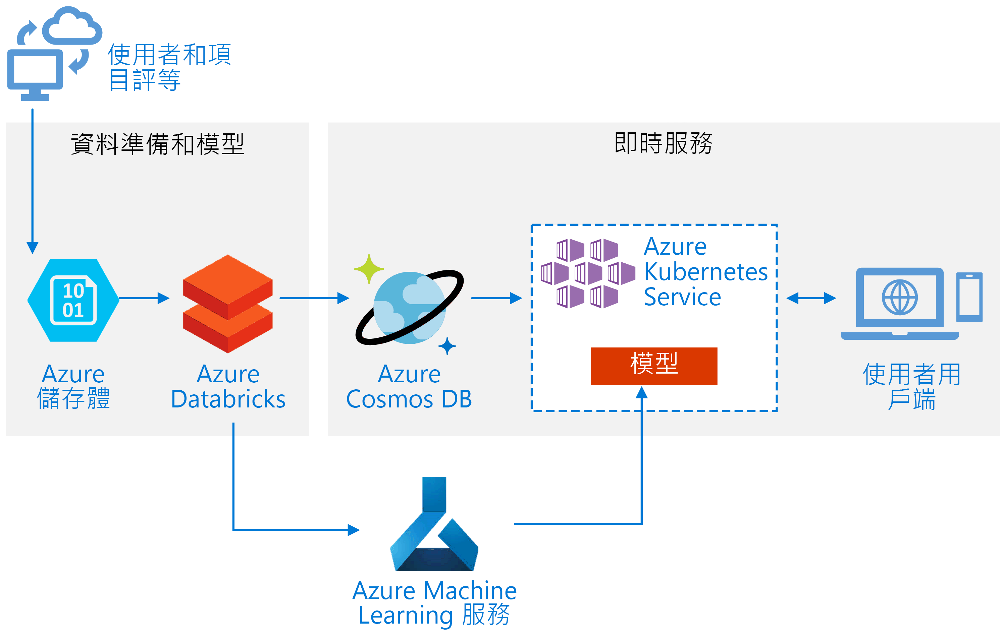
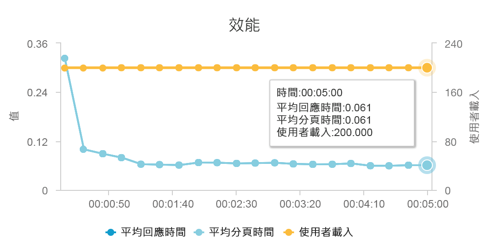
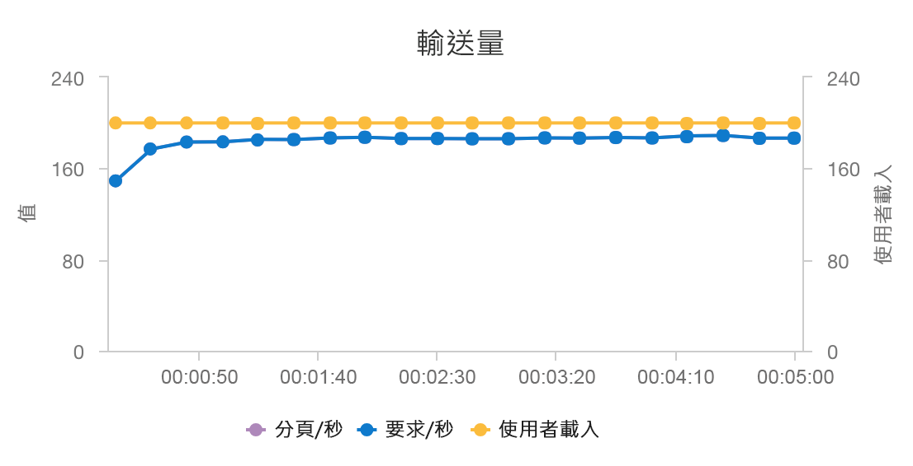

# <a name="build-a-real-time-recommendation-api-on-azure"></a>在 Azure 上建置即時建議 API

此參考架構會示範如何使用 Azure Databricks 定型建議模型，並使用 Azure Cosmos DB、Azure Machine Learning 和 Azure Kubernetes Service (AKS) 將其部署為 API。 此架構可廣泛用在大部分的建議引擎案例，包括產品、電影和新聞的建議。

此架構的參考實作可在 [GitHub](https://github.com/Microsoft/Recommenders/blob/master/notebooks/05_operationalize/als_movie_o16n.ipynb) 上取得。



**案例**：媒體組織想要提供電影或影片建議給其使用者。 藉由提供個人化的建議，組織就可達成數個商務目標，包括增加的點擊率、增加的網站參與度和更高的使用者滿意度。

此參考架構適用於定型和部署即時建議服務 API，而這可為特定使用者提供前 10 個電影建議。

此建議模型的資料流程如下所示：

1. 追蹤使用者行為。 例如，當使用者對影片進行評等，或是按一下產品或新聞文章時，後端服務可能會加以記錄。

2. 將資料從可用的[資料來源][data-source]載入至 Azure Databricks。

3. 準備資料，並將資料分割成訓練集和測試集來定型模型。 ([本指南][guide]會說明資料分割選項。)

4. 對資料套用 [Spark 協同篩選][als]模型。

5. 使用評等和排名計量來評估模型的品質。 ([本指南][eval-guide]會提供用來評估您建議程式的計量相關資料。)

6. 預先計算每個使用者和存放區的前 10 個建議，並作為 Azure Cosmos DB 中的快取。

7. 使用 Azure Machine Learning API 將 API 服務部署至 AKS，以將 API 容器化並對其進行部署。

8. 當後端服務取得使用者的要求時，呼叫 AKS 中裝載的建議 API 來取得前 10 個建議，並向使用者顯示這些建議。

## <a name="architecture"></a>架構

此架構由下列元件組成：

[Azure Databricks][databricks]。 Databricks 是開發環境，用來準備輸入資料和定型 Spark 叢集上的建議程式模型。 Azure Databricks 也會提供可在 Notebook 上執行和共同作業的互動式工作區，以進行任何資料處理或機器學習工作。

[Azure Kubernetes Service][aks] (AKS)。 AKS 會用來部署及操作化 Kubernetes 叢集上的機器學習模型服務 API。 AKS 會裝載容器化的模型，並提供符合輸送量需求的延展性、身分識別和存取管理，以及記錄和健康情況監視。

[Azure Cosmos DB][cosmosdb]。 Cosmos DB 是全域分散式資料庫服務，用來儲存每個使用者的前 10 個建議電影。 Azure Cosmos DB 十分適用於此案例，因為其提供低延遲 (第 99 個百分位數上的 10 毫秒) 來讀取指定使用者的前幾個建議項目。

[Azure Machine Learning 服務][mls]。 這項服務可用來追蹤和管理機器學習模型，然後將這些模型封裝並部署至可調整的 AKS 環境。

[Microsoft Recommenders][github]。 此開放原始碼存放庫包含公用程式的程式碼和範例，可協助使用者開始建置、評估和操作化建議系統。

## <a name="performance-considerations"></a>效能考量

效能是即時建議的主要考量，因為建議通常會落在網站上使用者所提要求的關鍵路徑上。

結合 AKS 和 Azure Cosmos DB 可讓此架構提供好的起點，並以最少的額外負荷為中型工作負載提供建議項目。 在有 200 個並行使用者的負載測試中，此架構以大約 60 毫秒的延遲中位數提供建議項目，並以每秒 180 個要求的輸送量執行。 負載測試會針對預設的部署組態執行 (3 x D3 v2 AKS 叢集，包含 12 個 vCPU、42 GB 記憶體和為 Azure Cosmos DB 佈建的每秒 11,000 個[要求單位 (RU)][ru])。





之所以建議使用 Azure Cosmos DB，是因為其具有周全的全域散發功能，以及滿足任何資料庫需求的實用性。 如需稍微[更快的延遲][latency]，請考慮使用 [Azure Redis 快取][redis]來處理查閱作業，而不是使用 Azure Cosmos DB。 若系統高度依賴後端存放區中的資料，則 Redis 快取可提升該系統的效能。

## <a name="scalability-considerations"></a>延展性考量

如果您不打算使用 Spark，或者您的工作負載較小且不需要散發功能，那麼請考慮使用[資料科學虛擬機器][dsvm] (DSVM)，而不是 Azure Databricks。 DSVM 是 Azure 虛擬機器，內含機器學習服務和資料科學的深度學習架構和工具。 如同 Azure Databricks，在 DSVM 中建立的任何模型都可以透過 Azure Machine Learning 成為 AKS 上可操作的服務。

在訓練期間，您可以在 Azure Databricks 中佈建更大的固定大小 Spark 叢集，或設定[自動調整][autoscaling]。 啟用自動調整時，Databricks 會監視您叢集上的負載，並根據需求來進行相應增加或減少。 如果您有大量資料，而且您想要減少準備資料或建立工作模型所需的時間，請佈建或擴充為較大的叢集。

調整 AKS 叢集以符合您的效能和輸送量需求。 為充分利用叢集，請謹慎地相應增加 [Pod][scale] 數目，並調整叢集的[節點][nodes]，以符合您服務的需求。 若要深入了解如何調整叢集，以符合建議服務的效能和輸送量需求，請參閱[調整 Azure Container Service 叢集][blog]\(英文\)。

若要管理 Azure Cosmos DB 效能，請評估每秒所需的讀取次數，並佈建所需的[每秒 RU][ru] (輸送量) 數量。 使用[資料分割與水平調整][partition-data]的最佳做法。

## <a name="cost-considerations"></a>成本考量

此案例中的主要成本動因為：

- 訓練所需的 Azure Databricks 叢集大小。
- 為符合您效能需求所需的 AKS 叢集大小。
- 為符合您效能需求所佈建的 Azure Cosmos DB RU。

藉由減少重新定型的頻率和關閉不使用的 Spark 叢集來管理 Azure Databricks 成本。 AKS 和 Azure Cosmos DB 的成本會與您網站所需的效能與輸送量密切相關，並會根據您網站的流量來相應增加和減少。

## <a name="deploy-the-solution"></a>部署解決方案

若要部署此架構，請先建立 Azure Databricks 環境來準備資料並定型建議模型：

1. 建立 [Azure Databricks 工作區][workspace]。

2. 在 Azure Databricks 中建立新叢集。 需要下列組態：

    - 叢集模式：標準
    - Databricks 執行階段版本：4.1 (包含 Apache Spark 2.3.0、Scala 2.11)
    - Python 版本：3
    - 驅動程式類型：Standard\_DS3\_v2
    - 背景工作角色類型：Standard\_DS3\_v2 (按照需求決定最小值和最大值)
    - 自動終止：(按照需求)
    - Spark 組態：(按照需求)
    - 環境變數：(按照需求)

3. 複製本機電腦上的 [Microsoft Recommenders][github] 存放庫。

4. 將 Recommender 資料夾的內容加入 Zip 檔：

    ```console
    cd Recommenders
    zip -r Recommenders.zip
    ```

5. 將 Recommender 程式庫連結至您的叢集，如下所示：

    1. 在下一個功能表中，使用選項來匯入程式庫 (「若要匯入 jar 或 egg 之類的程式庫，請按這裡」)，然後按 [按一下這裡]。

    2. 在第一個下拉式功能表中，選取 [上傳 Python egg 或 PyPI] 選項。

    3. 選取 [將程式庫 egg 拖放至此以上傳]，並選取您剛才建立的 Recommenders.zip 檔案。

    4. 選取 [建立程式庫] 來上傳 .zip 檔案，並使其可在您的工作區中使用。

    5. 在下一個功能表中，將程式庫連結至您的叢集。

6. 在您的工作區中，匯入 [ALS 電影操作化範例][als-example]。

7. 執行 ALS 電影操作化 Notebook 來建立所需資源，從而建立可提供指定使用者前 10 個電影建議的建議 API。

## <a name="related-architectures"></a>相關架構

我們也已建置使用 Spark 與 Azure Databricks 的參考架構，執行排定的 [批次評分程序][batch-scoring]。 請參閱該參考架構，以了解定期產生新建議的建議方法。

<!-- links -->
[aci]: /azure/container-instances/container-instances-overview
[aad]: /azure/active-directory-b2c/active-directory-b2c-overview
[aks]: /azure/aks/intro-kubernetes
[als]: https://spark.apache.org/docs/latest/ml-collaborative-filtering.html
[als-example]: https://github.com/Microsoft/Recommenders/blob/master/notebooks/04_operationalize/als_movie_o16n.ipynb
[autoscaling]: https://docs.azuredatabricks.net/user-guide/clusters/sizing.html
[autoscale]: https://docs.azuredatabricks.net/user-guide/clusters/sizing.html#autoscaling
[availability]: /azure/architecture/checklist/availability
[batch-scoring]: /azure/architecture/reference-architectures/ai/batch-scoring-databricks
[blob]: /azure/storage/blobs/storage-blobs-introduction
[blog]: https://blogs.technet.microsoft.com/machinelearning/2018/03/20/scaling-azure-container-service-cluster/
[clusters]: https://docs.azuredatabricks.net/user-guide/clusters/configure.html
[cosmosdb]: /azure/cosmos-db/introduction
[data-source]: https://docs.azuredatabricks.net/spark/latest/data-sources/index.html
[databricks]: /azure/azure-databricks/what-is-azure-databricks
[dsvm]: /azure/machine-learning/data-science-virtual-machine/overview
[dsvm-ubuntu]: /azure/machine-learning/data-science-virtual-machine/dsvm-ubuntu-intro
[eval-guide]: https://github.com/Microsoft/Recommenders/blob/master/notebooks/03_evaluate/evaluation.ipynb
[free]: https://azure.microsoft.com/free/?WT.mc_id=A261C142F
[github]: https://github.com/Microsoft/Recommenders
[guide]: https://github.com/Microsoft/Recommenders/blob/master/notebooks/01_prepare_data/data_split.ipynb
[latency]: https://github.com/jessebenson/azure-performance
[mls]: /azure/machine-learning/service/
[n-tier]: /azure/architecture/reference-architectures/n-tier/n-tier-cassandra
[ndcg]: https://en.wikipedia.org/wiki/Discounted_cumulative_gain
[nodes]: /azure/aks/scale-cluster
[notebook]: https://github.com/Microsoft/Recommenders/notebooks/00_quick_start/als_pyspark_movielens.ipynb
[partition-data]: /azure/cosmos-db/partition-data
[redis]: /azure/redis-cache/cache-overview
[regions]: https://azure.microsoft.com/global-infrastructure/services/?products=virtual-machines&regions=all
[resiliency]: /azure/architecture/resiliency/
[ru]: /azure/cosmos-db/request-units
[sec-docs]: /azure/security/
[setup]: https://github.com/Microsoft/Recommenders/blob/master/SETUP.md%60
[scale]: /azure/aks/tutorial-kubernetes-scale
[sla]: https://azure.microsoft.com/support/legal/sla/virtual-machines/v1_8/
[vm-size]: /azure/virtual-machines/virtual-machines-linux-change-vm-size
[workspace]: https://docs.azuredatabricks.net/getting-started/index.html
