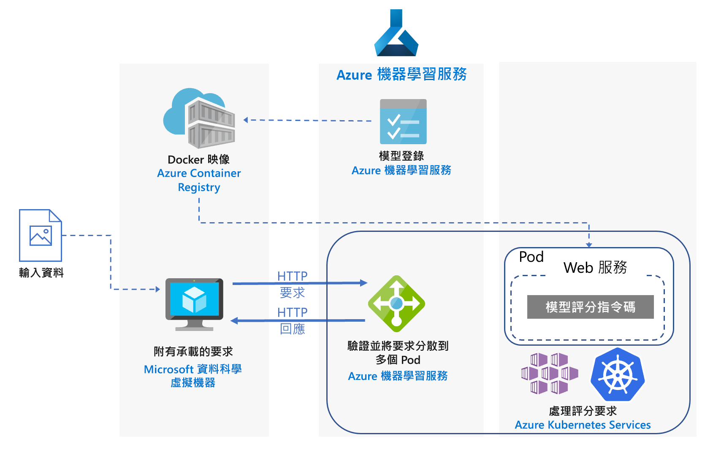
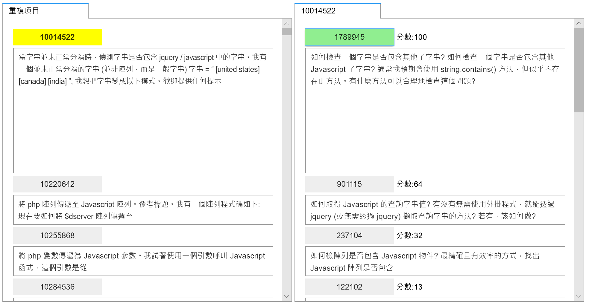
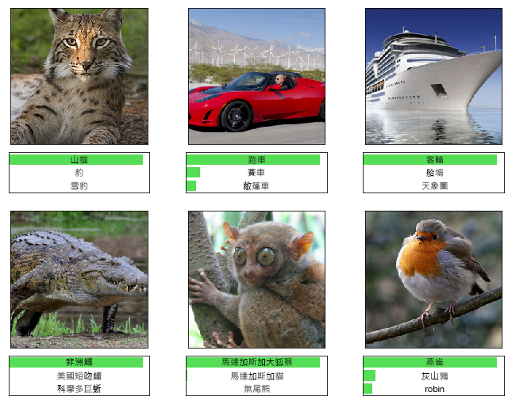

# Azure 上 Python Scikit-Learn 和深度學習模型的即時評分Real-time scoring of Python Scikit-Learn and Deep Learning Models on Azure

此參考架構會示範如何將 Python 模型部署為 Web 服務，以進行即時預測。This reference architecture shows how to deploy Python models as web services to make real-time predictions. 涵蓋兩個案例：部署一般的 Python 模型，以及部署深度學習模型的特定需求。Two scenarios are covered: deploying regular Python models, and the specific requirements of deploying deep learning models. 兩個案例皆使用顯示的架構。Both scenarios use the architecture shown.

此架構的兩個參考實作可在 GitHub 上取得，一個用於[一般 Python 模型][github-python]，另一個用於[深度學習模型][github-dl]。Two reference implementations for this architecture are available on GitHub, one for [regular Python models][github-python] and one for [deep learning models][github-dl].

## 案例Scenarios

參考實作會使用此架構示範兩個案例。The reference implementations demonstrate two scenarios using this architecture.

**案例 1：常見問題集比對**。**Scenario 1: FAQ matching**. 此案例會示範如何將常見問題 (常見問題集) 比對模型部署為 Web 服務，以提供使用者問題的預測。This scenario shows how to deploy a frequently asked questions (FAQ) matching model as a web service to provide predictions for user questions. 此案例中，架構圖中的「輸入資料」是指包含使用者問題的文字字串，用來與常見問題集清單進行比對。For this scenario, "Input Data" in the architecture diagram refers to text strings containing user questions to match with a list of FAQs. 此案例設計用於 Python 的 [scikit-learn][scikit] 機器學習程式庫，但可以一般化為使用 Python 模型進行即時預測的任何案例。This scenario is designed for the [scikit-learn][scikit] machine learning library for Python, but can be generalized to any scenario that uses Python models to make real-time predictions.

此案例使用 Stack Overflow 問題資料的子集，其中包括標記為 JavaScript 的原始問題、其重複的問題，以及答案。This scenario uses a subset of Stack Overflow question data that includes original questions tagged as JavaScript, their duplicate questions, and their answers. 它會訓練 scikit-learn 管線，以預測重複問題與每個原始問題的比對符合機率。It trains a scikit-learn pipeline to predict the match probability of a duplicate question with each of the original questions. 這些預測使用 REST API 端點即時進行。These predictions are made in real time using a REST API  endpoint.

此架構的應用程式流程如下所示：The application flow for this architecture is as follows:

1.  用戶端會傳送 HTTP POST 要求與編碼的問題資料。The client sends an HTTP POST request with the encoded question data.

2.  Flask 應用程式會擷取要求中的問題。The Flask app extracts the question from the request.

3.  問題會傳送至 scikit-learn 管線模型，以進行特徵化和評分。The question is sent to the scikit-learn pipeline model for featurization and scoring.

4.  比對符合的常見問題及其評分會輸送到 JSON 物件，並傳回給用戶端。The matching FAQ questions with their scores are piped into a JSON object and returned to the client.

以下是取用結果的範例應用程式螢幕擷取畫面：Here is a screenshot of the example app that consumes the results:

**案例 2：影像分類。****Scenario 2: Image classification.** 此案例會示範如何將卷積神經網路 (CNN) 模型部署為 Web 服務，以提供影像上的預測。This scenario shows how to deploy a Convolutional Neural Network (CNN) model as a web service to provide predictions on images. 此案例中，架構圖中的「輸入資料」是指影像檔案。For this scenario, "Input Data" in the architecture diagram refers to image files. CNN 可有效處理電腦視覺等工作，例如影像分類和物件偵測。CNNs are very effective in computer vision for tasks such as image classification and object detection. 此案例設計用於 TensorFlow、Keras (具有 TensorFlow 後端)，以及 PyTorch 等架構。This scenario is designed for the frameworks TensorFlow, Keras (with the TensorFlow back end), and PyTorch. 不過，它可以一般化為使用深度學習模型進行即時預測的任何案例。However, it can be generalized to any scenario that uses deep learning models to make real-time predictions.

此案例使用在 ImageNet-1K (1,000 個類別) 資料集上定型的 ResNet-152 預先定型模型，來預測影像所屬類別 (請參閱下圖)。This scenario uses a pre-trained ResNet-152 model trained on ImageNet-1K (1,000 classes) dataset to predict which category (see figure below) an image belongs to. 這些預測使用 REST API 端點即時進行。These predictions are made in real time using a REST API endpoint.

深度學習模型的應用程式流程如下所示：The application flow for the deep learning model is as follows:

1.  用戶端會傳送 HTTP POST 要求與編碼的影像資料。The client sends an HTTP POST request with the encoded image data.

2.  Flask 應用程式會擷取要求中的影像。The Flask app extracts the image from the request.

3.  影像已前置處理並傳送至模型進行評分。The image is preprocessed and sent to the model for scoring.

4.  評分結果會輸送到 JSON 物件，並傳回給用戶端。The scoring result is piped into a JSON object and returned to the client.

## 架構Architecture

此架構由下列元件組成。This architecture consists of the following components.

**[虛擬機器][vm]** (VM)。**[Virtual machine][vm]** (VM). 虛擬機器會顯示為可傳送 HTTP 要求的裝置 (&mdash;本機或雲端&mdash;) 範例。The VM is shown as an example of a device &mdash; local or in the cloud &mdash; that can send an HTTP request.

**[Azure Kubernetes Service][aks]** (AKS) 用於在 Kubernetes 叢集上部署應用程式。**[Azure Kubernetes Service][aks]** (AKS) is used to deploy the application on a Kubernetes cluster. AKS 可簡化 Kubernetes 的部署與作業。AKS simplifies the deployment and operations of Kubernetes. 可以針對一般 Python 模型使用僅限 CPU 的虛擬機器，或針對深度學習模型使用已啟用 GPU 的虛擬機器來設定叢集。The cluster can be configured using CPU-only VMs for regular Python models or GPU-enabled VMs for deep learning models.

**[負載平衡器][lb]**。**[Load balancer][lb]**. 由 AKS 佈建的負載平衡器是用於向外部公開服務。A load balancer, provisioned by AKS, is used to expose the service externally. 負載平衡器的流量會導向至後端 Pod。Traffic from the load balancer is directed to the back-end pods.

**[Docker 中樞][docker]** 用來儲存部署在 Kubernetes 叢集上的 Docker 映像。**[Docker Hub][docker]** is used to store the Docker image that is deployed on Kubernetes cluster. 此架構已選擇使用 Docker 中樞，因為它容易使用，而且是 Docker 使用者的預設映像存放庫。Docker Hub was chosen for this architecture because it's easy to use and is the default image repository for Docker users. [Azure Container Registry][acr] 也可用於此架構。[Azure Container Registry][acr] can also be used for this architecture.

## 效能考量Performance considerations

對於即時評分架構，輸送量效能會成為主要的考量。For real-time scoring architectures, throughput performance becomes a dominant consideration. 對於一般的 Python 模型，普遍認為 CPU 足以處理工作負載。For regular Python models, it's generally accepted that CPUs are sufficient to handle the workload. 

不過，對於深度學習工作負載，當速度造成瓶頸時，相較於 CPU，GPU 通常可提供更佳的[效能][gpus-vs-cpus]。However for deep learning workloads, when speed is a bottleneck, GPUs generally provide better [performance][gpus-vs-cpus] compared to CPUs. 若要使用 CPU 達到 GPU 效能，通常需要具有大量 CPU 的叢集。To match GPU performance using CPUs, a cluster with large number of CPUs is usually needed.

您可以在任何情況下針對此架構使用 CPU，但針對深度學習模型，相較於成本相近的 CPU 叢集，GPU 明顯可提供更高的輸送量值。You can use CPUs for this architecture in either scenario, but for deep learning models, GPUs provide significantly higher throughput values compared to a CPU cluster of similar cost. AKS 可支援使用 GPU，這是將 AKS 用於此架構的優點之一。AKS supports the use of GPUs, which is one advantage of using AKS for this architecture. 此外，深度學習部署通常會使用具有大量參數的模型。Also, deep learning deployments typically use models with a high number of parameters. 使用 GPU 可避免模型與 Web 服務之間的資源競爭，這對於僅限 CPU 的部署是一大問題。Using GPUs prevents contention for resources between the model and the web service, which is an issue in CPU-only deployments.

## 延展性考量Scalability considerations

對於一般 Python 模型，其使用僅限 CPU 的虛擬機器佈建 AKS 叢集，在[相應放大 Pod 數目][manually-scale-pods]時需多加注意。For regular Python models, where AKS cluster is provisioned with CPU-only VMs, take care when [scaling out the number of pods][manually-scale-pods]. 目標是要充分利用叢集。The goal is to fully utilize the cluster. 縮放取決於針對 Pod 定義的 CPU 要求和限制。Scaling depends on the CPU requests and limits defined for the pods. Kubernetes 也支援 Pod 的[自動調整][autoscale-pods]，可根據 CPU 使用率或其他選取的計量來調整部署中的 Pod 數目。Kubernetes also supports [autoscaling][autoscale-pods] of the pods to adjust the number of pods in a deployment depending on CPU utilization or other select metrics. [叢集自動調整程式][autoscaler] (預覽) 可根據擱置中的 Pod 來縮放代理程式節點。The [cluster autoscaler][autoscaler] (in preview) can scale agent nodes based on pending pods.

對於深度學習案例，其使用已啟用 GPU 的虛擬機器，Pod 上的資源限制為一個 GPU 需指派給一個 Pod。For deep learning scenarios, using GPU-enabled VMs, resource limits on pods are such that one GPU is assigned to one pod. 根據使用的虛擬機器類型，您必須[調整叢集的節點][scale-cluster]以滿足服務需求。Depending on the type of VM used, you must [scale the nodes of the cluster][scale-cluster] to meet the demand for the service. 您可以使用 Azure CLI 和 kubectl 來輕鬆完成。You can do this easily using the Azure CLI and kubectl.

## 監視和記錄的考量Monitoring and logging considerations

### AKS 監視AKS monitoring

如需 AKS 效能的可見性，請使用[適用於容器的 Azure 監視器][monitor-containers]功能。For visibility into AKS performance, use the [Azure Monitor for containers][monitor-containers] feature. 它可透過計量 API 從 Kubernetes 中提供的控制器、節點與容器收集記憶體與處理器計量。It collects memory and processor metrics from controllers, nodes, and containers that are available in Kubernetes through the Metrics API.

在部署您的應用程式時，監視 AKS 叢集，確定叢集正常運作、所有節點功能正常，且所有 Pod 都在執行。While deploying your application, monitor the AKS cluster to make sure it's working as expected, all the nodes are operational, and all pods are running. 雖然您可以使用 [kubectl][kubectl] 命令列工具來擷取 Pod 狀態，Kubernetes 也包含 Web 儀表板，可對叢集狀態和管理進行基本監視。Although you can use the [kubectl][kubectl] command-line tool to retrieve pod status, Kubernetes also includes a web dashboard for basic monitoring of the cluster status and management.

若要查看叢集和節點的整體狀態，請前往 Kubernetes 儀表板的**節點**區段。To see the overall state of the cluster and nodes, go to the **Nodes** section of the Kubernetes dashboard. 如果節點處於非使用中或已失敗，您可以從該頁面顯示錯誤記錄檔。If a node is inactive or has failed, you can display the error logs from that page. 同樣地，請前往 **Pod** 和**部署**區段，以取得 Pod 數目和部署狀態的相關資訊。Similarly, go to the **Pods** and **Deployments** sections for information about the number of pods and status of your deployment.

### AKS 記錄AKS logs 

AKS 會自動將所有 stdout/stderr 記錄到叢集中的 Pod 記錄檔。AKS automatically logs all stdout/stderr to the logs of the pods in the cluster. 使用 kubectl 來查看，以及節點層級事件和記錄。Use kubectl to see these and also node-level events and logs. 如需詳細資料，請參閱部署步驟。For details, see the deployment steps.

透過適用於 Linux 的 Log Analytics 代理程式容器化版本，使用[適用於容器的 Azure 監視器][monitor-containers]來收集計量和記錄，該代理程式會儲存在您的 Log Analytics 工作區。Use [Azure Monitor for containers][monitor-containers] to collect metrics and logs through a containerized version of the Log Analytics agent for Linux, which is stored in your Log Analytics workspace.

## 安全性考量Security considerations

使用 [Azure 資訊安全中心][security-center]來集中檢視 Azure 資源的安全性狀態。Use [Azure Security Center][security-center] to get a central view of the security state of your Azure resources. 資訊安全中心會監視潛在的安全性問題，並提供全面性的部署安全性健康情況，儘管它不會監視 AKS 代理程式節點。Security Center monitors potential security issues and provides a comprehensive picture of the security health of your deployment, although it doesn't monitor AKS agent nodes. 資訊安全中心是依每個 Azure 訂用帳戶設定。Security Center is configured per Azure subscription. 啟用安全性資料收集，如[將 Azure 訂用帳戶上架到資訊安全中心的標準層][get-started]中所述。Enable security data collection as described in [Onboard your Azure subscription to Security Center Standard][get-started]. 啟用資料收集時，資訊安全性中心就會自動掃描任何該訂用帳戶建立的 VM。When data collection is enabled, Security Center automatically scans any VMs created under that subscription.

**作業**。**Operations**. 若要使用 Azure Active Directory (Azure AD) 驗證權杖登入 AKS 叢集，請設定 AKS 以將 Azure AD 用於[使用者驗證][aad-auth]。To sign in to an AKS cluster using your Azure Active Directory (Azure AD) authentication token, configure AKS to use Azure AD for [user authentication][aad-auth]. 叢集系統管理員也能夠根據使用者身分識別或目錄群組成員資格，設定 Kubernetes 角色型存取控制 (RBAC)。Cluster administrators can also configure Kubernetes role-based access control (RBAC) based on a user's identity or directory group membership.

使用 [RBAC][rbac] 來控制您所部署之 Azure 資源的存取權。Use [RBAC][rbac] to control access to the Azure resources that you deploy. RBAC 可讓您指派授權角色給您 DevOps 小組的成員。RBAC lets you assign authorization roles to members of your DevOps team. 使用者可以指派多個角色，且您可以針對更詳細的[權限]建立自訂角色。A user can be assigned to multiple roles, and you can create custom roles for even more fine-grained [permissions].

**HTTPS**。**HTTPS**. 作為最佳安全性做法，應用程式應強制執行 HTTPS 並重新導向 HTTP 要求。As a security best practice, the application should enforce HTTPS and redirect HTTP requests. 使用[輸入控制器][ingress-controller]以部署可終止 SSL 並重新導向 HTTP 要求的反向 Proxy。Use an [ingress controller][ingress-controller] to deploy a reverse proxy that terminates SSL and redirects HTTP requests. 如需詳細資訊，請參閱[在 Azure Kubernetes Service (AKS) 上建立 HTTPS 輸入控制器][https-ingress]。For more information, see [Create an HTTPS ingress controller on Azure Kubernetes Service (AKS)][https-ingress].

**驗證**。**Authentication**. 此解決方案並不會限制端點的存取。This solution doesn't restrict access to the endpoints. 若要在企業設定中部署架構，需透過 API 金鑰保護端點，並將某種形式的使用者驗證新增至用戶端應用程式。To deploy the architecture in an enterprise setting, secure the endpoints through API keys and add some form of user authentication to the client application.

**容器登錄**。**Container registry**. 此解決方案會使用公用登錄來儲存 Docker 映像。This solution uses a public registry to store the Docker image. 應用程式相依的程式碼以及模型都包含在此映像中。The code that the application depends on, and the model, are contained within this image. 企業應用程式應使用私人登錄，有助於防止惡意程式碼執行，並協助將資訊保存在容器內而不會遭到入侵。Enterprise applications should use a private registry to help guard against running malicious code and to help keep the information inside the container from being compromised.

**DDoS 保護**.**DDoS protection**. 考慮啟用 [DDoS 保護標準][ddos]。Consider enabling [DDoS Protection Standard][ddos]. 雖然基本 DDoS 保護會隨著 Azure 平台而啟用，但 Azure DDoS 保護標準提供了專門針對 Azure 虛擬網路資源進行調整的安全防護功能。Although basic DDoS protection is enabled as part of the Azure platform, DDoS Protection Standard provides mitigation capabilities that are tuned specifically to Azure virtual network resources.

**記錄**。**Logging**. 在儲存記錄資料前請使用最佳做法，例如清除使用者密碼以及其他可能用來認可安全性詐騙的資訊。Use best practices before storing log data, such as scrubbing user passwords and other information that could be used to commit security fraud.

## 部署Deployment

若要部署此參考架構，請遵循 GitHub 存放庫中所述步驟：To deploy this reference architecture, follow the steps described in the GitHub repos: 

  - [一般的 Python 模型][github-python][Regular Python models][github-python]
  - [深度學習模型][github-dl][Deep learning models][github-dl]

[aad-auth]: /azure/aks/aad-integration
[acr]: /azure/container-registry/
[something]: https://kubernetes.io/docs/reference/access-authn-authz/authentication/
[aks]: /azure/aks/intro-kubernetes
[autoscaler]: /azure/aks/autoscaler
[autoscale-pods]: /azure/aks/tutorial-kubernetes-scale#autoscale-pods
[azcopy]: /azure/storage/common/storage-use-azcopy-linux
[ddos]: /azure/virtual-network/ddos-protection-overview
[docker]: https://hub.docker.com/
[get-started]: /azure/security-center/security-center-get-started
[github-python]: https://github.com/Azure/MLAKSDeployment
[github-dl]: https://github.com/Microsoft/AKSDeploymentTutorial
[gpus-vs-cpus]: https://azure.microsoft.com/en-us/blog/gpus-vs-cpus-for-deployment-of-deep-learning-models/
[https-ingress]: /azure/aks/ingress-tls
[ingress-controller]: https://kubernetes.io/docs/concepts/services-networking/ingress/
[kubectl]: https://kubernetes.io/docs/tasks/tools/install-kubectl/
[lb]: /azure/load-balancer/load-balancer-overview
[manually-scale-pods]: /azure/aks/tutorial-kubernetes-scale#manually-scale-pods
[monitor-containers]: /azure/monitoring/monitoring-container-insights-overview
[權限]: /azure/aks/concepts-identity
[permissions]: /azure/aks/concepts-identity
[rbac]: /azure/active-directory/role-based-access-control-what-is
[scale-cluster]: /azure/aks/scale-cluster
[scikit]: https://pypi.org/project/scikit-learn/
[security-center]: /azure/security-center/security-center-intro
[vm]: /azure/virtual-machines/

