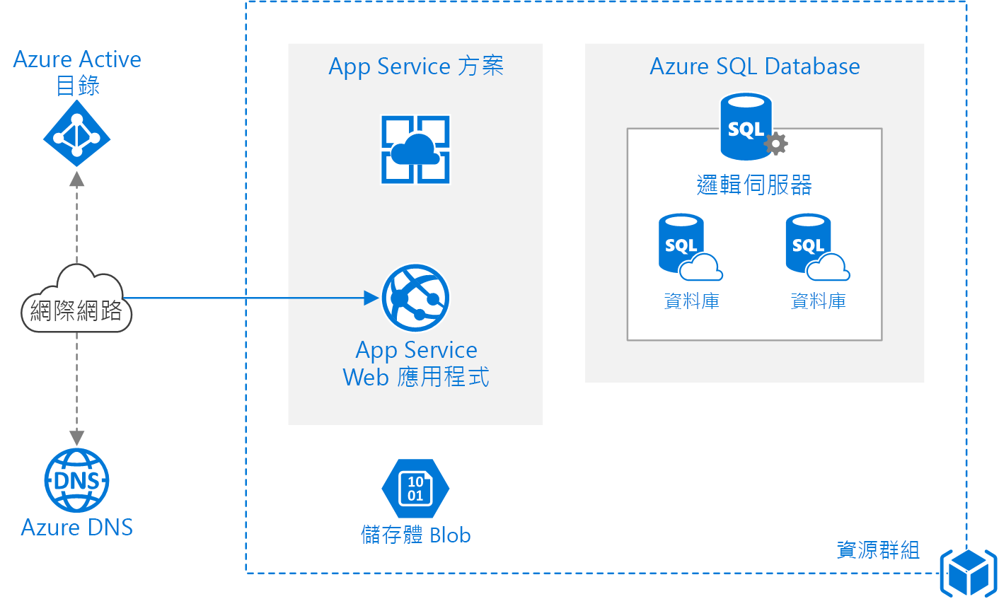

# <a name="run-a-basic-web-application-in-azure"></a>執行 Azure 中的基本 Web 應用程式

針對使用 [Azure App Service][app-service] 和 [Azure SQL Database][sql-db]，此參考架構會示範經過證實的作法。 [**部署這個解決方案**](#deploy-the-solution)。



下載這個架構的 [Visio 檔案][visio-download]。

## <a name="architecture"></a>架構

> [!NOTE]
> 此架構不會著重於應用程式開發，也不會假設任何特定的應用程式架構。 目的是了解不同的 Azure 服務如何搭配在一起。
>

此架構具有下列元件：

- **資源群組**。 [資源群組](/azure/azure-resource-manager/resource-group-overview)是 Azure 資源的邏輯容器。

- **App Service 應用程式**。 [Azure App Service][app-service] 是完全受控的平台，用於建立及部署雲端應用程式。

- **App Service 方案**。 [App Service 方案][app-service-plans]提供受控虛擬機器 (VM) 來裝載您的應用程式。 所有與方案相關聯的應用程式都會在相同的虛擬機器執行個體上執行。

- **部署位置**。  [部署位置][deployment-slots]可讓您預先準備好部署，然後將其與生產環境部署交換。 這樣一來，您可以避免直接在生產環境中部署。 如需特定建議事項，請參閱[可管理性](#manageability-considerations)一節。

- **IP 位址**。 App Service 應用程式具有公用 IP 位址和網域名稱。 網域名稱是 `azurewebsites.net` 的子網域，例如 `contoso.azurewebsites.net`。

- **Azure DNS**。 [Azure DNS][azure-dns] 是 DNS 網域的主機服務，採用 Microsoft Azure 基礎結構提供名稱解析。 只要將您的網域裝載於 Azure，就可以像管理其他 Azure 服務一樣，使用相同的認證、API、工具和計費方式來管理 DNS 記錄。 若要使用自訂網域名稱 (例如 `contoso.com`)，請建立 DNS 記錄，將自訂網域名稱對應至 IP 位址。 如需詳細資訊，請參閱 [在 Azure App Service 中設定自訂網域名稱][custom-domain-name]。

- **Azure SQL Database**。 [SQL Database][sql-db] 是雲端中的關聯式資料庫即服務。 SQL Database 與 Microsoft SQL Server 資料庫引擎共用其程式碼基底。 根據您的應用程式需求而定，您也可以使用[適用於 MySQL 的 Azure 資料庫](/azure/mysql)或[適用於 PostgreSQL 的 Azure 資料庫](/azure/postgresql)。 這些都是完全受控的資料庫服務，分別以 MySQL Server 和 Postgres 資料庫引擎的開放原始碼作為基礎。

- **邏輯伺服器**。 在 Azure SQL Database 中，邏輯伺服器會裝載您的資料庫。 您可以為每部邏輯伺服器建立多個資料庫。

- **Azure 儲存體**。 建立包含 Blob 容器的 Azure 儲存體帳戶，以儲存診斷記錄。

- **Azure Active Directory (Azure AD)**。 使用 Azure AD 或其他識別提供者進行驗證。

## <a name="recommendations"></a>建議

您的需求可能和此處所述的架構不同。 以本節的建議作為起點。

### <a name="app-service-plan"></a>App Service 方案

使用標準或進階層，因為其支援相應放大、自動調整規模和安全通訊端層 (SSL)。 每個層皆支援數個*執行個體大小* (因核心和記憶體數量不同而有所差異)。 建立方案之後，您可以變更層或執行個體的大小。 如需 App Service 方案的詳細資訊，請參閱 [App Service 價格][app-service-plans-tiers]。

您必須支付 App Service 方案中的執行個體費用，即使該應用程式已停用。 請務必刪除您不使用的方案 (例如測試部署所使用的方案)。

### <a name="sql-database"></a>SQL Database

使用 SQL Database [V12 版][sql-db-v12]。 SQL Database 支援基本、標準和進階[服務層][sql-db-service-tiers]，且各層內皆有多個以[資料庫交易單位 (DTU)][sql-dtu] 計量的效能層級。 進行容量規劃，然後選擇符合您需求的層和效能層級。

### <a name="region"></a>區域

將 App Service 方案和 SQL Database 佈建於相同區域，可使網路延遲降至最低。 通常會選擇最接近使用者的區域。

資源群組也會有區域，該區域會指定儲存部署中繼資料的位置。 將資源群組及其資源放置於相同區域。 這麼做可在部署期間提升可用性。

## <a name="scalability-considerations"></a>延展性考量

Azure App Service 的主要優點是能夠根據負載調整應用程式規模。 以下是規劃調整應用程式時，應記住的一些考量。

### <a name="scaling-the-app-service-app"></a>調整 App Service 應用程式的規模

有兩種方式可用來調整 App Service 應用程式的規模：

- *相應增加*，表示變更執行個體的大小。 執行個體大小會決定每個虛擬機器執行個體上的記憶體、核心數及儲存體。 您可以手動變更執行個體大小或方案層，來進行相應增加。

- *相應放大*，表示新增執行個體以處理增加的負載。 每個定價層都有執行個體的數目上限。

  您可以變更執行個體計數來手動進行相應放大，或使用[自動調整][web-app-autoscale]，讓 Azure 根據排程和/或效能計量，自動新增或移除執行個體。 每個縮放作業通常會在數秒內快速生效。

  若要啟用自動調整，請建立自動調整設定檔，其中會定義執行個體數量的下限和上限。 您可以排程設定檔。 例如，您可以針對工作日和週末各別建立設定檔。 設定檔可包含何時新增或移除執行個體的規則 (選擇性)。 (例如：如果 CPU 使用量超過 70% 達 5 分鐘之久，則新增兩個執行個體。)

調整 Web 應用程式規模的建議事項：

- 盡可能避免進行相應增加和減少，因為這樣可能會觸發應用程式重新啟動。 相反地，選取在一般負載下符合您效能需求的層和大小，然後相應放大執行個體來處理流量的變更。
- 啟用自動調整。 如果您的應用程式具有可預測的規律工作負載，可建立設定檔以預先排定執行個體計數。 如果工作負載不可預測，可使用規則式自動調整來因應負載的變更。 您可以結合這兩種方法。
- CPU 使用率通常很適合作為自動調整規則的計量。 不過，您應對您的應用程式進行負載測試，找出潛在的瓶頸，並根據該資料設定自動調整規則。
- 自動調整規則包含「冷卻」期間，也就是調整動作完成後，再啟動新調整動作前的等候間隔。 冷卻期間會讓系統穩定後，才能再次進行調整。 針對新增執行個體設定較短的冷卻期間，以及針對移除執行個體設定較長的冷卻期間。 例如，為新增執行個體設定 5 分鐘，但為移除執行個體設定 60 分鐘。 最好在負載過重時快速增加新執行個體來處理額外的流量，然後逐漸減少執行個體。

### <a name="scaling-sql-database"></a>調整 SQL Database 的規模

如果您的 SQL Database 需要較高服務層或效能層級，您可以相應增加個別資料庫，且無須停止應用程式。 如需詳細資訊，請參閱 [SQL Database 選項和效能：了解每個服務層中可用的項目][sql-db-scale]。

## <a name="availability-considerations"></a>可用性考量

本文撰寫時，App Service 的服務等級協定 (SLA) 為 99.95%，而 SQL Database 的 SLA 為 99.99%，適用於基本、標準和進階層。

> [!NOTE]
> App Service SLA 適用於單一和多重執行個體。
>

### <a name="backups"></a>備份

如果發生資料遺失，SQL Database 會提供還原時間點和異地還原。 這些功能適用於所有層，而且會自動啟用。 您不需要排程或管理備份。

- 使用還原時間點將資料庫回復至較早的時間點，以[從人為錯誤中復原][sql-human-error]。
- 使用異地還原從異地備援儲存體中還原資料庫，以[從服務中斷中復原][sql-outage-recovery]。

如需詳細資訊，請參閱 [雲端商務持續性和 SQL Database 的資料庫災害復原][sql-backup]。

App Service 提供[備份和還原][web-app-backup]應用程式檔案的功能。 不過，請注意，備份檔案包含純文字的應用程式設定，且這些設定可能包含祕密，例如連接字串。 請避免使用 App Service 的備份功能來備份 SQL 資料庫，因為它會將資料庫匯出為 SQL.bacpac 檔案，如此會耗用 [DTU][sql-dtu]。 請改用上述的 SQL Database 還原時間點。

## <a name="manageability-considerations"></a>管理性考量

針對生產、部署和測試環境，各別建立資源群組。 這可讓您更輕鬆地管理部署、刪除測試部署及指派存取權限。

將資源指派給資源群組時，請考慮下列項目：

- 生命週期。 一般來說，會將生命週期相同的資源放在同個資源群組中。
- 存取。 您可以使用[角色型存取控制][rbac] (RBAC) 將存取原則套用至群組中的資源。
- 計費。 您可以檢視資源群組的彙總成本。

如需詳細資訊，請參閱 [Azure Resource Manager 概觀](/azure/azure-resource-manager/resource-group-overview)。

### <a name="deployment"></a>部署

部署包含兩個步驟：

1. 佈建 Azure 資源。 對於此步驟，我們建議您使用 [Azure Resoure Manager 範本][arm-template]。 範本可讓您輕鬆地透過 PowerShell 或 Azure 命令列介面 (CLI) 進行自動部署。
2. 部署應用程式 (程式碼、二進位檔和內容檔案)。 您有數個選項，包括從本機 Git 存放庫進行部署、使用 Visual Studio 或從雲端式原始檔控制進行連續部署。 請參閱[將您的應用程式部署至 Azure App Service][deploy]。

App Service 應用程式一律會有一個名為 `production` 的部署位置，代表實際作用的生產網站。 我們建議您為部署更新建立預備位置。 使用預備位置的優點包括：

- 您可以確認部署成功後，再交換至生產環境。
- 部署至預備位置，可確保所有執行個體在交換至生產環境之前就已準備就緒。 許多應用程式都有重要的暖機和冷啟動時間。

我們也建議您建立第三個位置來保存上一次的正確部署。 當您交換預備環境和生產環境之後，請將先前的生產環境部署 (現在處於預備環境) 移到「上一次的正確部署」位置。 這樣一來，如果您之後發現問題，您可以快速還原至上一次的正確版本。

![[1]][1]

如果還原至之前的版本，請確定任何資料庫的結構描述變更都可以與舊版相容。

請勿使用生產環境部署上的位置進行測試，因為同個 App Service 方案內的所有應用程式會共用相同的虛擬機器執行個體。 例如，負載測試可能會使實際作用的生產網站降級。 針對生產和測試，請建立不同的 App Service 方案。 透過將測試部署放在不同方案內，您可以使其與生產版本隔離。

### <a name="configuration"></a>組態

儲存作為[應用程式設定][app-settings]的組態設定。 在您的 Resource Manager 範本中或使用 PowerShell 定義應用程式設定。 在執行階段上，應用程式設定可作為應用程式的環境變數。

永遠不會將密碼、存取金鑰或連接字串簽入原始檔控制。 而是會將這些項目作為參數傳遞至部署指令碼，將這些值儲存為應用程式設定。

依預設，當您交換部署位置時，應用程式設定也會進行交換。 如果生產環境和預備環境需要不同設定，您可以建立衷於位置且不要進行交換的應用程式設定。

### <a name="diagnostics-and-monitoring"></a>診斷和監控

啟用[診斷記錄][diagnostic-logs]，包括應用程式記錄和 Web 伺服器記錄。 將記錄設定為使用 Blob 儲存體。 基於效能考量，請針對診斷記錄建立個別的儲存體帳戶。 記錄和應用程式資料不可使用相同儲存體帳戶。 如需記錄的詳細指引，請參閱[監視和診斷指引][monitoring-guidance]。

使用 [New Relic][new-relic] 或 [Application Insights][app-insights] 來監視負載下的應用程式效能和行為。 請留意 Application insights 的[資料速率限制][app-insights-data-rate]。

使用 [Azure DevOps][azure-devops] 或 [Visual Studio Team Foundation Server][tfs] 等工具執行負載測試。 如需雲端應用程式中的一般效能分析概觀，請參閱[效能分析入門][perf-analysis]。

針對應用程式進行疑難排解的秘訣：

- 在 Azure 入口網站中使用 [[疑難排解] 刀鋒視窗][troubleshoot-blade]，來尋找常見問題的解決方案。
- 啟用[記錄串流][web-app-log-stream]，可讓您近乎即時地查看記錄資訊。
- [Kudu 儀表板][kudu]有數個工具可用來監視和偵錯您的應用程式。 如需詳細資訊，請參 [您應該知道的 Azure 網站線上工具][kudu] (部落格文章)。 您可以從 Azure 入口網站連線至 Kudu 儀表板。 開啟您應用程式的刀鋒視窗，按一下 [工具]，然後按一下 Kudu。
- 如果您使用 Visual Studio，請參閱[使用 Visual Studio 為 Azure App Service 中的 Web 應用程式進行疑難排解][troubleshoot-web-app]，來取得偵錯和疑難排解的秘訣。

## <a name="security-considerations"></a>安全性考量

本節列出 Azure 服務專屬的安全性考量， 但不是安全性最佳做法的完整清單。 如需更多的安全性考量，請參閱[保護 Azure App Service 中的應用程式][app-service-security]。

### <a name="sql-database-auditing"></a>SQL Database 稽核

稽核可協助您保持法規遵循，以及深入了解可指出商務考量或疑似安全違規的不一致和不合規行為。 請參閱[開始使用 SQL Database 稽核][sql-audit]。

### <a name="deployment-slots"></a>部署位置

每個部署位置都具有公用 IP 位址。 使用 [Azure Active Directory 登入][aad-auth]可保護非生產位置，因此只有您的開發和 DevOps 小組成員可以連線至這些端點。

### <a name="logging"></a>記錄

記錄絕對不能記下使用者的密碼，或其他可能可用來認可身分識別詐騙的資訊。 儲存之前請先從資料中清除這些細節。

### <a name="ssl"></a>SSL

App Service 應用程式包含 `azurewebsites.net` 子網域的 SSL 端點 (不需額外費用)。 SSL 端點包含 `*.azurewebsites.net` 網域的萬用字元憑證。 如果您使用自訂網域名稱，您必須提供符合自訂網域的憑證。 最簡單的方式是直接透過 Azure 入口網站購買憑證。 您也可以從其他憑證授權單位匯入憑證。 如需詳細資訊，請參閱[購買並設定您 Azure App Service 的 SSL 憑證][ssl-cert]。

作為最佳安全性做法，您的應用程式應該透過重新導向 HTTP 要求來強制執行 HTTPS。 您可以在您的應用程式中實作此項目，或如[針對 Azure App Service 中的應用程式啟用 HTTPS][ssl-redirect]中所述使用 URL 重寫規則。

### <a name="authentication"></a>驗證

我們建議您透過識別提供者 (IDP) 進行驗證，例如 Azure AD、Facebook、Google 或 Twitter。 使用 OAuth 2 或 OpenID Connect (OIDC) 作為驗證流程。 Azure AD 提供的功能可讓您管理使用者及群組、建立應用程式角色、整合您的內部部署身分識別，以及使用 Office 365 及商務用 Skype 等後端服務。

應避免讓應用程式直接管理使用者登入和認證，因為應用程式會產生潛在的攻擊面。  最少，您應必須有電子郵件確認、密碼復原和多重要素驗證；驗證密碼強度並安全地儲存密碼雜湊。 大型的識別提供者會為您處理這些所有的事，並不斷地監視並改善其安全性做法。

請考慮使用 [App Service 服務驗證][app-service-auth]來實作 OAuth/OIDC 驗證流程。 App Service 驗證的優點包括：

- 容易設定。
- 簡單的驗證案例不需要程式碼。
- 支援委派授權使用 OAuth 存取權杖來代表使用者使用資源。
- 提供內建權杖快取。

App Service 驗證的部分限制：

- 限制的自訂選項。
- 委派授權僅限於每個登入工作階段的一個後端資源。
- 如果您使用多個 IDP，則沒有任何內建機制可用於首頁領域探索。
- 在多租用戶的情況下，應用程式必須實作邏輯以驗證權杖簽發者。

## <a name="deploy-the-solution"></a>部署解決方案

此架構的範例 Resoure Manager 範本[可在 GitHub 上取得][paas-basic-arm-template]。

若要使用 PowerShell 部署範本，請執行下列命令：

```powershell
New-AzureRmResourceGroup -Name <resource-group-name> -Location "West US"

$parameters = @{"appName"="<app-name>";"environment"="dev";"locationShort"="uw";"databaseName"="app-db";"administratorLogin"="<admin>";"administratorLoginPassword"="<password>"}

New-AzureRmResourceGroupDeployment -Name <deployment-name> -ResourceGroupName <resource-group-name> -TemplateFile .\PaaS-Basic.json -TemplateParameterObject  $parameters
```

如需詳細資訊，請參閱[使用 Azure Resource Manager 範本部署資源][deploy-arm-template]。

<!-- links -->

[aad-auth]: /azure/app-service-mobile/app-service-mobile-how-to-configure-active-directory-authentication
[app-insights]: /azure/application-insights/app-insights-overview
[app-insights-data-rate]: /azure/application-insights/app-insights-pricing
[app-service]: /azure/app-service/
[app-service-auth]: /azure/app-service-api/app-service-api-authentication
[app-service-plans]: /azure/app-service/azure-web-sites-web-hosting-plans-in-depth-overview
[app-service-plans-tiers]: https://azure.microsoft.com/pricing/details/app-service/
[app-service-security]: /azure/app-service-web/web-sites-security
[app-settings]: /azure/app-service-web/web-sites-configure
[arm-template]: /azure/azure-resource-manager/resource-group-overview#resource-groups
[azure-devops]: /azure/devops/
[azure-dns]: /azure/dns/dns-overview
[custom-domain-name]: /azure/app-service-web/web-sites-custom-domain-name
[deploy]: /azure/app-service-web/web-sites-deploy
[deploy-arm-template]: /azure/resource-group-template-deploy
[deployment-slots]: /azure/app-service-web/web-sites-staged-publishing
[diagnostic-logs]: /azure/app-service-web/web-sites-enable-diagnostic-log
[kudu]: https://azure.microsoft.com/blog/windows-azure-websites-online-tools-you-should-know-about/
[monitoring-guidance]: ../../best-practices/monitoring.md
[new-relic]: https://newrelic.com/
[paas-basic-arm-template]: https://github.com/mspnp/reference-architectures/tree/master/managed-web-app/basic-web-app/Paas-Basic/Templates
[perf-analysis]: https://github.com/mspnp/performance-optimization/blob/master/Performance-Analysis-Primer.md
[rbac]: /azure/active-directory/role-based-access-control-what-is
[resource-group]: /azure/azure-resource-manager/resource-group-overview
[sla]: https://azure.microsoft.com/support/legal/sla/
[sql-audit]: /azure/sql-database/sql-database-auditing-get-started
[sql-backup]: /azure/sql-database/sql-database-business-continuity
[sql-db]: /azure/sql-database/
[sql-db-overview]: /azure/sql-database/sql-database-technical-overview
[sql-db-scale]: /azure/sql-database/sql-database-service-tiers#scaling-up-or-scaling-down-a-single-database
[sql-db-service-tiers]: /azure/sql-database/sql-database-service-tiers
[sql-db-v12]: /azure/sql-database/sql-database-features
[sql-dtu]: /azure/sql-database/sql-database-service-tiers
[sql-human-error]: /azure/sql-database/sql-database-business-continuity#recover-a-database-after-a-user-or-application-error
[sql-outage-recovery]: /azure/sql-database/sql-database-business-continuity#recover-a-database-to-another-region-from-an-azure-regional-data-center-outage
[ssl-redirect]: /azure/app-service-web/web-sites-configure-ssl-certificate#bkmk_enforce
[sql-resource-limits]: /azure/sql-database/sql-database-resource-limits
[ssl-cert]: /azure/app-service-web/web-sites-purchase-ssl-web-site
[troubleshoot-blade]: https://azure.microsoft.com/updates/self-service-troubleshooting-for-app-service-web-apps-customers/
[tfs]: /tfs/index
[troubleshoot-web-app]: /azure/app-service-web/web-sites-dotnet-troubleshoot-visual-studio
[visio-download]: https://archcenter.blob.core.windows.net/cdn/app-service-reference-architectures.vsdx
[web-app-autoscale]: /azure/app-service-web/web-sites-scale
[web-app-backup]: /azure/app-service-web/web-sites-backup
[web-app-log-stream]: /azure/app-service-web/web-sites-enable-diagnostic-log#streamlogs
[1]: ./images/paas-basic-web-app-staging-slots.png "交換生產和預備環境部署的位置"
