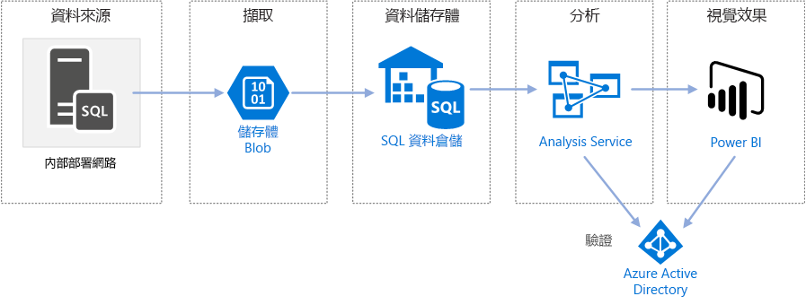

# Azure 中具 SQL 資料倉儲的 Enterprise BI

此參考架構會實作[擷取、載入和轉換 (ELT)](../../data-guide/relational-data/etl.md#extract-load-and-transform-elt) 管線，將資料從內部部署 SQL Server 資料庫移至 SQL 資料倉儲，並轉換資料以供分析。

此架構的參考實作可在 [GitHub][github-folder] 上取得。

**案例**：組織具有在內部部署的 SQL Server 資料庫中儲存的大型 OLTP 資料集。 組織想要使用 SQL 資料倉儲，透過 Power BI 執行分析。

此參考架構是針對一次性或隨需作業而設計的。 如果您需要持續移動資料 (每小時或每日)，建議您使用 Azure Data Factory 來定義自動化工作流程。 如需使用 Data Factory 的參考架構，請參閱[具 SQL 資料倉儲和 Azure Data Factory 的自動化 Enterprise BI][adf-ra]。

## 架構

此架構由下列元件組成。

### 資料來源

**SQL Server**。 來源資料位於內部部署的 SQL Server 資料庫中。 為了模擬內部部署環境，此架構的部署指令碼會在 Azure 中佈建已安裝 SQL Server 的 VM。 系統會使用 [Wide World Importers OLTP 範例資料庫][wwi] (機器翻譯) 作為來源資料。

### 擷取和資料儲存體

**Blob 儲存體**。 Blob 儲存體會作為在資料載入至 SQL 資料倉儲之前用來複製資料的臨時區域。

**Azure SQL 資料倉儲**。 [SQL 資料倉儲](/azure/sql-data-warehouse/)是為了對大型資料執行分析而設計的分散式系統。 它支援大量平行處理 (MPP)，因而適合用來執行高效能分析。

### 分析和報告

**Azure Analysis Services**。 [Analysis Services](/azure/analysis-services/) 是完全受控的服務，可提供資料模型功能。 使用 Analysis Services 可建立可供使用者查詢的語意模型。 Analysis Services 在 BI 儀表板案例中最能發揮效用。 在此架構中，Analysis Services 會從資料倉儲讀取資料以處理語意模型，並有效率地為儀表板查詢提供服務。 它也可藉由相應放大複本以加快查詢處理速度，而支援彈性的並行存取。

目前，Azure Analysis Services 支援表格式模型，但不支援多維度模型。 表格式模型使用關聯式模型建構 (資料表和資料行)，而多維度模型則使用 OLAP 模型建構 (Cube、維度和量值)。 如果您需要多維度模型，請使用 SQL Server Analysis Services (SSAS)。 如需詳細資訊，請參閱[比較表格式和多維度解決方案](/sql/analysis-services/comparing-tabular-and-multidimensional-solutions-ssas)。

**Power BI**。 Power BI 是一套用來分析資料以產生商業見解的商務分析工具。 在此架構中，它會查詢儲存在 Analysis Services 中的語意模型。

### 驗證

**Azure Active Directory** (Azure AD) 會驗證透過 Power BI 連線至 Analysis Services 伺服器的使用者。

## Data Pipeline

此參考架構會使用 [WorldWideImporters](/sql/sample/world-wide-importers/wide-world-importers-oltp-database) 範例資料庫作為資料來源。 資料管線具有下列階段：

1. 將資料從 SQL Server 匯出至一般檔案 (bcp 公用程式)。
2. 將一般檔案複製到 Azure Blob 儲存體 (AzCopy)。
3. 將資料載入 SQL 資料倉儲中 (PolyBase)。
4. 將資料轉換為星型結構描述 (T-SQL)。
5. 將語意模型載入 Analysis Services 中 (SQL Server Data Tools)。

> [!NOTE]
> 在步驟 1 &ndash; 3 中，請考慮使用 Redgate Data Platform Studio。 Data Platform Studio 會套用最適當的相容性修正檔與最佳化，因此它是開始使用 SQL 資料倉儲最快的方式。 如需詳細資訊，請參閱[使用 Redgate Data Platform Studio 載入資料](/azure/sql-data-warehouse/sql-data-warehouse-load-with-redgate)。
>

以下幾節將詳細說明這些階段。

### 從 SQL Server 匯入資料

[bcp](/sql/tools/bcp-utility) (大量複製程式) 公用程式是從 SQL 資料表建立一般文字檔的快速途徑。 在此步驟中，您會選取您要匯出的資料行，但不會轉換資料。 任何資料轉換均應在 SQL 資料倉儲中執行。

**建議：**

可能的話，請將資料擷取排程於離峰時間，以盡可能避免生產環境中的資源爭用。

請避免在資料庫伺服器上執行 bcp。 改以其他機器來執行。 請將檔案寫入至本機磁碟機。 請確定您有足夠的 I/O 資源可處理並行寫入。 為了達到最佳效能，請將檔案匯出至專用的快速儲存磁碟機。

您可以用 Gzip 壓縮格式儲存匯出的資料，以加快網路傳輸速度。 不過，壓縮的檔案載入至倉儲的速度會低於非壓縮檔案的載入速度，因此，您必須在網路傳輸速度與載入速度之間做出取捨。 如果您決定使用 Gzip 壓縮，請勿建立單一 Gzip 檔案。 此時，請將資料分成多個壓縮檔案。

### 將一般檔案複製到 Blob 儲存體中

[AzCopy](/azure/storage/common/storage-use-azcopy) 公用程式可讓您以高效能將資料複製到 Azure Blob 儲存體中。

**建議：**

儲存體帳戶請建立在來源資料所在位置的鄰近區域中。 請將儲存體帳戶和 SQL 資料倉儲執行個體部署在相同區域中。 

請勿在執行生產工作負載的相同機器上執行 AzCopy，因為 CPU 和 I/O 的耗用可能會影響到生產工作負載。

請先測試上傳，以確認上傳速度。 您可以使用 AzCopy 中的 /NC 選項來指定並行複製作業數目。 一開始請先使用預設值，然後再試著以這項設定調整效能。 在低頻寬環境中，過多的並行作業有可能會拖垮網路連線，而使作業無法順利完成。

AzCopy 會透過公用網際網路將資料移至儲存體。 若其速度不夠快，請考慮設定 [ExpressRoute](/azure/expressroute/) 線路。 ExpressRoute 是一項服務，它會透過專用私人連線將您的資料路由傳送至 Azure。 當網路連線速度太慢時，您也可以考慮將磁碟上的資料傳送至 Azure 資料中心。 如需詳細資訊，請參閱[從 Azure 來回傳輸資料](/azure/architecture/data-guide/scenarios/data-transfer)。

在複製作業期間，AzCopy 會建立暫存日誌檔案，讓 AzCopy 能夠在作業中斷 (例如，由於網路錯誤) 時加以重新啟動。 請確定有足夠的磁碟空間可儲存日誌檔案。 您可以使用 /Z 選項來指定日誌檔案的寫入位置。

### 將資料載入至 SQL 資料倉儲

使用 [PolyBase](/sql/relational-databases/polybase/polybase-guide) 可將檔案從 Blob 儲存體載入資料倉儲中。 PolyBase 依設計會運用 SQL 資料倉儲的 MPP (大量平行處理) 架構，因此能夠以最快的速度將資料載入 SQL 資料倉儲中。

載入資料的程序由兩個步驟組成：

1. 為資料建立一組外部資料表。 外部資料表是一項資料表定義，會指向儲存在倉儲外部的資料 &mdash; 在此案例中，是指 Blob 儲存體中的一般檔案。 此步驟不會將任何資料移至倉儲中。
2. 建立暫存資料表，並將資料載入暫存資料表中。 此步驟會將資料複製到倉儲中。

**建議：**

當您的資料龐大 (超過 1 TB)，且您的分析工作負載透過平行處理來執行又會比較好的話，請考慮使用 SQL 資料倉儲。 SQL 資料倉儲不適用於 OLTP 工作負載或較小的資料集 (< 250 GB)。 對於小於 250 GB 的資料集，請考慮使用 Azure SQL Database 或 SQL Server。 如需詳細資訊，請參閱[資料倉儲](../../data-guide/relational-data/data-warehousing.md)。

建立堆積資料表形式的暫存資料表 (不會編製索引)。 建立生產資料表的查詢時將會執行完整資料表掃描，因此不需要編製暫存資料表的索引。

PolyBase 會在倉儲中自動使用平行處理。 載入效能會在您增加 DWU 時隨之調整。 若要達到最佳效能，請使用單一載入作業。 將輸入資料分成多個區塊，並執行多項並行載入，並不會帶來效能上的優勢。

PolyBase 可讀取 Gzip 壓縮檔案。 不過，每個壓縮檔案只會使用一個讀取器，因為解壓縮檔案是單一執行緒作業。 因此，請避免載入單一大型壓縮檔案。 此時，請將資料分成多個壓縮檔案，以運用平行處理。

請留意以下限制：

- PolyBase 支援的資料行大小上限為 `varchar(8000)`、`nvarchar(4000)` 或 `varbinary(8000)`。 如果您有超出這些限制的資料，其中一個選項是在資料匯出時將其分成多個區塊，並等到匯入後再重組區塊。

- PolyBase 會使用固定的資料列結束字元 \n 或新行。 如果來源資料中出現新行字元，這可能會造成問題。

- 您的來源資料結構描述可能會包含 SQL 資料倉儲中不支援的資料類型。

為了因應這些限制，您可以建立會執行必要轉換的預存程序。 在執行 bcp 時，請參考此預存程序。 或者，[Redgate 資料平台 Studio](/azure/sql-data-warehouse/sql-data-warehouse-load-with-redgate) 會自動轉換在 SQL 資料倉儲中不支援的資料類型。

如需詳細資訊，請參閱下列文章：

- [將資料載入 Azure SQL 資料倉儲中的最佳做法](/azure/sql-data-warehouse/guidance-for-loading-data)。
- [將您的結構描述移轉至 SQL 資料倉儲](/azure/sql-data-warehouse/sql-data-warehouse-migrate-schema)
- [定義 SQL 資料倉儲中的資料表資料類型的指引](/azure/sql-data-warehouse/sql-data-warehouse-tables-data-types)

### 轉換資料

轉換資料，並將其移至生產資料表中。 在此步驟中，資料會轉換成具有維度資料表與事實資料表、且適用於語意模型的星型結構描述。

建立具有叢集資料行存放區索引的生產資料表，以提供最理想的整體查詢效能。 資料行存放區索引已針對會掃描多筆記錄的查詢進行最佳化。 資料行存放區索引也不會就單一查閱而執行 (也就是查閱單一資料列)。 如果您需要執行頻繁的單一查詢，您可以將非叢集索引新增至資料表。 使用非叢集索引的單一查閱可大幅提升執行速度。 不過，相較於 OLTP 工作負載，在資料倉儲案例中通常較不常使用單一查閱。 如需詳細資訊，請參閱[在 SQL 資料倉儲中編製資料表的索引](/azure/sql-data-warehouse/sql-data-warehouse-tables-index)。

> [!NOTE]
> 叢集資料行存放區資料表不支援 `varchar(max)`、`nvarchar(max)` 或 `varbinary(max)` 資料類型。 在此情況下，請考慮使用堆積或叢集索引。 您可以將這些資料行放入個別的資料表中。

由於範例資料庫並不龐大，因此我們建立的複寫資料表不含分割區。 對於生產工作負載，使用分散式資料表應可改善查詢效能。 請參閱[在 Azure SQL 資料倉儲中設計分散式資料表的指引](/azure/sql-data-warehouse/sql-data-warehouse-tables-distribute)。 我們的範例指令碼會使用靜態[資源類別](/azure/sql-data-warehouse/resource-classes-for-workload-management)執行查詢。

### 載入語意模型

將資料載入至 Azure Analysis Services 中的表格式模型。 在此步驟中，您會使用 SQL Server Data Tools (SSDT) 建立語意資料模型。 您也可以從 Power BI Desktop 檔案匯入模型，藉以建立模型。 SQL 資料倉儲並不支援外部索引鍵，因此您必須將關聯性新增至語意模型，以便在資料表之間進行聯結。

### 使用 Power BI 以視覺方式呈現資料

Power BI 支援兩個連線至 Azure Analysis Services 的選項：

- 匯入。 資料會匯入 Power BI 模型中。
- 即時連線。 資料會直接提取自 Analysis Services。

建議您使用即時連線，因為它不需要將資料複製到 Power BI 模型中。 此外，使用 DirectQuery 可確保結果絕對會與最新的來源資料一致。 如需詳細資訊，請參閱[使用 Power BI 進行連線](/azure/analysis-services/analysis-services-connect-pbi)。

**建議：**

請避免直接對資料倉儲執行 BI 儀表板查詢。 BI 儀表板需要非常短的回應時間，直接對倉儲執行的查詢可能達不到此需求。 此外，重新整理儀表板將會計入並行查詢數目，而可能會影響效能。

Azure Analysis Services 依設計可用來處理 BI 儀表板的查詢需求，因此，建議的作法是從 Power BI 查詢 Analysis Services。

## 延展性考量

### SQL 資料倉儲

透過 SQL 資料倉儲，您可以隨需相應放大您的計算資源。 查詢引擎可根據計算節點的數目最佳化要平行處理的查詢，並視需要在節點之間移動資料。 如需詳細資訊，請參閱[管理 Azure SQL 資料倉儲中的計算能力](/azure/sql-data-warehouse/sql-data-warehouse-manage-compute-overview)。

### Analysis Services

對於生產工作負載，建議您使用 Azure Analysis Services 的標準層，因為它支援分割區和 DirectQuery。 在一層之中，執行個體大小會決定記憶體和處理能力。 處理能力會以查詢處理單位 (QPU) 來測量。 請監視 QPU 使用量以選取適當的大小。 如需詳細資訊，請參閱[監視伺服器計量](/azure/analysis-services/analysis-services-monitor)。

在高負載的情況下，查詢效能可能會因為查詢並行而下降。 您可以建立用來處理查詢的複本集區以相應放大 Analysis Services，以便同時執行多個查詢。 處理資料模型的工作一律會在主要伺服器上執行。 根據預設，主要伺服器也會處理查詢。 您可以選擇性地指定以獨佔方式執行處理的主要伺服器，讓查詢集區可處理所有查詢。 如果您的處理需求較高，則應將處理獨立於查詢集區以外。 如果您的查詢負載較高，且處理負載相對較低，則可以將主要伺服器包含在查詢集區中。 如需詳細資訊，請參閱 [Azure Analysis Services 相應放大](/azure/analysis-services/analysis-services-scale-out)。

若要減少非必要的處理量，請考慮使用分割區將表格式模型分成多個邏輯部分。 每個分割區將可個別處理。 如需詳細資訊，請參閱[分割區](/sql/analysis-services/tabular-models/partitions-ssas-tabular)。

## 安全性考量

### Analysis Services 用戶端的 IP 允許清單

請考慮使用 Analysis Services 防火牆功能，將用戶端 IP 位址列入允許清單中。 防火牆啟用時，會封鎖未指定於防火牆規則中的所有用戶端連線。 預設規則會將 Power BI 服務列入允許清單中，但您可以視需要停用此規則。 如需詳細資訊，請參閱[使用新的防火牆功能強化 Azure Analysis Services](https://azure.microsoft.com/blog/hardening-azure-analysis-services-with-the-new-firewall-capability/)。

### Authorization

Azure Analysis Services 會使用 Azure Active Directory (Azure AD) 驗證連線至 Analysis Services 伺服器的使用者。 您可以建立角色，然後將 Azure AD 使用者或群組指派給這些角色，以限制特定使用者所能檢視的資料。 對於每個角色，您可以︰

- 保護資料表或個別資料行。
- 根據篩選運算式保護個別資料列。

如需詳細資訊，請參閱[管理資料庫角色和使用者](/azure/analysis-services/analysis-services-database-users)。

## 部署解決方案

若要部署及執行參考實作，請依照 [GitHub 讀我檔案][github-folder]中的步驟。 它會部署下列各項：

- 一個 Windows VM，用以模擬內部部署資料庫伺服器。 其中包含 SQL Server 2017 和相關工具以及 Power BI Desktop。
- 一個提供 Blob 儲存體的 Azure 儲存體帳戶，用以保存從 SQL Server 資料庫匯出的資料。
- 一個 Azure SQL 資料倉儲執行個體。
- 一個 Azure Analysis Services 執行個體。

## 後續步驟

- 使用 Azure Data Factory 將 ELT 管線自動化。 請參閱[具 SQL 資料倉儲和 Azure Data Factory 的自動化 Enterprise BI][adf-ra]。

## 相關資源

您可以檢閱下列 [Azure 範例案例](/azure/architecture/example-scenario)，其中示範使用相同技術的一些特定解決方案：

- [適用於銷售和行銷的資料倉儲和分析](/azure/architecture/example-scenario/data/data-warehouse)
- [使用現有內部部署 SSIS 和 Azure Data Factory 的混合式 ETL](/azure/architecture/example-scenario/data/hybrid-etl-with-adf)

<!-- links -->

[adf-ra]: ./enterprise-bi-adf.md
[github-folder]: https://github.com/mspnp/reference-architectures/tree/master/data/enterprise_bi_sqldw
[wwi]: /sql/sample/world-wide-importers/wide-world-importers-oltp-database
