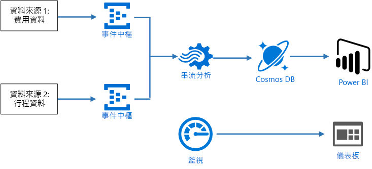
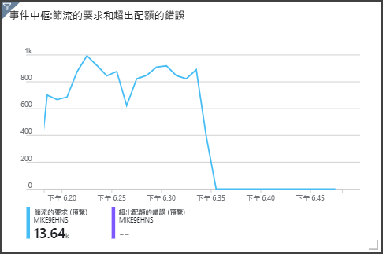

# <a name="create-a-stream-processing-pipeline-with-azure-stream-analytics"></a>使用 Azure 串流分析建立串流處理管線

此參考架構顯示端對端[串流處理](/azure/architecture/data-guide/big-data/real-time-processing)管線。 管線會從兩個來源擷取資料、在兩個串流中將記錄相互關聯，並計算時間範圍內的移動平均。 結果會儲存以供進一步分析。

此架構的參考實作可在 [GitHub][github] 上取得。



**案例**：計程車公司會收集有關每趟計程車車程的資料。 在此案例中，我們假設有兩個不同的裝置會傳送資料。 計程車的其中一個計量會傳送關於每趟車程的資訊，如車程時間、距離和上下車地點等。 另一個裝置會接收客戶付款，並傳送費用相關資料。 計程車公司想要即時計算出平均每英里的小費，以便找出趨勢。

## <a name="architecture"></a>架構

此架構由下列元件組成。

**資料來源**。 在此架構中，有兩個資料來源會即時產生資料流。 第一個資料流包含車程資訊，而第二個包含費用資訊。 參考架構包含模擬的資料產生器，可讀取一組靜態檔案，並將資料推送到事件中樞。 在實際的應用程式中，資料來源會是安裝在計程車上的裝置。

**Azure 事件中樞**. [事件中樞](/azure/event-hubs/)是事件擷取服務。 此架構使用兩個事件中樞執行個體，分別用於兩個資料來源。 每個資料來源會將資料流傳送至相關聯的事件中樞。

**Azure 串流分析**。 [串流分析](/azure/stream-analytics/)是事件處理引擎。 串流分析作業會從兩個事件中樞讀取資料流，並執行串流處理。

**Cosmos DB**。 串流分析作業的輸出是一系列記錄，其會以 JSON 文件寫入 Cosmos DB 文件資料庫。

**Microsoft Power BI**。 Power BI 是一套用來分析資料以產生商業見解的商務分析工具。 在此架構中，它會從 Cosmos DB 載入資料。 這可讓使用者分析收集到的一組完整歷程記錄資料。 您也可以直接從串流分析將結果串流到 Power BI，以取得資料的即時檢視。 如需詳細資訊，請參閱 [Power BI 中的即時串流](/power-bi/service-real-time-streaming)。

**Azure 監視器**。 [Azure 監視器](/azure/monitoring-and-diagnostics/)會收集解決方案中部署的 Azure 服務相關效能計量。 透過儀表板中的資料視覺化，您可以取得解決方案健康情況的深入解析。

## <a name="data-ingestion"></a>資料擷取

<!-- markdownlint-disable MD033 MD034 -->

若要模擬資料來源，此參考架構會使用[紐約市計程車資料](https://uofi.app.box.com/v/NYCtaxidata/folder/2332218797)資料集<sup>[[1]](#note1)</sup>。 此資料集包含紐約市在 4 年期間的計程車路程資料 (2010 &ndash; 2013)。 其包含兩種類型的記錄：車程資料和費用資料。 車程資料包括路程持續時間、路程距離和上下車地點。 費用資料包括費用、稅金和小費金額。 在這兩種記錄類型中共同欄位包含計程車牌照號碼、計程車執照和廠商識別碼。 這三個欄位可唯一識別一輛計程車加上司機。 資料會以 CSV 格式儲存。

[1] <span id="note1">Donovan, Brian; Work, Dan (2016)：紐約市計程車車程資料 (2010-2013)。 伊利諾大學香檳分校。 https://doi.org/10.13012/J8PN93H8

<!-- markdownlint-enable MD033 MD034 -->

資料產生器為 .NET Core 應用程式，可讀取記錄並將其傳送到 Azure 事件中樞。 產生器會以 JSON 格式傳送車程資料，以 CSV 格式傳送費用資料。

事件中樞使用[分割區](/azure/event-hubs/event-hubs-features#partitions)來分割資料。 資料分割可讓取用者平行讀取每個分割。 將資料傳送至事件中樞時，您可以明確指定分割區索引鍵。 否則，記錄會以循環配置資源的方式指派給分割區。

在此特定案例中，車程資料和費用資料最後應具有指定計程車的同一分割區識別碼。 這可讓串流分析在將兩個資料流相互關聯時套用平行處理原則。 車程資料分割區 *n* 中的記錄會比對到費用資料分割區 *n* 中的記錄。


在資料產生器中，這兩種記錄類型的共同資料模型具有 `PartitionKey` 屬性，其為 `Medallion`、`HackLicense` 和 `VendorId` 的串連。

```csharp
public abstract class TaxiData
{
    public TaxiData()
    {
    }

    [JsonProperty]
    public long Medallion { get; set; }

    [JsonProperty]
    public long HackLicense { get; set; }

    [JsonProperty]
    public string VendorId { get; set; }

    [JsonProperty]
    public DateTimeOffset PickupTime { get; set; }

    [JsonIgnore]
    public string PartitionKey
    {
        get => $"{Medallion}_{HackLicense}_{VendorId}";
    }
```

在傳送至事件中樞時，這個屬性用來提供明確的分割區索引鍵：

```csharp
using (var client = pool.GetObject())
{
    return client.Value.SendAsync(new EventData(Encoding.UTF8.GetBytes(
        t.GetData(dataFormat))), t.PartitionKey);
}
```

## <a name="stream-processing"></a>串流處理

串流處理作業使用 SQL 查詢搭配數個不同步驟來定義。 前兩個步驟僅從兩個輸入資料流中選取記錄。

```sql
WITH
Step1 AS (
    SELECT PartitionId,
           TRY_CAST(Medallion AS nvarchar(max)) AS Medallion,
           TRY_CAST(HackLicense AS nvarchar(max)) AS HackLicense,
           VendorId,
           TRY_CAST(PickupTime AS datetime) AS PickupTime,
           TripDistanceInMiles
    FROM [TaxiRide] PARTITION BY PartitionId
),
Step2 AS (
    SELECT PartitionId,
           medallion AS Medallion,
           hack_license AS HackLicense,
           vendor_id AS VendorId,
           TRY_CAST(pickup_datetime AS datetime) AS PickupTime,
           tip_amount AS TipAmount
    FROM [TaxiFare] PARTITION BY PartitionId
),
```

下一個步驟會將兩個輸入資料流聯結，從每個資料流中選取相符的記錄。

```sql
Step3 AS (
  SELECT
         tr.Medallion,
         tr.HackLicense,
         tr.VendorId,
         tr.PickupTime,
         tr.TripDistanceInMiles,
         tf.TipAmount
    FROM [Step1] tr
    PARTITION BY PartitionId
    JOIN [Step2] tf PARTITION BY PartitionId
      ON tr.Medallion = tf.Medallion
     AND tr.HackLicense = tf.HackLicense
     AND tr.VendorId = tf.VendorId
     AND tr.PickupTime = tf.PickupTime
     AND tr.PartitionId = tf.PartitionId
     AND DATEDIFF(minute, tr, tf) BETWEEN 0 AND 15
)
```

此查詢會聯結一組欄位上的記錄，可唯一識別相符記錄 (Medallion、HackLicense、VendorId 和 PickupTime)。 `JOIN` 陳述式也包含分割區識別碼。 如上所述，此案例中這是利用了相符的記錄具有相同的分割區識別碼。

在串流分析中，聯結是*時態性*，表示記錄已加入特定的時間範圍內。 否則，作業可能需要無限期等待相符項目。 [DATEDIFF](https://msdn.microsoft.com/azure/stream-analytics/reference/join-azure-stream-analytics) 函式可指定針對符合項目，兩筆相符記錄的時間可以間隔多久。

作業的最後一個步驟會計算每英里的平均小費，依 5 分鐘跳動視窗分組。

```sql
SELECT System.Timestamp AS WindowTime,
       SUM(tr.TipAmount) / SUM(tr.TripDistanceInMiles) AS AverageTipPerMile
  INTO [TaxiDrain]
  FROM [Step3] tr
  GROUP BY HoppingWindow(Duration(minute, 5), Hop(minute, 1))
```

串流分析提供多種[時間範圍函式](/azure/stream-analytics/stream-analytics-window-functions)。 跳動視窗會以一段固定時間向前移動，在此案例中為每個躍點 1 分鐘。 目的是要計算過去 5 分鐘的移動平均。

在此處所示的架構中，只有串流分析作業的結果會儲存到 Cosmos DB。 在巨量資料案例中，也請考慮使用[事件中樞擷取](/azure/event-hubs/event-hubs-capture-overview)，將原始事件資料儲存至 Azure Blob 儲存體。 保留未經處理資料可讓您在稍後對歷程記錄資料執行批次查詢，以便從資料中找出新的深入解析。

## <a name="scalability-considerations"></a>延展性考量

### <a name="event-hubs"></a>事件中樞

事件中樞的輸送量容量會以[輸送量單位](/azure/event-hubs/event-hubs-features#throughput-units)來測量。 您可以啟用[自動擴充](/azure/event-hubs/event-hubs-auto-inflate)以自動調整事件中樞，這會根據流量 (上限為設定的最大值) 自動調整輸送量單位。

### <a name="stream-analytics"></a>串流分析

對於串流分析，配置給作業的計算資源會以串流單位測量。 如果作業可以平行處理，則串流分析作業可進行最佳調整。 如此一來，串流分析可以將作業分散至多個計算節點。

對於事件中樞輸入，使用 `PARTITION BY` 關鍵字來分割串流分析作業。 資料會根據事件中樞分割區分割為子集。

時間範圍函式和時態性聯結需要額外的 SU。 可能的話，請使用 `PARTITION BY` 以便每個分割區可個別處理。 如需詳細資訊，請參閱[了解和調整串流單位](/azure/stream-analytics/stream-analytics-streaming-unit-consumption#windowed-aggregates)。

如果無法平行處理整個串流分析作業，請嘗試將作業分成多個步驟，從一或多個平行步驟開始。 如此一來，第一個步驟即可平行執行。 例如，在此參考架構中：

- 步驟 1 和 2 是簡單的 `SELECT` 陳述式，可選取單一分割區內的記錄。
- 步驟 3 會跨兩個輸入資料流執行資料分割的聯結。 此步驟是由於相符記錄共用相同的分割區索引鍵，因此每個輸入資料流一定會有相同的分割區識別碼。
- 步驟 4 會彙總所有資料分割。 此步驟無法平行處理。

使用串流分析[作業圖表](/azure/stream-analytics/stream-analytics-job-diagram-with-metrics)，查看有多少分割區指派給作業中的每個步驟。 下圖顯示此參考架構的作業圖表：


### <a name="cosmos-db"></a>Cosmos DB

Cosmos DB 的輸送量容量會以[要求單位](/azure/cosmos-db/request-units) (RU) 來測量。 若要將 Cosmos DB 容器調整超過 10,000 RU，建立容器時您必須指定[分割區索引鍵](/azure/cosmos-db/partition-data)，並在每份文件中包含分割區索引鍵。

在此參考架構中，新文件每分鐘只會建立一次 (跳動視窗間隔)，因此輸送量需求相當低。 基於這個理由，此案例不需要指派分割區索引鍵。

## <a name="monitoring-considerations"></a>監視功能考量

使用任何串流處理解決方案，請務必監視系統效能與健康情況。 [Azure 監視器](/azure/monitoring-and-diagnostics/)會為架構中使用的 Azure 服務收集計量和診斷記錄。 Azure 監視器內建於 Azure 平台，且不需要您應用程式中任何額外的程式碼。

任何下列警告信號表示您應相應放大相關的 Azure 資源：

- 事件中樞會對要求進行節流，否則會接近每日的訊息配額。
- 串流分析作業持續使用超過 80% 的配置串流單位 (SU)。
- Cosmos DB 會開始對要求進行節流。

參考架構包含部署至 Azure 入口網站的自訂儀表板。 部署架構之後，您可以開啟 [Azure 入口網站](https://portal.azure.com)並從儀表板清單選取 `TaxiRidesDashboard` 來檢視儀表板。 如需在 Azure 入口網站建立及部署自訂儀表板的詳細資訊，請參閱[以程式設計方式建立 Azure 儀表板](/azure/azure-portal/azure-portal-dashboards-create-programmatically)。

串流分析作業執行大約一小時後，下圖會顯示儀表板。


左下方的面板顯示出串流分析作業的 SU 耗用量在前 15 分鐘攀升，然後再下降。 作業達到穩定狀態時，這是典型的模式。

請注意，事件中樞正在對要求進行節流，如右上角面板所示。 偶爾節流的要求不是問題，因為收到節流錯誤時，事件中樞用戶端 SDK 會自動重試。 不過，如果您看到一致的節流錯誤，表示事件中樞需要更多輸送量單位。 以下圖表顯示使用事件中樞自動擴充功能的測試回合，其可自動相應放大所需的輸送量單位。



自動擴充已於 06:35 標記啟用。 事件中樞自動向上調整至 3 個輸送量單位時，您會在節流的要求中看到 p 下降。

有趣的是，這樣做的副作用是在串流分析作業中增加 SU 使用率。 藉由節流，事件中樞會以人為方式減少串流分析作業的擷取率。 實際上常見到，解決一個效能瓶頸會帶來另一個瓶頸。 在此案例中，為串流分析作業配置額外的 SU 解決了問題。

## <a name="deploy-the-solution"></a>部署解決方案

若要部署及執行參考實作，請依照 [GitHub 讀我檔案][github]中的步驟。

[github]: https://github.com/mspnp/reference-architectures/tree/master/data/streaming_asa
