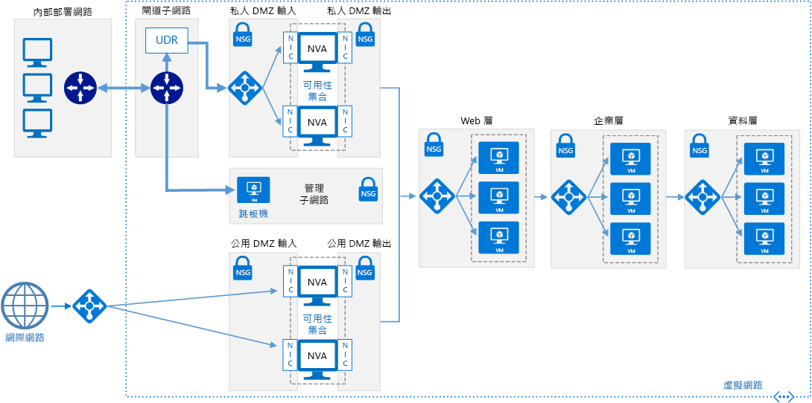
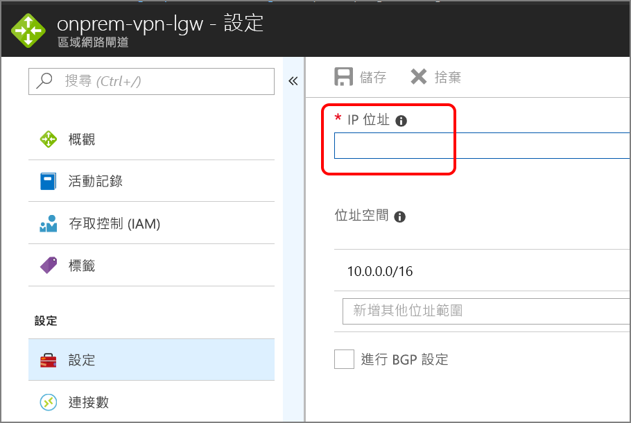

# <a name="implement-a-dmz-between-azure-and-the-internet"></a><span data-ttu-id="0351f-103">實作 Azure 和網際網路之間的 DMZ</span><span class="sxs-lookup"><span data-stu-id="0351f-103">Implement a DMZ between Azure and the Internet</span></span>

<span data-ttu-id="0351f-104">此參考架構顯示的安全混合式網路，可將內部部署網路擴充至 Azure 並接受網際網路流量。</span><span class="sxs-lookup"><span data-stu-id="0351f-104">This reference architecture shows a secure hybrid network that extends an on-premises network to Azure and also accepts Internet traffic.</span></span> <span data-ttu-id="0351f-105">[**部署這個解決方案**](#deploy-the-solution)。</span><span class="sxs-lookup"><span data-stu-id="0351f-105">[**Deploy this solution**](#deploy-the-solution).</span></span>

> [!NOTE]
> <span data-ttu-id="0351f-106">此案例也可以使用 [Azure 防火牆](/azure/firewall/) (以雲端為基礎的網路安全性服務) 來完成。</span><span class="sxs-lookup"><span data-stu-id="0351f-106">This scenario can also be accomplished using [Azure Firewall](/azure/firewall/), a cloud-based network security service.</span></span>



<span data-ttu-id="0351f-108">下載這個架構的 [Visio 檔案][visio-download]。</span><span class="sxs-lookup"><span data-stu-id="0351f-108">*Download a [Visio file][visio-download] of this architecture.*</span></span>

<span data-ttu-id="0351f-109">此參考架構由[實作 Azure 和內部部署資料中心之間的 DMZ][implementing-a-secure-hybrid-network-architecture] 中所述的架構擴充而來。</span><span class="sxs-lookup"><span data-stu-id="0351f-109">This reference architecture extends the architecture described in [Implementing a DMZ between Azure and your on-premises datacenter][implementing-a-secure-hybrid-network-architecture].</span></span> <span data-ttu-id="0351f-110">除了用於處理來自內部網路流量的私人 DMZ，還加入了可處理網際網路流量的公用 DMZ。</span><span class="sxs-lookup"><span data-stu-id="0351f-110">It adds a public DMZ that handles Internet traffic, in addition to the private DMZ that handles traffic from the on-premises network.</span></span>

<span data-ttu-id="0351f-111">此架構的典型使用案例包括：</span><span class="sxs-lookup"><span data-stu-id="0351f-111">Typical uses for this architecture include:</span></span>

- <span data-ttu-id="0351f-112">部分工作負載在內部部署中執行、部分在 Azure 中執行的混合式應用程式。</span><span class="sxs-lookup"><span data-stu-id="0351f-112">Hybrid applications where workloads run partly on-premises and partly in Azure.</span></span>
- <span data-ttu-id="0351f-113">負責路由傳送內部部署與網際網路的連入流量的 Azure 基礎結構。</span><span class="sxs-lookup"><span data-stu-id="0351f-113">Azure infrastructure that routes incoming traffic from on-premises and the Internet.</span></span>

## <a name="architecture"></a><span data-ttu-id="0351f-114">架構</span><span class="sxs-lookup"><span data-stu-id="0351f-114">Architecture</span></span>

<span data-ttu-id="0351f-115">此架構由下列元件組成。</span><span class="sxs-lookup"><span data-stu-id="0351f-115">The architecture consists of the following components.</span></span>

- <span data-ttu-id="0351f-116">**公用 IP 位址 (PIP)**。</span><span class="sxs-lookup"><span data-stu-id="0351f-116">**Public IP address (PIP)**.</span></span> <span data-ttu-id="0351f-117">公用端點的 IP 位址。</span><span class="sxs-lookup"><span data-stu-id="0351f-117">The IP address of the public endpoint.</span></span> <span data-ttu-id="0351f-118">連線到網際網路的外部使用者可以透過此位址存取此系統。</span><span class="sxs-lookup"><span data-stu-id="0351f-118">External users connected to the Internet can access the system through this address.</span></span>
- <span data-ttu-id="0351f-119">**網路虛擬設備 (NVA)**。</span><span class="sxs-lookup"><span data-stu-id="0351f-119">**Network virtual appliance (NVA)**.</span></span> <span data-ttu-id="0351f-120">此架構有一個個別的 NVA 集區，用於處理來自網際網路的流量。</span><span class="sxs-lookup"><span data-stu-id="0351f-120">This architecture includes a separate pool of NVAs for traffic originating on the Internet.</span></span>
- <span data-ttu-id="0351f-121">**Azure 負載平衡器**。</span><span class="sxs-lookup"><span data-stu-id="0351f-121">**Azure load balancer**.</span></span> <span data-ttu-id="0351f-122">來自網際網路的所有傳入要求都要通過負載平衡器，並散發到公用 DMZ 中的 NVA。</span><span class="sxs-lookup"><span data-stu-id="0351f-122">All incoming requests from the Internet pass through the load balancer and are distributed to the NVAs in the public DMZ.</span></span>
- <span data-ttu-id="0351f-123">**公用 DMZ 輸入子網路**。</span><span class="sxs-lookup"><span data-stu-id="0351f-123">**Public DMZ inbound subnet**.</span></span> <span data-ttu-id="0351f-124">此子網路會接受來自 Azure 負載平衡器的要求。</span><span class="sxs-lookup"><span data-stu-id="0351f-124">This subnet accepts requests from the Azure load balancer.</span></span> <span data-ttu-id="0351f-125">傳入要求會傳遞至公用 DMZ 中的其中一個 NVA。</span><span class="sxs-lookup"><span data-stu-id="0351f-125">Incoming requests are passed to one of the NVAs in the public DMZ.</span></span>
- <span data-ttu-id="0351f-126">**公用 DMZ 輸出子網路**。</span><span class="sxs-lookup"><span data-stu-id="0351f-126">**Public DMZ outbound subnet**.</span></span> <span data-ttu-id="0351f-127">NVA 核准的要求會通過此子網路傳遞至 Web 層的內部負載平衡器。</span><span class="sxs-lookup"><span data-stu-id="0351f-127">Requests that are approved by the NVA pass through this subnet to the internal load balancer for the web tier.</span></span>

## <a name="recommendations"></a><span data-ttu-id="0351f-128">建議</span><span class="sxs-lookup"><span data-stu-id="0351f-128">Recommendations</span></span>

<span data-ttu-id="0351f-129">下列建議適用於大部分的案例。</span><span class="sxs-lookup"><span data-stu-id="0351f-129">The following recommendations apply for most scenarios.</span></span> <span data-ttu-id="0351f-130">除非您有特定的需求會覆寫它們，否則請遵循下列建議。</span><span class="sxs-lookup"><span data-stu-id="0351f-130">Follow these recommendations unless you have a specific requirement that overrides them.</span></span>

### <a name="nva-recommendations"></a><span data-ttu-id="0351f-131">NVA 建議</span><span class="sxs-lookup"><span data-stu-id="0351f-131">NVA recommendations</span></span>

<span data-ttu-id="0351f-132">一組 NVA 用於來自網際網路的流量，另一組用於來自內部部署的流量。</span><span class="sxs-lookup"><span data-stu-id="0351f-132">Use one set of NVAs for traffic originating on the Internet, and another for traffic originating on-premises.</span></span> <span data-ttu-id="0351f-133">兩者使用同一組 NVA 會造成安全性風險，因為在兩組網路流量之間沒有安全性界線。</span><span class="sxs-lookup"><span data-stu-id="0351f-133">Using only one set of NVAs for both is a security risk, because it provides no security perimeter between the two sets of network traffic.</span></span> <span data-ttu-id="0351f-134">使用個別 NVA 可降低檢查安全性規則的複雜度，並清楚哪些規則對應到每個傳入網路要求。</span><span class="sxs-lookup"><span data-stu-id="0351f-134">Using separate NVAs reduces the complexity of checking security rules, and makes it clear which rules correspond to each incoming network request.</span></span> <span data-ttu-id="0351f-135">一組 NVA 僅實作於網際網路流量的規則，而另一組 NVA 僅實作內部部署流量的規則。</span><span class="sxs-lookup"><span data-stu-id="0351f-135">One set of NVAs implements rules for Internet traffic only, while another set of NVAs implement rules for on-premises traffic only.</span></span>

<span data-ttu-id="0351f-136">加入第 7 層 NVA 來終止 NVA 層級的應用程式連線，並維持與後端層的相容性。</span><span class="sxs-lookup"><span data-stu-id="0351f-136">Include a layer-7 NVA to terminate application connections at the NVA level and maintain compatibility with the backend tiers.</span></span> <span data-ttu-id="0351f-137">這可確保對稱的連線，亦即來自後端層的回應流量會透過 NVA 傳回。</span><span class="sxs-lookup"><span data-stu-id="0351f-137">This guarantees symmetric connectivity where response traffic from the backend tiers returns through the NVA.</span></span>

### <a name="public-load-balancer-recommendations"></a><span data-ttu-id="0351f-138">公用負載平衡器建議</span><span class="sxs-lookup"><span data-stu-id="0351f-138">Public load balancer recommendations</span></span>

<span data-ttu-id="0351f-139">為了延展性和可用性，在[可用性設定組][availability-set]中部署公用 DMZ NVA，並使用[網際網路對向負載平衡器][load-balancer]分散可用性設定組中所有 NVA 的網際網路要求。</span><span class="sxs-lookup"><span data-stu-id="0351f-139">For scalability and availability, deploy the public DMZ NVAs in an [availability set][availability-set] and use an [Internet facing load balancer][load-balancer] to distribute Internet requests across the NVAs in the availability set.</span></span>

<span data-ttu-id="0351f-140">負載平衡器設定為只接受網際網路流量所需的通訊埠上的要求。</span><span class="sxs-lookup"><span data-stu-id="0351f-140">Configure the load balancer to accept requests only on the ports necessary for Internet traffic.</span></span> <span data-ttu-id="0351f-141">例如，限制輸入 HTTP 要求在連接埠 80，輸出 HTTPS 要求在連接埠 443。</span><span class="sxs-lookup"><span data-stu-id="0351f-141">For example, restrict inbound HTTP requests to port 80 and inbound HTTPS requests to port 443.</span></span>

## <a name="scalability-considerations"></a><span data-ttu-id="0351f-142">延展性考量</span><span class="sxs-lookup"><span data-stu-id="0351f-142">Scalability considerations</span></span>

<span data-ttu-id="0351f-143">即使您的架構一開始只需要公用 DMZ 中有單一 NVA，建議您從一開始就在公用 DMZ 前放置負載平衡器。</span><span class="sxs-lookup"><span data-stu-id="0351f-143">Even if your architecture initially requires a single NVA in the public DMZ, we recommend putting a load balancer in front of the public DMZ from the beginning.</span></span> <span data-ttu-id="0351f-144">未來如果需要，這將更容易擴充至多個 NVA。</span><span class="sxs-lookup"><span data-stu-id="0351f-144">That will make it easier to scale to multiple NVAs in the future, if needed.</span></span>

## <a name="availability-considerations"></a><span data-ttu-id="0351f-145">可用性考量</span><span class="sxs-lookup"><span data-stu-id="0351f-145">Availability considerations</span></span>

<span data-ttu-id="0351f-146">網際網路對向負載平衡器需要公用 DMZ 輸入子網路中的每個 NVA 皆實作[健康情況探查][lb-probe]。</span><span class="sxs-lookup"><span data-stu-id="0351f-146">The Internet facing load balancer requires each NVA in the public DMZ inbound subnet to implement a [health probe][lb-probe].</span></span> <span data-ttu-id="0351f-147">此端點無法回應健康情況探查的 NVA 會被視為無法使用，負載平衡器會將要求導向相同可用性設定組中的其他 NVA。</span><span class="sxs-lookup"><span data-stu-id="0351f-147">A health probe that fails to respond on this endpoint is considered to be unavailable, and the load balancer will direct requests to other NVAs in the same availability set.</span></span> <span data-ttu-id="0351f-148">請注意，如果所有 NVA 回應都失敗，您的應用程式就會失敗，所以一定要設定監視，在狀況良好的 NVA 執行個體數目低於定義的臨界值時警示 DevOps。</span><span class="sxs-lookup"><span data-stu-id="0351f-148">Note that if all NVAs fail to respond, your application will fail, so it's important to have monitoring configured to alert DevOps when the number of healthy NVA instances falls below a defined threshold.</span></span>

## <a name="manageability-considerations"></a><span data-ttu-id="0351f-149">管理性考量</span><span class="sxs-lookup"><span data-stu-id="0351f-149">Manageability considerations</span></span>

<span data-ttu-id="0351f-150">對公用 DMZ 中 NVA 的所有監視和管理，應該由管理子網路中的 jumpbox 執行。</span><span class="sxs-lookup"><span data-stu-id="0351f-150">All monitoring and management for the NVAs in the public DMZ should be performed by the jumpbox in the management subnet.</span></span> <span data-ttu-id="0351f-151">如[實作 Azure 與內部部署資料中心之間的 DMZ][implementing-a-secure-hybrid-network-architecture] 中所述，為了限制存取權，定義單一網路透過閘道從內部部署網路路由傳送至 jumpbox。</span><span class="sxs-lookup"><span data-stu-id="0351f-151">As discussed in [Implementing a DMZ between Azure and your on-premises datacenter][implementing-a-secure-hybrid-network-architecture], define a single network route from the on-premises network through the gateway to the jumpbox, in order to restrict access.</span></span>

<span data-ttu-id="0351f-152">如果從內部部署網路到 Azure 的閘道連線關閉，藉由部署公用 IP 位址、將它加入 jumpbox、然後從網際網路登入，仍可連線至 jumpbox。</span><span class="sxs-lookup"><span data-stu-id="0351f-152">If gateway connectivity from your on-premises network to Azure is down, you can still reach the jumpbox by deploying a public IP address, adding it to the jumpbox, and logging in from the Internet.</span></span>

## <a name="security-considerations"></a><span data-ttu-id="0351f-153">安全性考量</span><span class="sxs-lookup"><span data-stu-id="0351f-153">Security considerations</span></span>

<span data-ttu-id="0351f-154">此參考架構實作多個安全性層級：</span><span class="sxs-lookup"><span data-stu-id="0351f-154">This reference architecture implements multiple levels of security:</span></span>

- <span data-ttu-id="0351f-155">網際網路對向負載平衡器會將要求導向輸入公用 DMZ 子網路中的 NVA，而且只在應用程式所需的連接埠。</span><span class="sxs-lookup"><span data-stu-id="0351f-155">The Internet facing load balancer directs requests to the NVAs in the inbound public DMZ subnet, and only on the ports necessary for the application.</span></span>
- <span data-ttu-id="0351f-156">藉著封鎖 NSG 規則範圍之外的要求，輸入和輸出公用 DMZ 子網路的 NSG 規則可防止 NVA 受到危害。</span><span class="sxs-lookup"><span data-stu-id="0351f-156">The NSG rules for the inbound and outbound public DMZ subnets prevent the NVAs from being compromised, by blocking requests that fall outside of the NSG rules.</span></span>
- <span data-ttu-id="0351f-157">NVA 的 NAT 路由設定會將連接埠 80 和 443 上的傳入要求導向 Web 層負載平衡器，但會忽略其他所有通訊埠上的要求。</span><span class="sxs-lookup"><span data-stu-id="0351f-157">The NAT routing configuration for the NVAs directs incoming requests on port 80 and port 443 to the web tier load balancer, but ignores requests on all other ports.</span></span>

<span data-ttu-id="0351f-158">您應該記錄所有連接埠上的所有傳入要求。</span><span class="sxs-lookup"><span data-stu-id="0351f-158">You should log all incoming requests on all ports.</span></span> <span data-ttu-id="0351f-159">定期稽核記錄，留意不在預期參數範圍之內的要求，因為這些可能表示入侵嘗試。</span><span class="sxs-lookup"><span data-stu-id="0351f-159">Regularly audit the logs, paying attention to requests that fall outside of expected parameters, as these may indicate intrusion attempts.</span></span>

## <a name="deploy-the-solution"></a><span data-ttu-id="0351f-160">部署解決方案</span><span class="sxs-lookup"><span data-stu-id="0351f-160">Deploy the solution</span></span>

<span data-ttu-id="0351f-161">在 [GitHub][github-folder] 中有實作這些建議的參考架構部署。</span><span class="sxs-lookup"><span data-stu-id="0351f-161">A deployment for a reference architecture that implements these recommendations is available on [GitHub][github-folder].</span></span>

### <a name="prerequisites"></a><span data-ttu-id="0351f-162">必要條件</span><span class="sxs-lookup"><span data-stu-id="0351f-162">Prerequisites</span></span>

[!INCLUDE [ref-arch-prerequisites.md](../../../includes/ref-arch-prerequisites.md)]

### <a name="deploy-resources"></a><span data-ttu-id="0351f-163">部署資源</span><span class="sxs-lookup"><span data-stu-id="0351f-163">Deploy resources</span></span>

1. <span data-ttu-id="0351f-164">瀏覽至參考架構 GitHub 存放庫的 `/dmz/secure-vnet-dmz` 資料夾。</span><span class="sxs-lookup"><span data-stu-id="0351f-164">Navigate to the `/dmz/secure-vnet-dmz` folder of the reference architectures GitHub repository.</span></span>

2. <span data-ttu-id="0351f-165">執行以下命令：</span><span class="sxs-lookup"><span data-stu-id="0351f-165">Run the following command:</span></span>

    ```bash
    azbb -s <subscription_id> -g <resource_group_name> -l <region> -p onprem.json --deploy
    ```

3. <span data-ttu-id="0351f-166">瀏覽至參考架構 GitHub 存放庫的 `/dmz/ssecure-vnet-hybrid` 資料夾。</span><span class="sxs-lookup"><span data-stu-id="0351f-166">Navigate to the `/dmz/ssecure-vnet-hybrid` folder of the reference architectures GitHub repository.</span></span>

4. <span data-ttu-id="0351f-167">執行以下命令：</span><span class="sxs-lookup"><span data-stu-id="0351f-167">Run the following command:</span></span>

    ```bash
    azbb -s <subscription_id> -g <resource_group_name> -l <region> -p secure-vnet-hybrid.json --deploy
    ```

### <a name="connect-the-on-premises-and-azure-gateways"></a><span data-ttu-id="0351f-168">將內部部署連線到 Azure 閘道</span><span class="sxs-lookup"><span data-stu-id="0351f-168">Connect the on-premises and Azure gateways</span></span>

<span data-ttu-id="0351f-169">在此步驟中，您會將兩個區域網路閘道連線。</span><span class="sxs-lookup"><span data-stu-id="0351f-169">In this step, you will connect the two local network gateways.</span></span>

1. <span data-ttu-id="0351f-170">在 Azure 入口網站中，巡覽至您所建立的資源群組。</span><span class="sxs-lookup"><span data-stu-id="0351f-170">In the Azure Portal, navigate to the resource group that you created.</span></span>

2. <span data-ttu-id="0351f-171">尋找名為 `ra-vpn-vgw-pip` 的資源，並複製 [概觀] 刀鋒視窗中所顯示的 IP 位址。</span><span class="sxs-lookup"><span data-stu-id="0351f-171">Find the resource named `ra-vpn-vgw-pip` and copy the IP address shown in the **Overview** blade.</span></span>

3. <span data-ttu-id="0351f-172">尋找名為 `onprem-vpn-lgw` 的資源。</span><span class="sxs-lookup"><span data-stu-id="0351f-172">Find the resource named `onprem-vpn-lgw`.</span></span>

4. <span data-ttu-id="0351f-173">按一下 [設定] 刀鋒視窗。</span><span class="sxs-lookup"><span data-stu-id="0351f-173">Click the **Configuration** blade.</span></span> <span data-ttu-id="0351f-174">在 [IP 位址] 底下，貼上步驟 2 中的 IP 位址。</span><span class="sxs-lookup"><span data-stu-id="0351f-174">Under **IP address**, paste in the IP address from step 2.</span></span>

    

5. <span data-ttu-id="0351f-176">按一下 [儲存]，並等候作業完成。</span><span class="sxs-lookup"><span data-stu-id="0351f-176">Click **Save** and wait for the operation to complete.</span></span> <span data-ttu-id="0351f-177">可能需要大約 5 分鐘的時間。</span><span class="sxs-lookup"><span data-stu-id="0351f-177">It can take about 5 minutes.</span></span>

6. <span data-ttu-id="0351f-178">尋找名為 `onprem-vpn-gateway1-pip` 的資源。</span><span class="sxs-lookup"><span data-stu-id="0351f-178">Find the resource named `onprem-vpn-gateway1-pip`.</span></span> <span data-ttu-id="0351f-179">複製 [概觀] 刀鋒視窗中所顯示的 IP 位址。</span><span class="sxs-lookup"><span data-stu-id="0351f-179">Copy the IP address shown in the **Overview** blade.</span></span>

7. <span data-ttu-id="0351f-180">尋找名為 `ra-vpn-lgw` 的資源。</span><span class="sxs-lookup"><span data-stu-id="0351f-180">Find the resource named `ra-vpn-lgw`.</span></span>

8. <span data-ttu-id="0351f-181">按一下 [設定] 刀鋒視窗。</span><span class="sxs-lookup"><span data-stu-id="0351f-181">Click the **Configuration** blade.</span></span> <span data-ttu-id="0351f-182">在 [IP 位址] 底下，貼上步驟 6 中的 IP 位址。</span><span class="sxs-lookup"><span data-stu-id="0351f-182">Under **IP address**, paste in the IP address from step 6.</span></span>

9. <span data-ttu-id="0351f-183">按一下 [儲存]，並等候作業完成。</span><span class="sxs-lookup"><span data-stu-id="0351f-183">Click **Save** and wait for the operation to complete.</span></span>

10. <span data-ttu-id="0351f-184">若要確認連線，請前往每個閘道的 [連線] 刀鋒視窗。</span><span class="sxs-lookup"><span data-stu-id="0351f-184">To verify the connection, go to the **Connections** blade for each gateway.</span></span> <span data-ttu-id="0351f-185">狀態應該是 [已連線]。</span><span class="sxs-lookup"><span data-stu-id="0351f-185">The status should be **Connected**.</span></span>

### <a name="verify-that-network-traffic-reaches-the-web-tier"></a><span data-ttu-id="0351f-186">請確認網路流量有到達 Web 層</span><span class="sxs-lookup"><span data-stu-id="0351f-186">Verify that network traffic reaches the web tier</span></span>

1. <span data-ttu-id="0351f-187">在 Azure 入口網站中，巡覽至您所建立的資源群組。</span><span class="sxs-lookup"><span data-stu-id="0351f-187">In the Azure Portal, navigate to the resource group that you created.</span></span>

2. <span data-ttu-id="0351f-188">尋找名為 `pub-dmz-lb` 的資源，也就是公用 DMZ 前方的負載平衡器。</span><span class="sxs-lookup"><span data-stu-id="0351f-188">Find the resource named `pub-dmz-lb`, which is the load balancer in front of the public DMZ.</span></span>

3. <span data-ttu-id="0351f-189">複製 [概觀] 刀鋒視窗中的公用 IP 位址，並在網頁瀏覽器中開啟此位址。</span><span class="sxs-lookup"><span data-stu-id="0351f-189">Copy the public IP addess from the **Overview** blade and open this address in a web browser.</span></span> <span data-ttu-id="0351f-190">您應該會看到預設的 Apache2 伺服器首頁。</span><span class="sxs-lookup"><span data-stu-id="0351f-190">You should see the default Apache2 server home page.</span></span>

4. <span data-ttu-id="0351f-191">尋找名為 `int-dmz-lb` 的資源，也就是私人 DMZ 前方的負載平衡器。</span><span class="sxs-lookup"><span data-stu-id="0351f-191">Find the resource named `int-dmz-lb`, which is the load balancer in front of the private DMZ.</span></span> <span data-ttu-id="0351f-192">複製 [概觀] 刀鋒視窗中的私人 IP 位址。</span><span class="sxs-lookup"><span data-stu-id="0351f-192">Copy the private IP address from the **Overview** blade.</span></span>

5. <span data-ttu-id="0351f-193">尋找名為 `jb-vm1` 的 VM。</span><span class="sxs-lookup"><span data-stu-id="0351f-193">Find the VM named `jb-vm1`.</span></span> <span data-ttu-id="0351f-194">請按一下 [連線]，並使用遠端桌面連線到 VM。</span><span class="sxs-lookup"><span data-stu-id="0351f-194">Click **Connect** and use Remote Desktop to connect to the VM.</span></span> <span data-ttu-id="0351f-195">使用者名稱與密碼會在 onprem.json 檔案中指定。</span><span class="sxs-lookup"><span data-stu-id="0351f-195">The user name and password are specified in the onprem.json file.</span></span>

6. <span data-ttu-id="0351f-196">從遠端桌面工作階段中，開啟網頁瀏覽器並巡覽至步驟 4 中的 IP 位址。</span><span class="sxs-lookup"><span data-stu-id="0351f-196">From the Remote Desktop Session, open a web browser and navigate to the IP address from step 4.</span></span> <span data-ttu-id="0351f-197">您應該會看到預設的 Apache2 伺服器首頁。</span><span class="sxs-lookup"><span data-stu-id="0351f-197">You should see the default Apache2 server home page.</span></span>

[availability-set]: /azure/virtual-machines/virtual-machines-windows-manage-availability
[github-folder]: https://github.com/mspnp/reference-architectures/tree/master/dmz/secure-vnet-dmz

[implementing-a-secure-hybrid-network-architecture]: ./secure-vnet-hybrid.md
[iptables]: https://help.ubuntu.com/community/IptablesHowTo
[lb-probe]: /azure/load-balancer/load-balancer-custom-probe-overview
[load-balancer]: /azure/load-balancer/load-balancer-Internet-overview
[network-security-group]: /azure/virtual-network/virtual-networks-nsg

[visio-download]: https://archcenter.blob.core.windows.net/cdn/dmz-reference-architectures.vsdx
