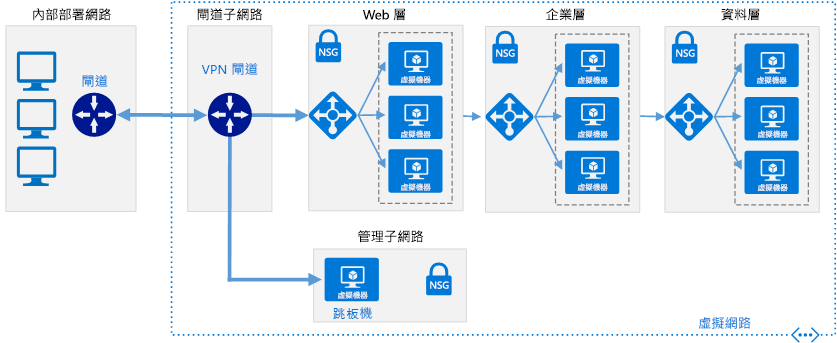
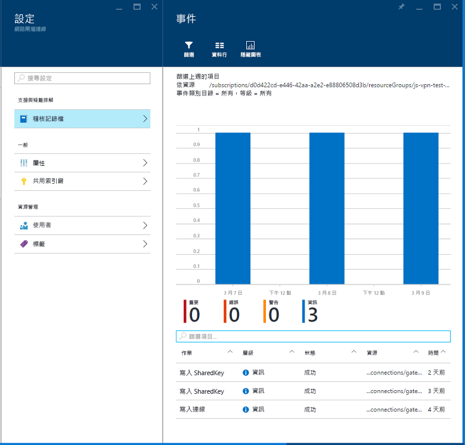

# 使用 VPN 閘道將內部部署網路連線至 Azure

此參考架構會示範如何使用網站對網站虛擬私人網路 (VPN)，將內部部署網路擴充至 Azure。 內部部署網路和 Azure 虛擬網路 (VNet) 之間的流量會透過 IPSec VPN 通道流動。 [**部署這個解決方案**](#deploy-the-solution)。

下載這個架構的 [Visio 檔案][visio-download]。

## 架構

此架構由下列元件組成。

- **內部部署網路**。 在組織內執行的私用區域網路。

- **VPN 設備**。 可對內部部署網路提供外部連線的裝置或服務。 VPN 設備可能是硬體裝置或軟體解決方案，例如，Windows Server 2012 中的路由及遠端存取服務 (RRAS)。 如需支援的 VPN 設備清單和將其設定為連線至 Azure VPN 閘道的詳細資訊，請參閱[關於站對站 VPN 閘道連線的 VPN 裝置][vpn-appliance]一文中所選取裝置的指示。

- **虛擬網路 (VNet)**。 雲端應用程式與 Azure VPN 閘道的元件存會位於相同 [VNet][azure-virtual-network]。

- **Azure VPN 閘道**。 [VPN 閘道][azure-vpn-gateway]服務可讓您透過 VPN 設備將 VNet 連線至內部部署網路。 如需詳細資訊，請參閱[將內部部署網路連線至 Microsoft Azure 虛擬網路][connect-to-an-Azure-vnet]。 VPN 閘道包含下列元素：

  - **虛擬網路閘道**。 為 VNet 提供虛擬 VPN 設備的資源。 負責將流量從內部部署網路由至 VNet。
  - **區域網路閘道**。 內部部署 VPN 設備的抽象概念。 從雲端應用程式流至內部部署網路的網路流量會透過此閘道路由傳送。
  - **連線**。 連線的屬性會指定連線類型 (IPSec) 以及與內部部署 VPN 設備共用以加密流量的金鑰。
  - **閘道子網路**。 虛擬網路閘道保留在自己的子網路中，其受限於下方＜建議＞一節中所述的各種需求。

- **雲端應用程式**。 在 Azure 中裝載的應用程式。 此應用程式在透過 Azure 負載平衡器連線多個子網路的情況下，可能包括多層。 如需有關應用程式基礎結構的詳細資訊，請參閱[執行 Windows VM 工作負載][windows-vm-ra]和[執行 Linux VM 工作負載][linux-vm-ra]。

- **內部負載平衡器**。 來自 VPN 閘道的網路流量會透過內部負載平衡器，路由傳送至雲端應用程式。 負載平衡器會位於應用程式的前端子網路中。

## 建議

下列建議適用於大部分的案例。 除非您有特定的需求會覆寫它們，否則請遵循下列建議。

### VNet 和閘道子網路

建立 Azure VNet，且其位址空間要夠大，以便使用所有必要資源。 如果未來可能需要其他虛擬機器，請確定 VNet 位址空間有足夠的空間可擴增。 VNet 的位址空間不得與內部部署網路重疊。 例如，上圖中 VNet 使用位址空間 10.20.0.0/16。

建立一個名為 *GatewaySubnet* 的子網路，且其位址範圍為 /27。 虛擬網路閘道需要使用這個子網路。 將 32 個位址配置給這個子網路，將有助於防止未來達到閘道大小限制。 此外，請避免將此子網路放在位址空間的中間。 較好的做法是，將閘道子網路的位址空間設定在 VNet 位址空間的上端。 圖中所示的範例是使用 10.20.255.224/27。  以下是計算 [CIDR] 的快速程序：

1. 將 VNet 位址空間中的變動位元數設為 1 (根據閘道正在使用的位元數)，然後將其他位元數設為 0。
2. 將產生的位元數轉換成十進位，並將其表示為前置長度設為閘道子網路大小的位址空間。

例如，IP 位址範圍是 10.20.0.0/16 的 VNet，套用上述步驟 1 後會變成 10.20.0b11111111.0b11100000。  將其轉換成十進位並表示為位址空間後會產生 10.20.255.224/27。

> [!WARNING]
> 請勿將任何虛擬機器部署至閘道子網路。 此外，請勿指派 NSG 至此子網路，因為會導致閘道停止運作。
>

### 虛擬網路閘道

配置虛擬網路閘道的公用 IP 位址。

在閘道子網路中建立虛擬網路閘道，並為其指派新配置的公用 IP 位址。 使用最符合您需求且由您的 VPN 設備啟用的閘道類型：

- 如果您需要根據原則準則 (例如位址首碼)，密切地控制要求的路由方式，可建立[原則型閘道][policy-based-routing]。 原則型閘道會使用靜態路由，並只適用於站對站連線。

- 如果您使用 RRAS 連線至內部部署網路、支援多站台或跨區域連線或實作 VNet 對 VNet 連線 (包括跨越多個 Vnet 的路由)，可建立[路由型閘道][route-based-routing]。 路由型閘道會使用動態路由來指引網路之間的流量。 動態路由在網路路徑中的容錯能力比靜態路由好，因為動態路由可以嘗試替代路由。 路由型閘道也可減少額外負荷，因為當網路位址變更時，路由可能不需要以手動方式更新。

如需支援的 VPN 設備清單，請參閱[關於站對站 VPN 閘道連線的 VPN 裝置][vpn-appliances]。

> [!NOTE]
> 一旦建立閘道之後，您必須刪除並重新建立閘道才能變更閘道類型。
>

選取最符合您輸送量需求的 Azure VPN 閘道 SKU。 如需詳細資訊，請參閱[閘道 SKU][azure-gateway-skus]

> [!NOTE]
> 基本 SKU 與 Azure ExpressRoute 不相容。 建立閘道之後，您可以[變更 SKU][changing-SKUs]。
>

您須根據閘道上所佈建及可用時間量支付費用。 請參閱 [VPN 閘道價格][azure-gateway-charges]。

建立閘道子網路的路由規則，將傳入的應用程式流量從閘道引導至內部負載平衡器，而不允許將要求直接傳遞至應用程式虛擬機器。

### 內部部署網路連線

建立區域網路閘道。 指定內部部署 VPN 設備的公用 IP 位址，以及內部部署網路的位址空間。 請注意，內部部署 VPN 設備必須有可以存取的公用 IP 位址，讓 Azure VPN 閘道中的區域網路閘道進行存取。 在網路位址轉譯 (NAT) 裝置後面找不到 VPN 裝置。

建立虛擬網路閘道與區域網路閘道的站對站連線。 選取站對站 (IPSec) 連線類型，並指定共用金鑰。 Azure VPN 閘道的站對站加密是以 IPSec 通訊協定為基礎，並使用預先共用的金鑰來進行驗證。 您會在建立 Azure VPN 閘道時指定金鑰。 您必須使用相同金鑰來設定在內部部署執行的 VPN 設備。 目前不支援其他驗證機制。

請確認內部部署路由基礎結構已設定為，將原本目的地是 Azure VNet 位址的要求轉送至 VPN 裝置。

在內部部署網路中，開啟任何雲端應用程式所需的連接埠。

測試連線以確認下列事項：

- 內部部署 VPN 設備透過 Azure VPN 閘道，正確地將流量路由至雲端應用程式。
- VNet 正確地將流量路由回內部部署網路。
- 兩個方向中禁止的流量已正確地封鎖。

## 延展性考量

您可以從基本或標準 VPN 閘道 SKU 移到高效能 VPN SKU，以達到所限制的垂直延展性。

對於預期有大量 VPN 流量的 Vnet，請考慮將不同工作負載分散到較小的個別 VNet，以及為每一個個別 VNet 設定 VPN 閘道。

您可以水平或垂直分割 VNet。 若要以水平方式分割，請將一些虛擬機器執行個體從每個層移至新 VNet 的子網路。 結果會是每個 VNet 都具有相同的結構與功能。 若要以垂直方式分割，請重新設計每個層以將功能分成不同的邏輯區域 (例如處理訂單、發票開立和客戶帳戶管理等)。 然後每個功能區域就可以放在自己的 VNet 中。

複寫 VNet 中的內部部署 Active Directory 網域控制站，以及在 VNet 中實作 DNS，可以協助減少部分安全性相關流量與系統管理流量從內部部署流至雲端。 如需詳細資訊，請參閱[將 Active Directory Domain Services (AD DS) 擴充至 Azure][adds-extend-domain]。

## 可用性考量

如果您需要確保內部部署網路仍然可供 Azure VPN 閘道使用，可為內部部署 VPN 閘道實作容錯移轉叢集。

如果您的組織具有多個內部部署站台，可對一個或多個 Azure Vnet 建立[多站台連線][vpn-gateway-multi-site]。 此方法需要建立動態 (路由型) 路由，因此請確定內部部署 VPN 閘道支援此功能。

如需有關服務等級協定的詳細資訊，請參閱 [VPN 閘道的 SLA][sla-for-vpn-gateway]。

## 管理性考量

監視內部部署 VPN 設備中的診斷資訊。 此流程取決於 VPN 設備所提供的功能。 例如，如果您使用 Windows Server 2012 上的路由及遠端存取服務，也就是 [RRAS 記錄][rras-logging]。

請使用 [Azure VPN 閘道診斷][gateway-diagnostic-logs]來擷取連線問題的相關資訊。 這些記錄可用來追蹤資訊，例如連線要求的來源和目的地、使用的通訊協定，以及建立連線的方式 (或嘗試失敗的原因)。

在 Azure 入口網站中，使用可用的稽核記錄來監視 Azure VPN 閘道的作業記錄。 個別的記錄適用於區域網路閘道、Azure 網路閘道和連線。 此資訊可用來追蹤閘道上所做的任何變更，而且有助於了解先前可運作的閘道為什麼會停止運作。

監視連線，並追蹤連線失敗事件。 您可以使用監視套件 (例如 [Nagios][nagios]) 來擷取和提報此資訊。

## 安全性考量

針對每個 VPN 閘道產生不同的共用金鑰。 使用強式共用金鑰，以協助抵禦暴力密碼破解攻擊。

> [!NOTE]
> 目前，您無法使用 Azure Key Vault 預先共用 Azure VPN 閘道的金鑰。
>

請確定內部部署 VPN 設備使用的加密方法[與 Azure VPN 閘道相容][vpn-appliance-ipsec]。 針對原則型路由，Azure VPN 閘道支援 AES256、AES128 和 3DES 加密演算法。 路由型閘道支援 AES256 和 3DES。

如果您的內部部署 VPN 設備位在與網際網路之間有防火牆的周邊網路 (DMZ) 上，您可能必須設定[其他防火牆規則][additional-firewall-rules]，以允許站對站 VPN 連線。

如果 VNet 中的應用程式會將資料傳送至網際網路，請考慮[實作強制通道][forced-tunneling]，以透過內部部署網路來路由所有網際網路繫結流量。 此方法可讓您稽核應用程式在內部部署基礎結構中所做的傳出要求。

> [!NOTE]
> 強制通道可能會影響與 Azure 服務 (例如儲存體服務) 和 Windows 授權管理員的連線。
>

## 部署解決方案

**必要條件**。 您必須已經使用適當的網路設備，設定現有的內部部署基礎結構。

若要部署解決方案，請執行下列步驟。

<!-- markdownlint-disable MD033 -->

1. 按一下下方的按鈕： 
2. 等待此連結在 Azure 入口網站中開啟，然後按照下列步驟進行：
   - **資源群組**名稱已在參數檔案中定義，因此請在文字方塊中選取 [新建] 並輸入 `ra-hybrid-vpn-rg`。
   - 從 [位置] 下拉式方塊選取區域。
   - 請勿編輯 [範本的根 URI] 或 [參數根 URI] 文字方塊。
   - 檢閱條款和條件，然後按一下 [我同意上方所述的條款及條件] 核取方塊。
   - 按一下 [購買] 按鈕。
3. 等待部署完成。

<!-- markdownlint-enable MD033 -->

若要對連線進行疑難排解，請參閱[針對混合式 VPN 連線進行疑難排解](./troubleshoot-vpn.md)。

<!-- links -->

[adds-extend-domain]: ../identity/adds-extend-domain.md
[windows-vm-ra]: ../virtual-machines-windows/index.md
[linux-vm-ra]: ../virtual-machines-linux/index.md

[azure-cli]: /azure/virtual-machines-command-line-tools
[azure-virtual-network]: /azure/virtual-network/virtual-networks-overview
[vpn-appliance]: /azure/vpn-gateway/vpn-gateway-about-vpn-devices
[azure-vpn-gateway]: https://azure.microsoft.com/services/vpn-gateway/
[azure-gateway-charges]: https://azure.microsoft.com/pricing/details/vpn-gateway/
[azure-gateway-skus]: /azure/vpn-gateway/vpn-gateway-about-vpngateways#gwsku
[connect-to-an-Azure-vnet]: https://technet.microsoft.com/library/dn786406.aspx
[vpn-gateway-multi-site]: /azure/vpn-gateway/vpn-gateway-multi-site
[policy-based-routing]: https://en.wikipedia.org/wiki/Policy-based_routing
[route-based-routing]: https://en.wikipedia.org/wiki/Static_routing
[sla-for-vpn-gateway]: https://azure.microsoft.com/support/legal/sla/vpn-gateway/
[additional-firewall-rules]: https://technet.microsoft.com/library/dn786406.aspx#firewall
[nagios]: https://www.nagios.org/
[changing-SKUs]: https://azure.microsoft.com/blog/azure-virtual-network-gateway-improvements/
[gateway-diagnostic-logs]: https://blogs.technet.microsoft.com/keithmayer/2016/10/12/step-by-step-capturing-azure-resource-manager-arm-vnet-gateway-diagnostic-logs/
[rras-logging]: https://www.petri.com/enable-diagnostic-logging-in-windows-server-2012-r2-routing-and-remote-access
[forced-tunneling]: /azure/vpn-gateway/vpn-gateway-about-forced-tunneling
[vpn-appliances]: /azure/vpn-gateway/vpn-gateway-about-vpn-devices
[visio-download]: https://archcenter.blob.core.windows.net/cdn/hybrid-network-architectures.vsdx
[vpn-appliance-ipsec]: /azure/vpn-gateway/vpn-gateway-about-vpn-devices#ipsec-parameters
[azure-cli]: /cli/azure/install-azure-cli
[CIDR]: https://en.wikipedia.org/wiki/Classless_Inter-Domain_Routing
