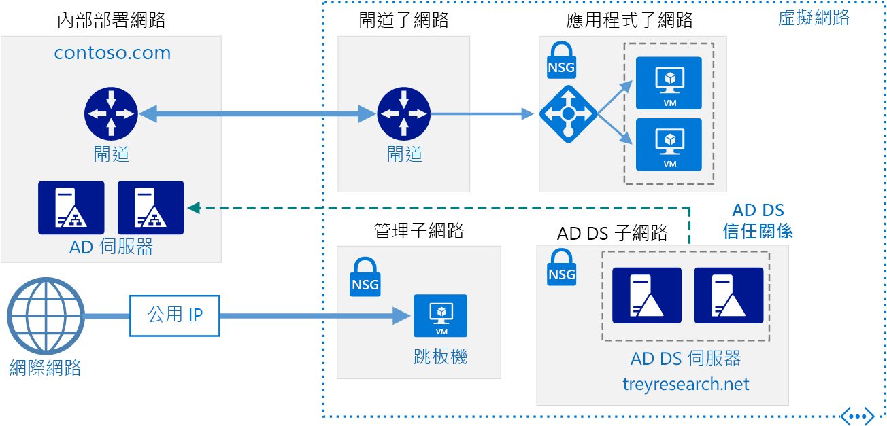
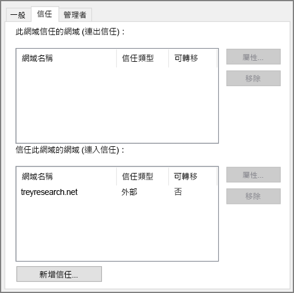

# <a name="create-an-active-directory-domain-services-ad-ds-resource-forest-in-azure"></a>在 Azure 中建立 Active Directory Domain Services (AD DS) 資源樹系

此參考架構會顯示如何在 Azure 中建立受到內部部署 AD 樹系內網域信任的另一個 Active Directory 網域。 [**部署這個解決方案**](#deploy-the-solution)。



下載這個架構的 [Visio 檔案][visio-download]。

Active Directory Domain Services (AD DS) 會以階層式結構儲存身分識別資訊。 階層式結構中的最上層節點稱為樹系。 樹系包含網域，而網域則包含其他類型的物件。 此參考架構會在 Azure 中建立與內部部署網域具有單向連出信任關係的 AD DS 樹系。 Azure 中的樹系包含不存在於內部部署的網域。 因為信任關係，才能夠信任針對內部部署網域的登入，以存取個別 Azure 網域中的資源。

這個架構的典型用途包括維持雲端中保留之物件和身分識別的安全性隔離，以及將個別網域從內部部署移轉到雲端。

如需了解其他考量，請參閱[選擇解決方案以整合內部部署 Active Directory 與 Azure][considerations]。 

## <a name="architecture"></a>架構

此架構具有下列元件。

- **內部部署網路**。 內部部署網路包含自己的 Active Directory 樹系和網域。
- **Active Directory 伺服器**。 這些是雲端中實作當作 VM 執行之網域服務的網域控制站。 這些伺服器會裝載包含一個或多個網域的樹系，而且與內部部署的網域不同。
- **單向信任關係**。 圖表中的範例顯示 Azure 中網域到內部部署網域的單向信任。 這種關係可讓內部部署使用者在 Azure 中存取網域內的資源，但不適用於反向。 如果雲端使用者也需要存取內部部署資源，您可以建立雙向信任。
- **Active Directory 子網路**。 AD DS 伺服器會裝載在不同的子網路中。 網路安全性群組 (NSG) 規則可保護 AD DS 伺服器，並提供防火牆以防禦來自非預期來源的流量。
- **Azure 閘道**。 Azure 閘道會提供內部部署網路與 Azure VNet 之間的連線。 這可能是 [VPN 連線][azure-vpn-gateway]或 [Azure ExpressRoute][azure-expressroute]。 如需詳細資訊，請參閱[在 Azure 中實作安全的混合式網路架構][implementing-a-secure-hybrid-network-architecture]。

## <a name="recommendations"></a>建議

如需在 Azure 中實作 Active Directory 的特定建議，請參閱下列文章：

- [將 Active Directory Domain Services (AD DS) 擴充至 Azure][adds-extend-domain]。
- [在 Azure 虛擬機器上部署 Windows Server Active Directory 的指導方針][ad-azure-guidelines]。

### <a name="trust"></a>信任

內部部署網域包含在雲端網域中的不同樹系內。 若要在雲端驗證內部部署使用者，Azure 中的網域必須信任內部部署樹系中的登入網域。 同樣地，如果雲端為外部使用者提供登入網域，內部部署樹系也需要信任雲端網域。

您可以在樹系層級[建立樹系信任][creating-forest-trusts]，也可以在網域層級[建立外部信任][creating-external-trusts]來建立信任。 樹系層級信任會建立兩個樹系中所有網域之間的關係。 外部網域層級信任只會建立兩個指定網域之間的關係。 您僅應在不同樹系的網域之間建立外部網域層級信任。

信任可以是單向或雙向：

- 單向信任可讓一個網域或樹系 (稱為「連入」網域或樹系) 中的使用者存取另一個網域或樹系 (「連出」網域或樹系) 中保留的資源。
- 雙向信任可讓網域或樹系中的使用者存取其他網域或樹系中保留的資源。

下表摘要說明一些簡單案例的信任設定：

| 案例 | 內部部署信任 | 雲端信任 |
| --- | --- | --- |
| 內部部署使用者需要存取雲端的資源，但反之則否 |單向，連入 |單向，連出 |
| 雲端使用者需要存取內部部署的資源，但反之則否 |單向，連出 |單向，連入 |
| 雲端和內部部署的使用者需要同時存取雲端和內部部署保留的資源 |雙向，連入和連出 |雙向，連入和連出 |

## <a name="scalability-considerations"></a>延展性考量

Active Directory 會針對屬於相同網域的網域控制站自動進行調整。 要求會分散到網域內的所有控制站。 您可以新增另一個網域控制站，而且該網域控制站會自動與網域同步。 請勿將個別的負載平衡器設定為將流量導向至網域內的控制站。 請確定所有網域控制站都有足夠的記憶體和儲存體資源，可處理網域資料庫。 將所有網域控制站 VM 的大小設為相同。

## <a name="availability-considerations"></a>可用性考量

針對每個網域至少佈建兩個網域控制站。 如此可在伺服器之間啟用自動複寫。 針對當作處理每個網域之 Active Directory 伺服器的 VM，建立可用性設定組。 在此可用性設定組中至少放置兩部伺服器。

此外，如果作為彈性單一主機操作 (FSMO) 角色之伺服器的連線失敗，請考慮將每個網域中的一部或多部伺服器指定為[待命操作主機][standby-operations-masters]。

## <a name="manageability-considerations"></a>管理性考量

如需管理與監視考量的相關資訊，請參閱[將 Active Directory 擴充至 Azure][adds-extend-domain]。

如需其他資訊，請參閱[監視 Active Directory][monitoring_ad]。 您可以在管理子網路中的監視伺服器上安裝工具 (例如 [Microsoft Systems Center][microsoft_systems_center]) 以協助執行這些工作。

## <a name="security-considerations"></a>安全性考量

樹系層級信任是可轉移的。 如果您在內部部署樹系與雲端樹系之間建立樹系層級信任，此信任會擴充至任一樹系中建立的其他新網域。 如果您基於安全性目的而使用網域提供區隔，請考慮僅在網域層級建立信任。 網域層級信任是不可轉移的。

如需了解 Active Directory 專屬的安全性考量，請參閱[將 Active Directory 擴充至 Azure][adds-extend-domain] 中的＜安全性考量＞一節。

## <a name="deploy-the-solution"></a>部署解決方案

適用於此架構的部署可在 [GitHub][github] 上取得。 請注意，整個部署最多可能需要兩個小時，其中包括建立 VPN 閘道和執行設定 AD DS 的指令碼。

### <a name="prerequisites"></a>必要條件

1. 複製、派生或下載適用於 [GitHub 存放庫](https://github.com/mspnp/identity-reference-architectures)的 zip 檔案。

2. 安裝 [Azure CLI 2.0](/cli/azure/install-azure-cli?view=azure-cli-latest)。

3. 安裝 [Azure 建置組塊](https://github.com/mspnp/template-building-blocks/wiki/Install-Azure-Building-Blocks) npm 封裝。

   ```bash
   npm install -g @mspnp/azure-building-blocks
   ```

4. 從命令提示字元、Bash 提示字元或 PowerShell 提示字元中登入 Azure 帳戶，如下所示：

   ```bash
   az login
   ```

### <a name="deploy-the-simulated-on-premises-datacenter"></a>部署模擬的內部部署資料中心

1. 巡覽至 GitHub 存放庫的 `identity/adds-forest` 資料夾。

2. 開啟 `onprem.json` 檔案。 搜尋 `adminPassword` 和 `Password` 的執行個體，並新增密碼的值。

3. 執行下列命令，並等待部署完成：

    ```bash
    azbb -s <subscription_id> -g <resource group> -l <location> -p onprem.json --deploy
    ```

### <a name="deploy-the-azure-vnet"></a>部署 Azure VNet

1. 開啟 `azure.json` 檔案。 搜尋 `adminPassword` 和 `Password` 的執行個體，並新增密碼的值。

2. 在同一個檔案中，搜尋 `sharedKey` 的執行個體，並輸入 VPN 連線的共用金鑰。

    ```json
    "sharedKey": "",
    ```

3. 執行下列命令，並等待部署完成。

    ```bash
    azbb -s <subscription_id> -g <resource group> -l <location> -p onoprem.json --deploy
    ```

   部署至與內部 VNet 相同的資源群組。

### <a name="test-the-ad-trust-relation"></a>測試 AD 信任關係

1. 使用 Azure 入口網站，巡覽至您所建立的資源群組。

2. 使用 Azure 入口網站尋找名為 `ra-adt-mgmt-vm1` 的 VM。

3. 按一下 `Connect` 以開啟 VM 的遠端桌面工作階段。 使用者名稱是 `contoso\testuser`，而密碼是您在 `onprem.json` 參數檔案中指定的密碼。

4. 從遠端桌面工作階段中開啟連至 192.168.0.4 (此為 VM `ra-adtrust-onpremise-ad-vm1` 的 IP 位址) 的另一個遠端桌面工作階段。 使用者名稱是 `contoso\testuser`，而密碼是您在 `azure.json` 參數檔案中指定的密碼。

5. 從 `ra-adtrust-onpremise-ad-vm1` 的遠端桌面工作階段中移至 [伺服器管理員]，然後按一下 [工具] > [Active Directory 網域及信任]。

6. 在左窗格中，以滑鼠右鍵按一下 contoso.com，然後選取 [內容]。

7. 按一下 [信任] 索引標籤。您應該會看到 treyresearch.net 列為連入信任。



## <a name="next-steps"></a>後續步驟

- 了解[將內部部署 AD DS 網域擴充至 Azure][adds-extend-domain] 的最佳做法
- 了解[在 Azure 中建立 AD FS 基礎結構][adfs]的最佳做法。

<!-- links -->
[adds-extend-domain]: adds-extend-domain.md
[adfs]: adfs.md
[azure-cli-2]: /azure/install-azure-cli
[azbb]: https://github.com/mspnp/template-building-blocks/wiki/Install-Azure-Building-Blocks

[implementing-a-secure-hybrid-network-architecture]: ../dmz/secure-vnet-hybrid.md
[implementing-a-secure-hybrid-network-architecture-with-internet-access]: ../dmz/secure-vnet-dmz.md

[running-VMs-for-an-N-tier-architecture-on-Azure]: ../virtual-machines-windows/n-tier.md

[ad-azure-guidelines]: https://msdn.microsoft.com/library/azure/jj156090.aspx
[azure-expressroute]: https://azure.microsoft.com/documentation/articles/expressroute-introduction/
[azure-vpn-gateway]: https://azure.microsoft.com/documentation/articles/vpn-gateway-about-vpngateways/
[considerations]: ./considerations.md
[creating-external-trusts]: https://technet.microsoft.com/library/cc816837(v=ws.10).aspx
[creating-forest-trusts]: https://technet.microsoft.com/library/cc816810(v=ws.10).aspx
[github]: https://github.com/mspnp/identity-reference-architectures/tree/master/adds-forest
[incoming-trust]: https://raw.githubusercontent.com/mspnp/identity-reference-architectures/master/adds-forest/extensions/incoming-trust.ps1
[microsoft_systems_center]: https://microsoft.com/cloud-platform/system-center
[monitoring_ad]: https://msdn.microsoft.com/library/bb727046.aspx
[resource-manager-overview]: /azure/azure-resource-manager/resource-group-overview
[solution-script]: https://raw.githubusercontent.com/mspnp/identity-reference-architectures/master/adds-forest/Deploy-ReferenceArchitecture.ps1
[standby-operations-masters]: https://technet.microsoft.com/library/cc794737(v=ws.10).aspx
[outgoing-trust]: https://raw.githubusercontent.com/mspnp/identity-reference-architectures/master/adds-forest/extensions/outgoing-trust.ps1
[verify-a-trust]: https://technet.microsoft.com/library/cc753821.aspx
[visio-download]: https://archcenter.blob.core.windows.net/cdn/identity-architectures.vsdx
