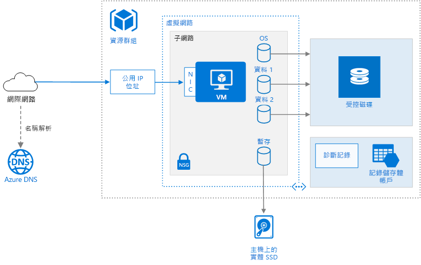

# <a name="run-a-windows-virtual-machine-on-azure"></a>在 Azure 中執行 Windows 虛擬機器

除了虛擬機器 (VM) 本身，佈建 VM 還需要額外的元件，包括網路功能和儲存體資源。 本文將說明在 Azure 上執行 Windows VM 的最佳做法。



## <a name="resource-group"></a>資源群組

[資源群組][resource-manager-overview]是保存 Azure 相關資源的本機容器。 一般來說，根據資源的存留期以及將管理資源的人員來群組資源。

請將關係密切且具有相同生命週期的資源置於同一個[資源群組][resource-manager-overview]中。 資源群組可讓您以群組為單位來部署和監視資源，並根據資源群組追蹤帳單成本。 您也可以刪除整組資源，這對於測試部署非常有用。 請指派有意義的資源名稱，以簡化尋找特定資源及了解其角色的程序。 如需詳細資訊，請參閱[建議的 Azure 資源命名慣例][naming-conventions]。

## <a name="virtual-machine"></a>虛擬機器

您可以從已發佈的映像清單、自訂的受控映像或您上傳至 Azure Blob 儲存體的虛擬硬碟 (VHD) 檔案佈建 VM。

Azure 提供許多不同的虛擬機器大小。 如需相關資訊，請參閱 [Azure 中虛擬機器的大小][virtual-machine-sizes]。 如果您將現有的工作負載移至 Azure，則從最符合您內部部署伺服器的 VM 大小開始。 然後根據 CPU、記憶體和每秒的磁碟輸入/輸出作業 (IOPS) 測量您的實際工作負載效能，並視需要調整大小。

一般而言，選擇最接近您的內部使用者或客戶的 Azure 區域。 並非所有 VM 大小在所有區域都可供使用。 如需詳細資訊，請參閱[依區域提供的服務][services-by-region]。 如需特定區域中可用的 VM 大小清單，請從 Azure 命令列介面 (CLI) 執行下列命令：

```azurecli
az vm list-sizes --location <location>
```

如需選擇已發佈 VM 映像的相關資訊，請參閱[尋找 Windows VM 映像][select-vm-image]。

## <a name="disks"></a>磁碟

為了達到最佳的磁碟 I/O 效能，我們建議使用[進階儲存體][premium-storage]，這會將資料儲存在固態硬碟 (SSD)。 成本是依佈建的磁碟容量而定。 IOPS 和輸送量也取決於磁碟大小，因此當您佈建磁碟時，請考慮以下三個因素 (容量、IOPS 和輸送量)。

我們也建議使用[受控磁碟][managed-disks]。 受控磁碟藉由為您處理儲存體來簡化磁碟管理。 受控磁碟不需要儲存體帳戶。 您只需指定磁碟的大小和類型，它就會以高度可用的資源方式進行部署

作業系統磁碟是儲存在 [Azure 儲存體][azure-storage]中的 VHD，因此即使主機電腦已關閉仍會保存下來。 我們也建議建立一或多個[資料磁碟][data-disk]，這些是用於應用程式資料的持續性 VHD。 若情況允許，請將應用程式安裝在資料磁碟，不要安裝在作業系統磁碟。 有些舊版應用程式可能需要在 C: 磁碟機上安裝元件，在此情況下，您可以使用 PowerShell [調整作業系統磁碟大小][resize-os-disk]。

VM 也是使用暫存磁碟 (Windows 上的 `D:` 磁碟機) 來建立。 此磁碟會儲存在主機電腦的實體磁碟機上。 它「不會」儲存在 Azure 儲存體中，而且可能在重新開機期間和其他 VM 生命週期事件中遭到刪除。 僅將此磁碟使用於暫存資料，例如分頁檔或交換檔。

## <a name="network"></a>網路

網路元件包括下列資源：

- **虛擬網路**。 每部 VM 都會部署到可以分割成多個子網路的虛擬網路。

- **網路介面 (NIC)**。 NIC 可讓 VM 與虛擬網路通訊。 如果您的 VM 需要多個 NIC，請注意每種 [VM 大小][vm-size-tables]都有定義 NIC 的數目上限。

- **公用 IP 位址**。 必須要有公用 IP 位址才能與 VM &mdash; 進行通訊，例如透過遠端桌面 (RDP)。 此公用 IP 位址可以是動態或靜態。 預設值為動態。

- 若您需要一個不會變更 &mdash; 的固定 IP 位址 (例如，若您需要建立 DNS「A」記錄，或將 IP 位址新增到安全清單中)，請保留一個[靜態 IP 位址][static-ip]。
- 您也可以建立 IP 位址的完整網域名稱 (FQDN)。 然後您可以在 DNS 中註冊指向該 FQDN 的 [CNAME 記錄][cname-record]。 如需詳細資訊，請參閱[在 Azure 入口網站中建立完整網域名稱][fqdn]。

- **網路安全性群組 (NSG)**。 [網路安全性群組][nsg]可用來允許或拒絕 VM 的網路流量。 NSG 可與子網路或個別 VM 執行個體相關聯。

所有 NSG 都包含一組[預設規則][nsg-default-rules]，包括一個封鎖所有網際網路輸入流量的規則。 預設的規則不能刪除，但其他規則可以覆寫它們。 若要啟用網際網路流量，請建立允許輸入流量輸入特定連接埠的規則 &mdash; 例如，允許連接埠 80 用於 HTTP。 若要啟用 RDP，請新增一個 NSG 規則，以允許將輸入流量輸入至 TCP 連接埠 3389。

## <a name="operations"></a>作業

**診斷**。 啟用監視和診斷，包括基本健全狀況度量、診斷基礎結構記錄檔及[開機診斷][boot-diagnostics]。 如果您的 VM 進入無法開機的狀態，開機診斷能協助您診斷開機失敗。 建立用來儲存記錄的 Azure 儲存體帳戶。 標準本地備援儲存體 (LRS) 帳戶已足以保存診斷記錄。 如需詳細資訊，請參閱[啟用監視和診斷][enable-monitoring]。

**可用性**。 您的 VM 可能會受到[計劃性維護][planned-maintenance]或[非計劃性停機][manage-vm-availability]的影響。 您可以使用 [VM 重新啟動記錄檔][reboot-logs]來判斷 VM 重新啟動是否是因為計劃性維護所造成。 若要擁有較高的可用性，請在[可用性設定組](/azure/virtual-machines/windows/manage-availability#configure-multiple-virtual-machines-in-an-availability-set-for-redundancy)中部署多個 VM。 此設定會提供較高的[服務等級協定 (SLA)][vm-sla]。

**備份** 若要防止資料意外遺失，請使用 [Azure 備份](/azure/backup/)服務將您的 VM 備份到異地備援儲存體。 Azure 備份提供應用程式一致的備份。

**停止 VM**。 Azure 會區分「已停止」和「已解除配置」狀態。 您需要在 VM 狀態停止時支付費用，而不是在取消配置 VM 時支付。 在 Azure 入口網站中，[停止] 按鈕會取消配置 VM。 如果您已在登入時透過 OS 關閉，則會停止 VM，但不會取消配置，因此您仍需付費。

**刪除 VM**。 如果您刪除 VM，並不會刪除 VHD。 這表示您可以放心地刪除 VM，而不會遺失任何資料。 不過，您仍需支付儲存體費用。 若要刪除 VHD，請將檔案從 [Blob 儲存體][blob-storage]中刪除。 若要防止意外刪除，請使用[資源鎖定][resource-lock]來鎖定整個資源群組或鎖定個別資源 (例如 VM)。

## <a name="security-considerations"></a>安全性考量

使用 [Azure 資訊安全中心][security-center]來集中檢視 Azure 資源的安全性狀態。 資訊安全中心會監視潛在的安全性問題，並提供全面性的部署安全性健康狀態。 資訊安全中心是依每個 Azure 訂用帳戶設定。 啟用安全性資料收集，如[將 Azure 訂用帳戶上架到資訊安全中心的標準層][security-center-get-started]中所述。 啟用資料收集時，資訊安全性中心就會自動掃描任何該訂用帳戶建立的 VM。

**修補程式管理**。 若已啟用，資訊安全性中心會檢查是否遺漏了任何安全性或重要更新。 使用 VM 上的[群組原則設定][group-policy]來啟用自動系統更新。

**反惡意程式碼**。 如果啟用，資訊安全性中心會檢查是已安裝反惡意程式碼軟體。 您也可以使用資訊安全中心來從 Azure 入口網站內安裝反惡意程式碼軟體。

**存取控制**。 請使用[角色型存取控制 (RBAC)][rbac] 來控制 Azure 資源的存取。 RBAC 可讓您指派授權角色給您 DevOps 小組的成員。 例如，「讀取者」角色能檢視 Azure 資源但不能建立、管理或刪除它們。 有些權限只專屬於某個 Azure 資源類型。 例如，「虛擬機器參與者」角色能重新啟動或解除配置 VM、重設系統管理員密碼、建立新的 VM 等等。 其他對此架構可能有用的[內建 RBAC 角色][rbac-roles]包括 [DevTest Labs 使用者][rbac-devtest]和[網路參與者][rbac-network]。 

> [!NOTE]
> RBAC 不會限制使用者登入 VM 可執行的動作。 這些權限是由客體 OS上的帳戶類型來決定。

**稽核記錄**。 使用[稽核記錄檔][audit-logs]來查看佈建動作和其他 VM 事件。

**資料加密**。 如果您要加密作業系統和資料磁碟，請使用 [Azure 磁碟加密][disk-encryption]。

## <a name="next-steps"></a>後續步驟

- 若要佈建 Windows VM，請參閱[使用 Azure PowerShell 建立和管理 Windows VM](/azure/virtual-machines/windows/tutorial-manage-vm)
- 若要了解 Windows VM 上的完整多層式架構 (N-Tier)，請參閱 [Azure 上使用 SQL Server 的 Windows 多層式應用程式](./n-tier-sql-server.md)。

<!-- links -->
[audit-logs]: https://azure.microsoft.com/blog/analyze-azure-audit-logs-in-powerbi-more/
[azure-storage]: /azure/storage/storage-introduction
[blob-storage]: /azure/storage/storage-introduction
[boot-diagnostics]: https://azure.microsoft.com/blog/boot-diagnostics-for-virtual-machines-v2/
[cname-record]: https://en.wikipedia.org/wiki/CNAME_record
[data-disk]: /azure/virtual-machines/virtual-machines-windows-about-disks-vhds
[disk-encryption]: /azure/security/azure-security-disk-encryption
[enable-monitoring]: /azure/monitoring-and-diagnostics/insights-how-to-use-diagnostics
[fqdn]: /azure/virtual-machines/virtual-machines-windows-portal-create-fqdn
[group-policy]: https://docs.microsoft.com/previous-versions/windows/it-pro/windows-server-2012-R2-and-2012/dn595129(v=ws.11)
[manage-vm-availability]: /azure/virtual-machines/virtual-machines-windows-manage-availability
[managed-disks]: /azure/storage/storage-managed-disks-overview
[naming-conventions]: ../../best-practices/naming-conventions.md
[nsg]: /azure/virtual-network/virtual-networks-nsg
[nsg-default-rules]: /azure/virtual-network/virtual-networks-nsg#default-rules
[planned-maintenance]: /azure/virtual-machines/virtual-machines-windows-planned-maintenance
[premium-storage]: /azure/virtual-machines/windows/premium-storage
[rbac]: /azure/active-directory/role-based-access-control-what-is
[rbac-roles]: /azure/active-directory/role-based-access-built-in-roles
[rbac-devtest]: /azure/active-directory/role-based-access-built-in-roles#devtest-labs-user
[rbac-network]: /azure/active-directory/role-based-access-built-in-roles#network-contributor
[reboot-logs]: https://azure.microsoft.com/blog/viewing-vm-reboot-logs/
[resize-os-disk]: /azure/virtual-machines/virtual-machines-windows-expand-os-disk
[resource-lock]: /azure/resource-group-lock-resources
[resource-manager-overview]: /azure/azure-resource-manager/resource-group-overview
[security-center]: /azure/security-center/security-center-intro
[security-center-get-started]: /azure/security-center/security-center-get-started
[select-vm-image]: /azure/virtual-machines/virtual-machines-windows-cli-ps-findimage
[services-by-region]: https://azure.microsoft.com/regions/#services
[static-ip]: /azure/virtual-network/virtual-networks-reserved-public-ip
[virtual-machine-sizes]: /azure/virtual-machines/virtual-machines-windows-sizes
[visio-download]: https://archcenter.blob.core.windows.net/cdn/vm-reference-architectures.vsdx
[vm-size-tables]: /azure/virtual-machines/virtual-machines-windows-sizes
[vm-sla]: https://azure.microsoft.com/support/legal/sla/virtual-machines
