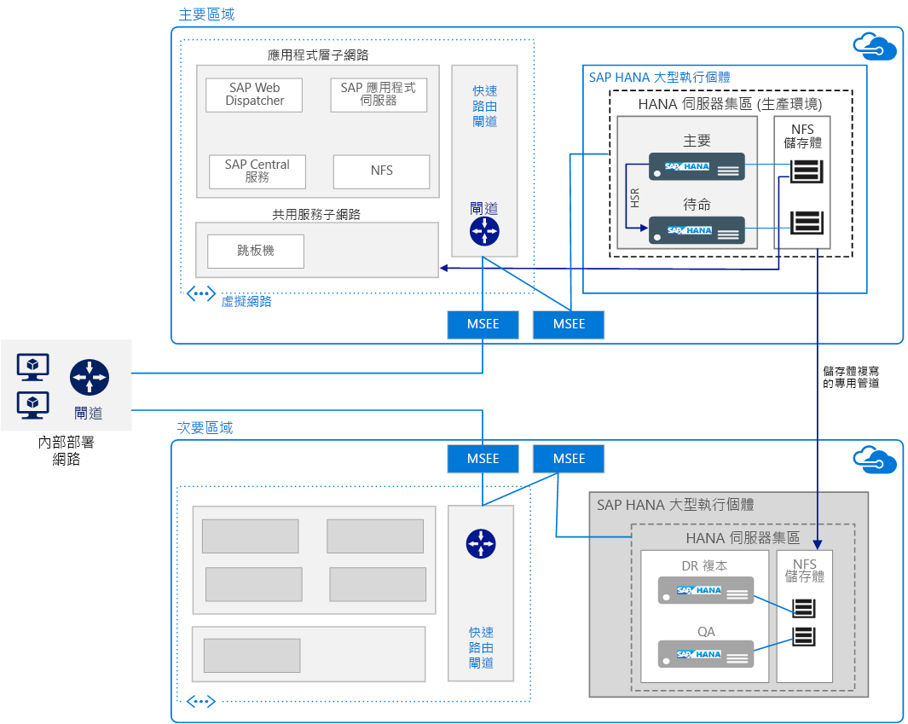

# 在 Azure 大型執行個體上執行 SAP HANA

此參考架構會顯示一組經過證實的做法，能在具有高可用性和災害復原 (DR) 的 Azure (大型執行個體) 上執行 SAP HANA。 這個供應項目名為 HANA 大型執行個體，部署在 Azure 區域中的實體伺服器上。

下載這個架構的 [Visio 檔案][visio-download]。

> [!NOTE]
> 部署此參考架構需要 SAP 產品的適當授權和其他非 Microsoft 技術。

## 架構

此架構由下列基礎結構元件組成。

- **虛擬網路**。 [Azure 虛擬網路][vnet]服務會安全地讓 Azure 資源彼此連線，且系統會針對每個層將其細分為個別[子網路][subnet]。 SAP 應用程式層會部署在 Azure 虛擬機器 (VM) 上，以連線至位於大型執行個體上的 HANA 資料庫層。

- **虛擬機器**。 會在 SAP 應用程式層和共用服務層中使用虛擬機器。 後者包含 jumpbox，系統管理員會使用該 jumpbox 來設定 HANA 大型執行個體，並提供其他虛擬機器的存取權。

- **HANA 大型執行個體**。 經認證已符合 SAP HANA Tailored Datacenter Integration (TDI) 標準的[實體伺服器][physical]，用於執行 SAP HANA。 此架構會使用兩個 HANA 大型執行個體：主要和次要計算單位。 資料層的高可用性由 HANA 系統複寫 (HSR) 提供。

- **高可用性配對**。 一組 HANA 大型執行個體刀鋒視窗會一起管理，以提供應用程式備援能力和可靠性。

- **MSEE (Microsoft Enterprise Edge)**。 MSEE 是透過 ExpressRoute 線路來自連線提供者或您網路邊線的連接點。

- **網路介面卡 (NIC)**。 為了啟用通訊，HANA 大型執行個體伺服器預設會提供 4 個虛擬 NIC。 這個架構需要一個 NIC 才能進行用戶端通訊，需要第二個 NIC 才能進行 HSR 所需的端點對端點連線，需要第三個 NIC 才能啟用 HANA 大型執行個體儲存體，以及需要第四個才能讓 iSCSI 用於高可用性叢集。

- **網路檔案系統 (NFS) 儲存體**。 [NFS][nfs] 伺服器會支援網路檔案共用，它會為 HANA 大型執行個體提供安全資料持續性。

- **ExpressRoute**。 若要在內部部署網路與 Azure 虛擬網路之間建立不會經過公開網際網路的私人連線，[ExpressRoute][expressroute] 是最建議您使用 Azure 網路服務。 Azure 虛擬機器會使用另一個 ExpressRoute 連線，以連線至 HANA 大型執行個體。 Azure 虛擬網路與 HANA 大型執行個體之間的 ExpressRoute 連線已設為 Microsoft 供應項目的一部分。

- **閘道**。 使用 ExpressRoute 閘道以將用於 SAP 應用程式層的 Azure 虛擬網路連線至 HANA 大型執行個體網路。 使用[高效能或超級效能][sku] SKU。

- **災害復原 (DR)**。 收到要求時，會支援儲存體複寫，並且該複寫的設定是從主要儲存體到位於其他區域中的 [DR 網站][DR-site]。

## 建議

需求可能有所不同，因此請使用這些建議作為起點。

### HANA 大型執行個體計算

[大型執行個體][physical]是以 Intel EX E7 CPU 架構為基礎且在大型執行個體戳記中設定的實體伺服器，也就是特定的一組伺服器或刀鋒視窗。 計算單位等於一個伺服器或刀鋒視窗，戳記由多個伺服器或刀鋒視窗組成。 在大型執行個體戳記內，伺服器不會共用，而是專用於執行一個客戶的 SAP HANA 部署。

有各種 SKU 可用於 HANA 大型執行個體，針對單一執行個體的 S/4HANA 或其他 SAP HANA 工作負載，支援最多 20 TB (60 TB 相應放大) 的記憶體。 提供[兩個類別][classes]的伺服器：

- 類型 I 類別：S72、S72m、S144、S144m、S192 和 S192m

- 類型 II 類別：S384、S384m、S384xm、S576m、S768m 和 S960m

例如，S72 SKU 隨附 768 GB RAM、3 terabytes (TB) 儲存體，以及具有 36 核心的 2 個 Intel Xeon 處理器 (E7-8890 v3)。 選擇適合的 SKU，來滿足您在架構和設計工作階段中所推斷出的大小需求。 務必確定您的大小能與正確的 SKU 相符。 功能和部署需求會[因類型而異][type]，可用性會因[區域][region]而異。 您也可以從一個 SKU 升級到較大的 SKU。

Microsoft 會協助建立大型執行個體安裝，但是您要負責驗證作業系統的組態設定。 請務必檢閱確切 Linux 版本的最新 SAP 附註。

### 儲存體

實作儲存體配置時應以適用於 SAP HANA 的 TDI 建議為基礎。 HANA 大型執行個體隨附標準 TDI 規格的特定儲存體組態。 不過，您可以 1 TB 為增量單位，購買額外的儲存體。

為了支援任務關鍵性環境的需求 (包括快速復原)，會使用 NFS 而不是直接連結儲存體。 適用於 HANA 大型執行個體的 NFS 儲存體伺服器是裝載於多租用戶環境，在其中會使用計算、網路和儲存體隔離來隔離及保護租用戶。

若要在主要網站中支援高可用性，請使用不同的儲存體配置。 例如，在多主機相應放大中，會共用儲存體。 另一個高可用性選項是以應用程式為基礎的複寫 (例如 HSR)。 不過，針對 DR 會使用以快照集為基礎的儲存體複寫。

### 網路

此架構會同時使用虛擬和實體網路。 虛擬網路是 Azure IaaS 的一部分，而且會透過 [ExpressRoute][expressroute] 線路連線至離散 HANA 大型執行個體實體網路。 跨部署閘道會將您在 Azure 虛擬網路中的工作負載連線到內部部署網站。

基於安全性考量，會將 HANA 大型執行個體網路彼此互相隔離。 除了專用的儲存體複寫，位於不同區域中的執行個體不會互相通訊。 不過，若要使用 HSR，需要區域間通訊。 [IP 路由表][ip]或 Proxy 可以用來啟用跨區域 HSR。

連線到一個區域中 HANA 大型執行個體的所有 Azure 虛擬網路，可以透過 ExpressRoute [交叉連線][cross-connected]至次要區域中的 HANA 大型執行個體。

在佈建期間預設會包含適用於 HANA 大型執行個體的 ExpressRoute。 針對安裝，需要特定網路配置 (包括必要的 CIDR 位址範圍和網域路由)。 如需詳細資訊，請參閱 [Azure 上 SAP HANA (大型執行個體) 的基礎結構和連線][HLI-infrastructure]。

## 延展性考量

若要相應增加或相應減少，您可以從適用於 HANA 大型執行個體之各種尺寸的伺服器中選擇。 這些伺服器的分類為[類型 I 和類型 II][ classes]且是為不同的工作負載而量身訂做的。 請選擇可以隨著未來三年工作負載而成長的大小。 一年認可也可行。

多主機相應放大部署通常用於 BW/4HANA 部署，作為一種資料庫資料分割策略。 若要相應放大，請在安裝之前規劃 HANA 資料表的位置。 從基礎結構的觀點而言，多主機會連線到共用儲存體磁碟區，萬一 HANA 系統中其中一個計算背景工作角色節點失敗時，可以讓待命主機快速接管。

單一刀鋒視窗上 HANA 中的 S/4HANA 和 SAP Business Suite，可以相應增加到單一 HANA 大型執行個體 20 TB。

針對嶄新的案例，可使用 [SAP Quick Sizer][quick-sizer] 來計算在 HANA 上實作 SAP 軟體時的記憶體需求。 Hana 的記憶體需求會隨著資料磁碟區擴大而增加。 使用您系統目前的記憶體耗用量作為基礎，來預測未來的耗用量，然後將需求對應至其中一個 HANA 大型執行個體大小。

如果您已經有 SAP 部署，SAP 會提供報告，您可使用該報告來檢查現有系統所使用的資料和計算 HANA 執行個體的記憶體需求。 如需範例，請參閱下列 SAP 附註：

- SAP 附註 [1793345][sap-1793345] - 調整 HANA 上 SAP Suite 的大小
- SAP 附註 [1872170][sap-1872170] - HANA 與 S/4 HANA 上套件大小調整報告
- SAP 附註 [2121330][sap-2121330] - 常見問題集：HANA 上 SAP BW 的大小調整報告
- SAP 附註 [1736976][sap-1736976] - HANA 上 BW 的大小調整報告
- SAP 附註 [2296290][sap-2296290] - 新的 HANA 上 BW 的大小調整報告

## 可用性考量

資源備援是高可用性基礎結構解決方案中的一般主題。 針對具有寬鬆 SLA 的企業，單一執行個體 Azure 虛擬機器會提供執行時間 SLA。 如需詳細資訊，請參閱 [Azure 服務等級協定](https://azure.microsoft.com/support/legal/sla/)。

與 SAP、您的系統整合者或 Microsoft 合作，以便正確建構及實作[高可用性和災害復原][hli-hadr]策略。 此架構會遵循 Azure (大型執行個體) 上 HANA 的 Azure [服務等級協定][sla] (SLA)。 若要評估您的可用性需求，請考慮任何單一失敗點、所需的服務執行時間層級，以及這些常見計量：

- 復原時間目標 (RTO) 表示 HANA 大型執行個體伺服器無法使用的持續時間。

- 復原點目標 (RPO) 表示客戶資料可能由於失敗而遺失的最大可容忍期間。

針對高可用性，在 HA 配對中部署一個以上的執行個體，並且在同步模式中使用 HSR 以將資料遺失與停機時間降到最低。 除了本機、兩個節點的高可用性安裝以外，HSR 還支援多層式複寫，在其中位於不同 Azure 區域的第三個節點會登錄至叢集 HSR 配對的次要複本，作為其複寫目標。 這樣會形成複寫菊輪鍊。 對 DR 節點的容錯移轉是手動程序。

當您設定具有自動容錯移轉的 HANA 大型執行個體 HSR 時，您可以要求 Microsoft 服務管理小組為您現有的伺服器設定 [STONITH 裝置][stonith]。

## 災害復原考量

這個架構支援不同 Azure 區域中 HANA 大型執行個體之間的[災害復原][hli-dr]。 有兩種方式可支援 HANA 大型執行個體的 DR：

- 儲存體複寫。 主要儲存體內容會持續複寫到指定 DR HANA 大型執行個體伺服器上可用的遠端 DR 儲存體系統。 在儲存體複寫中，HANA 資料庫不會載入記憶體。 此 DR 選項從管理的觀點而言更簡單。 若要判斷這是否為合適的策略，請針對可用性 SLA 考量資料庫載入時間。 儲存體複寫也可讓您執行時間點復原。 如果已設定多用途 (成本最佳化) DR，您必須購買與 DR 位置相同大小的額外儲存體。 Microsoft 為 HANA 容錯移轉提供自助式[儲存體快照集和容錯移轉指令碼][scripts]，作為 HANA 大型執行個體供應項目的一部分。

- DR 區域中具有第三個複本的多層 HSR (其中 HANA 資料庫會載入記憶體)。 此選項支援較快的復原時間，但是不支援時間點復原。 HSR 需要次要系統。 針對 DR 網站的 HANA 系統複寫是透過 Proxy (例如 nginx 或 IP 資料表) 進行處理。

> [!NOTE]
> 您可以在單一執行個體環境中執行，以針對成本最佳化此參考架構。 這個[成本最佳化案例](https://blogs.sap.com/2016/07/19/new-whitepaper-for-high-availability-for-sap-hana-cost-optimized-scenario/)適用於非生產 HANA 工作負載。

## 備份考量

根據您的業務需求，從適用於[備份與復原][hli-backup]的數個選項中選擇。

| 備份選項                   | 優點                                                                                                   | 缺點                                                       |
|---------------------------------|--------------------------------------------------------------------------------------------------------|------------------------------------------------------------|
| HANA 備份        | 對 SAP 是原生的。 內建一致性檢查。                                                             | 冗長備份與復原時間。 儲存體空間耗用量。 |
| HANA 快照集      | 對 SAP 是原生的。 快速備份與還原。                                                               |                                       |
| 儲存體快照集   | 隨附於 HANA 大型執行個體。 適用於 HANA 大型執行個體的最佳化 DR。 開機磁碟區備份支援。 | 每個磁碟區最多 254 個快照集。                          |
| 記錄備份         | 時間點復原的必要項目。                                                                   |                                                            |
| 其他備份工具 | 備援備份位置。                                                                             | 其他授權成本。                                |

## 管理性考量

使用 SAP HANA Studio、SAP HANA Cockpit、SAP Solution Manager 及其他原生 Linux 工具，監視 HANA 大型執行個體資源 (例如 CPU、記憶體、網路頻寬及儲存體空間)。 HANA 大型執行個體未隨附內建監視工具。 Microsoft 提供的資源可協助您根據組織的需求[進行疑難排解和監視][hli-troubleshoot]，而且 Microsoft 支援小組可以在針對技術問題進行疑難排解方面為您提供協助。

如果您需要更多計算功能，您必須取得更大的 SKU。

## 安全性考量

- 根據預設，HANA 大型執行個體會根據待用資料的 TDE (透明資料加密)，使用儲存體加密。

- 不會對 HANA 大型執行個體與虛擬機器之間傳輸中的資料進行加密。 若要加密資料傳輸，請啟用應用程式特定加密。 請參閱 SAP 附註 [2159014][sap-2159014] - 常見問題集：SAP HANA 安全性。

- 隔離可以為多租用戶 HANA 大型執行個體環境中的租用戶之間提供安全性。 會使用租用戶自己的 VLAN 將其進行隔離。

- [Azure 網路安全性最佳做法][network-best-practices]提供有用的指引。

- 如同任何部署，建議進行[作業系統強化][os-hardening]。

- 基於實體安全性的考量，僅限獲授權的人員可存取 Azure 資料中心。 沒有任何客戶可以存取實體伺服器。

如需詳細資訊，請參閱 [SAP HANA 安全性 - 概觀][sap-security]。(需要 SAP Service Marketplace 帳戶才能進行存取。)

## 社群

社群可以回答問題並協助您設定成功的部署。 請考慮下列：

- [在 Microsoft 平台上執行 SAP 應用程式部落格][running-sap-blog]
- [Azure 社群支援][azure-forum]
- [SAP 社群][sap-community]
- [堆疊溢位 SAP][stack-overflow]

## 相關資源

您可以檢閱下列 [Azure 範例案例](/azure/architecture/example-scenario)，其中示範使用相同技術的一些特定解決方案：

- [在 Azure 上使用 Oracle Database 來執行 SAP 生產環境工作負載](/azure/architecture/example-scenario/apps/sap-production)
- [Azure 上 SAP 工作負載的開發/測試環境](/azure/architecture/example-scenario/apps/sap-dev-test)

<!-- links -->

[azure-forum]: https://azure.microsoft.com/support/forums/
[azure-large-instances]: /azure/virtual-machines/workloads/sap/hana-overview-architecture
[classes]: /azure/virtual-machines/workloads/sap/hana-overview-architecture
[cross-connected]: /azure/virtual-machines/workloads/sap/hana-overview-high-availability-disaster-recovery#network-considerations-for-disaster-recovery-with-hana-large-instances
[dr-site]: /azure/virtual-machines/workloads/sap/hana-overview-high-availability-disaster-recovery
[expressroute]: /azure/architecture/reference-architectures/hybrid-networking/expressroute
[filter-network]: https://azure.microsoft.com/blog/multiple-vm-nics-and-network-virtual-appliances-in-azure/
[hli-dr]: /azure/virtual-machines/workloads/sap/hana-overview-high-availability-disaster-recovery#network-considerations-for-disaster-recovery-with-hana-large-instances
[hli-backup]: /azure/virtual-machines/workloads/sap/hana-overview-high-availability-disaster-recovery#backup-and-restore
[hli-hadr]: /azure/virtual-machines/workloads/sap/hana-overview-high-availability-disaster-recovery?toc=%2fazure%2fvirtual-machines%2flinux%2ftoc.json
[hli-infrastructure]: /azure/virtual-machines/workloads/sap/hana-overview-infrastructure-connectivity
[hli-overview]: /azure/virtual-machines/workloads/sap/hana-overview-architecture
[hli-troubleshoot]: /azure/virtual-machines/workloads/sap/troubleshooting-monitoring
[ip]: https://blogs.msdn.microsoft.com/saponsqlserver/2018/02/10/setting-up-hana-system-replication-on-azure-hana-large-instances/
[network-best-practices]: /azure/security/azure-security-network-security-best-practices
[nfs]: /azure/virtual-machines/workloads/sap/high-availability-guide-suse-nfs
[os-hardening]: /azure/security/azure-security-iaas
[physical]: /azure/virtual-machines/workloads/sap/hana-overview-architecture
[planning]: /azure/vpn-gateway/vpn-gateway-plan-design
[protecting-sap]: https://blogs.msdn.microsoft.com/saponsqlserver/2016/05/06/protecting-sap-systems-running-on-vmware-with-azure-site-recovery/
[ref-arch]: /azure/architecture/reference-architectures/
[running-SAP]: https://blogs.msdn.microsoft.com/saponsqlserver/2016/06/07/sap-on-sql-general-update-for-customers-partners-june-2016/
[region]: https://azure.microsoft.com/global-infrastructure/services/
[running-sap-blog]: https://blogs.msdn.microsoft.com/saponsqlserver/2017/05/04/sap-on-azure-general-update-for-customers-partners-april-2017/
[quick-sizer]: https://service.sap.com/quicksizing
[sap-1793345]: https://launchpad.support.sap.com/#/notes/1793345
[sap-1872170]: https://launchpad.support.sap.com/#/notes/1872170
[sap-2121330]: https://launchpad.support.sap.com/#/notes/2121330
[sap-2159014]: https://launchpad.support.sap.com/#/notes/2159014
[sap-1736976]: https://launchpad.support.sap.com/#/notes/1736976
[sap-2296290]: https://launchpad.support.sap.com/#/notes/2296290
[sap-community]: https://www.sap.com/community.html
[sap-security]: https://archive.sap.com/documents/docs/DOC-62943
[scripts]: /azure/virtual-machines/workloads/sap/hana-overview-high-availability-disaster-recovery
[sku]: /azure/expressroute/expressroute-about-virtual-network-gateways
[sla]: https://azure.microsoft.com/support/legal/sla/virtual-machines
[stack-overflow]: https://stackoverflow.com/tags/sap/info
[stonith]: /azure/virtual-machines/workloads/sap/ha-setup-with-stonith
[subnet]: /azure/virtual-network/virtual-network-manage-subnet
[swd]: https://help.sap.com/doc/saphelp_nw70ehp2/7.02.16/en-us/48/8fe37933114e6fe10000000a421937/frameset.htm
[type]: /azure/virtual-machines/workloads/sap/hana-installation
[vnet]: /azure/virtual-network/virtual-networks-overview
[visio-download]: https://archcenter.blob.core.windows.net/cdn/sap-reference-architectures.vsdx