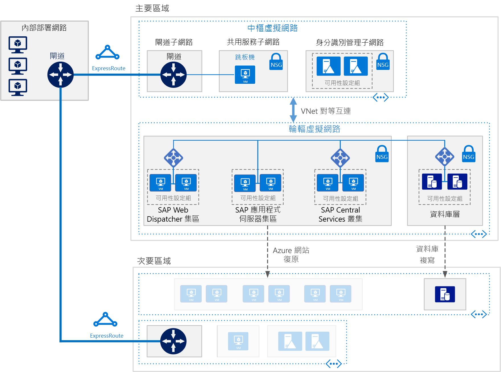

# 在 Azure 虛擬機器上部署適用於 AnyDB 的 SAP NetWeaver (Windows)

此參考架構會顯示一組經過證實的做法，能在 Windows 環境中具有高可用性的 Azure 上執行 SAP NetWeaver。 資料庫是 AnyDB，這是任何支援 DBMS 的 SAP 字詞，不包括 SAP HANA。 這個架構是以特定虛擬機器 (VM) 大小進行部署，大小可以變更以符合您的組織需求。

下載這個架構的 [Visio 檔案][visio-download]。

> [!NOTE] 
> 部署此參考架構需要 SAP 產品的適當授權和其他非 Microsoft 技術。

## 架構
此架構由下列基礎結構和關鍵軟體元件組成。

**虛擬網路**。 Azure 虛擬網路服務會安全地讓 Azure 資源彼此連線。 在此架構中，虛擬網路是透過在[中樞輪輻](../hybrid-networking/hub-spoke.md)中樞中所部署的 VPN 閘道，連線至內部部署環境。 輪輻是虛擬網路，用於 SAP 應用程式和資料庫層。

**子網路**。 虛擬網路會針對以下各個層級細分為不同的子網路：應用程式 (SAP NetWeaver)、資料庫、共用服務 (jumpbox) 和 Active Directory。
    
**虛擬機器**。 此架構會針對應用程式層和資料庫層使用虛擬機器，群組如下：

- **SAP NetWeaver**。 應用程式層會使用 Windows 虛擬機器，並執行 SAP 中央服務和 SAP 應用程式伺服器。 執行中央服務的虛擬機器會設定為 Windows Server 容錯移轉叢集以取得高可用性，受 SIOS DataKeeper 叢集版本所支援。
- **AnyDB**。 資料庫層會執行 AnyDB 作為來源資料庫，例如 Microsoft SQL Server、Oracle 或 IBM DB2。
- **Jumpbox**。 也稱為防禦主機。 這是網路上系統管理員用來連線到其他虛擬機器的安全虛擬機器。
- **Windows Server Active Directory 網域控制站**。 會針對所有虛擬機器和網域中的使用者使用網域控制站。

**負載平衡器**。 會使用 [Azure Load Balancer](/azure/load-balancer/load-balancer-overview) 執行個體，將流量分配到應用程式層子網路中的虛擬機器。 您可以在資料層中使用內建的 SAP 負載平衡器、Azure Load Balancer 或其他機制，根據 DBMS 來達到高可用性。 如需詳細資訊，請參閱[適用於 SAP NetWeaver 的 Azure 虛擬機器 DBMS 部署](/azure/virtual-machines/workloads/sap/dbms-guide)。 

**可用性設定組**。 SAP Web Dispatcher、SAP 應用程式伺服器和 (A)SCS 的虛擬機器角色會分組到個別[可用性設定組](/azure/virtual-machines/windows/tutorial-availability-sets)，每個角色都會佈建至少兩部虛擬機器。 這讓虛擬機器能夠符合適用於較高[服務等級協定](https://azure.microsoft.com/support/legal/sla/virtual-machines) (SLA) 的資格。

**NIC**。 [網路介面卡](/azure/virtual-network/virtual-network-network-interface) (NIC) 會啟用虛擬網路上虛擬機器的所有通訊。

**網路安全性群組**。 若要限制虛擬網路中的傳入、傳出及內部子網路流量，您可以建立[網路安全性群組](/azure/virtual-network/virtual-networks-nsg) (NSG)。

**閘道**。 閘道會將您的內部部署網路擴充至 Azure 虛擬網路。 [ExpressRoute](/azure/architecture/reference-architectures/hybrid-networking/expressroute) 是建議的 Azure 服務，用來建立不會經過公用網際網路的私人連線，但是也可以使用[站對站](/azure/vpn-gateway/vpn-gateway-howto-site-to-site-resource-manager-portal)連線。

**Azure 儲存體**。 若要提供虛擬機器虛擬硬碟 (VHD) 的持續性儲存體，則需要 [Azure 儲存體](/azure/storage/storage-standard-storage)。 [雲端見證](/windows-server/failover-clustering/deploy-cloud-witness)也會使用它來實作容錯移轉叢集作業。 

## 建議
您的需求可能和此處所述的架構不同。 請使用以下建議作為起點。

### SAP Web Dispatcher 集區

Web Dispatcher 元件是用來作為 SAP 應用程式伺服器之間 SAP 流量的負載平衡器。 為了達到 Web Dispatcher 元件的高可用性，會使用 Azure Load Balancer 來實作平行 Web Dispatcher 設定。 Web Dispatcher 會針對平衡器集區中可用 Web Dispatcher 之間的 HTTP(S) 流量分配，使用循環配置資源組態。

如需在 Azure 虛擬機器中執行 SAP NetWeaver 的詳細資訊，請參閱 [SAP NetWeaver 的 Azure 虛擬機器規劃和實作](/azure/virtual-machines/workloads/sap/planning-guide)。

### 應用程式伺服器集區

若要管理 ABAP 應用程式伺服器的登入群組，請使用 SMLG 交易。 它會在中央服務的訊息伺服器內使用負載平衡函式，以針對 SAPGUI 和 RFC 流量，分配 SAP 應用程式伺服器集區之間的工作負載。 與高可用性中央服務的應用程式伺服器連線是透過叢集虛擬網路名稱。

### SAP 中央服務叢集

此參考架構會在應用程式層中的虛擬機器上執行中央服務。 部署到單一虛擬機器 (不需要高可用性時的典型部署) 時，中央服務是潛在的單一失敗點 (SPOF)。 若要實作高可用性解決方案，可以使用共用磁碟叢集或檔案共用叢集。

若要設定共用磁碟叢集的虛擬機器，請使用 [Windows Server 容錯移轉叢集](https://blogs.sap.com/2018/01/25/how-to-create-sap-resources-in-windows-failover-cluster/)。 建議將[雲端見證](/windows-server/failover-clustering/deploy-cloud-witness)作為仲裁見證。 若要支援容錯移轉叢集環境，[SIOS DataKeeper 叢集版本](https://azuremarketplace.microsoft.com/marketplace/apps/sios_datakeeper.sios-datakeeper-8)會執行叢集共用磁碟區函式，方法為複寫叢集節點所擁有的獨立磁碟。 Azure 本身不支援共用磁碟，因此需要 SIOS 所提供的解決方案。

如需詳細資訊，請參閱「3. 在 Azure 上的 SIOS 執行 ASCS 的 SAP 客戶重要更新」，位於[在 Microsoft 平台上執行 SAP 應用程式](https://blogs.msdn.microsoft.com/saponsqlserver/2017/05/04/sap-on-azure-general-update-for-customers-partners-april-2017/)。

處理叢集的另一種方式是使用 Windows Server 容錯移轉叢集實作檔案共用叢集。 [SAP](https://blogs.sap.com/2018/03/19/migration-from-a-shared-disk-cluster-to-a-file-share-cluster/) 最近修改了中央服務部署模式，來透過 UNC 路徑存取 /sapmnt 全域目錄。 這項變更會針對 SIOS，或中央服務虛擬機器上的其他共用磁碟解決方案[移除需求](https://blogs.msdn.microsoft.com/saponsqlserver/2017/08/10/high-available-ascs-for-windows-on-file-share-shared-disk-no-longer-required/)。 但是仍然建議確保 /sapmnt UNC 共用是[高可用性](https://blogs.sap.com/2017/07/21/how-to-create-a-high-available-sapmnt-share/)。 可以藉由使用 Windows Server 容錯移轉叢集與[相應放大檔案伺服器](https://blogs.msdn.microsoft.com/saponsqlserver/2017/11/14/file-server-with-sofs-and-s2d-as-an-alternative-to-cluster-shared-disk-for-clustering-of-an-sap-ascs-instance-in-azure-is-generally-available/) (SOFS) 和 Windows Server 2016 中的[儲存空間直接存取](https://blogs.sap.com/2018/03/07/your-sap-on-azure-part-5-ascs-high-availability-with-storage-spaces-direct/) (S2D) 功能，在中央服務執行個體上完成這個操作。 

### 可用性設定組

可用性設定組會將伺服器分配到不同實體基礎結構並且更新群組，以改善服務可用性。 將執行相同角色的虛擬機器放到可用性設定組，以協助防範 Azure 基礎結構維護所造成的停機時間，並符合 [SLA](https://azure.microsoft.com/support/legal/sla/virtual-machines) (SLA)。 建議您針對每個可用性設定組使用兩部以上的虛擬機器。

集合中的所有虛擬機器必須執行相同的角色。 請勿在相同的可用性設定組中混用不同角色的伺服器。 例如，不要將中央服務節點放置在與應用程式伺服器相同的可用性設定組。

### NIC

傳統內部部署 SAP 部署會為每部機器實作多個網路介面卡 (NIC)，以隔離系統管理流量與商務流量。 在 Azure 上，虛擬網路是軟體定義網路，它會透過相同的網路網狀架構傳送所有流量。 因此，不需要使用多個 NIC。 不過，如果您的組織需要隔離流量，您可以對每部虛擬機器部署多個 NIC、將每個 NIC 連線到不同的子網路，然後使用 NSG 以強制執行不同的存取控制原則。

### 子網路和 NSG

此架構會將虛擬網路位址空間細分為子網路。 此參考架構主要著重在應用程式層子網路。 每個子網路可以與定義子網路存取原則的 NSG 相關聯。 將應用程式伺服器放在不同的子網路上，您就可以藉由管理子網路安全性原則 (而非個別伺服器)，以便更輕鬆地保護它們。

當 NSG 與子網路產生關聯時，它會套用至子網路內的所有伺服器。 如需使用 NSG 對子網路中伺服器進行更細微控制的詳細資訊，請參閱[使用網路安全性群組篩選網路流量](https://azure.microsoft.com/en-us/blog/multiple-vm-nics-and-network-virtual-appliances-in-azure/)。

### 負載平衡器

[SAP Web Dispatcher](https://help.sap.com/doc/saphelp_nw73ehp1/7.31.19/en-US/48/8fe37933114e6fe10000000a421937/frameset.htm) 會處理對 SAP 應用程式伺服器集區之 HTTP(S) 流量的負載平衡。

針對透過 DIAG 通訊協定或遠端函式呼叫 (RFC)，從 SAP GUI 用戶端連線 SAP 伺服器的流量，中央服務訊息伺服器會透過 SAP 應用程式伺服器[登入群組](https://wiki.scn.sap.com/wiki/display/SI/ABAP+Logon+Group+based+Load+Balancing)進行負載平衡，因此不需要額外負載平衡器。

### Azure 儲存體

針對所有資料庫伺服器虛擬機器，建議您使用 Azure 進階儲存體以獲得一致的讀取/寫入延遲。 對於將進階儲存體用於所有作業系統磁碟和資料磁碟的任何單一執行個體虛擬機器，請參閱[虛擬機器的 SLA](https://azure.microsoft.com/support/legal/sla/virtual-machines)。 此外，針對生產環境 SAP 系統，我們建議在所有情況下都使用進階 [Azure 受控磁碟](/azure/storage/storage-managed-disks-overview)。 基於可靠性的考量，會使用受控磁碟來管理磁碟的 VHD 檔案。 受控磁碟可確保可用性設定組內的虛擬機器磁碟是各自獨立的，以避免發生單一失敗點。

針對 SAP 應用程式伺服器 (包括中央服務虛擬機器)，您可以使用 Azure 標準儲存體來降低成本，因為應用程式的執行會發生在記憶體中，並只會使用磁碟來記錄。 不過，目前標準儲存體只針對非受控儲存體經過認證。 因為應用程式伺服器未裝載任何資料，您也可以使用較小的 P4 和 P6 進階儲存體磁碟以協助降低成本。

[雲端見證](/windows-server/failover-clustering/deploy-cloud-witness)也會使用 Azure 儲存體，以針對遠離叢集所在主要區域的遠端 Azure 區域中的裝置維護仲裁。

針對備份資料存放區，我們建議您使用 Azure [coolaccess 層](/azure/storage/storage-blob-storage-tiers)和[封存存取層儲存體](/azure/storage/storage-blob-storage-tiers)。 這些儲存體層是符合成本效益的方式，用來儲存不常存取的長時間執行資料。

## 效能考量

SAP 應用程式伺服器會執行與資料庫伺服器的持續通訊。 針對在任何資料庫平台上執行的效能關鍵性應用程式 (包括 SAP HANA)，請考慮啟用[寫入加速器](/azure/virtual-machines/linux/how-to-enable-write-accelerator)以改善記錄寫入延遲。 若要最佳化伺服器間的通訊，請使用[加速網路](https://azure.microsoft.com/blog/linux-and-windows-networking-performance-enhancements-accelerated-networking/)。 請注意，這些加速器僅適用於特定虛擬機器系列。

若要達到高 IOPS 和磁碟頻寬輸送量，可將儲存體磁碟區[效能最佳化](/azure/virtual-machines/windows/premium-storage-performance)的常見做法套用於 Azure 儲存體配置。 例如，將多個磁碟合併在一起來建立等量磁碟區，能夠改善 IO 效能。 在不常變更的儲存體內容上啟用讀取快取，能夠增強資料擷取的速度。

針對 SQL 上的 SAP，[在 Azure 上部署 SAP 應用程式的前 10 名主要考量](https://blogs.msdn.microsoft.com/saponsqlserver/2015/05/25/top-10-key-considerations-for-deploying-sap-applications-on-azure/)部落格提供針對 SQL Server 上 SAP 工作負載最佳化 Azure 儲存體的絕佳建議。

## 延展性考量

在 SAP 應用程式層中，Azure 會提供各種不同的虛擬機器大小可進行相應增加或相應放大。如需完整清單，請參閱 [SAP 附註 1928533](https://launchpad.support.sap.com/#/notes/1928533) - Azure 上的 SAP 應用程式︰支援的產品和 Azure 虛擬機器類型。 (需要 SAP Service Marketplace 帳戶才能進行存取)。 SAP 應用程式伺服器和中央服務叢集可以藉由新增更多執行個體來相應增加/相應減少或相應放大。 AnyDB 資料庫可以相應增加/相應減少，但是無法相應放大。AnyDB 的 SAP 資料庫容器不支援分區化。

## 可用性考量

資源備援是高可用性基礎結構解決方案中的一般主題。 針對具有寬鬆 SLA 的企業，單一執行個體 Azure 虛擬機器會提供執行時間 SLA。 如需詳細資訊，請參閱 [Azure 服務等級協定](https://azure.microsoft.com/support/legal/sla/)。

在 SAP 應用程式的這個分散式安裝中，會複寫基底安裝來達到高可用性。 針對每一層的架構，高可用性設計會有所不同。

### 應用程式層

SAP Web Dispatcher 的高可用性是以備援執行個體來達成。 請參閱 SAP 文件中的 [SAP Web Dispatcher](https://help.sap.com/doc/saphelp_nw70ehp2/7.02.16/en-us/48/8fe37933114e6fe10000000a421937/frameset.htm)。

中央服務的高可用性是使用 Windows Server 容錯移轉叢集來實作。 部署在 Azure 上的時候，可以使用兩種方法來設定容錯移轉叢集的叢集儲存體：叢集共用磁碟區或檔案共用。

因為無法在 Azure 上使用共用磁碟，所以會使用 SIOS Datakeeper 來複寫連結到叢集節點的獨立磁碟內容，並且讓磁碟機作為叢集管理員的叢集共用磁碟區。 如需實作詳細資料，請參閱[在 Azure 上叢集 SAP ASCS](https://blogs.msdn.microsoft.com/saponsqlserver/2015/05/20/clustering-sap-ascs-instance-using-windows-server-failover-cluster-on-microsoft-azure-with-sios-datakeeper-and-azure-internal-load-balancer/)。

另一個選項是使用由[相應放大檔案伺服器](https://blogs.msdn.microsoft.com/saponsqlserver/2017/11/14/file-server-with-sofs-and-s2d-as-an-alternative-to-cluster-shared-disk-for-clustering-of-an-sap-ascs-instance-in-azure-is-generally-available/) (SOFS) 提供服務的檔案共用。 SOFS 提供彈性檔案共用，您可以用來作為 Windows 叢集的叢集共用磁碟區。 SOFS 叢集可以在多個中央服務節點之間共用。 在此文件撰寫當下，SOFS 只適用於高可用性設計，因為 SOFS 叢集不會跨區域擴充，以提供災害復原支援。

藉由應用程式伺服器集區內的負載平衡流量來達到 SAP 應用程式伺服器的高可用性。
請參閱[於 Microsoft Azure 上執行的 SAP 認證和設定](/azure/virtual-machines/workloads/sap/sap-certifications)。

### 資料庫層

此參考架構假設來源資料庫是在 AnyDB 上執行，亦即例如 SQL Server、SAP ASE、IBM DB2 或 Oracle 的 DBMS。 資料庫層的原生複寫功能提供複寫節點之間手動或自動容錯移轉。

如需特定資料庫系統的實作詳細資訊，請參閱[針對 SAP NetWeaver 的 Azure 虛擬機器 DBMS 部署](/azure/virtual-machines/workloads/sap/dbms-guide)。

## 災害復原考量

針對災害復原 (DR)，您必須能夠容錯移轉到次要區域。 每一層會使用不同的策略來提供災害復原 (DR) 保護。

- **應用程式伺服器層**。 SAP 應用程式伺服器不包含商務資料。 在 Azure 上，簡易 DR 策略是在次要區域建立 SAP 應用程式伺服器，然後將它們關機。 在主要應用程式伺服器上進行任何組態變更或核心更新時，必須將相同的變更複製到次要區域中的虛擬機器。 例如，將核心可執行檔複製到 DR 虛擬機器。 如需將應用程式伺服器自動複寫到次要區域中，[Azure Site Recovery](/azure/site-recovery/site-recovery-overview) 是建議的解決方案。

- **中央服務**。 這個 SAP 應用程式堆疊的元件也不會保存商務資料。 您可以在災害復原區域中建置虛擬機器，來執行中央服務角色。 主要中央服務節點中同步處理的唯一內容是 /sapmnt 共用內容。 另外，如果組態變更或核心更新是在主要中央服務伺服器上發生，必須在執行中央服務的災害復原區域中的虛擬機器上重複執行這些變更或更新。 若要同步處理兩部伺服器，您可以使用 Azure Site Recovery 複寫叢集節點，或者只使用定期排程備份作業將 /sapmnt 複製到災害復原區域。 如需這個簡易複寫方法之建置、複製及測試容錯移轉程序的詳細資訊，請下載 [SAP NetWeaver：建置 Hyper-V 和以 Microsoft Azure 作為基礎的災害復原解決方案](http://download.microsoft.com/download/9/5/6/956FEDC3-702D-4EFB-A7D3-2DB7505566B6/SAP%20NetWeaver%20-%20Building%20an%20Azure%20based%20Disaster%20Recovery%20Solution%20V1_5%20.docx)，並參考「4.3. SAP SPOF layer (ASCS)。」

- **資料庫層**。 DR 的最佳實作方式是使用資料庫自己的整合複寫技術。 舉例來說，如果是 SQL Server，我們建議使用 AlwaysOn 可用性群組以在遠端區域中建立複本，使用手動容錯移轉以非同步方式複寫交易。 非同步複寫可避免對主要網站的互動式工作負載效能造成影響。 手動容錯移轉讓人員有機會評估 DR 影響，並判斷透過 DR 網站的運作是否適當。

若要使用 Azure Site Recovery 自動建置原始的完整複寫生產環境網站，您必須執行自訂[部署指令碼](/azure/site-recovery/site-recovery-runbook-automation)。 Site Recovery 首先會在可用性設定組中部署虛擬機器，然後執行指令碼以新增負載平衡器之類的資源。

## 管理性考量

Azure 會提供幾個函式來[監視和診斷](/azure/architecture/best-practices/monitoring)整體基礎結構。 此外，Azure 虛擬機器的增強型監視會由 Azure Operations Management Suite (OMS) 處理。

若要提供以 SAP 作為基礎的 SAP 基礎結構之資源與服務效能監視，請使用 [Azure SAP 增強型監視](/azure/virtual-machines/workloads/sap/deployment-guide#detailed-tasks-for-sap-software-deployment)延伸模組。 此延伸模組會將 Azure 監視統計資料輸入 SAP 應用程式，以進行作業系統監視和 DBA Cockpit 函式。

## 安全性考量

SAP 有它自己的「使用者管理引擎 (UME)」，可控制角色型存取和 SAP 應用程式內的授權。 如需詳細資訊，請參閱[適用於 ABAP 的 SAP NetWeaver 應用程式伺服器安全性指南](https://help.sap.com/doc/7b932ef4728810148a4b1a83b0e91070/1610 001/en-US/frameset.htm?4dde53b3e9142e51e10000000a42189c.html)和 [SAP NetWeaver 應用程式伺服器 Java 安全性指南](https://help.sap.com/doc/saphelp_snc_uiaddon_10/1.0/en-US/57/d8bfcf38f66f48b95ce1f52b3f5184/frameset.htm)。

如需額外的網路安全性，請考慮實作[網路 DMZ](../dmz/secure-vnet-hybrid.md)，它會使用網路虛擬設備，在 Web Dispatcher 的子網路前面建立防火牆。

針對基礎結構安全性，資料在傳輸中和靜止時會加密。 [Azure 虛擬機器 (VM) 上的 SAP NetWeaver - 規劃和實作指南](/azure/virtual-machines/workloads/sap/planning-guide)的「安全性考量」一節會開始說明網路安全性。 本指南也會指定您在防火牆上必須開啟才能允許應用程式通訊的網路連接埠。

如需加密 Windows 虛擬機器磁碟，您可以使用 [Azure 磁碟加密](/azure/security/azure-security-disk-encryption)。 它會使用 Windows 的 BitLocker 功能來提供作業系統和資料磁碟的磁碟區加密。 此解決方案也可與 Azure Key Vault 搭配使用，協助您控制及管理金鑰保存庫訂用帳戶中的磁碟加密金鑰與祕密。 虛擬機器磁碟上的所有待用資料都會在您的 Azure 儲存體中加密。

## 社群

社群可以回答問題並協助您設定成功的部署。 請考慮下列：

- [在 Microsoft 平台上執行 SAP 應用程式部落格](https://blogs.msdn.microsoft.com/saponsqlserver/2017/05/04/sap-on-azure-general-update-for-customers-partners-april-2017/)
- [Azure 社群支援](https://azure.microsoft.com/support/community/)
- [SAP 社群](https://www.sap.com/community.html)
- [Stack Overflow](https://stackoverflow.com/tags/sap/)

[visio-download]: https://archcenter.blob.core.windows.net/cdn/sap-reference-architectures.vsdx
