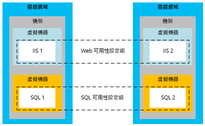
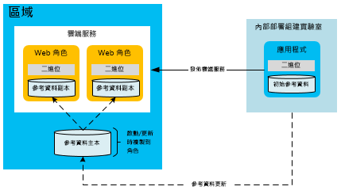

[!INCLUDE [header](../_includes/header.md)]

# 建置在 Microsoft Azure 上之應用程式的高可用性
具有高可用性的應用程式可以化解相依服務和硬體中，可用性、負載和暫時性失敗方面的變動。 應用程式會持續以可接受的方式來執行，如業務需求或應用程式服務等級協定 (SLA) 所定義。

## Azure 的高可用性功能
Azure 有許多支援高可用性應用程式的內建平台功能。 本節說明其中的一些主要功能。

### 網狀架構控制器
Azure 網狀架構控制器會佈建和監視 Azure 計算執行個體的狀況。 網狀架構控制器會監視主機和來賓機器執行個體的硬體和軟體狀態。 當它偵測到失敗時，就會自動重新放置 VM 執行個體來維持 SLA。 容錯和升級網域的概念可進一步支援計算 SLA。

在部署多個雲端服務角色執行個體時，Azure 會將這些執行個體部署到不同的容錯網域。 容錯網域界限基本上是相同區域中的不同硬體機架。 容錯網域會減少局部硬體故障中斷應用程式服務的機率。 您無法管理背景工作角色或 Web 角色的容錯網域數目。 網狀架構控制器會使用與 Azure 託管應用程式分開的專用資源。 它需要 100% 的執行時間，因為它會作為 Azure 系統的核心。 它會跨容錯網域監視和管理角色執行個體。

下圖顯示網狀架構控制器跨不同容錯網域所部署和管理的 Azure 共用資源。

儘管容錯網域是用以減緩失敗的實際分隔，但升級網域是執行個體分隔的邏輯單元，可判斷將在特定時間升級服務的哪些執行個體。 根據預設，會針對您的託管服務部署定義五個升級網域。 不過，您可以在服務定義檔中變更該值。 例如，如果您的 Web 角色有八個執行個體，三個升級網域中有兩個執行個體，而一個升級網域中有兩個執行個體。 Azure 會根據升級網域數目定義更新序列。 如需詳細資訊，請參閱[更新雲端服務](/azure/cloud-services/cloud-services-update-azure-service/)。

### 其他服務中的功能
除了支援高可用性計算資源的平台功能，Azure 還會在它的其他服務中內嵌高可用性功能。 例如，Azure 儲存體會在 Azure 儲存體帳戶中至少保留所有資料的三個複本。 它也可讓異地備援在次要區域中儲存資料複本。 Azure 內容傳遞網路可在全球快取 Blob，以獲得備援、延展性和低延遲。 Azure SQL Database 也會維護多個複本。

如需 Azure 平台可用性功能的更深入討論，請參閱[復原技術指引](index.md)。 另請參閱 [Windows Azure 上大規模服務設計的最佳作法](https://azure.microsoft.com/blog/best-practices-for-designing-large-scale-services-on-windows-azure/) \(英文\)。

雖然 Azure 提供多個支援高可用性的功能，但請務必了解其限制：

* 針對計算，Azure 保證您的角色可供使用且執行中，但它無法偵測您的應用程式正在執行中還是已多載。
* 針對 Azure SQL Database，資料會在區域內同步複寫。 您可以選擇主動式異地複寫，其最多可在相同區域 (或不同區域) 中允許四個額外的資料庫複本。 雖然這些資料庫複本不是時間點備份，但 SQL Database 還是會提供時間點備份功能。 如需詳細資訊，請參閱[使用自動資料庫備份復原 Azure SQL Database：時間點還原](/azure/sql-database/sql-database-recovery-using-backups#point-in-time-restore)。
* 針對 Azure 儲存體，資料表資料和 Blob 資料預設均會複寫到替代區域。 不過，在 Microsoft 選擇容錯移轉至替代網站之前，您無法存取這些複本。 區域容錯移轉只會在遇到長時間的全區域服務中斷時發生，而且沒有適用於異地容錯移轉時間的 SLA。 也請務必注意，任何資料損毀都會快速擴散到複本。 基於這些理由，您必須搭配應用程式特有的可用性功能來補充平台可用性功能，包括 Blob 快照集功能，以建立 Blob 資料的時間點備份。

### Azure 虛擬機器的可用性設定組
本文主要將重點放在使用平台即服務 (PaaS) 模型的雲端服務。 Azure 虛擬機器還具備特有的可用性功能，其使用基礎結構即服務 (IaaS) 模型。 若要利用虛擬機器來達到高可用性，您必須使用可用性設定組，為錯誤和升級網域提供類似功能。 在可用性設定組內，Azure 會以防止局部硬體故障和維護活動關閉該群組中所有電腦的方式，來放置虛擬機器。 必須有可用性設定組才能實現 Azure 的虛擬機器可用性 SLA。

下圖呈現兩個分別適用於 Web 和 SQL Server 虛擬機器的可用性設定組。

> [!NOTE]
> 在上圖中，SQL Server 是在虛擬機器上安裝並執行。 這點不同於 Azure SQL Database，其會提供資料庫作為受控服務。
> 
> 

## 應用程式的高可用性策略
大部分應用程式的高可用性策略包括備援或移除應用程式元件之間的硬式相依性。 應用程式的設計應該支援在 Azure 或協力廠商服務偶爾停機時執行容錯。 下列各節將說明可改善雲端服務可用性的應用程式模式。

### 非同步通訊和耐久性佇列
若要提高 Azure 應用程式中的可用性，請考慮在鬆散結合的服務之間進行非同步通訊。 在此模式中，會將訊息寫入儲存體佇列或 Azure 服務匯流排佇列，以供稍後處理。 將訊息寫入佇列時，控制權就會立即回到傳送者。 應用程式的另一個服務 (通常實作為背景工作角色) 會處理訊息。 如果處理服務停止運作，訊息就會累積在佇列中，直到處理服務還原為止。 前端傳送者與訊息處理器之間沒有直接相依性。 這樣就不需要會在分散式應用程式中造成瓶頸的同步服務呼叫。

此模式的變化會在 Azure 儲存體 (Blob、資料表、佇列) 或服務匯流排佇列中儲存關於失敗資料庫的資訊。 例如，某個應用程式內對另一個服務 (例如 Azure SQL Database) 的同步呼叫會重複失敗。 您或許可以將該要求序列化到耐久性儲存體。 稍後當服務或資料庫重新上線時，應用程式就可從儲存體重新提交要求。 此模型的差異在於，中繼位置只會在失敗時使用，不會作為應用程式工作流程的固定部分。

在這兩種案例中，非同步通訊和中繼儲存體可避免停機的後端服務關閉整個應用程式。 佇列會做為邏輯媒介。 如需在佇列服務之間進行選擇的詳細資訊，請參閱 [Azure 佇列和 Azure 服務匯流排佇列 &mdash; 異同比較](/azure/service-bus-messaging/service-bus-azure-and-service-bus-queues-compared-contrasted/)。

### 錯誤偵測和重試邏輯
高可用性應用程式設計的一個關鍵點是，使用程式碼內的重試邏輯，適當地處理暫時無法使用的服務。 適用於 Azure 儲存體和 Azure 服務匯流排的新版 SDK 原本就支援重試。 如需為應用程式提供自訂重試邏輯的詳細資訊，請參閱[重試邏輯](../patterns/retry.md)。

### 高可用性的參考資料模式
參考資料是應用程式的唯讀資料。 此資料會提供商業內容，應用程式會在商務作業期間，於其中產生交易資料。 交易資料的完整性取決於交易完成時間的參考資料快照集。

您必須有參考資料，才能使應用程式正常運作。 各種應用程式都會建立和維護參考資料；主要資料管理 (MDM) 系統通常會執行此函式。 這些系統會負責參考資料的生命週期。 參考資料的範例包括產品目錄、員工主檔、組件主檔和設備主檔。 參考資料也可以來自組織外部，例如郵遞區號或稅率。 用來增加參考資料可用性的策略，通常不會比交易資料的策略困難。 參考資料的優點在於它多半不可變。

透過與應用程式一起部署參考資料，取用參考資料的 Azure Web 角色和背景工作角色會在執行階段變成自發性。 如果本機儲存體的大小允許這類部署，這會是個理想的方式。 在本機部署的內嵌 SQL Database、NoSQL 資料庫或 XML 檔案，有助於 Azure 計算調整單位的自發性。 不過，您應該具有不需重新部署就能更新每個角色中的資料的機制。 若要這樣做，請在雲端儲存體端點 (例如，Azure Blob 儲存體或 SQL Database) 上放置參考資料的任何更新。 在每個會在角色啟動時將資料更新下載到計算節點的角色中新增程式碼。 或者，新增可讓系統管理員執行強制下載到角色執行個體的程式碼。

若要增加可用性，角色也應該包含一組參考資料，以免儲存體關閉。 角色可以使用一組基本的參考資料來啟動，直到儲存體資源變成可供更新使用為止。

利用此模式，如果您要部署或下載大量參考資料，則新的部署或角色執行個體可能需要較長的時間來啟動。 這個取捨結果是可接受的，因為其會自發性地讓每個角色立即可以取得參考資料，而不需取決於外部儲存體服務。

### 高可用性的交易資料模式
交易資料是應用程式在商務內容中產生的資料。 交易資料是應用程式所實作的一組商務程序以及支援這些程序的參考資料的組合。 交易資料範例可包括訂單、預先出貨通知、發票和客戶關係管理 (CRM) 商機。 交易資料會送到外部系統，以進行記錄保存或進一步處理。

參考資料可以在負責處理該資料的系統內加以變更。 因此，交易資料必須儲存時間點參考資料內容，將外部相依性降至最低，以達到其語意一致性。 例如，在訂單完成數個月之後，可能會從目錄中移除產品。 建議盡可能使用交易來儲存最多的參考資料內容。 這個方法會保留與交易相關聯的語意，即使在擷取交易之後參考資料就會變更也是一樣。

如先前所述，使用鬆散結合和非同步通訊的架構可提供更高等級的可用性。 交易資料也是如此，但其實作更加複雜。 傳統的交易模式通常依賴資料庫來保證交易。 當您引入中繼層時，應用程式的程式碼必須正確處理各層的資料，以確保有足夠的一致性和耐久性。

下列順序說明將交易資料的擷取和處理分開進行的工作流程︰

1. Web 計算節點︰目前的參考資料。
2. 外部儲存體︰儲存中繼交易資料。
3. Web 計算節點︰完成使用者交易。
4. Web 計算節點︰將完成的交易資料及其參考資料內容傳送到保證提供可預測回應的暫時耐久性儲存體。
5. Web 計算節點︰向使用者發出交易完成的訊號。
6. 背景計算節點︰擷取交易資料、視需要進一步處理它，並將它傳送到其在目前系統中的最終儲存體位置。

下圖說明這種設計在 Azure 託管雲端服務中的一個可能的實作。

上圖中的虛線箭頭表示非同步處理。 前端 Web 角色並不知道這個非同步處理。 這會造成交易儲存在有關目前系統的最終目的地。 由於這種非同步模型會帶來延遲，交易資料無法立即可供查詢。 因此，每個交易資料單位都必須儲存在快取或使用者工作階段中，才能滿足立即 UI 的需要。

Web 角色會不同於基礎結構的其餘部分而變成是自發性的。 其可用性設定檔是 Web 角色和 Azure 佇列的組合，而不是整個基礎結構。 除了高可用性，這種方法還可讓 Web 角色進行水平調整，不受後端儲存體所控制。 這個高可用性模型會影響作業的經濟效益。 Azure 佇列和背景工作角色等其他元件會影響每月使用量成本。

上圖說明交易資料的這種分離方法的其中一個實作。 還有其他許多可能的實作。 下列清單會提供一些替代實作：

* 背景工作角色或許可以放在 Web 角色和儲存體佇列之間。
* 可以使用服務匯流排佇列，而不使用 Azure 儲存體佇列。
* 最終目的地可以是 Azure 儲存體或不同的資料庫提供者。
* 可在 Web 層使用 Azure 快取，以在交易後提供立即的快取需求。

### 延展性模式
請務必注意，雲端服務的延展性會直接影響可用性。 如果負載增加造成服務沒有回應，使用者的認知會是應用程式已停止運作。 根據您預期的應用程式負載和未來的預期，遵循適用於延展性且經過證實的作法。 將規模最大化會涉及許多考量，例如，單一或多個儲存體帳戶、跨多個資料庫共用，以及快取策略。 如需這些模式的深入資訊，請參閱 [Microsoft Azure 中大規模服務設計的最佳作法](https://azure.microsoft.com/blog/best-practices-for-designing-large-scale-services-on-windows-azure/) \(英文\)。

## 後續步驟
本系列的文件會說明建置在 Microsoft Azure 上之應用程式的災害復原和高可用性。 系列中的下一篇文章是[建置在 Microsoft Azure 上之應用程式的災害復原](disaster-recovery-azure-applications.md)。

